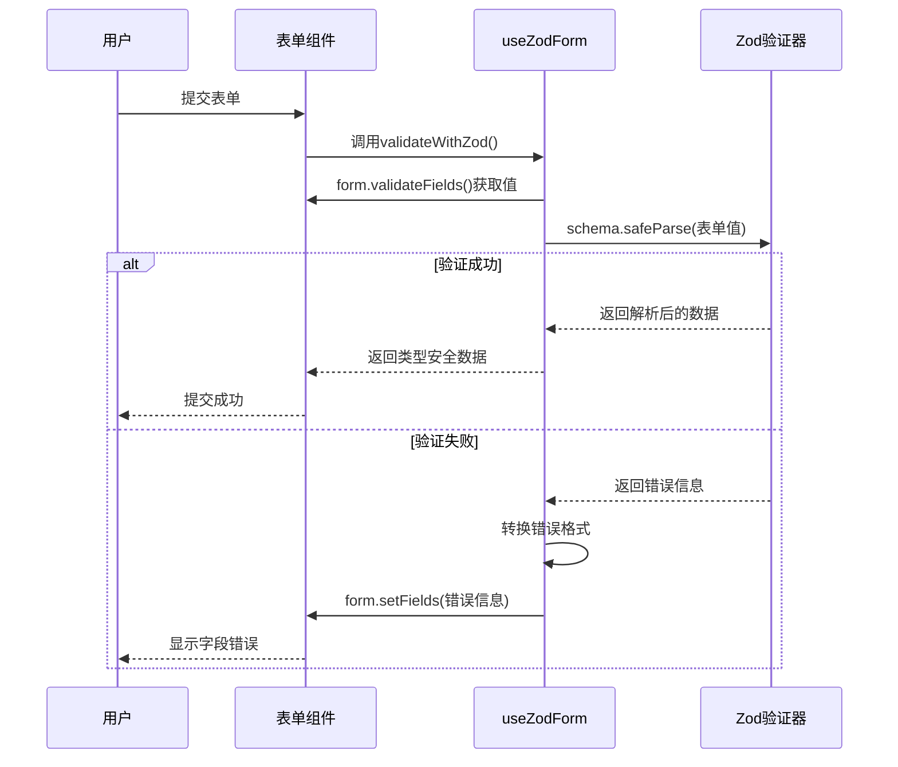
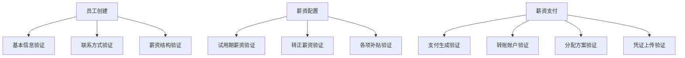

# 表单验证机制

<cite>
**本文档引用文件**  
- [useZodForm.ts](file://frontend/src/hooks/forms/useZodForm.ts)
- [employee.schema.ts](file://frontend/src/validations/employee.schema.ts)
- [salary.schema.ts](file://frontend/src/validations/salary.schema.ts)
- [EmployeeFormModal.tsx](file://frontend/src/features/employees/components/modals/EmployeeFormModal.tsx)
- [SalaryConfigModal.tsx](file://frontend/src/features/employees/components/modals/SalaryConfigModal.tsx)
- [errorHandler.ts](file://frontend/src/utils/errorHandler.ts)
- [EmployeeForm.tsx](file://frontend/src/features/employees/components/forms/EmployeeForm.tsx)
- [EmployeeSalaryForm.tsx](file://frontend/src/features/employees/components/forms/EmployeeSalaryForm.tsx)
</cite>

## 目录
1. [简介](#简介)
2. [核心实现原理](#核心实现原理)
3. [类型安全与推断优势](#类型安全与推断优势)
4. [实际应用场景](#实际应用场景)
5. [错误处理流程](#错误处理流程)
6. [扩展功能](#扩展功能)
7. [最佳实践](#最佳实践)

## 简介
本系统采用 `useZodForm` 自定义 Hook 实现表单验证机制，将 Zod 的类型安全验证能力与 Ant Design Form 组件无缝集成。该机制通过统一的验证流程确保前端输入数据的完整性与正确性，广泛应用于员工管理、薪资配置等关键业务场景。

**Section sources**
- [useZodForm.ts](file://frontend/src/hooks/forms/useZodForm.ts)

## 核心实现原理
`useZodForm` Hook 接收一个 Zod Schema 作为参数，返回 Ant Design Form 实例和 `validateWithZod` 验证函数。其核心流程如下：

1. 调用 `form.validateFields()` 获取表单当前值
2. 使用传入的 Zod Schema 执行 `safeParse` 进行类型验证
3. 若验证失败，将 Zod 的错误信息结构转换为 Ant Design 兼容的字段错误格式
4. 调用 `form.setFields()` 将错误信息注入表单，触发 UI 展示
5. 若验证成功，返回解析后的类型安全数据

该机制实现了声明式验证逻辑，开发者只需定义一次 Zod Schema，即可同时获得运行时验证和编译时类型推断。

**Diagram sources**
- [useZodForm.ts](file://frontend/src/hooks/forms/useZodForm.ts#L28-L54)

**Section sources**
- [useZodForm.ts](file://frontend/src/hooks/forms/useZodForm.ts#L25-L60)

## 类型安全与推断优势
通过 Zod Schema 定义验证规则，系统实现了完整的类型推断链路。当使用 `z.infer<typeof schema>` 时，TypeScript 能够准确推断出验证通过后数据的结构类型。

例如，在员工创建表单中，`createEmployeeSchema` 定义了姓名、部门、职位、薪资结构等字段的验证规则。调用 `validateWithZod()` 后，返回值的类型自动推断为 `CreateEmployeeFormData`，确保后续业务逻辑处理的数据结构完全匹配预期。

这种类型安全机制有效防止了运行时类型错误，提升了代码的可维护性和开发效率。

**Section sources**
- [employee.schema.ts](file://frontend/src/validations/employee.schema.ts#L4-L51)
- [useZodForm.ts](file://frontend/src/hooks/forms/useZodForm.ts#L49)

## 实际应用场景

### 员工创建表单
在 `EmployeeFormModal` 中，根据是否为编辑模式动态选择 `createEmployeeSchema` 或 `updateEmployeeSchema`。表单包含基本信息、联系方式、薪资与补贴等多个标签页，通过 Zod 验证确保必填字段完整性和数据格式正确性。

### 薪资配置
`SalaryConfigModal` 使用 `salaryConfigSchema` 验证多币种底薪配置，确保每项薪资都包含有效的币种和金额。该模态框支持动态添加/删除薪资项，Zod 的数组验证能力确保至少存在一项有效配置。

### 薪资支付
薪资支付流程中的多个步骤（生成、转账、分配、确认）分别使用对应的 Zod Schema 进行验证，如 `salaryPaymentGenerateSchema` 验证年月选择，`salaryPaymentConfirmSchema` 确保转账凭证已上传。

**Diagram sources**
- [EmployeeFormModal.tsx](file://frontend/src/features/employees/components/modals/EmployeeFormModal.tsx#L32)
- [SalaryConfigModal.tsx](file://frontend/src/features/employees/components/modals/SalaryConfigModal.tsx#L21)
- [salary.schema.ts](file://frontend/src/validations/salary.schema.ts#L3-L22)

**Section sources**
- [EmployeeFormModal.tsx](file://frontend/src/features/employees/components/modals/EmployeeFormModal.tsx)
- [SalaryConfigModal.tsx](file://frontend/src/features/employees/components/modals/SalaryConfigModal.tsx)
- [salary.schema.ts](file://frontend/src/validations/salary.schema.ts)

## 错误处理流程
系统采用分层错误处理机制：

1. **表单级错误**：由 `useZodForm` 捕获 Zod 验证错误，转换为 Ant Design 格式并显示在对应字段
2. **操作级错误**：通过 `withErrorHandler` 包装异步操作，统一处理 API 错误和业务逻辑错误
3. **用户反馈**：根据错误类型显示相应的提示消息，如表单验证失败提示"请检查表单填写是否完整"

当 `validateWithZod` 抛出"表单验证失败"异常时，不会中断程序执行，而是通过 UI 提示引导用户修正输入。

**Section sources**
- [useZodForm.ts](file://frontend/src/hooks/forms/useZodForm.ts#L46-L47)
- [errorHandler.ts](file://frontend/src/utils/errorHandler.ts)
- [EmployeeFormModal.tsx](file://frontend/src/features/employees/components/modals/EmployeeFormModal.tsx#L248-L255)

## 扩展功能

### 自定义异步验证
虽然当前实现主要基于同步验证，但可通过在 Zod Schema 中使用 `.refine()` 方法结合异步函数实现异步验证逻辑，如检查邮箱是否已被注册。

### 字段联动验证
通过 Zod 的 `.refine()` 和 `.superRefine()` 方法，可以实现字段间的联动验证。例如，在员工表单中，可以验证转正日期必须晚于入职日期。

### 动态验证规则
根据表单状态动态调整验证规则。例如，在编辑模式下某些字段可能变为可选，通过条件性地构建 Schema 实现灵活的验证策略。

**Section sources**
- [employee.schema.ts](file://frontend/src/validations/employee.schema.ts#L123-L125)
- [EmployeeForm.tsx](file://frontend/src/features/employees/components/forms/EmployeeForm.tsx#L116-L123)

## 最佳实践

### Schema 设计原则
- 将验证 Schema 与 TypeScript 接口分离，便于复用和维护
- 使用 `z.object()` 明确定义每个字段的验证规则
- 对于可选字段，使用 `.optional()` 明确声明
- 复杂嵌套结构使用 `z.array(z.object({...}))` 进行验证

### 组件使用规范
- 在模态框或表单组件中统一使用 `useZodForm` 初始化验证
- 将 `validateWithZod` 调用包裹在 `try-catch` 中处理验证失败情况
- 结合 `withErrorHandler` 实现完整的错误处理闭环

### 性能优化
- 利用 `useCallback` 缓存 `validateWithZod` 函数，避免不必要的重新渲染
- 对大型表单采用分步验证策略，提升用户体验

**Section sources**
- [employee.schema.ts](file://frontend/src/validations/employee.schema.ts)
- [useZodForm.ts](file://frontend/src/hooks/forms/useZodForm.ts)
- [errorHandler.ts](file://frontend/src/utils/errorHandler.ts)