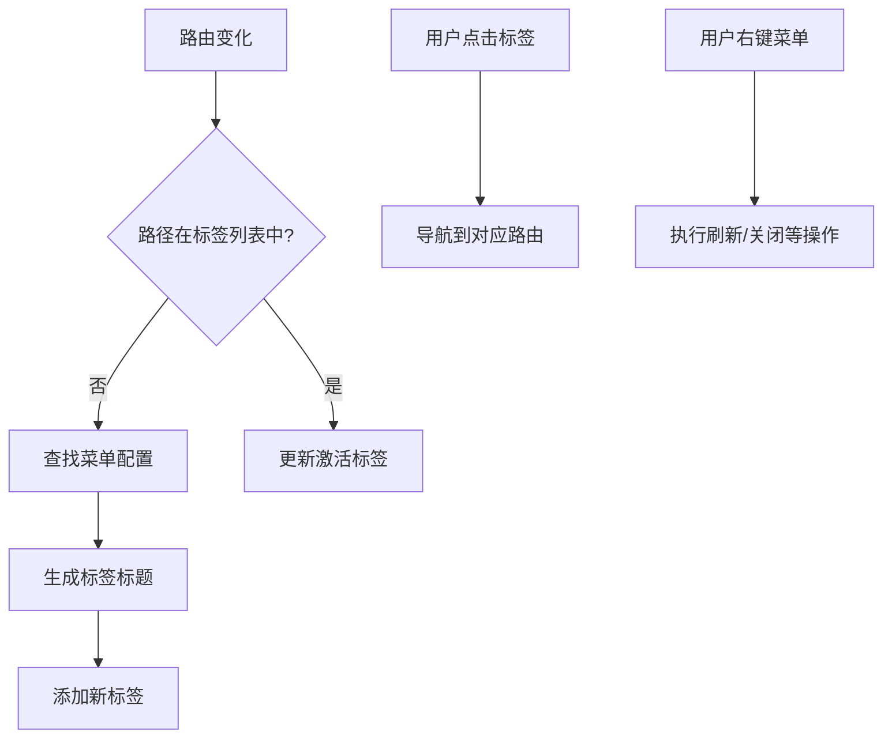
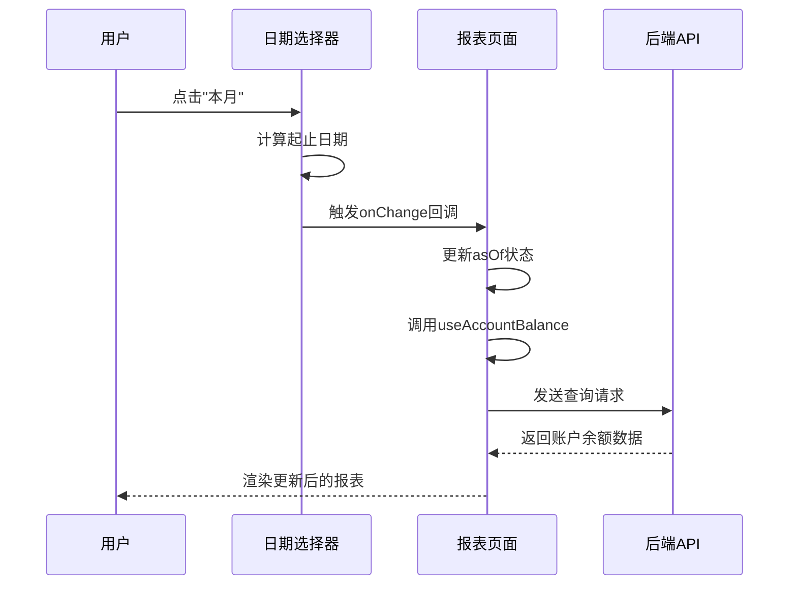

# 布局与容器组件

<cite>
**本文档引用文件**  
- [PageContainer.tsx](file://frontend/src/components/PageContainer.tsx)
- [PageContainer.css](file://frontend/src/components/PageContainer.css)
- [PageToolbar.tsx](file://frontend/src/components/common/PageToolbar.tsx)
- [MultiTabs.tsx](file://frontend/src/components/layout/MultiTabs.tsx)
- [MultiTabs.css](file://frontend/src/components/layout/MultiTabs.css)
- [FormModal.tsx](file://frontend/src/components/FormModal.tsx)
- [DateRangePicker.tsx](file://frontend/src/components/DateRangePicker.tsx)
- [ErrorBoundary.tsx](file://frontend/src/components/ErrorBoundary.tsx)
- [SensitiveField.tsx](file://frontend/src/components/SensitiveField.tsx)
- [EmployeeManagementPage.tsx](file://frontend/src/features/hr/pages/EmployeeManagementPage.tsx)
- [FlowsPage.tsx](file://frontend/src/features/finance/pages/FlowsPage.tsx)
- [ReportAccountBalancePage.tsx](file://frontend/src/features/reports/pages/ReportAccountBalancePage.tsx)
</cite>

## 目录
1. [页面容器与工具栏集成](#页面容器与工具栏集成)
2. [多标签页状态管理](#多标签页状态管理)
3. [表单模态框设计](#表单模态框设计)
4. [日期范围选择器集成](#日期范围选择器集成)
5. [错误边界与敏感字段](#错误边界与敏感字段)
6. [核心模块布局案例](#核心模块布局案例)

## 页面容器与工具栏集成

`PageContainer` 组件作为页面级布局的基础容器，提供了统一的页面结构，包括标题、面包屑导航和操作区域。它通过集成 `PageToolbar` 组件实现了操作按钮的标准化布局。

`PageContainer` 接收 `title` 和 `breadcrumb` 属性来展示页面标题和导航路径，同时通过 `extra` 属性接收 `PageToolbar` 或其他自定义内容。`PageToolbar` 组件则接收一个 `actions` 数组，每个操作项包含按钮文本、类型、图标、点击事件等属性，实现了操作按钮的灵活配置和统一样式。

在 `EmployeeManagementPage` 和 `FlowsPage` 等实际页面中，`PageContainer` 与 `PageToolbar` 的集成模式清晰可见：`PageContainer` 定义了页面的整体框架，而 `PageToolbar` 则在 `extra` 区域内渲染具体的“新建”、“刷新”等操作按钮，确保了整个应用中页面头部布局的一致性。

**Section sources**
- [PageContainer.tsx](file://frontend/src/components/PageContainer.tsx#L1-L82)
- [PageContainer.css](file://frontend/src/components/PageContainer.css#L1-L185)
- [PageToolbar.tsx](file://frontend/src/components/common/PageToolbar.tsx#L1-L84)
- [EmployeeManagementPage.tsx](file://frontend/src/features/hr/pages/EmployeeManagementPage.tsx#L204-L220)
- [FlowsPage.tsx](file://frontend/src/features/finance/pages/FlowsPage.tsx#L116-L185)

## 多标签页状态管理

`MultiTabs` 组件实现了多标签页的用户界面和状态管理。它利用 `react-router-dom` 的 `useLocation` 和 `useNavigate` 钩子来监听和同步路由变化，确保标签页的激活状态与当前 URL 保持一致。

组件内部通过 `useState` 管理 `items`（标签列表）和 `activeKey`（激活的标签键）两个状态。当路由发生变化时，`useEffect` 钩子会检查当前路径是否已存在于标签列表中，若不存在则根据 `config/menu` 中的配置动态生成标签标题并添加新标签。

为了优化内存，`MultiTabs` 采用了“按需渲染”的策略。标签页的内容由路由系统控制，只有当用户切换到某个标签页时，对应的页面组件才会被加载和渲染。关闭标签页时，通过 `onEdit` 回调从 `items` 状态中移除对应项，并在必要时更新 `activeKey` 以激活下一个标签页，有效避免了内存泄漏。

此外，`MultiTabs` 还实现了右键上下文菜单，支持“刷新”、“关闭当前”、“关闭其他”等多种操作，提升了用户体验。

**Diagram sources**
- [MultiTabs.tsx](file://frontend/src/components/layout/MultiTabs.tsx#L1-L165)
- [MultiTabs.css](file://frontend/src/components/layout/MultiTabs.css#L1-L194)

**Section sources**
- [MultiTabs.tsx](file://frontend/src/components/layout/MultiTabs.tsx#L1-L165)
- [MultiTabs.css](file://frontend/src/components/layout/MultiTabs.css#L1-L194)

## 表单模态框设计

`FormModal` 组件提供了一种非破坏性的表单交互模式，即在不离开当前页面的情况下弹出模态框进行数据录入或编辑，提交后自动关闭模态框并刷新数据。

该组件的核心设计在于其对表单状态和生命周期的管理。它接收一个 `FormInstance` 实例，通过 `form.resetFields()` 在模态框关闭时自动重置表单，避免了数据残留。提交流程通过 `handleSubmit` 回调封装，首先执行 `form.validateFields()` 进行表单验证，验证通过后调用外部传入的 `onSubmit` 异步函数。组件通过 `try-catch` 捕获提交过程中的任何错误，区分表单验证错误和业务逻辑错误，并给出相应的反馈（验证错误由 Ant Design 自动提示，业务错误则通过 `message.error` 显示）。

`FormModal` 还提供了 `onSuccess` 和 `onError` 回调钩子，允许父组件在提交成功或失败后执行自定义逻辑，如刷新表格数据或记录日志，实现了高度的可复用性和灵活性。

**Section sources**
- [FormModal.tsx](file://frontend/src/components/FormModal.tsx#L1-L96)

## 日期范围选择器集成

`DateRangePicker` 组件专为财务报表和流水查询等时间敏感功能设计，集成了日期范围选择和快速选择功能。

组件内部通过 `useState` 管理 `range` 状态，并通过 `useEffect` 监听外部传入的 `value` 属性以实现受控模式。其核心功能是 `quickSelect` 函数，它预设了“今天”、“昨天”、“本月”、“上月”、“最近7天”、“最近30天”等多个常用时间范围。用户点击这些快捷按钮时，函数会计算出相应的时间区间并更新 `range` 状态，同时触发 `onChange` 回调，通知父组件时间范围已变更。

在 `ReportAccountBalancePage` 等报表页面中，`DateRangePicker` 与查询逻辑紧密结合。用户选择日期后，页面会立即调用 `useAccountBalance` 等数据获取 Hook，以新的日期参数重新发起 API 请求，从而实现数据的动态刷新，满足了财务分析对时效性的高要求。

**Diagram sources**
- [DateRangePicker.tsx](file://frontend/src/components/DateRangePicker.tsx#L1-L109)
- [ReportAccountBalancePage.tsx](file://frontend/src/features/reports/pages/ReportAccountBalancePage.tsx#L55-L163)

**Section sources**
- [DateRangePicker.tsx](file://frontend/src/components/DateRangePicker.tsx#L1-L109)
- [ReportAccountBalancePage.tsx](file://frontend/src/features/reports/pages/ReportAccountBalancePage.tsx#L55-L163)

## 错误边界与敏感字段

`ErrorBoundary` 组件用于捕获其子组件树中未处理的 JavaScript 错误，防止整个应用崩溃。它通过 `getDerivedStateFromError` 静态方法在错误发生时更新组件状态，将 `hasError` 置为 `true`，并渲染一个降级的 UI 界面，通常是一个带有“重试”和“刷新”按钮的错误提示页。`componentDidCatch` 生命周期方法则用于记录错误信息，在开发环境下输出到控制台，在生产环境下可集成 Sentry 等监控服务。

`SensitiveField` 组件负责敏感数据（如薪资、账户余额）的安全防护。它通过 `usePermissions` 钩子检查用户权限，若无权查看则直接显示“—— 无权查看 ——”。对于有权查看的用户，字段默认以脱敏形式（如 `****.**`）显示。用户点击“显示”按钮后，`visible` 状态切换，真实数据才会暴露。更重要的是，每次用户点击“显示”按钮查看敏感数据时，`SensitiveField` 都会调用 `useCreateAuditLog` Hook 记录一条审计日志，实现了对敏感数据访问行为的追踪和审计。

**Section sources**
- [ErrorBoundary.tsx](file://frontend/src/components/ErrorBoundary.tsx#L1-L117)
- [SensitiveField.tsx](file://frontend/src/components/SensitiveField.tsx#L1-L83)

## 核心模块布局案例

在 HR 和财务等核心模块中，上述布局组件被综合运用，构建出功能强大且用户体验良好的界面。

在 **人力资源模块** 的 `EmployeeManagementPage` 中，`PageContainer` 定义了“人员管理”页面，面包屑导航为“人力资源 > 人员管理”。`PageToolbar` 提供了“新建员工”和“刷新”按钮。`DataTable` 表格的展开行中，`SensitiveField` 被广泛用于展示薪资、手机号、地址等敏感信息，确保了数据安全。

在 **财务模块** 的 `FlowsPage` 中，`PageContainer` 结合 `SearchFilters` 组件实现了复杂的查询条件筛选，包括日期范围、账户、类别等。`PageToolbar` 位于筛选区下方，仅保留“刷新”按钮，保持界面简洁。`DataTable` 的操作列中集成了“查看凭证”、“补充凭证”和“红冲”等功能，通过 `Modal` 组件实现凭证的上传和预览。

在 **报表模块** 的 `ReportAccountBalancePage` 中，展示了多层级的钻取式报表。`PageContainer` 内部通过 `Breadcrumb` 组件动态生成导航路径，用户可以从“币种汇总”逐级下钻到“账户明细”。`DateRangePicker` 被放置在 `PageToolbar` 中，作为主要的查询条件，实现了报表数据的按需加载。

这些案例充分体现了该系统布局组件的灵活性和可组合性，能够满足不同业务场景下的复杂需求。

**Section sources**
- [EmployeeManagementPage.tsx](file://frontend/src/features/hr/pages/EmployeeManagementPage.tsx#L1-L367)
- [FlowsPage.tsx](file://frontend/src/features/finance/pages/FlowsPage.tsx#L1-L456)
- [ReportAccountBalancePage.tsx](file://frontend/src/features/reports/pages/ReportAccountBalancePage.tsx#L1-L384)