# 组件架构

<cite>
**本文档引用的文件**
- [DataTable.tsx](file://frontend/src/components/common/DataTable.tsx)
- [StatusTag.tsx](file://frontend/src/components/common/StatusTag.tsx)
- [BatchActionButton.tsx](file://frontend/src/components/common/BatchActionButton.tsx)
- [AccountSelect.tsx](file://frontend/src/components/form/AccountSelect.tsx)
- [CurrencySelect.tsx](file://frontend/src/components/form/CurrencySelect.tsx)
- [AmountInput.tsx](file://frontend/src/components/form/AmountInput.tsx)
- [PageContainer.tsx](file://frontend/src/components/PageContainer.tsx)
- [FormModal.tsx](file://frontend/src/components/FormModal.tsx)
- [useZodForm.ts](file://frontend/src/hooks/forms/useZodForm.ts)
- [status.tsx](file://frontend/src/utils/status.tsx)
- [FlowsPage.tsx](file://frontend/src/features/finance/pages/FlowsPage.tsx)
- [EmployeeManagementPage.tsx](file://frontend/src/features/hr/pages/EmployeeManagementPage.tsx)
- [common/index.ts](file://frontend/src/components/common/index.ts)
- [form/index.ts](file://frontend/src/components/form/index.ts)
</cite>

## 目录
1. [引言](#引言)
2. [组件分层设计](#组件分层设计)
3. [通用组件设计](#通用组件设计)
4. [表单组件设计](#表单组件设计)
5. [布局与交互组件](#布局与交互组件)
6. [组件分类图示](#组件分类图示)
7. [实际应用示例](#实际应用示例)
8. [可访问性与响应式设计](#可访问性与响应式设计)
9. [结论](#结论)

## 引言
本组件架构文档详细阐述了财务系统前端的组件分层设计与复用策略。文档重点说明了通用组件、表单组件和布局组件的设计原则与使用场景，旨在为开发团队提供一致的开发规范和最佳实践指导。

## 组件分层设计

前端组件架构采用分层设计理念，将组件划分为三个主要层级：基础组件、业务组件和布局组件。这种分层结构有助于提高代码的可维护性和复用性。

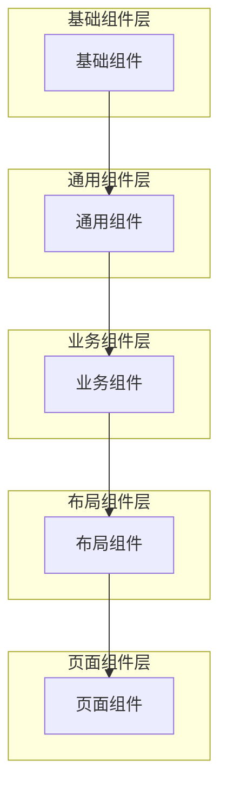

**Diagram sources**
- [DataTable.tsx](file://frontend/src/components/common/DataTable.tsx)
- [FormModal.tsx](file://frontend/src/components/FormModal.tsx)
- [PageContainer.tsx](file://frontend/src/components/PageContainer.tsx)

**Section sources**
- [DataTable.tsx](file://frontend/src/components/common/DataTable.tsx)
- [FormModal.tsx](file://frontend/src/components/FormModal.tsx)
- [PageContainer.tsx](file://frontend/src/components/PageContainer.tsx)

## 通用组件设计

通用组件位于`src/components/common/`目录下，提供跨业务场景的可复用UI元素。这些组件封装了常见的交互模式和视觉样式，确保系统整体的一致性。

### DataTable组件

`DataTable`组件是系统中最常用的表格组件，封装了分页、排序、筛选、加载状态等常用功能。它通过`columns`属性定义列配置，支持自定义渲染函数和操作列。

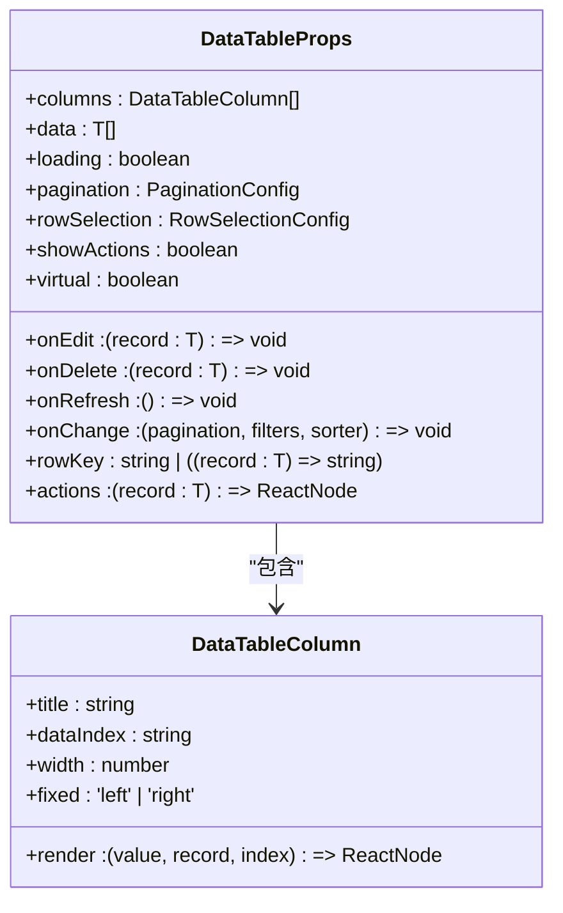

**Diagram sources**
- [DataTable.tsx](file://frontend/src/components/common/DataTable.tsx)

**Section sources**
- [DataTable.tsx](file://frontend/src/components/common/DataTable.tsx)

### StatusTag组件

`StatusTag`组件用于统一显示各种业务状态标签。它通过`statusMap`参数接收状态映射配置，根据状态值显示相应的文本和颜色。

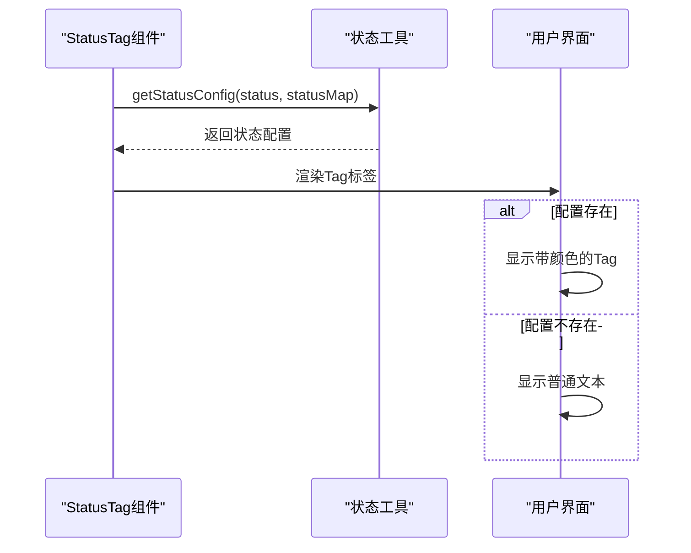

**Diagram sources**
- [StatusTag.tsx](file://frontend/src/components/common/StatusTag.tsx)
- [status.tsx](file://frontend/src/utils/status.tsx)

**Section sources**
- [StatusTag.tsx](file://frontend/src/components/common/StatusTag.tsx)
- [status.tsx](file://frontend/src/utils/status.tsx)

### BatchActionButton组件

`BatchActionButton`组件用于处理批量操作，如批量删除、批量审批等。它通过`selectedCount`参数显示选中项数量，并在点击时弹出确认对话框。

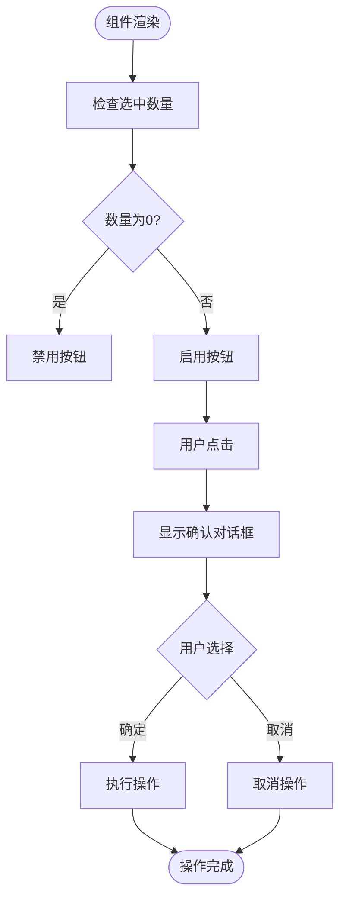

**Diagram sources**
- [BatchActionButton.tsx](file://frontend/src/components/common/BatchActionButton.tsx)

**Section sources**
- [BatchActionButton.tsx](file://frontend/src/components/common/BatchActionButton.tsx)

## 表单组件设计

表单组件位于`src/components/form/`目录下，专注于领域控件的封装和表单验证集成。这些组件将业务逻辑与UI表现分离，提高了表单开发的效率和一致性。

### AccountSelect组件

`AccountSelect`组件封装了账户选择的业务逻辑，支持按币种过滤账户，并在选择时提供账户信息回调。

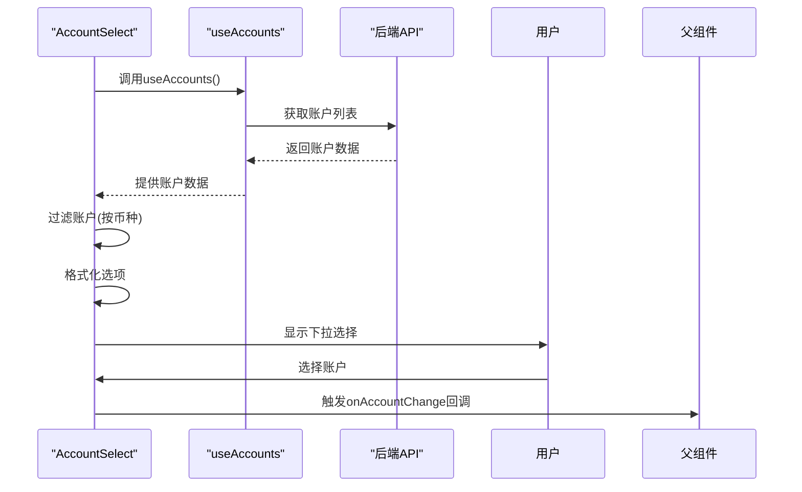

**Diagram sources**
- [AccountSelect.tsx](file://frontend/src/components/form/AccountSelect.tsx)
- [useAccounts.ts](file://frontend/src/hooks/useAccounts.ts)

**Section sources**
- [AccountSelect.tsx](file://frontend/src/components/form/AccountSelect.tsx)

### CurrencySelect组件

`CurrencySelect`组件封装了币种选择逻辑，支持仅显示币种代码或完整名称，并处理下拉菜单的渲染位置以避免被遮挡。

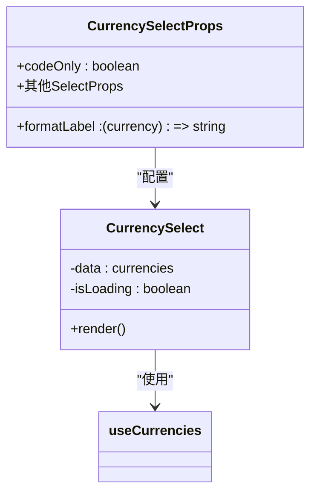

**Diagram sources**
- [CurrencySelect.tsx](file://frontend/src/components/form/CurrencySelect.tsx)
- [useCurrencies.ts](file://frontend/src/hooks/useCurrencies.ts)

**Section sources**
- [CurrencySelect.tsx](file://frontend/src/components/form/CurrencySelect.tsx)

### AmountInput组件

`AmountInput`组件封装了金额输入的业务规则，包括精度控制、负数允许和币种显示。

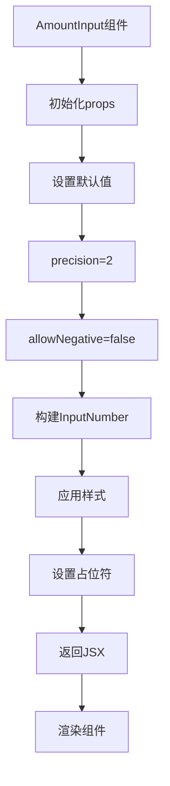

**Diagram sources**
- [AmountInput.tsx](file://frontend/src/components/form/AmountInput.tsx)

**Section sources**
- [AmountInput.tsx](file://frontend/src/components/form/AmountInput.tsx)

## 布局与交互组件

布局与交互组件提供了页面级别的结构和交互模式，确保用户体验的一致性。

### PageContainer组件

`PageContainer`组件是页面的顶层容器，提供标题、面包屑导航和内容区域的标准化布局。

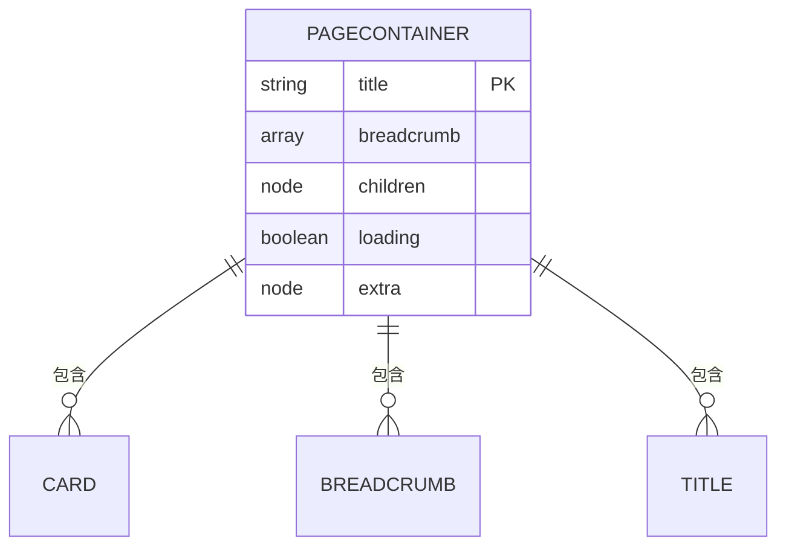

**Diagram sources**
- [PageContainer.tsx](file://frontend/src/components/PageContainer.tsx)

**Section sources**
- [PageContainer.tsx](file://frontend/src/components/PageContainer.tsx)

### FormModal组件

`FormModal`组件封装了表单模态框的通用逻辑，包括表单验证、提交处理和错误提示。

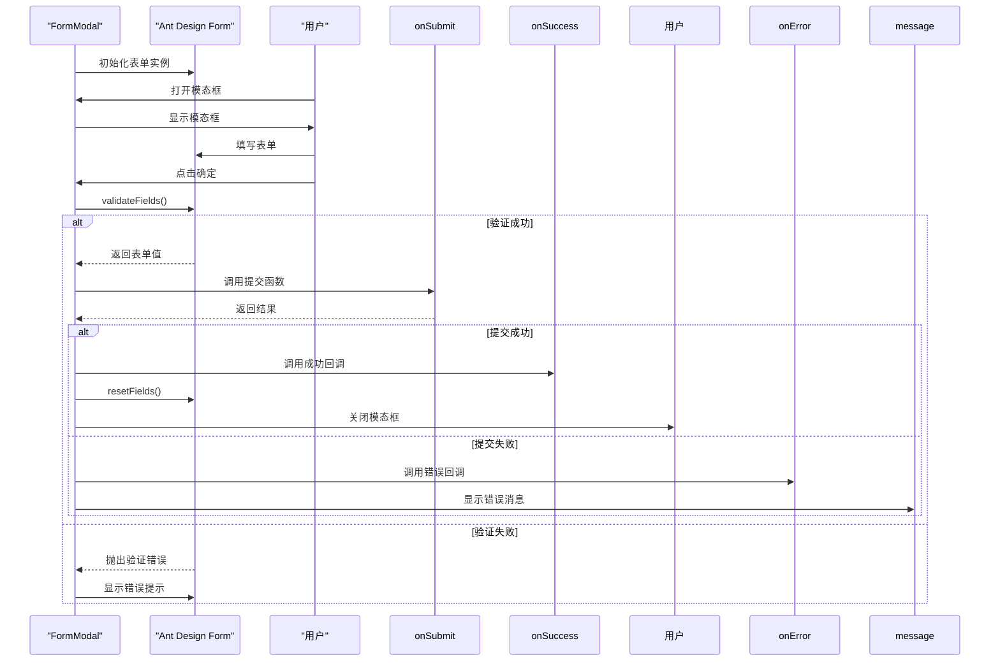

**Diagram sources**
- [FormModal.tsx](file://frontend/src/components/FormModal.tsx)

**Section sources**
- [FormModal.tsx](file://frontend/src/components/FormModal.tsx)

## 组件分类图示

以下图示展示了系统的组件分类层级关系：

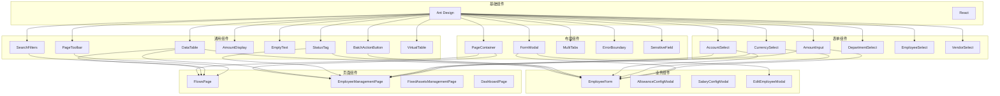

**Diagram sources**
- [common/index.ts](file://frontend/src/components/common/index.ts)
- [form/index.ts](file://frontend/src/components/form/index.ts)
- [PageContainer.tsx](file://frontend/src/components/PageContainer.tsx)
- [FormModal.tsx](file://frontend/src/components/FormModal.tsx)

**Section sources**
- [common/index.ts](file://frontend/src/components/common/index.ts)
- [form/index.ts](file://frontend/src/components/form/index.ts)

## 实际应用示例

### 财务收支页面

在`FlowsPage`中，多个通用组件被组合使用，展示了组件复用的实际效果。

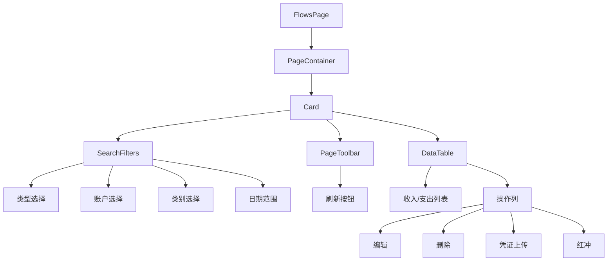

**Diagram sources**
- [FlowsPage.tsx](file://frontend/src/features/finance/pages/FlowsPage.tsx)
- [PageContainer.tsx](file://frontend/src/components/PageContainer.tsx)
- [SearchFilters.tsx](file://frontend/src/components/common/SearchFilters.tsx)
- [PageToolbar.tsx](file://frontend/src/components/common/PageToolbar.tsx)
- [DataTable.tsx](file://frontend/src/components/common/DataTable.tsx)

**Section sources**
- [FlowsPage.tsx](file://frontend/src/features/finance/pages/FlowsPage.tsx)

### 人力资源管理页面

在`EmployeeManagementPage`中，`StatusTag`组件被用于显示员工状态和账号状态。

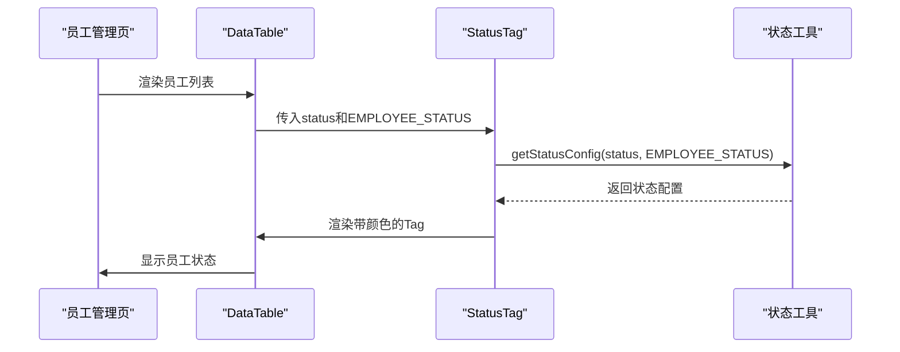

**Diagram sources**
- [EmployeeManagementPage.tsx](file://frontend/src/features/hr/pages/EmployeeManagementPage.tsx)
- [StatusTag.tsx](file://frontend/src/components/common/StatusTag.tsx)
- [status.tsx](file://frontend/src/utils/status.tsx)

**Section sources**
- [EmployeeManagementPage.tsx](file://frontend/src/features/hr/pages/EmployeeManagementPage.tsx)

## 可访问性与响应式设计

系统在组件设计中充分考虑了可访问性和响应式需求。

### 可访问性实现

- 所有交互元素都提供了适当的ARIA标签
- 表单组件支持键盘导航和屏幕阅读器
- 颜色对比度符合WCAG 2.1标准
- 状态变化提供适当的视觉和文本反馈

### 响应式设计策略

- 使用CSS Flexbox和Grid实现灵活布局
- 移动端优先的设计理念
- 断点设置：移动端(<768px)、平板(768px-1024px)、桌面(>1024px)
- 表格在小屏幕上自动启用虚拟滚动

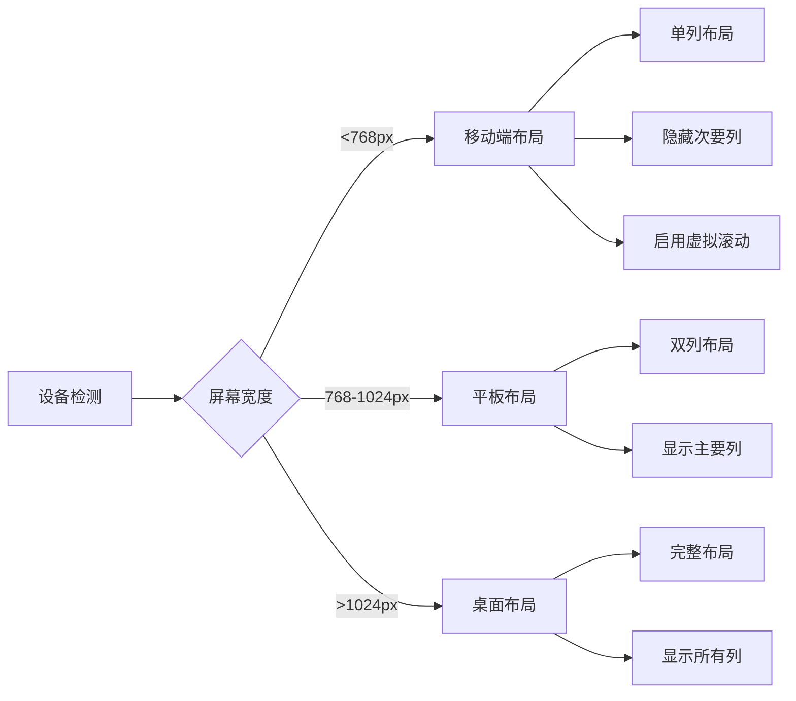

**Diagram sources**
- [DataTable.tsx](file://frontend/src/components/common/DataTable.tsx)
- [PageContainer.tsx](file://frontend/src/components/PageContainer.tsx)
- [styles/variables.css](file://frontend/src/styles/variables.css)

**Section sources**
- [DataTable.tsx](file://frontend/src/components/common/DataTable.tsx)
- [PageContainer.tsx](file://frontend/src/components/PageContainer.tsx)

## 结论

本组件架构通过清晰的分层设计和严格的复用策略，实现了前端代码的高内聚、低耦合。通用组件、表单组件和布局组件的分离，不仅提高了开发效率，也确保了系统整体的一致性和可维护性。未来可以进一步优化组件库，增加更多业务场景的专用组件，同时加强组件的可访问性和国际化支持。