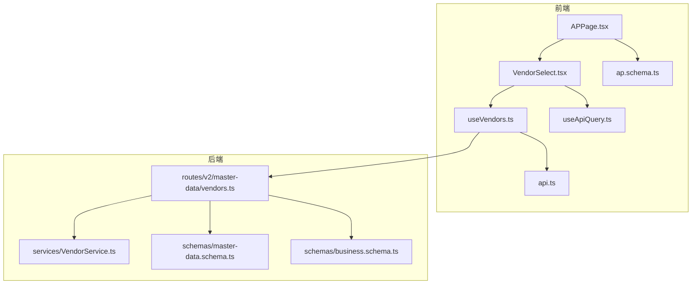
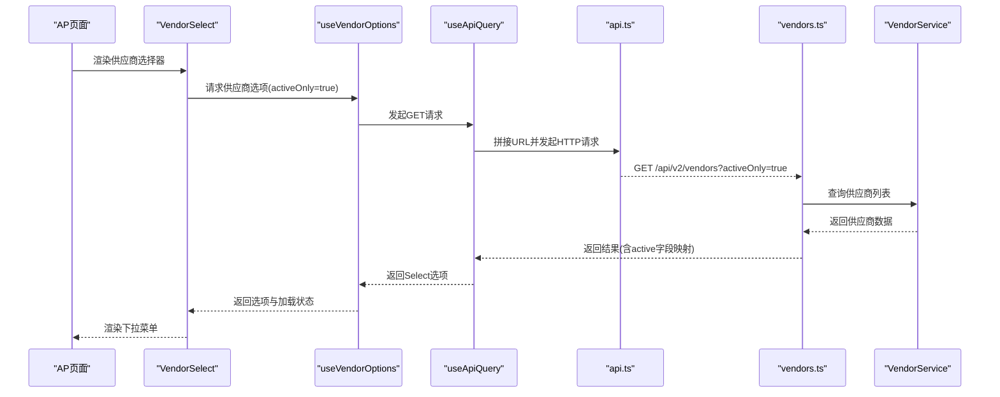
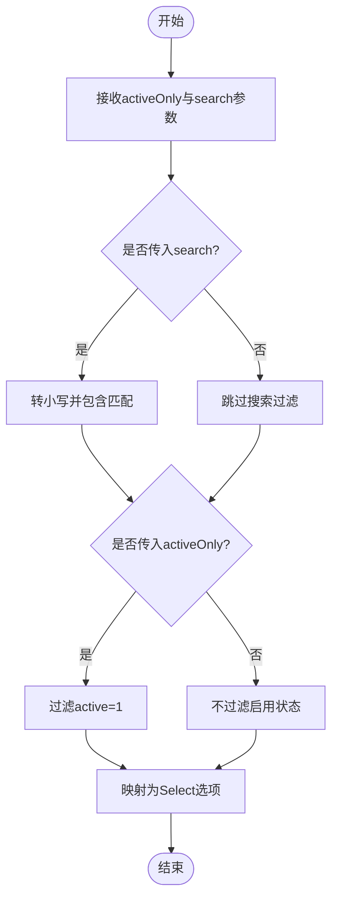
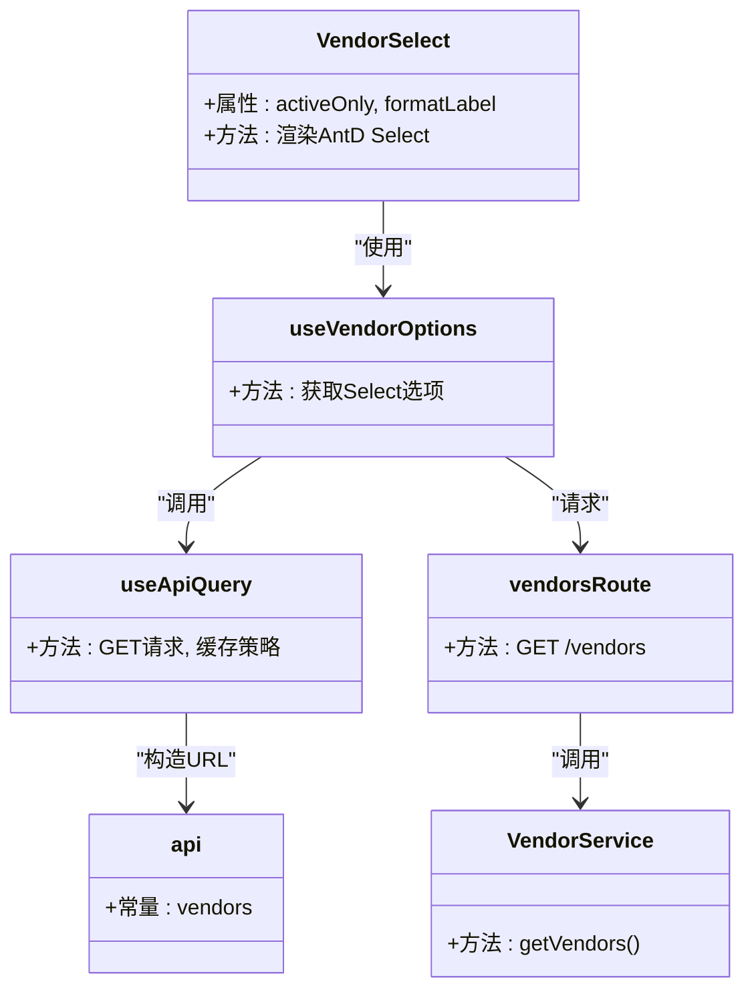

# 供应商选择器

<cite>
**本文引用的文件**
- [VendorSelect.tsx](file://frontend/src/components/form/VendorSelect.tsx)
- [useVendors.ts](file://frontend/src/hooks/business/useVendors.ts)
- [vendors.ts](file://backend/src/routes/v2/master-data/vendors.ts)
- [VendorService.ts](file://backend/src/services/VendorService.ts)
- [master-data.schema.ts](file://backend/src/schemas/master-data.schema.ts)
- [business.schema.ts](file://backend/src/schemas/business.schema.ts)
- [APPage.tsx](file://frontend/src/features/finance/pages/APPage.tsx)
- [ap.schema.ts](file://frontend/src/validations/ap.schema.ts)
- [api.ts](file://frontend/src/config/api.ts)
- [useApiQuery.ts](file://frontend/src/utils/useApiQuery.ts)
- [domain.ts](file://frontend/src/types/domain.ts)
- [vendor.schema.ts](file://frontend/src/validations/vendor.schema.ts)
</cite>

## 目录
1. [简介](#简介)
2. [项目结构](#项目结构)
3. [核心组件](#核心组件)
4. [架构总览](#架构总览)
5. [详细组件分析](#详细组件分析)
6. [依赖关系分析](#依赖关系分析)
7. [性能考量](#性能考量)
8. [故障排查指南](#故障排查指南)
9. [结论](#结论)

## 简介
本文件系统性阐述 VendorSelect 供应商选择器组件的设计目标与实现细节，重点说明其在采购、应付账款（AP）等业务场景中的应用，包括：
- 支持模糊搜索供应商名称的能力，以及如何在前端与后端协同实现
- 展示供应商状态（启用/禁用）与联系信息（联系人、电话、邮箱、地址）
- 与财务主数据的联动机制（如账户币种），以及在创建 AP 单据时对供应商必填与有效性校验的实现方式
- 结合表单验证需求，说明在创建 AP 单据时对供应商必填与有效性校验的实现方式
- 提供性能优化建议（如结果缓存、分页加载）

## 项目结构
VendorSelect 位于前端组件层，配合自定义 Hook 与 API 配置，调用后端供应商接口；后端提供供应商列表与详情接口，并由服务层负责数据持久化与状态控制。

图表来源
- [VendorSelect.tsx](file://frontend/src/components/form/VendorSelect.tsx#L1-L67)
- [useVendors.ts](file://frontend/src/hooks/business/useVendors.ts#L1-L106)
- [useApiQuery.ts](file://frontend/src/utils/useApiQuery.ts#L1-L103)
- [api.ts](file://frontend/src/config/api.ts#L1-L188)
- [APPage.tsx](file://frontend/src/features/finance/pages/APPage.tsx#L1-L320)
- [ap.schema.ts](file://frontend/src/validations/ap.schema.ts#L1-L22)
- [vendors.ts](file://backend/src/routes/v2/master-data/vendors.ts#L1-L260)
- [VendorService.ts](file://backend/src/services/VendorService.ts#L1-L94)
- [master-data.schema.ts](file://backend/src/schemas/master-data.schema.ts#L102-L118)
- [business.schema.ts](file://backend/src/schemas/business.schema.ts#L186-L224)

章节来源
- [VendorSelect.tsx](file://frontend/src/components/form/VendorSelect.tsx#L1-L67)
- [useVendors.ts](file://frontend/src/hooks/business/useVendors.ts#L1-L106)
- [vendors.ts](file://backend/src/routes/v2/master-data/vendors.ts#L1-L260)

## 核心组件
- VendorSelect 组件：封装供应商下拉选择逻辑，统一格式与样式，支持启用状态筛选与自定义标签格式化。
- useVendors/useVendorOptions Hook：封装供应商列表查询与 Select 选项格式化，内置缓存策略。
- 后端供应商路由与服务：提供供应商列表与详情接口，支持启用状态过滤与名称模糊匹配，维护供应商状态与联系信息。
- AP 页面与表单校验：在创建 AP 单据时对供应商必填进行校验，并与账户币种联动。

章节来源
- [VendorSelect.tsx](file://frontend/src/components/form/VendorSelect.tsx#L1-L67)
- [useVendors.ts](file://frontend/src/hooks/business/useVendors.ts#L1-L106)
- [vendors.ts](file://backend/src/routes/v2/master-data/vendors.ts#L1-L260)
- [VendorService.ts](file://backend/src/services/VendorService.ts#L1-L94)
- [APPage.tsx](file://frontend/src/features/finance/pages/APPage.tsx#L1-L320)
- [ap.schema.ts](file://frontend/src/validations/ap.schema.ts#L1-L22)

## 架构总览
VendorSelect 的调用链路如下：
- 前端组件 VendorSelect 使用 useVendorOptions 获取供应商选项
- useVendorOptions 通过 useApiQuery 发起请求到后端供应商接口
- 后端路由 vendors.ts 接收 activeOnly 与 search 参数，执行过滤与映射
- 服务层 VendorService 负责数据读取与状态维护
- AP 页面在表单提交前通过 zod schema 对供应商字段进行必填与有效性校验

图表来源
- [APPage.tsx](file://frontend/src/features/finance/pages/APPage.tsx#L236-L260)
- [VendorSelect.tsx](file://frontend/src/components/form/VendorSelect.tsx#L1-L67)
- [useVendors.ts](file://frontend/src/hooks/business/useVendors.ts#L37-L55)
- [useApiQuery.ts](file://frontend/src/utils/useApiQuery.ts#L1-L41)
- [api.ts](file://frontend/src/config/api.ts#L89-L90)
- [vendors.ts](file://backend/src/routes/v2/master-data/vendors.ts#L16-L68)
- [VendorService.ts](file://backend/src/services/VendorService.ts#L15-L17)

## 详细组件分析

### 组件设计与职责
- VendorSelect
  - 负责渲染 Ant Design 下拉选择器，支持启用状态筛选与自定义标签格式化
  - 内置模糊搜索能力（showSearch 与 optionFilterProp="label"）
  - 默认 activeOnly=true，确保仅显示启用供应商
- useVendorOptions
  - 以 Select 期望的 {value,label} 格式返回供应商选项
  - 内置 staleTime 缓存策略，减少重复请求
- useVendors
  - 返回完整供应商实体数组，便于扩展其他用途
  - 支持 activeOnly 与 search 参数传递给后端

章节来源
- [VendorSelect.tsx](file://frontend/src/components/form/VendorSelect.tsx#L1-L67)
- [useVendors.ts](file://frontend/src/hooks/business/useVendors.ts#L1-L106)

### 搜索与过滤机制
- 前端搜索
  - VendorSelect 内置 showSearch 与 optionFilterProp="label"，可对供应商标签进行模糊匹配
- 后端搜索
  - vendors.ts 路由接收 search 参数，对名称进行大小写无关的包含匹配
  - 同时支持 activeOnly 参数，仅返回启用供应商

图表来源
- [vendors.ts](file://backend/src/routes/v2/master-data/vendors.ts#L16-L68)

章节来源
- [vendors.ts](file://backend/src/routes/v2/master-data/vendors.ts#L16-L68)
- [VendorSelect.tsx](file://frontend/src/components/form/VendorSelect.tsx#L55-L65)

### 供应商状态与联系信息展示
- 供应商状态
  - 后端 schema 中 vendorSchema 定义 active 字段，默认启用
  - 前端 useVendorOptions 返回的选项不直接暴露 active 字段，但后端在响应中会映射 active 字段
- 联系信息
  - 后端 vendorSchema 支持 contact、phone、email、address、memo 等字段
  - 前端 VendorSelect 不直接展示这些字段，可在业务页面中通过供应商详情或表格列展示

章节来源
- [master-data.schema.ts](file://backend/src/schemas/master-data.schema.ts#L102-L118)
- [vendors.ts](file://backend/src/routes/v2/master-data/vendors.ts#L60-L68)

### 与财务主数据的联动机制
- 账户币种联动
  - 在 AP 确认阶段，AccountSelect 会根据所选账户显示币种，从而影响单据币种一致性
  - VendorSelect 本身不直接联动币种，但通过 AP 流程中的账户选择间接影响币种
- 供应商有效性校验
  - AP 页面在创建阶段通过 zod schema 对 partyId 进行必填校验
  - 后端 business.schema.ts 中 createArApDocSchema 对 partyId 的类型与长度进行约束

章节来源
- [APPage.tsx](file://frontend/src/features/finance/pages/APPage.tsx#L236-L260)
- [ap.schema.ts](file://frontend/src/validations/ap.schema.ts#L1-L10)
- [business.schema.ts](file://backend/src/schemas/business.schema.ts#L186-L199)

### 创建 AP 单据时的供应商必填与有效性校验
- 前端校验
  - AP 表单中 partyId 字段设置必填规则，VendorSelect 作为该字段的控件
  - zod schema createAPSchema 对 partyId 进行最小长度校验
- 后端校验
  - createArApDocSchema 对 partyId 进行 UUID 格式与正数金额校验
  - 后端 VendorService 在查询供应商时默认仅返回启用供应商，避免无效供应商被选中

章节来源
- [APPage.tsx](file://frontend/src/features/finance/pages/APPage.tsx#L236-L260)
- [ap.schema.ts](file://frontend/src/validations/ap.schema.ts#L1-L10)
- [business.schema.ts](file://backend/src/schemas/business.schema.ts#L186-L199)
- [VendorService.ts](file://backend/src/services/VendorService.ts#L15-L17)

## 依赖关系分析
- 组件依赖
  - VendorSelect 依赖 useVendorOptions，useVendorOptions 依赖 useApiQuery 与 api 配置
- 数据流
  - 前端通过 useApiQuery 访问后端 /api/v2/vendors 接口
  - 后端 vendors.ts 路由处理 activeOnly 与 search 参数，调用 VendorService 获取数据
- 类型与模式
  - 前端 domain.ts 定义 Vendor 类型，后端 master-data.schema.ts 定义 vendorSchema
  - AP 表单使用 ap.schema.ts 的 createAPSchema 与 confirmAPSchema

图表来源
- [VendorSelect.tsx](file://frontend/src/components/form/VendorSelect.tsx#L1-L67)
- [useVendors.ts](file://frontend/src/hooks/business/useVendors.ts#L37-L55)
- [useApiQuery.ts](file://frontend/src/utils/useApiQuery.ts#L1-L41)
- [api.ts](file://frontend/src/config/api.ts#L89-L90)
- [vendors.ts](file://backend/src/routes/v2/master-data/vendors.ts#L16-L68)
- [VendorService.ts](file://backend/src/services/VendorService.ts#L15-L17)

章节来源
- [VendorSelect.tsx](file://frontend/src/components/form/VendorSelect.tsx#L1-L67)
- [useVendors.ts](file://frontend/src/hooks/business/useVendors.ts#L1-L106)
- [useApiQuery.ts](file://frontend/src/utils/useApiQuery.ts#L1-L103)
- [api.ts](file://frontend/src/config/api.ts#L1-L188)
- [vendors.ts](file://backend/src/routes/v2/master-data/vendors.ts#L1-L260)
- [VendorService.ts](file://backend/src/services/VendorService.ts#L1-L94)
- [domain.ts](file://frontend/src/types/domain.ts#L237-L255)

## 性能考量
- 缓存策略
  - useVendors/useVendorOptions 使用 staleTime 缓存，默认 5 分钟，减少重复请求
  - useApiQuery 提供 keepPreviousData 与 placeholderData，提升切换体验
- 搜索性能
  - 前端 optionFilterProp="label" 实现轻量级客户端过滤
  - 后端 search 参数进行名称包含匹配，建议在大量数据时考虑索引与分页
- 分页加载
  - 当前供应商列表接口未见分页参数，建议在 vendors.ts 中引入分页参数（如 limit/offset 或游标分页），并在 useVendors 中暴露分页参数
- 并发与去重
  - useApiQuery 默认去重相同 queryKey 的请求，避免重复并发
- 传输优化
  - 仅返回 Select 所需的 value/label 字段，减少传输体积

章节来源
- [useVendors.ts](file://frontend/src/hooks/business/useVendors.ts#L1-L106)
- [useApiQuery.ts](file://frontend/src/utils/useApiQuery.ts#L1-L103)
- [vendors.ts](file://backend/src/routes/v2/master-data/vendors.ts#L16-L68)

## 故障排查指南
- 无法选择供应商
  - 检查 activeOnly 参数是否为 true 导致仅启用供应商被显示
  - 确认 search 参数是否导致过滤结果为空
- 供应商状态异常
  - 后端 VendorService 默认仅返回 active=1 的供应商，若供应商被禁用则不会出现在列表中
- 表单校验失败
  - AP 创建表单中 partyId 必须非空，否则 zod 校验会报错
  - 后端 createArApDocSchema 对 partyId 有 UUID 校验，确保传入值有效

章节来源
- [vendors.ts](file://backend/src/routes/v2/master-data/vendors.ts#L16-L68)
- [VendorService.ts](file://backend/src/services/VendorService.ts#L15-L17)
- [ap.schema.ts](file://frontend/src/validations/ap.schema.ts#L1-L10)
- [business.schema.ts](file://backend/src/schemas/business.schema.ts#L186-L199)

## 结论
VendorSelect 通过统一的组件封装与 Hook 抽象，实现了供应商选择的标准化与可复用性。其与后端供应商接口的协作，既满足了前端模糊搜索与启用状态筛选的需求，又通过后端严格的数据模型与服务层逻辑保障了数据一致性。在 AP 单据流程中，通过前端 zod 校验与后端 schema 校验共同保证了供应商字段的有效性。建议后续引入分页参数与更细粒度的搜索优化，以进一步提升大规模数据下的性能与用户体验。