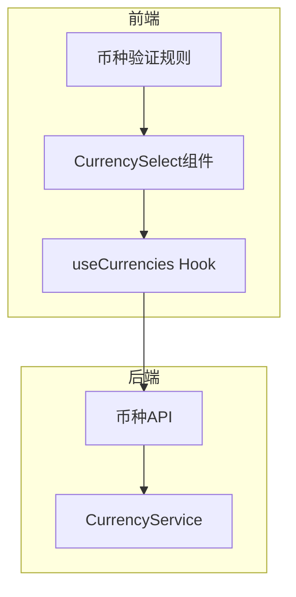
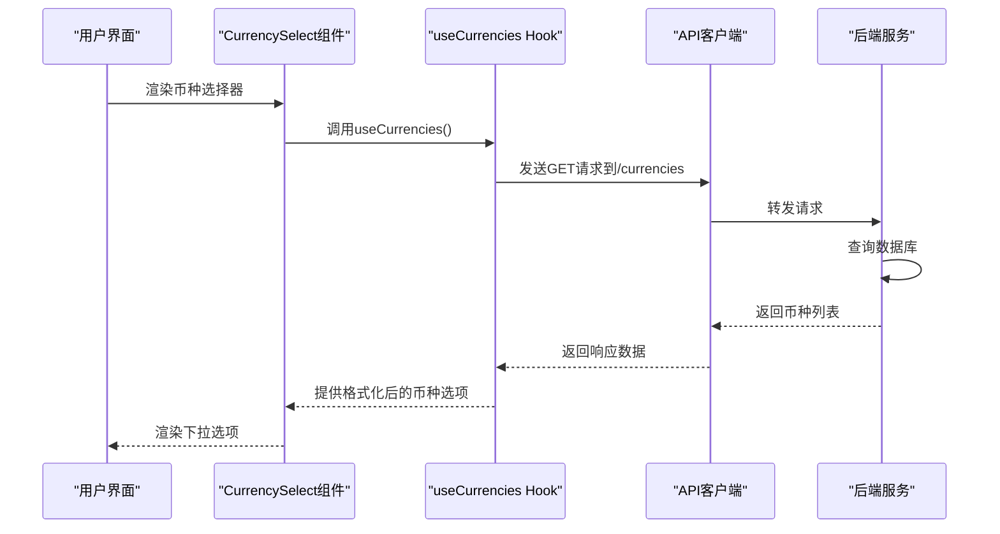
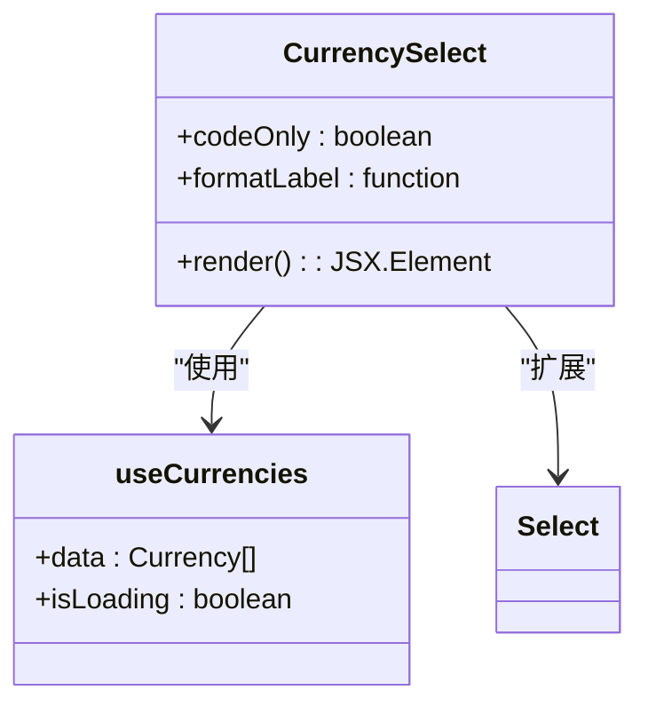
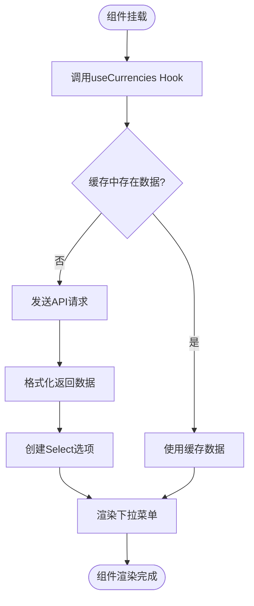
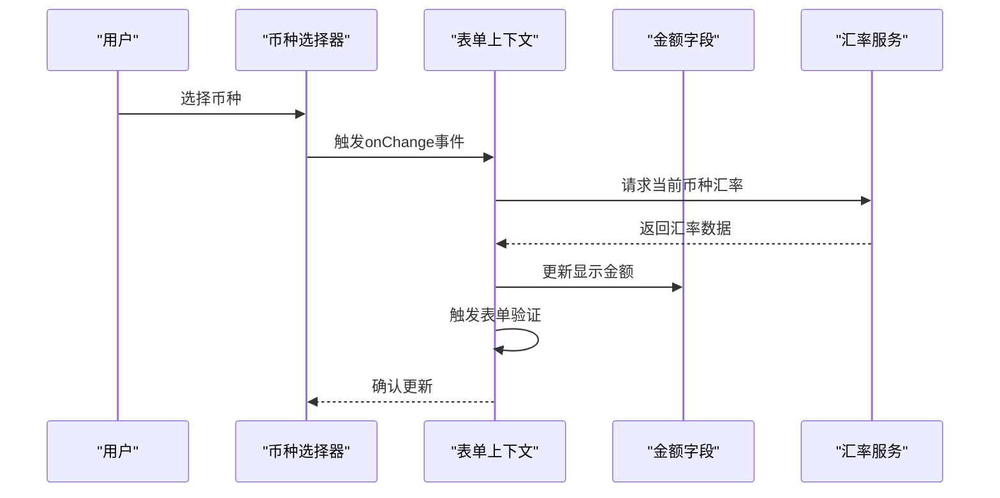
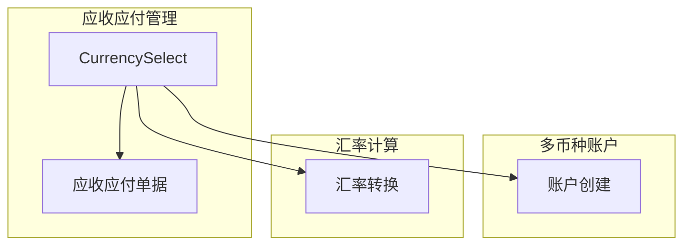
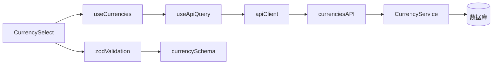

# 币种选择器

<cite>
**本文档引用的文件**  
- [CurrencySelect.tsx](file://frontend/src/components/form/CurrencySelect.tsx)
- [useCurrencies.ts](file://frontend/src/hooks/business/useCurrencies.ts)
- [CurrencyService.ts](file://backend/src/services/CurrencyService.ts)
- [currency.schema.ts](file://frontend/src/validations/currency.schema.ts)
- [api.ts](file://frontend/src/config/api.ts)
- [useApiQuery.ts](file://frontend/src/utils/useApiQuery.ts)
- [business.ts](file://frontend/src/types/business.ts)
- [useBusinessData.ts](file://frontend/src/hooks/useBusinessData.ts)
</cite>

## 目录
1. [简介](#简介)
2. [项目结构](#项目结构)
3. [核心组件](#核心组件)
4. [架构概述](#架构概述)
5. [详细组件分析](#详细组件分析)
6. [依赖分析](#依赖分析)
7. [性能考虑](#性能考虑)
8. [故障排除指南](#故障排除指南)
9. [结论](#结论)

## 简介
币种选择器组件（CurrencySelect）是财务管理系统中的核心表单组件，用于统一管理币种选择功能。该组件封装了币种下拉选择的逻辑和样式，支持动态加载系统支持的币种列表、渲染货币符号，并与其他表单字段联动。它在应收应付管理、多币种账户创建等场景中发挥重要作用，同时支持只读模式、禁用特定币种等配置选项，并通过zod验证规则确保币种必填和合法性校验。

## 项目结构
币种选择器组件位于前端组件库中，与后端服务和验证规则紧密配合，形成完整的币种管理解决方案。

**图表来源**  
- [CurrencySelect.tsx](file://frontend/src/components/form/CurrencySelect.tsx)
- [useCurrencies.ts](file://frontend/src/hooks/business/useCurrencies.ts)
- [CurrencyService.ts](file://backend/src/services/CurrencyService.ts)
- [currency.schema.ts](file://frontend/src/validations/currency.schema.ts)

**章节来源**  
- [CurrencySelect.tsx](file://frontend/src/components/form/CurrencySelect.tsx)
- [useCurrencies.ts](file://frontend/src/hooks/business/useCurrencies.ts)
- [CurrencyService.ts](file://backend/src/services/CurrencyService.ts)

## 核心组件
币种选择器组件通过React Hook和Ant Design组件库实现，封装了币种选择的核心逻辑。组件使用useCurrencies Hook获取币种数据，并根据配置选项动态渲染选项。它支持自定义标签格式化函数和仅显示代码模式，确保在不同场景下的灵活性。

**章节来源**  
- [CurrencySelect.tsx](file://frontend/src/components/form/CurrencySelect.tsx)
- [useCurrencies.ts](file://frontend/src/hooks/business/useCurrencies.ts)

## 架构概述
币种选择器采用分层架构设计，从前端组件到后端服务形成完整的数据流。前端组件通过Hook获取数据，经过格式化后渲染到UI层；后端服务处理数据持久化和业务逻辑。

**图表来源**  
- [CurrencySelect.tsx](file://frontend/src/components/form/CurrencySelect.tsx)
- [useCurrencies.ts](file://frontend/src/hooks/business/useCurrencies.ts)
- [CurrencyService.ts](file://backend/src/services/CurrencyService.ts)

## 详细组件分析

### 币种选择器组件分析
CurrencySelect组件是基于Ant Design的Select组件封装的高级组件，提供了统一的币种选择体验。

#### 组件实现

**图表来源**  
- [CurrencySelect.tsx](file://frontend/src/components/form/CurrencySelect.tsx)
- [useCurrencies.ts](file://frontend/src/hooks/business/useCurrencies.ts)

**章节来源**  
- [CurrencySelect.tsx](file://frontend/src/components/form/CurrencySelect.tsx)

### 币种数据加载机制
组件通过useCurrencies Hook加载系统支持的币种列表，并动态渲染货币符号。

#### 数据加载流程

**图表来源**  
- [useCurrencies.ts](file://frontend/src/hooks/business/useCurrencies.ts)
- [CurrencySelect.tsx](file://frontend/src/components/form/CurrencySelect.tsx)

**章节来源**  
- [useCurrencies.ts](file://frontend/src/hooks/business/useCurrencies.ts)

### 表单联动与上下文机制
在涉及汇率计算的场景中，币种选择器通过表单上下文与其他字段联动更新。

#### 联动更新机制

**图表来源**  
- [CurrencySelect.tsx](file://frontend/src/components/form/CurrencySelect.tsx)
- [useZodForm.ts](file://frontend/src/hooks/forms/useZodForm.ts)

**章节来源**  
- [CurrencySelect.tsx](file://frontend/src/components/form/CurrencySelect.tsx)

### 配置选项与应用场景
组件支持多种配置选项，并在不同业务场景中灵活应用。

#### 配置选项
| 配置项 | 类型 | 默认值 | 描述 |
|--------|------|--------|------|
| codeOnly | boolean | false | 是否只显示币种代码 |
| formatLabel | function | undefined | 自定义标签格式化函数 |
| disabled | boolean | false | 是否禁用选择器 |
| readOnly | boolean | false | 是否只读模式 |

#### 实际应用场景

**图表来源**  
- [ARPage.tsx](file://frontend/src/features/finance/pages/ARPage.tsx)
- [APPage.tsx](file://frontend/src/features/finance/pages/APPage.tsx)
- [AccountSelect.tsx](file://frontend/src/components/form/AccountSelect.tsx)

**章节来源**  
- [CurrencySelect.tsx](file://frontend/src/components/form/CurrencySelect.tsx)

## 依赖分析
币种选择器组件依赖多个前端和后端模块，形成完整的功能链。

**图表来源**  
- [go.mod](file://backend/go.mod)
- [package.json](file://frontend/package.json)

**章节来源**  
- [CurrencySelect.tsx](file://frontend/src/components/form/CurrencySelect.tsx)
- [useCurrencies.ts](file://frontend/src/hooks/business/useCurrencies.ts)
- [CurrencyService.ts](file://backend/src/services/CurrencyService.ts)

## 性能考虑
组件在设计时考虑了性能优化，通过缓存机制减少不必要的API调用。

- **数据缓存**：使用React Query的缓存机制，设置合理的staleTime，避免频繁请求
- **懒加载**：仅在组件需要时才加载币种数据
- **虚拟滚动**：对于大量币种选项，考虑使用虚拟滚动优化渲染性能
- **防抖处理**：在搜索场景中使用防抖技术，减少服务器压力

## 故障排除指南
### 常见问题及解决方案
| 问题现象 | 可能原因 | 解决方案 |
|---------|--------|---------|
| 币种列表为空 | 后端服务异常或网络问题 | 检查API端点是否正常，确认网络连接 |
| 无法选择币种 | 组件被禁用或只读 | 检查组件的disabled和readOnly属性 |
| 新增币种不显示 | 缓存未更新 | 手动刷新页面或清除缓存 |
| 搜索功能失效 | 搜索逻辑错误 | 检查后端搜索接口实现 |

**章节来源**  
- [CurrencySelect.tsx](file://frontend/src/components/form/CurrencySelect.tsx)
- [CurrencyService.ts](file://backend/src/services/CurrencyService.ts)

## 结论
币种选择器组件通过精心设计的架构和实现，为财务管理系统提供了稳定可靠的币种选择功能。组件不仅实现了基本的选择功能，还通过与表单上下文的联动、灵活的配置选项和严格的验证规则，满足了复杂业务场景的需求。其分层架构设计使得组件易于维护和扩展，为系统的稳定运行提供了保障。