# 表单组件

<cite>
**本文档引用的文件**  
- [AccountSelect.tsx](file://frontend/src/components/form/AccountSelect.tsx)
- [CurrencySelect.tsx](file://frontend/src/components/form/CurrencySelect.tsx)
- [AmountInput.tsx](file://frontend/src/components/form/AmountInput.tsx)
- [DepartmentSelect.tsx](file://frontend/src/components/form/DepartmentSelect.tsx)
- [EmployeeSelect.tsx](file://frontend/src/components/form/EmployeeSelect.tsx)
- [useAccounts.ts](file://frontend/src/hooks/business/useAccounts.ts)
- [useCurrencies.ts](file://frontend/src/hooks/business/useCurrencies.ts)
- [useDepartments.ts](file://frontend/src/hooks/business/useDepartments.ts)
- [useEmployees.ts](file://frontend/src/hooks/business/useEmployees.ts)
- [EmployeeForm.tsx](file://frontend/src/features/employees/components/forms/EmployeeForm.tsx)
- [SalaryPaymentsPage.tsx](file://frontend/src/features/hr/pages/SalaryPaymentsPage.tsx)
- [useZodForm.ts](file://frontend/src/hooks/forms/useZodForm.ts)
- [salary.schema.ts](file://frontend/src/validations/salary.schema.ts)
- [employee.schema.ts](file://frontend/src/validations/employee.schema.ts)
</cite>

## 目录
1. [引言](#引言)
2. [核心表单组件分析](#核心表单组件分析)
3. [数据加载与缓存机制](#数据加载与缓存机制)
4. [表单验证与UI联动](#表单验证与ui联动)
5. [实际应用场景](#实际应用场景)
6. [结论](#结论)

## 引言
本文档系统阐述财务系统中领域专用表单控件的封装原则与工程实践。重点解析AccountSelect、CurrencySelect、AmountInput、DepartmentSelect和EmployeeSelect等核心组件的实现机制，分析其在员工管理、薪资发放等业务场景中的应用模式。

## 核心表单组件分析

### AccountSelect账户选择器
AccountSelect组件封装了账户下拉选择的逻辑，通过useAccounts Hook实现账户数据的异步加载和缓存管理。组件支持按币种过滤账户、显示币种信息等配置选项，并提供onAccountChange回调以获取账户信息。

**组件特性**：
- 支持按币种过滤账户
- 可自定义账户标签格式化
- 提供账户选择回调
- 内置搜索过滤功能

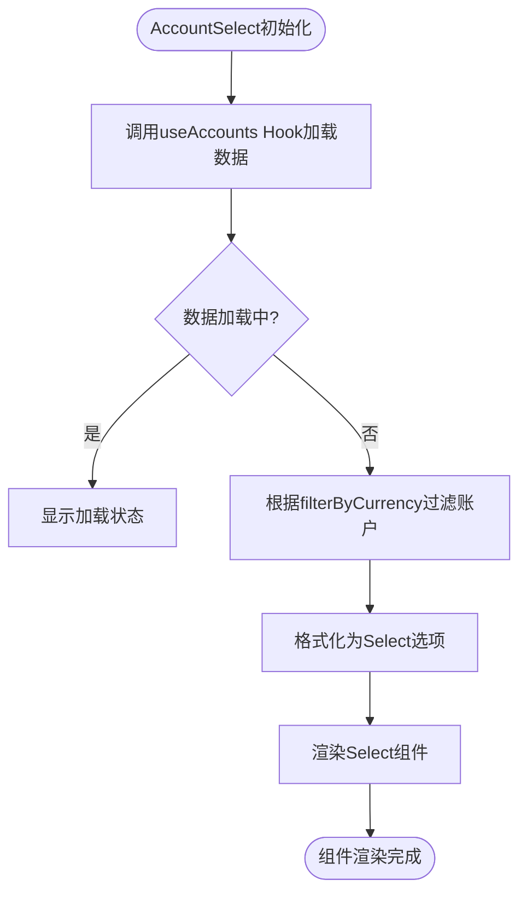

**组件源码**
- [AccountSelect.tsx](file://frontend/src/components/form/AccountSelect.tsx)

### CurrencySelect币种选择器
CurrencySelect组件实现了币种选择功能，通过useCurrencies Hook获取币种数据。组件支持仅显示币种代码或完整名称，并可自定义标签格式。

**组件特性**：
- 支持codeOnly模式
- 可自定义币种标签格式化
- 内置搜索过滤
- 智能弹出容器定位

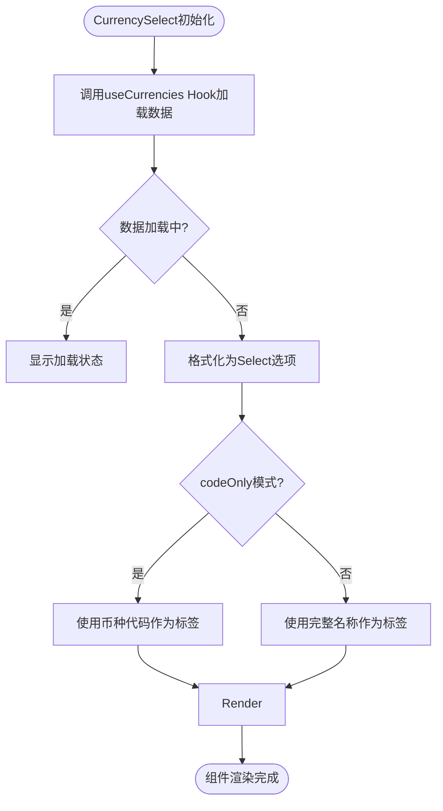

**组件源码**
- [CurrencySelect.tsx](file://frontend/src/components/form/CurrencySelect.tsx)

### AmountInput金额输入框
AmountInput组件封装了金额输入的逻辑，提供实时格式化、精度控制和正负值校验功能。

**组件特性**：
- 支持千分位分隔
- 可配置小数位数
- 支持负数输入
- 币种符号显示

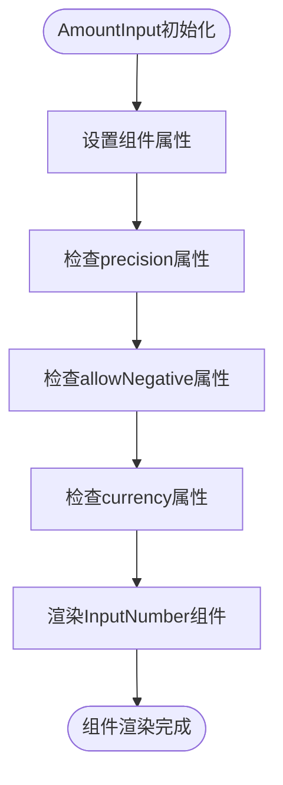

**组件源码**
- [AmountInput.tsx](file://frontend/src/components/form/AmountInput.tsx)

### DepartmentSelect部门选择器
DepartmentSelect组件实现了部门选择功能，通过useDepartments Hook获取部门数据。

**组件特性**：
- 支持自定义部门标签格式化
- 内置搜索过滤
- 支持树形结构展示

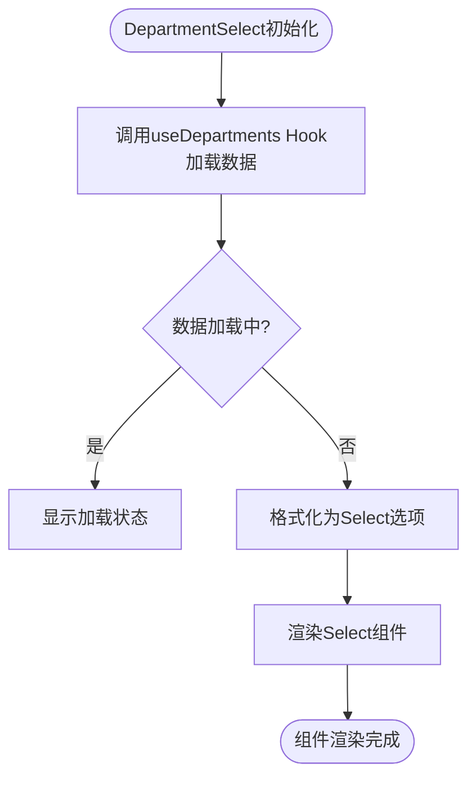

**组件源码**
- [DepartmentSelect.tsx](file://frontend/src/components/form/DepartmentSelect.tsx)

### EmployeeSelect员工选择器
EmployeeSelect组件实现了员工选择功能，通过useEmployees Hook获取员工数据。

**组件特性**：
- 支持仅显示活跃员工
- 可显示部门信息
- 支持自定义员工标签格式化
- 内置搜索过滤

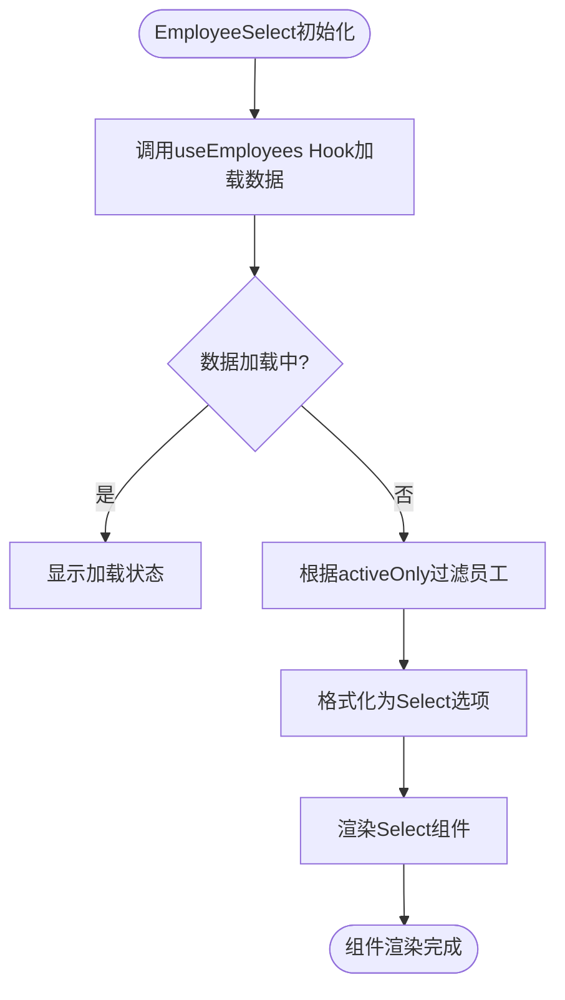

**组件源码**
- [EmployeeSelect.tsx](file://frontend/src/components/form/EmployeeSelect.tsx)

## 数据加载与缓存机制

### useAccounts Hook实现
useAccounts Hook负责账户数据的异步加载和缓存管理，采用React Query进行数据获取和状态管理。

**核心功能**：
- 支持多种过滤条件（activeOnly, currency, accountType, search）
- 数据缓存时间配置
- 查询键依赖管理
- 数据选择器（select）处理

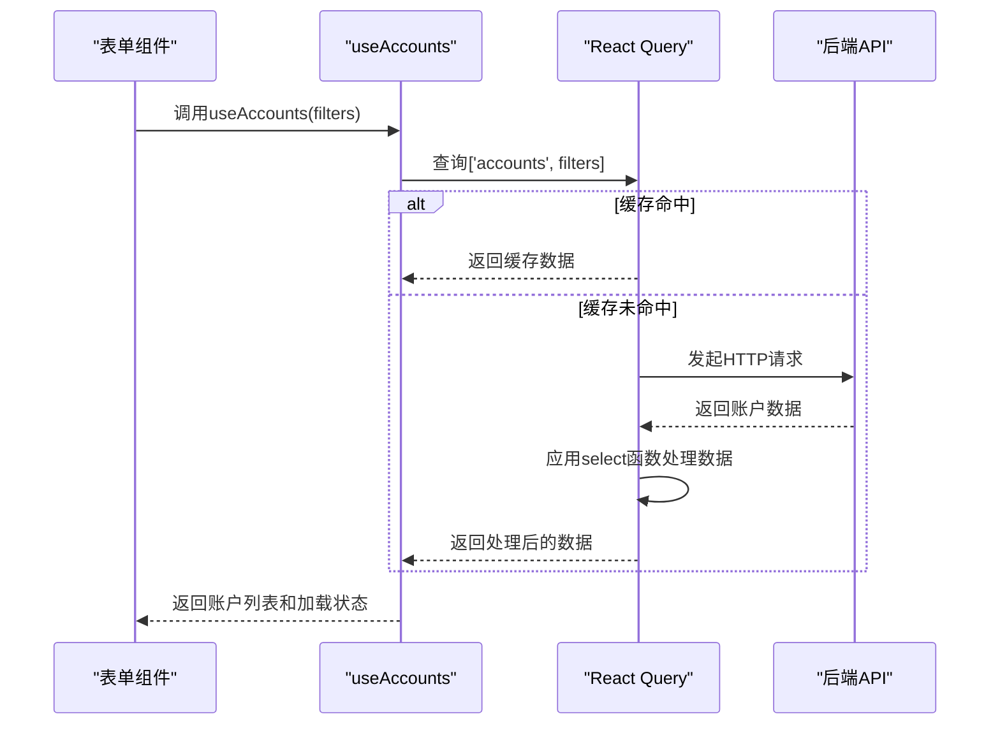

**Hook源码**
- [useAccounts.ts](file://frontend/src/hooks/business/useAccounts.ts)

### useCurrencies Hook实现
useCurrencies Hook负责币种数据的异步加载，支持启用状态过滤。

**核心功能**：
- 支持activeOnly过滤
- 数据缓存管理
- 选项格式化

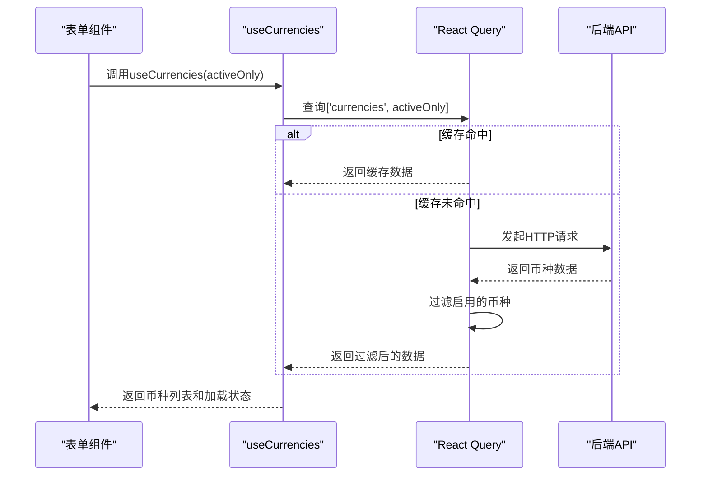

**Hook源码**
- [useCurrencies.ts](file://frontend/src/hooks/business/useCurrencies.ts)

### useDepartments Hook实现
useDepartments Hook负责部门数据的加载，提供基础的部门列表查询功能。

**核心功能**：
- 部门列表查询
- 数据缓存（1小时）
- 选项格式化

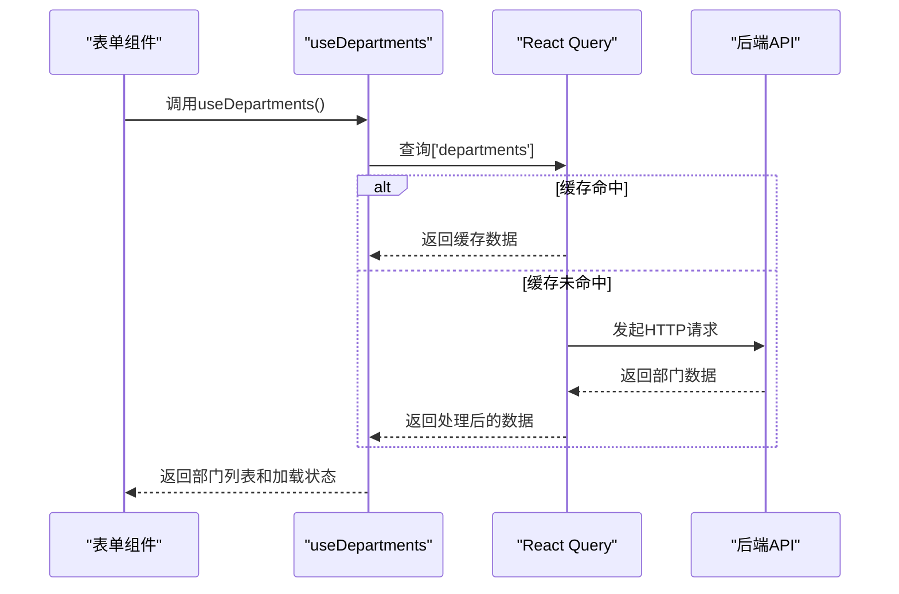

**Hook源码**
- [useDepartments.ts](file://frontend/src/hooks/business/useDepartments.ts)

### useEmployees Hook实现
useEmployees Hook负责员工数据的加载，支持多种过滤条件。

**核心功能**：
- 支持状态过滤
- 支持活跃状态过滤
- 支持搜索过滤
- 数据缓存管理

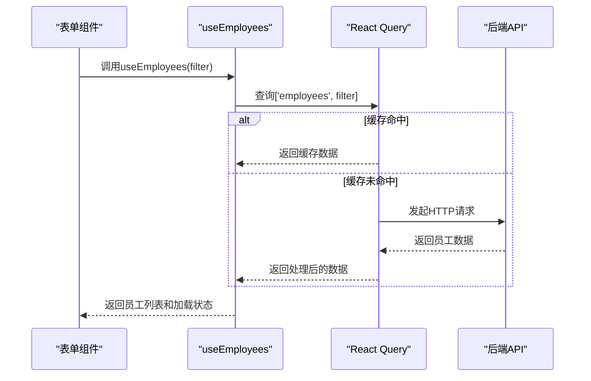

**Hook源码**
- [useEmployees.ts](file://frontend/src/hooks/business/useEmployees.ts)

## 表单验证与UI联动

### zod schema验证机制
系统采用zod作为表单验证库，通过useZodForm Hook实现表单验证与UI的联动。

**验证流程**：
1. 定义zod schema
2. 使用useZodForm创建表单实例
3. 调用validateWithZod进行验证
4. 错误信息自动显示在表单中

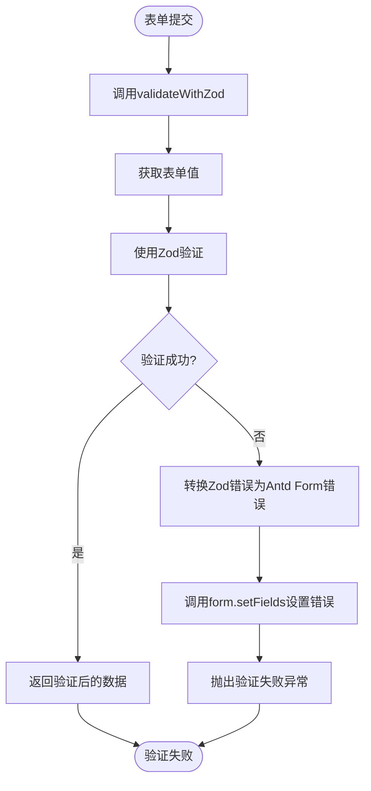

**Hook源码**
- [useZodForm.ts](file://frontend/src/hooks/forms/useZodForm.ts)

### 验证规则示例
#### 薪资发放验证规则
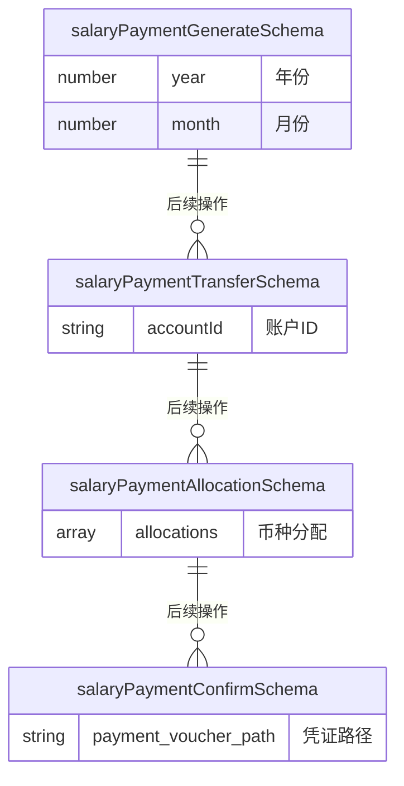

**验证源码**
- [salary.schema.ts](file://frontend/src/validations/salary.schema.ts)

#### 员工管理验证规则
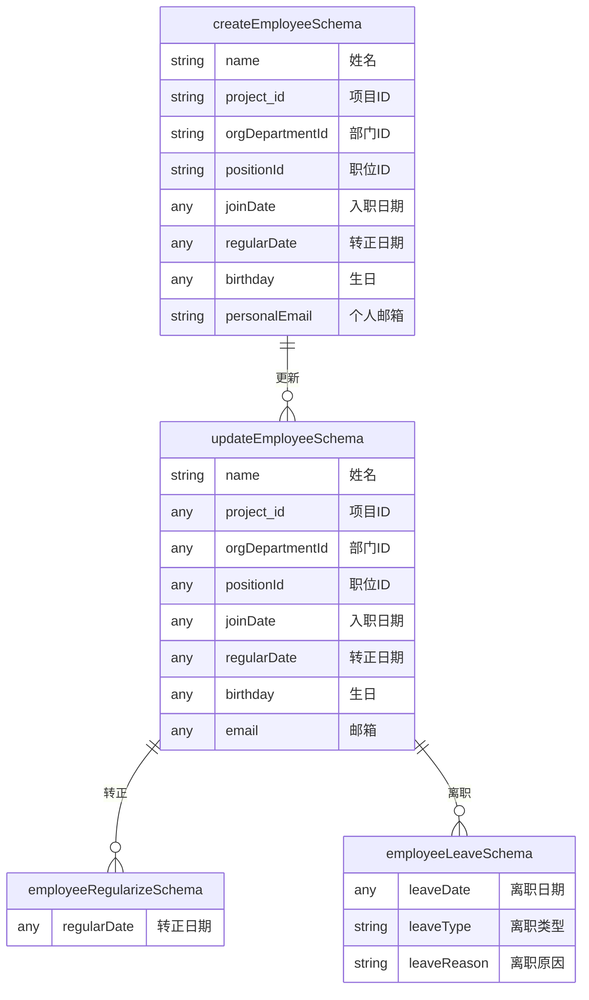

**验证源码**
- [employee.schema.ts](file://frontend/src/validations/employee.schema.ts)

## 实际应用场景

### 员工管理场景
在员工管理页面中，多个表单组件协同工作，实现完整的员工信息管理功能。

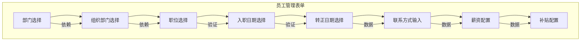

**应用场景源码**
- [EmployeeForm.tsx](file://frontend/src/features/employees/components/forms/EmployeeForm.tsx)

### 薪资发放场景
在薪资发放页面中，表单组件与验证规则紧密结合，确保薪资发放流程的准确性和安全性。

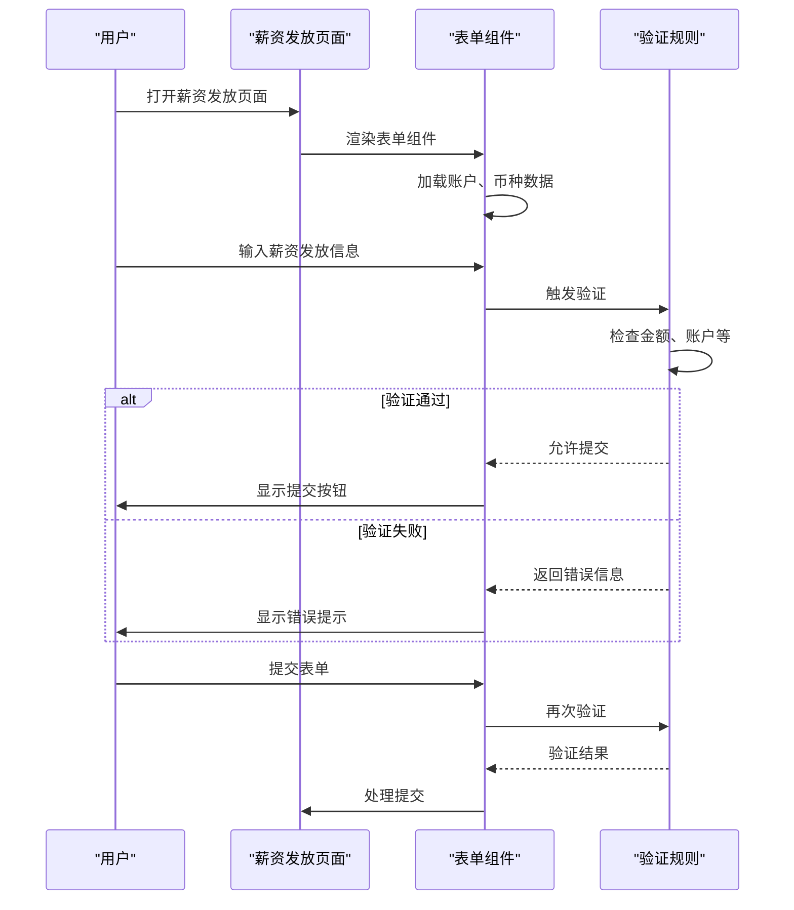

**应用场景源码**
- [SalaryPaymentsPage.tsx](file://frontend/src/features/hr/pages/SalaryPaymentsPage.tsx)

## 结论
本文档详细分析了财务系统中领域专用表单控件的封装原则与工程实践。通过useAccounts、useCurrencies等Hook实现了数据的异步加载和缓存管理，通过zod schema实现了表单验证与UI的联动。这些组件在员工管理、薪资发放等场景中得到了有效应用，提高了开发效率和用户体验。