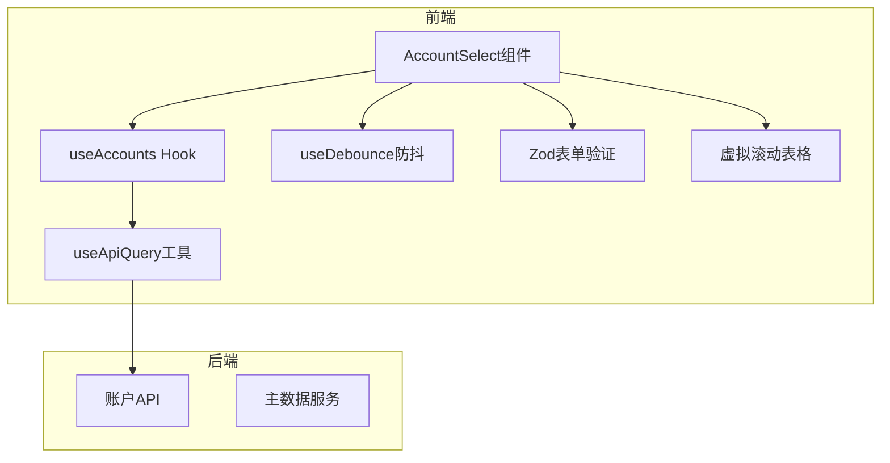
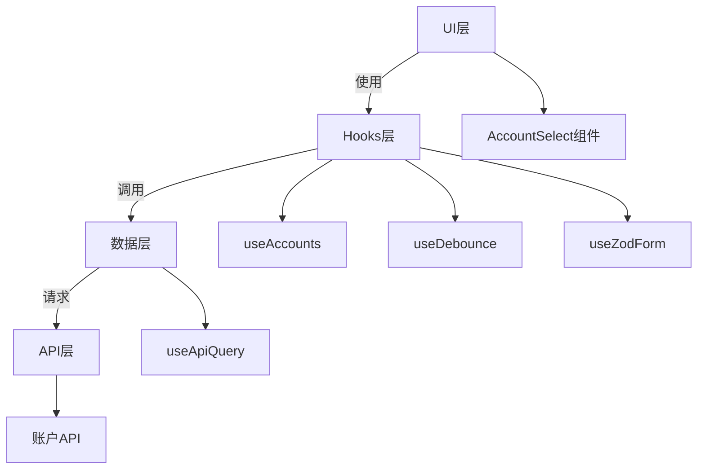
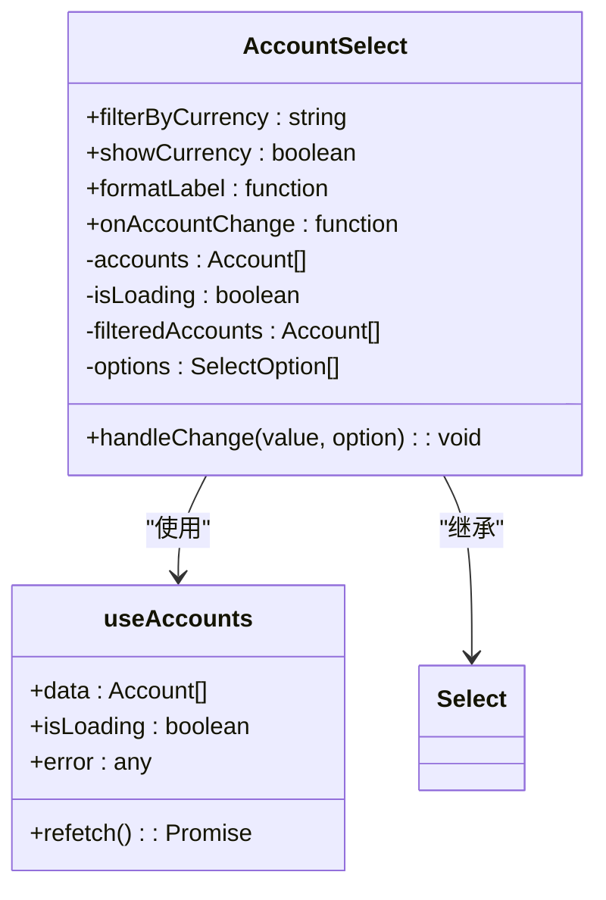
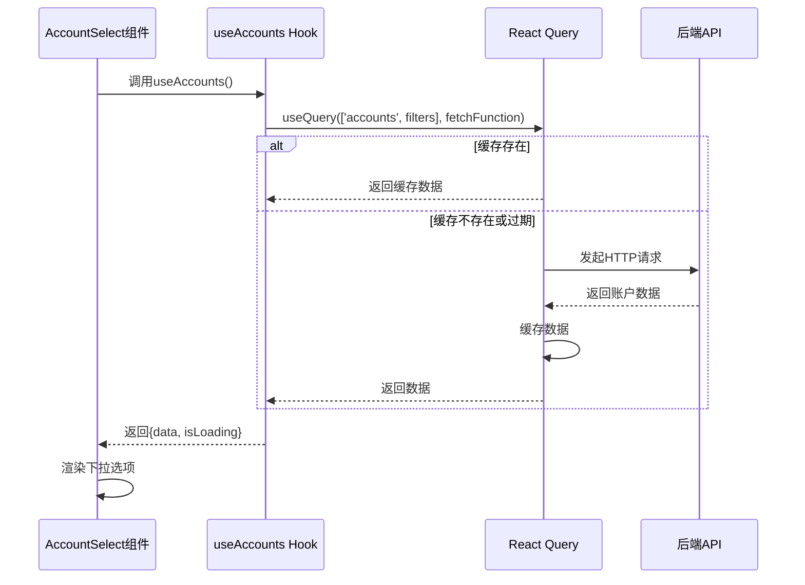
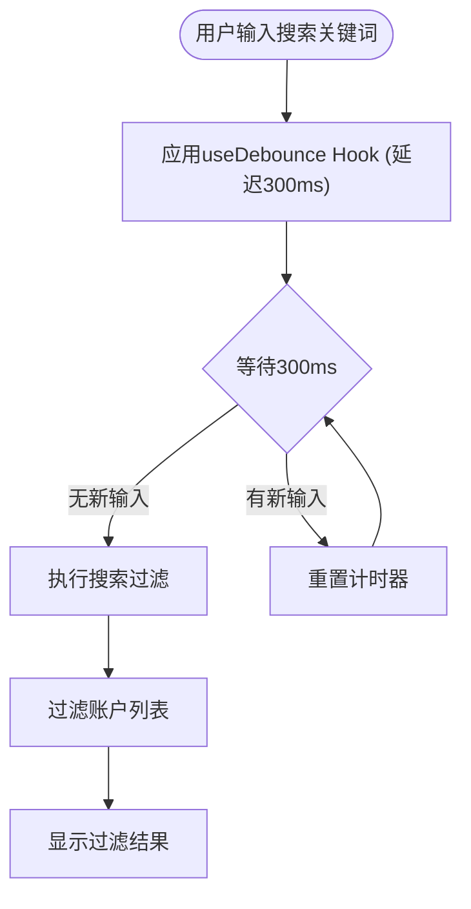
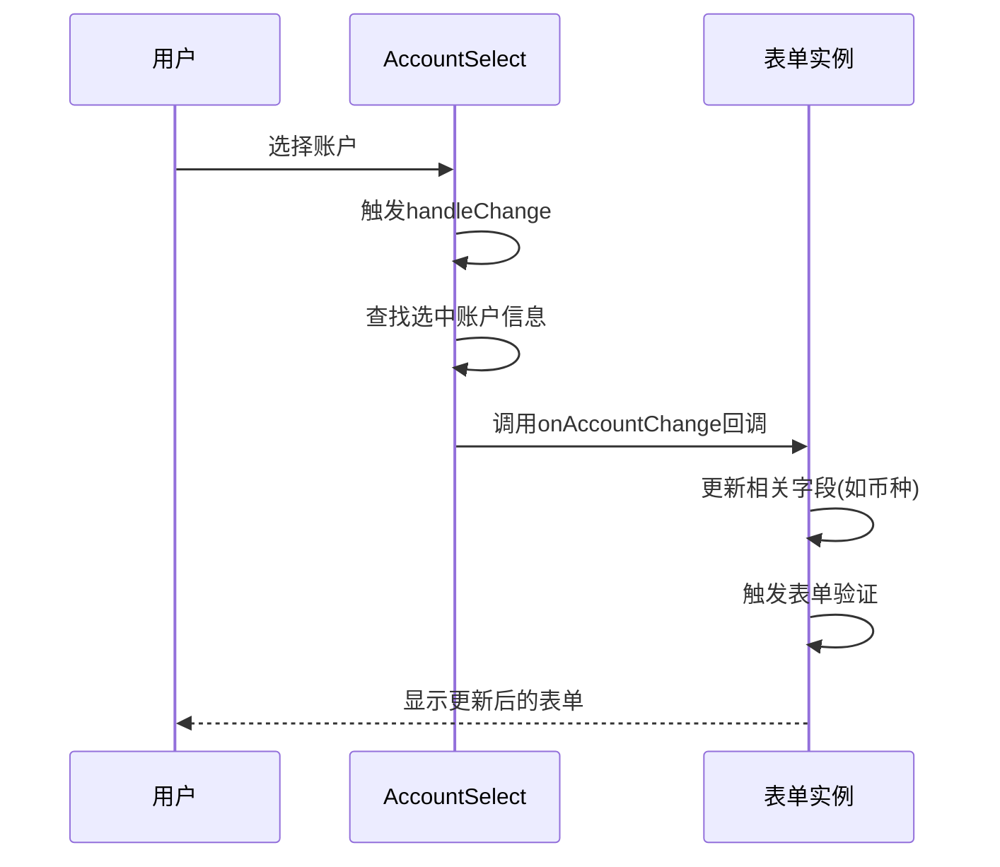
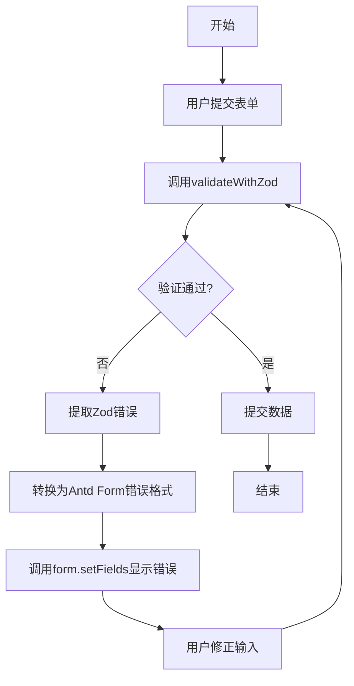
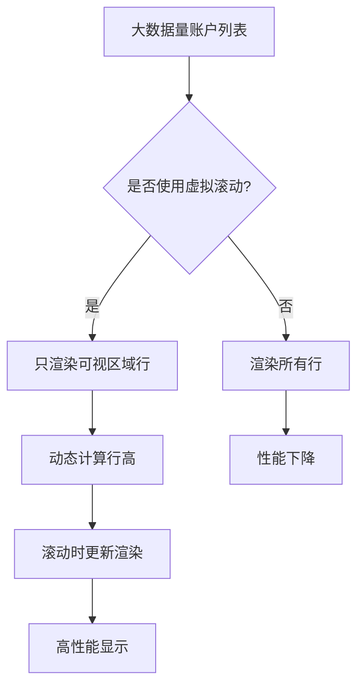
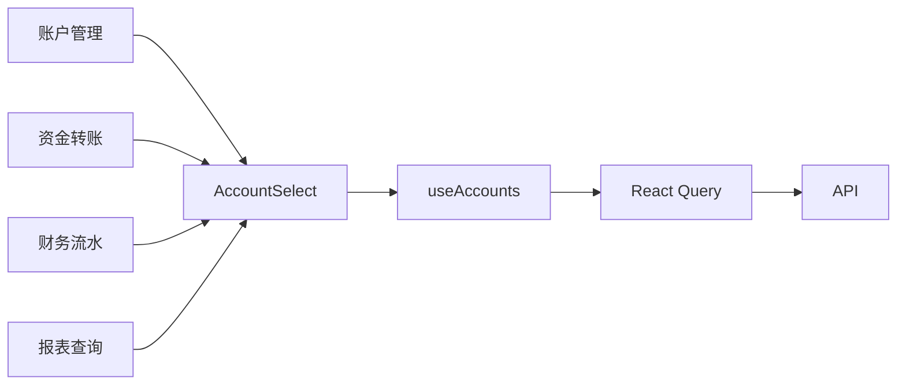
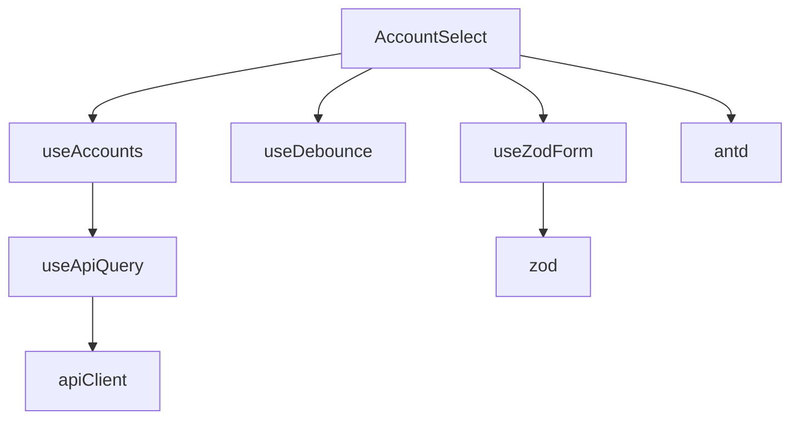

# 账户选择器

<cite>
**本文档引用的文件**
- [AccountSelect.tsx](file://frontend/src/components/form/AccountSelect.tsx)
- [useAccounts.ts](file://frontend/src/hooks/business/useAccounts.ts)
- [useApiQuery.ts](file://frontend/src/utils/useApiQuery.ts)
- [useDebounce.ts](file://frontend/src/hooks/useDebounce.ts)
- [account.schema.ts](file://frontend/src/validations/account.schema.ts)
- [accountTransfer.schema.ts](file://frontend/src/validations/accountTransfer.schema.ts)
- [useZodForm.ts](file://frontend/src/hooks/forms/useZodForm.ts)
- [VirtualTable.tsx](file://frontend/src/components/common/VirtualTable.tsx)
- [AccountManagementPage.tsx](file://frontend/src/features/system/pages/AccountManagementPage.tsx)
- [AccountTransferPage.tsx](file://frontend/src/features/finance/pages/AccountTransferPage.tsx)
- [AccountTransactionsPage.tsx](file://frontend/src/features/finance/pages/AccountTransactionsPage.tsx)
- [business.ts](file://frontend/src/types/business.ts)
</cite>

## 目录
1. [简介](#简介)
2. [项目结构](#项目结构)
3. [核心组件](#核心组件)
4. [架构概述](#架构概述)
5. [详细组件分析](#详细组件分析)
6. [依赖分析](#依赖分析)
7. [性能考虑](#性能考虑)
8. [故障排除指南](#故障排除指南)
9. [结论](#结论)
10. [附录](#附录)（如有必要）

## 简介
账户选择器组件（AccountSelect）是财务管理系统中的核心表单组件，用于在各种业务场景中选择账户。该组件通过集成React Query进行数据管理，支持异步加载、缓存和分页处理。组件设计注重用户体验，提供搜索过滤、防抖机制和灵活的格式化选项。在财务流水、转账等关键业务中，该组件与表单验证系统深度集成，确保数据的准确性和完整性。

## 项目结构
账户选择器组件位于前端项目的表单组件目录中，与业务逻辑、数据验证和工具函数紧密协作。组件通过Hooks与后端API通信，实现数据的高效加载和状态管理。

**图表来源**
- [AccountSelect.tsx](file://frontend/src/components/form/AccountSelect.tsx)
- [useAccounts.ts](file://frontend/src/hooks/business/useAccounts.ts)
- [useApiQuery.ts](file://frontend/src/utils/useApiQuery.ts)
- [useDebounce.ts](file://frontend/src/hooks/useDebounce.ts)
- [useZodForm.ts](file://frontend/src/hooks/forms/useZodForm.ts)
- [VirtualTable.tsx](file://frontend/src/components/common/VirtualTable.tsx)

**章节来源**
- [AccountSelect.tsx](file://frontend/src/components/form/AccountSelect.tsx)
- [project_structure](file://project_structure#L1-L10)

## 核心组件
账户选择器组件（AccountSelect）是一个封装了账户选择逻辑的React组件，它通过useAccounts Hook获取账户数据，并提供丰富的配置选项。组件支持按币种过滤、自定义标签格式化和选择回调，能够满足各种业务需求。组件与React Query集成，实现了数据的自动缓存和状态管理，确保在不同页面间切换时能快速显示数据。

**章节来源**
- [AccountSelect.tsx](file://frontend/src/components/form/AccountSelect.tsx#L1-L102)
- [useAccounts.ts](file://frontend/src/hooks/business/useAccounts.ts#L1-L129)

## 架构概述
账户选择器采用分层架构设计，将UI展示、数据获取和业务逻辑分离。组件通过React Query的Hooks进行数据获取和缓存管理，利用useDebounce实现搜索防抖，通过Zod进行表单验证。这种架构确保了组件的高性能和可维护性。

**图表来源**
- [AccountSelect.tsx](file://frontend/src/components/form/AccountSelect.tsx#L1-L102)
- [useAccounts.ts](file://frontend/src/hooks/business/useAccounts.ts#L1-L129)
- [useApiQuery.ts](file://frontend/src/utils/useApiQuery.ts#L1-L103)

## 详细组件分析

### AccountSelect组件分析
AccountSelect组件是一个功能丰富的账户选择器，它封装了账户下拉选择的通用逻辑，提供统一的样式和行为。

#### 组件设计

**图表来源**
- [AccountSelect.tsx](file://frontend/src/components/form/AccountSelect.tsx#L1-L102)
- [useAccounts.ts](file://frontend/src/hooks/business/useAccounts.ts#L1-L129)

#### 数据加载与缓存
AccountSelect组件通过useAccounts Hook集成React Query进行账户数据的异步加载和缓存管理。useAccounts Hook使用useApiQuery封装了账户列表的查询逻辑，设置了合理的缓存时间（CACHE_TIME.BUSINESS_DATA），确保数据在有效期内不会重复请求。当组件首次渲染时，React Query会自动发起请求获取账户数据，并在后续渲染中优先使用缓存数据，从而提升用户体验。

**图表来源**
- [AccountSelect.tsx](file://frontend/src/components/form/AccountSelect.tsx#L46-L47)
- [useAccounts.ts](file://frontend/src/hooks/business/useAccounts.ts#L41-L48)
- [useApiQuery.ts](file://frontend/src/utils/useApiQuery.ts#L26-L40)

#### 搜索过滤与防抖
AccountSelect组件本身不直接处理搜索过滤，而是依赖Ant Design Select组件的内置搜索功能。但系统中存在防抖机制，通过useDebounce Hook实现。当用户在搜索框中输入时，防抖Hook会延迟实际的搜索请求，避免频繁的API调用。这种设计在账户管理页面的搜索功能中得到应用，确保在大数据量下仍能保持良好的性能。

**图表来源**
- [useDebounce.ts](file://frontend/src/hooks/useDebounce.ts#L1-L17)
- [AccountManagementPage.tsx](file://frontend/src/features/system/pages/AccountManagementPage.tsx#L63-L69)

#### 多选模式与状态同步
虽然AccountSelect组件主要设计为单选模式，但其设计支持多选场景。组件通过onChange回调函数实现状态同步，当用户选择账户时，会触发onAccountChange回调，传递选中的账户ID和账户信息。在表单集成中，可以通过该回调更新相关字段，如自动填充币种信息，实现字段间的联动。

**图表来源**
- [AccountSelect.tsx](file://frontend/src/components/form/AccountSelect.tsx#L81-L88)
- [AccountTransferPage.tsx](file://frontend/src/features/finance/pages/AccountTransferPage.tsx#L246-L248)

#### 表单验证集成
AccountSelect组件与Zod验证系统深度集成，在各种业务场景中提供完整的验证功能。通过useZodForm Hook，组件可以与Zod Schema协同工作，实现必填、非禁用账户等校验规则。在账户管理、转账等页面中，组件被配置为必填项，确保用户必须选择有效的账户。

**图表来源**
- [useZodForm.ts](file://frontend/src/hooks/forms/useZodForm.ts#L28-L47)
- [account.schema.ts](file://frontend/src/validations/account.schema.ts#L4-L26)
- [accountTransfer.schema.ts](file://frontend/src/validations/accountTransfer.schema.ts#L4-L16)

#### 性能优化措施
对于大数据量的场景，系统采用虚拟滚动技术进行性能优化。虽然AccountSelect组件本身未直接使用虚拟滚动，但系统中的VirtualTable组件展示了这一技术的应用。通过只渲染可视区域内的行，大大减少了DOM节点数量，提升了渲染性能。此外，React Query的缓存机制也减少了不必要的网络请求，进一步优化了整体性能。

**图表来源**
- [VirtualTable.tsx](file://frontend/src/components/common/VirtualTable.tsx#L1-L150)
- [AccountTransactionsPage.tsx](file://frontend/src/features/finance/pages/AccountTransactionsPage.tsx#L1-L199)

**章节来源**
- [AccountSelect.tsx](file://frontend/src/components/form/AccountSelect.tsx#L1-L102)
- [useAccounts.ts](file://frontend/src/hooks/business/useAccounts.ts#L1-L129)
- [useApiQuery.ts](file://frontend/src/utils/useApiQuery.ts#L1-L103)
- [useDebounce.ts](file://frontend/src/hooks/useDebounce.ts#L1-L17)
- [account.schema.ts](file://frontend/src/validations/account.schema.ts#L1-L28)
- [accountTransfer.schema.ts](file://frontend/src/validations/accountTransfer.schema.ts#L1-L18)
- [useZodForm.ts](file://frontend/src/hooks/forms/useZodForm.ts#L1-L61)
- [VirtualTable.tsx](file://frontend/src/components/common/VirtualTable.tsx#L1-L150)

### 概念概述
账户选择器作为财务系统的核心组件，贯穿于账户管理、资金转账、财务流水等多个业务模块。其设计体现了现代前端开发的最佳实践，通过Hooks分离关注点，利用React Query管理服务端状态，结合Zod实现强大的表单验证。这种架构不仅提高了开发效率，也确保了系统的稳定性和可维护性。

## 依赖分析
账户选择器组件依赖于多个核心模块，包括React Query用于数据获取，Ant Design用于UI组件，Zod用于表单验证。这些依赖通过Hooks进行封装，降低了组件间的耦合度。

**图表来源**
- [AccountSelect.tsx](file://frontend/src/components/form/AccountSelect.tsx#L6-L8)
- [useAccounts.ts](file://frontend/src/hooks/business/useAccounts.ts#L1-L4)
- [useZodForm.ts](file://frontend/src/hooks/forms/useZodForm.ts#L1-L3)
- [useDebounce.ts](file://frontend/src/hooks/useDebounce.ts#L1-L2)

**章节来源**
- [AccountSelect.tsx](file://frontend/src/components/form/AccountSelect.tsx#L1-L102)
- [useAccounts.ts](file://frontend/src/hooks/business/useAccounts.ts#L1-L129)
- [useApiQuery.ts](file://frontend/src/utils/useApiQuery.ts#L1-L103)
- [useDebounce.ts](file://frontend/src/hooks/useDebounce.ts#L1-L17)
- [useZodForm.ts](file://frontend/src/hooks/forms/useZodForm.ts#L1-L61)

## 性能考虑
账户选择器组件在设计时充分考虑了性能因素。通过React Query的缓存机制，避免了重复的网络请求；利用防抖技术，减少了搜索时的频繁渲染；在大数据场景下，系统提供了虚拟滚动解决方案，确保界面的流畅性。这些优化措施共同保证了组件在各种使用场景下的良好性能表现。

## 故障排除指南
当账户选择器组件出现问题时，可按照以下步骤进行排查：
1. 检查网络请求是否成功，确认后端API是否正常返回数据
2. 查看React Query的缓存状态，确认数据是否已正确缓存
3. 检查Zod验证规则，确认表单验证逻辑是否正确
4. 审查防抖设置，确保搜索功能的响应时间合理
5. 在大数据量场景下，确认是否需要启用虚拟滚动

**章节来源**
- [AccountSelect.tsx](file://frontend/src/components/form/AccountSelect.tsx#L46-L47)
- [useAccounts.ts](file://frontend/src/hooks/business/useAccounts.ts#L41-L48)
- [useZodForm.ts](file://frontend/src/hooks/forms/useZodForm.ts#L36-L46)
- [useDebounce.ts](file://frontend/src/hooks/useDebounce.ts#L7-L9)

## 结论
账户选择器组件通过精心的设计和现代前端技术的集成，为财务管理系统提供了高效、可靠的账户选择功能。组件不仅满足了基本的业务需求，还通过缓存、防抖、验证等机制提升了用户体验和系统性能。其模块化的设计也为未来的功能扩展和维护提供了便利。

## 附录
### 账户选择器属性表
| 属性 | 类型 | 默认值 | 描述 |
|------|------|--------|------|
| filterByCurrency | string | 无 | 按指定币种过滤账户 |
| showCurrency | boolean | true | 是否显示币种信息 |
| formatLabel | function | 无 | 自定义账户标签格式化函数 |
| onAccountChange | function | 无 | 账户选择时的回调函数 |

### Zod验证规则
- 账户名称：必填，不能为空
- 币种：必填，必须选择
- 账户类型：枚举值(cash, bank, credit_card, other)
- 初始余额：金额验证，自动转换为分