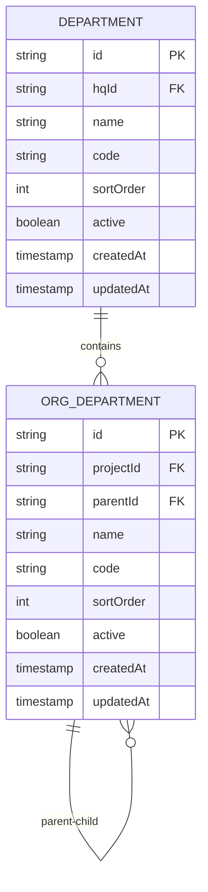
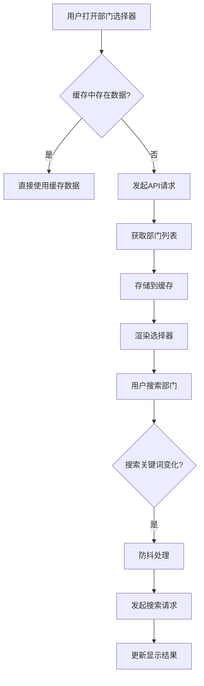
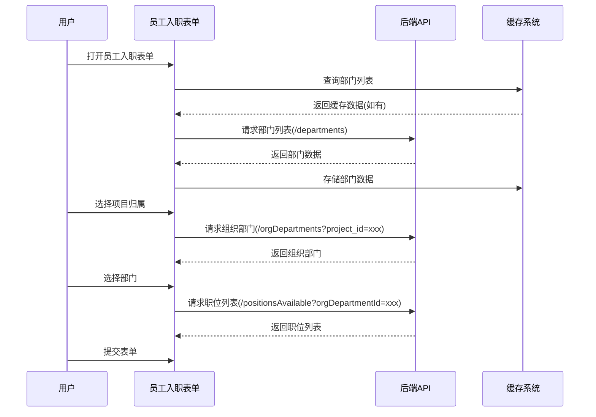

# 部门选择器

<cite>
**本文档引用文件**  
- [DepartmentSelect.tsx](file://frontend/src/components/form/DepartmentSelect.tsx)
- [useDepartments.ts](file://frontend/src/hooks/business/useDepartments.ts)
- [cache.ts](file://frontend/src/utils/cache.ts)
- [EmployeeForm.tsx](file://frontend/src/features/employees/components/forms/EmployeeForm.tsx)
- [employee.schema.ts](file://frontend/src/validations/employee.schema.ts)
- [departments.ts](file://backend/src/routes/v2/master-data/departments.ts)
- [OrgDepartmentService.ts](file://backend/src/services/OrgDepartmentService.ts)
</cite>

## 目录
1. [简介](#简介)
2. [树形结构数据支持](#树形结构数据支持)
3. [缓存机制与性能优化](#缓存机制与性能优化)
4. [实际应用场景](#实际应用场景)
5. [表单校验与层级控制](#表单校验与层级控制)
6. [结论](#结论)

## 简介
部门选择器（DepartmentSelect）是组织架构管理系统中的核心组件，用于在表单中选择部门。该组件支持树形结构展示、路径高亮、多层级展开，并通过缓存机制提升响应速度。在大型企业中，结合虚拟滚动等性能优化策略，确保在复杂组织结构下的流畅体验。

**Section sources**
- [DepartmentSelect.tsx](file://frontend/src/components/form/DepartmentSelect.tsx)

## 树形结构数据支持
部门选择器基于Ant Design的Select组件构建，支持完整的树形结构数据展示。后端通过`OrgDepartmentService`提供组织部门的层级结构，前端通过`useDepartments` Hook获取并格式化数据。

组件支持以下特性：
- **懒加载子节点**：通过API按需加载子部门，减少初始加载时间
- **路径高亮**：在搜索时高亮显示匹配的部门路径
- **多层级展开**：支持无限层级的部门嵌套展示

后端通过`orgDepartments`表存储部门层级关系，使用`parentId`字段表示父子关系，前端通过递归算法构建树形结构。



**Diagram sources**
- [OrgDepartmentService.ts](file://backend/src/services/OrgDepartmentService.ts#L16-L127)
- [departments.ts](file://backend/src/routes/v2/master-data/departments.ts#L22-L65)

**Section sources**
- [useDepartments.ts](file://frontend/src/hooks/business/useDepartments.ts#L18-L30)
- [OrgDepartmentService.ts](file://backend/src/services/OrgDepartmentService.ts#L16-L127)

## 缓存机制与性能优化
为提升重复选择的响应速度，系统采用多层级缓存机制：

### 缓存策略
- **主数据缓存**：部门数据作为主数据，缓存时间为1小时（60 * 60 * 1000毫秒）
- **内存缓存**：使用`DataCache`类实现内存缓存，避免重复请求
- **缓存键管理**：通过`cacheKeys`统一管理缓存键

### 性能优化策略
在大型企业组织中，采用以下性能优化策略：
- **虚拟滚动**：对于长列表场景，使用`VirtualTable`组件实现虚拟滚动
- **懒加载**：仅在用户展开节点时加载子节点数据
- **防抖搜索**：对搜索操作进行防抖处理，减少API调用频率



**Diagram sources**
- [cache.ts](file://frontend/src/utils/cache.ts#L11-L21)
- [useDepartments.ts](file://frontend/src/hooks/business/useDepartments.ts#L27-L28)

**Section sources**
- [cache.ts](file://frontend/src/utils/cache.ts#L1-L118)
- [useDepartments.ts](file://frontend/src/hooks/business/useDepartments.ts#L18-L30)

## 实际应用场景
部门选择器在多个业务场景中发挥重要作用，特别是在员工入职和薪资配置等流程中。

### 员工入职场景
在员工入职流程中，部门选择器与其他字段形成联动逻辑：
- **项目归属选择**：选择总部或项目后，部门选择器仅显示对应组织下的部门
- **职位联动**：选择部门后，自动加载该部门可用的职位列表
- **权限继承**：根据部门和职位自动继承相应的系统权限



**Diagram sources**
- [EmployeeForm.tsx](file://frontend/src/features/employees/components/forms/EmployeeForm.tsx#L46-L56)
- [departments.ts](file://backend/src/routes/v2/master-data/departments.ts#L22-L65)

**Section sources**
- [EmployeeForm.tsx](file://frontend/src/features/employees/components/forms/EmployeeForm.tsx#L28-L315)
- [employee.schema.ts](file://frontend/src/validations/employee.schema.ts#L4-L49)

## 表单校验与层级控制
在表单中，部门选择器支持多种校验规则，确保数据的完整性和一致性。

### 层级校验
系统支持灵活的层级校验规则，如：
- **仅允许选择末级部门**：通过后端验证确保用户不能选择包含子部门的父级部门
- **必填校验**：确保部门字段必须填写
- **状态校验**：仅允许选择激活状态的部门

### 联动校验
与其他字段形成联动校验逻辑：
- **项目与部门联动**：项目归属和部门必须匹配
- **部门与职位联动**：职位必须属于所选部门的权限范围

```mermaid
flowchart TD
A[开始表单验证] --> B{部门字段是否填写?}
B --> |否| C[显示"请选择部门"错误]
B --> |是| D{部门是否为激活状态?}
D --> |否| E[显示"不能选择已停用部门"错误]
D --> |是| F{是否仅允许选择末级部门?}
F --> |是| G{部门是否有子部门?}
G --> |是| H[显示"不能选择非末级部门"错误]
G --> |否| I[验证通过]
F --> |否| I
H --> J[阻止表单提交]
C --> J
E --> J
I --> K[允许表单提交]
```

**Diagram sources**
- [employee.schema.ts](file://frontend/src/validations/employee.schema.ts#L7-L9)
- [DepartmentSelect.tsx](file://frontend/src/components/form/DepartmentSelect.tsx#L29-L32)

**Section sources**
- [employee.schema.ts](file://frontend/src/validations/employee.schema.ts#L1-L127)
- [DepartmentSelect.tsx](file://frontend/src/components/form/DepartmentSelect.tsx#L10-L64)

## 结论
部门选择器组件通过树形结构支持、缓存机制和性能优化策略，有效解决了大型企业组织架构管理中的复杂选择需求。组件与职位、总部等字段的联动逻辑确保了数据的一致性，而灵活的表单校验机制则保证了业务规则的严格执行。该组件的设计体现了前后端协同、性能优先和用户体验至上的原则，为组织架构管理提供了可靠的技术支持。