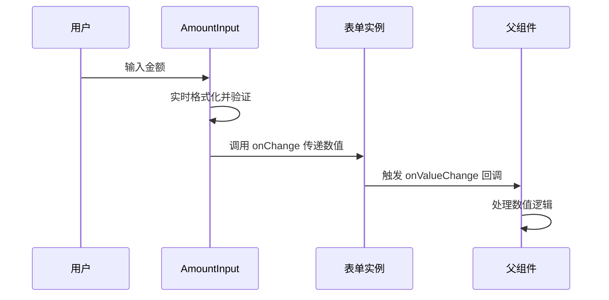
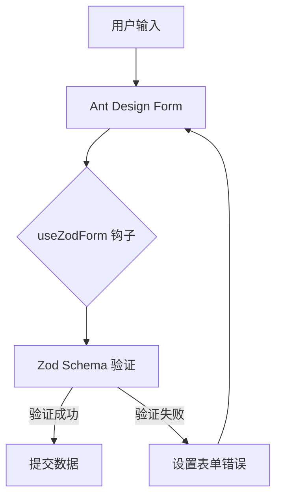
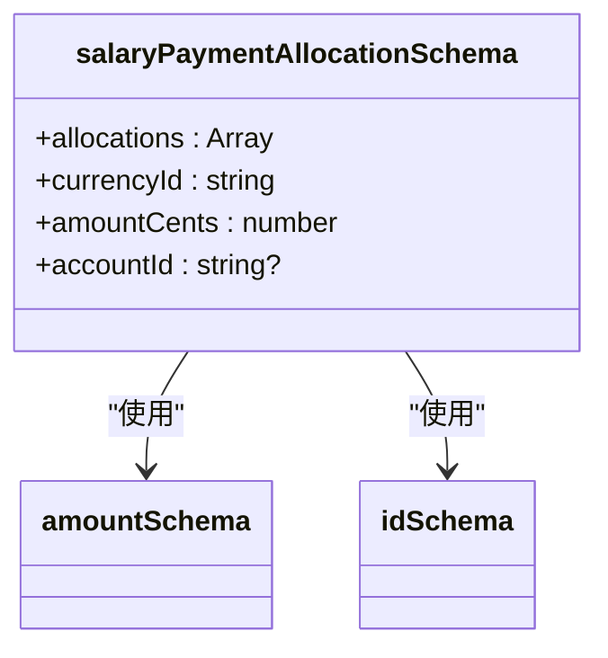
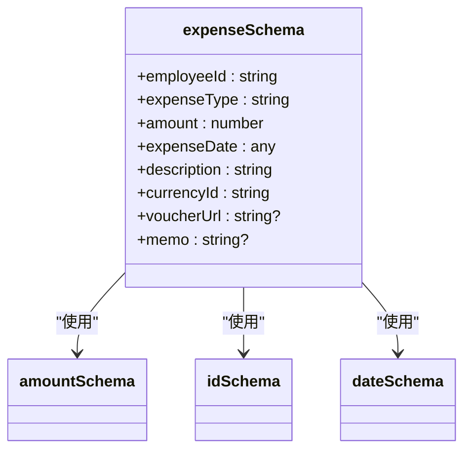
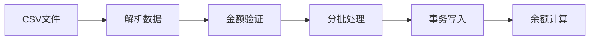
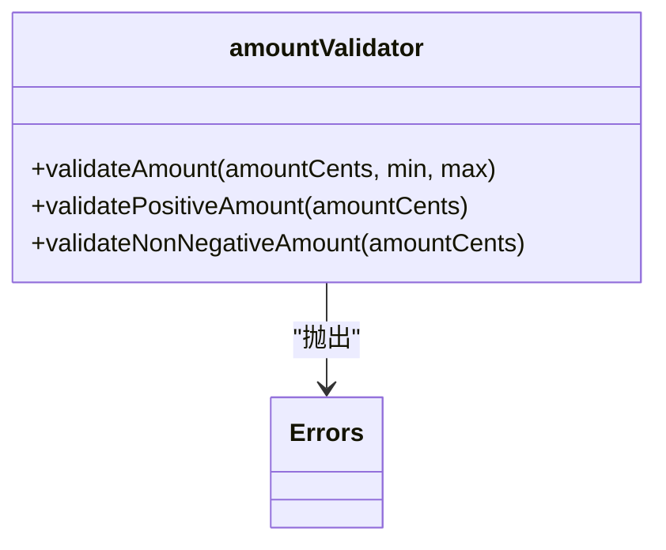

# 金额输入框

<cite>
**本文档引用的文件**   
- [AmountInput.tsx](file://frontend/src/components/form/AmountInput.tsx)
- [amount.ts](file://frontend/src/utils/amount.ts)
- [amount-validator.ts](file://backend/src/utils/amount-validator.ts)
- [common.schema.ts](file://frontend/src/validations/common.schema.ts)
- [expense.schema.ts](file://frontend/src/validations/expense.schema.ts)
- [salary.schema.ts](file://frontend/src/validations/salary.schema.ts)
- [useZodForm.ts](file://frontend/src/hooks/forms/useZodForm.ts)
</cite>

## 目录
1. [简介](#简介)
2. [核心功能](#核心功能)
3. [受控组件实现机制](#受控组件实现机制)
4. [表单验证集成](#表单验证集成)
5. [性能优化建议](#性能优化建议)
6. [总结](#总结)

## 简介
`AmountInput` 组件是财务系统中的核心输入控件，专为处理金额输入场景设计。该组件封装了金额输入的通用逻辑，包括格式化、精度控制、正负数标识和安全防护等特性，广泛应用于薪资发放、费用报销、账务处理等金融级业务场景。通过与 Zod 验证库深度集成，实现了前后端一致的验证规则，确保数据的准确性和安全性。

## 核心功能

`AmountInput` 组件提供了多项关键功能，确保金额输入的准确性、安全性和用户体验。

### 实时千分位格式化
组件基于 Ant Design 的 `InputNumber` 实现，在用户输入过程中自动进行千分位分隔格式化。这种实时格式化不仅提升了可读性，还帮助用户快速识别输入错误。格式化逻辑在组件内部处理，确保用户看到的是格式化的金额，而组件传递给表单的是原始数值。

### 小数位数限制（支持动态配置）
组件通过 `precision` 属性支持动态配置小数位数，默认为 2 位。这一设计满足了不同币种对精度的需求（如 CNY 通常为 2 位，而加密货币可能需要更多位数）。精度配置直接影响输入框的行为，防止用户输入超出允许范围的小数位。

### 正负金额标识
通过 `allowNegative` 属性控制是否允许输入负数金额，默认为 `false`。当设置为 `true` 时，组件允许用户输入负值，适用于退款、冲销等业务场景。该属性通过设置 `InputNumber` 的 `min` 属性为 `undefined`（允许负数）或 `0`（仅允许非负数）来实现。

### 防XSS注入的安全处理
组件继承了 Ant Design `InputNumber` 的安全特性，对输入内容进行严格的类型检查和过滤，有效防止 XSS（跨站脚本）注入攻击。所有输入被限制为数字类型，特殊字符和脚本代码无法通过输入框注入。此外，金额在后端存储时以"分"为单位的整数形式保存，从根本上避免了浮点数精度问题和潜在的安全风险。

**Section sources**
- [AmountInput.tsx](file://frontend/src/components/form/AmountInput.tsx#L8-L63)

## 受控组件实现机制

`AmountInput` 是一个典型的受控组件，通过 `onValueChange` 回调函数传递数值而非原始事件对象，实现了更简洁和安全的数据流。

### 数值传递而非事件传递
与传统的输入组件不同，`AmountInput` 不直接传递 `onChange` 事件，而是通过 `onValueChange` 回调传递格式化后的数值。这种设计模式有以下优势：
- **简化数据处理**：父组件无需解析事件对象，直接获取数值
- **类型安全**：传递的值是明确的数字类型，避免类型转换错误
- **统一数据格式**：确保所有使用该组件的地方都遵循相同的数据处理逻辑

### 与表单系统的集成
组件无缝集成到 Ant Design 的表单系统中，通过 `Form.Item` 的 `dependencies` 机制实现字段间的联动。例如，当币种字段变化时，金额输入框可以动态更新其显示的币种符号，提供更好的用户体验。

**Diagram sources**
- [AmountInput.tsx](file://frontend/src/components/form/AmountInput.tsx#L42-L63)

**Section sources**
- [AmountInput.tsx](file://frontend/src/components/form/AmountInput.tsx#L42-L63)

## 表单验证集成

`AmountInput` 组件与 Zod 验证库深度集成，通过 `useZodForm` 钩子实现强大的表单验证功能，满足各种业务规则需求。

### 与Zod的集成机制
系统使用 `useZodForm` 自定义钩子桥接 Ant Design 表单和 Zod 验证库。该钩子将 Zod 的验证结果转换为 Ant Design 表单可识别的错误格式，实现了声明式的表单验证。

**Diagram sources**
- [useZodForm.ts](file://frontend/src/hooks/forms/useZodForm.ts#L25-L60)

### 业务场景验证规则

#### 薪资场景
在薪资管理模块中，`salary.schema.ts` 定义了严格的验证规则：
- 金额必须大于等于 0
- 必须选择币种
- 支持多币种分配

**Diagram sources**
- [salary.schema.ts](file://frontend/src/validations/salary.schema.ts#L12-L18)

#### 报销场景
在费用报销模块中，`expense.schema.ts` 实现了更复杂的业务规则：
- 金额必须大于 0（非零校验）
- 必须选择员工和报销类型
- 必须提供报销说明

**Diagram sources**
- [expense.schema.ts](file://frontend/src/validations/expense.schema.ts#L4-L13)

### 通用验证规则
系统在 `common.schema.ts` 中定义了可复用的通用验证规则：
- `amountSchema`：金额必须为正数且为有限值
- `idSchema`：ID不能为空
- `dateSchema`：日期格式必须为 YYYY-MM-DD

这些通用规则确保了系统各模块验证逻辑的一致性，减少了代码重复。

**Section sources**
- [common.schema.ts](file://frontend/src/validations/common.schema.ts#L1-L23)
- [expense.schema.ts](file://frontend/src/validations/expense.schema.ts#L4-L13)
- [salary.schema.ts](file://frontend/src/validations/salary.schema.ts#L12-L18)
- [useZodForm.ts](file://frontend/src/hooks/forms/useZodForm.ts#L25-L60)

## 性能优化建议

在批量导入和快速录入等高频操作场景下，`AmountInput` 组件的性能优化至关重要。

### 批量操作优化
在批量导入场景中，系统通过以下方式优化性能：
- **事务处理**：使用数据库事务确保数据一致性
- **分批处理**：将大量数据分批处理，避免内存溢出
- **预计算**：在导入前对金额进行预计算和验证

**Diagram sources**
- [ImportService.ts](file://backend/src/services/ImportService.ts#L42-L75)

### 快速录入优化
对于需要快速录入的场景，建议采用以下策略：
- **防抖处理**：对频繁的输入操作进行防抖，减少不必要的验证和渲染
- **虚拟滚动**：在大量输入框的场景下使用虚拟滚动技术
- **异步验证**：将复杂的验证逻辑移至异步执行，避免阻塞主线程

### 后端验证优化
后端通过 `amount-validator.ts` 提供高效的验证函数：
- `validateAmount`：验证金额的基本规则
- `validatePositiveAmount`：验证正数金额
- `validateNonNegativeAmount`：验证非负金额

这些函数在数据库层面进行验证，确保数据的完整性和一致性。

**Diagram sources**
- [amount-validator.ts](file://backend/src/utils/amount-validator.ts#L11-L37)

**Section sources**
- [ImportService.ts](file://backend/src/services/ImportService.ts#L42-L75)
- [amount-validator.ts](file://backend/src/utils/amount-validator.ts#L11-L37)

## 总结
`AmountInput` 组件通过封装金额输入的复杂逻辑，为财务系统提供了可靠、安全和易用的输入解决方案。其核心优势在于：
- **功能完整**：支持千分位格式化、精度控制、正负数标识等关键功能
- **安全可靠**：通过前后端双重验证和防XSS设计确保数据安全
- **易于集成**：与 Zod 验证库深度集成，支持复杂的业务规则
- **性能优异**：在批量操作和高频录入场景下表现良好

该组件的设计体现了金融级应用对数据准确性和安全性的严格要求，是系统中不可或缺的基础组件。