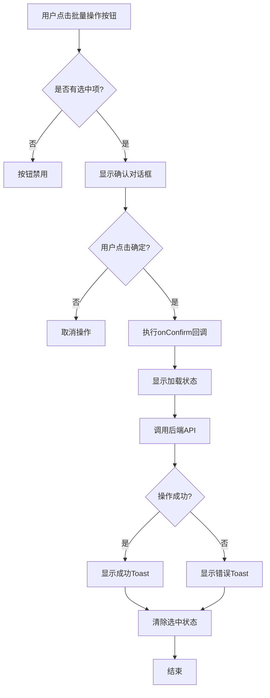
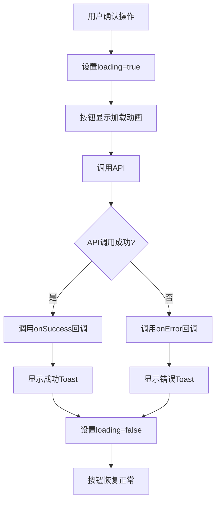
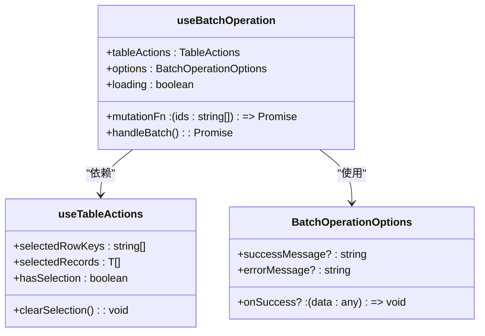

# 批量操作按钮 (BatchActionButton)

<cite>
**本文档引用的文件**  
- [BatchActionButton.tsx](file://frontend/src/components/common/BatchActionButton.tsx)
- [useBatchOperation.ts](file://frontend/src/hooks/business/useBatchOperation.ts)
- [useTableActions.ts](file://frontend/src/hooks/forms/useTableActions.ts)
- [SalaryPaymentsPage.tsx](file://frontend/src/features/hr/pages/SalaryPaymentsPage.tsx)
- [useSalaryPayments.ts](file://frontend/src/hooks/business/useSalaryPayments.ts)
- [errorHandler.ts](file://frontend/src/utils/errorHandler.ts)
</cite>

## 目录
1. [简介](#简介)
2. [核心设计考量](#核心设计考量)
3. [幂等性控制机制](#幂等性控制机制)
4. [加载状态与用户反馈](#加载状态与用户反馈)
5. [与useBatchOperation Hook集成](#与usebatchoperation-hook集成)
6. [错误处理与部分成功场景](#错误处理与部分成功场景)
7. [实际应用示例](#实际应用示例)

## 简介
`BatchActionButton` 是一个专门用于处理高风险批量操作的通用按钮组件。它封装了批量审批、批量导出、批量状态更新等操作的通用交互模式，通过统一的确认对话框、禁用状态和加载反馈，确保用户在执行关键操作时有清晰的预期和确认流程。

**Section sources**
- [BatchActionButton.tsx](file://frontend/src/components/common/BatchActionButton.tsx)

## 核心设计考量
`BatchActionButton` 组件的设计旨在解决批量操作中的常见问题，如误操作、重复提交和状态反馈不明确。其核心设计考量包括：

1. **统一交互模式**：通过封装 `Popconfirm` 组件，确保所有批量操作都遵循一致的确认流程。
2. **状态感知**：按钮的禁用状态由 `selectedCount` 和 `disabled` 属性共同决定，防止在未选择项目或条件不满足时进行操作。
3. **动态确认标题**：支持静态字符串和函数形式的 `confirmTitle`，可根据选中数量动态生成确认对话框标题。
4. **灵活配置**：提供 `type`、`danger`、`icon` 等属性，允许根据操作类型（如危险操作）自定义按钮外观。



**Diagram sources**
- [BatchActionButton.tsx](file://frontend/src/components/common/BatchActionButton.tsx)

## 幂等性控制机制
`BatchActionButton` 本身不直接实现幂等性，而是通过与 `useBatchOperation` Hook 结合，利用其内置的加载状态控制来防止重复提交。当用户点击确认后，按钮会立即进入加载状态（`loading={true}`），在此期间无法再次触发操作，从而有效防止了因网络延迟或用户误操作导致的重复提交。

**Section sources**
- [BatchActionButton.tsx](file://frontend/src/components/common/BatchActionButton.tsx)
- [useBatchOperation.ts](file://frontend/src/hooks/business/useBatchOperation.ts)

## 加载状态与用户反馈
组件通过 `loading` 属性与 Ant Design 的 `Button` 组件集成，实现加载状态反馈。当 `loading` 为 `true` 时，按钮会显示加载动画，文本变为“处理中...”，并自动禁用，防止用户重复点击。成功或失败的反馈则通过 `withErrorHandler` 包装器中的 `message.success` 和 `message.error` 实现，以 Toast 通知的形式告知用户操作结果。



**Diagram sources**
- [useBatchOperation.ts](file://frontend/src/hooks/business/useBatchOperation.ts)
- [errorHandler.ts](file://frontend/src/utils/errorHandler.ts)

## 与useBatchOperation Hook集成
`useBatchOperation` Hook 是 `BatchActionButton` 的核心搭档，它简化了批量操作的逻辑，自动处理加载状态、错误处理和选中状态的清除。该 Hook 接收一个 `mutationFn`（执行批量操作的函数）、`tableActions`（来自 `useTableActions` 的返回值）和 `options`（配置选项）。



**Diagram sources**
- [useBatchOperation.ts](file://frontend/src/hooks/business/useBatchOperation.ts)
- [useTableActions.ts](file://frontend/src/hooks/forms/useTableActions.ts)

## 错误处理与部分成功场景
系统通过 `withErrorHandler` 包装器统一处理错误，提取错误信息并显示 Toast 通知。对于包含数百个员工薪资条目的批量发放请求，后端服务（如 `ApprovalService`）实现了部分成功处理策略。即使某些条目失败，也会返回成功和失败的详细列表，确保操作的原子性和数据一致性。

```mermaid
flowchart TD
A[批量发放薪资] --> B[遍历每个员工ID]
B --> C{操作成功?}
C --> |是| D[添加到success列表]
C --> |否| E[捕获错误并添加到failed列表]
D --> F[继续下一个]
E --> F
F --> G{所有员工处理完毕?}
G --> |否| B
G --> |是| H[返回结果: { success: [], failed: [] }]
H --> I[前端根据结果显示汇总通知]
```

**Diagram sources**
- [useBatchOperation.ts](file://frontend/src/hooks/business/useBatchOperation.ts)
- [ApprovalService.ts](file://backend/src/services/ApprovalService.ts)

## 实际应用示例
在 `SalaryPaymentsPage` 中，`BatchActionButton` 与 `useBatchOperation` 结合使用，处理批量审批薪资单的场景。用户在表格中选择多个待审批的薪资条目，点击“批量审批”按钮，触发确认对话框。确认后，`useBatchOperation` 会调用 `approveSalaryPayments` 函数，处理所有选中条目，并在完成后清除选中状态，显示成功或失败的 Toast 通知。

**Section sources**
- [SalaryPaymentsPage.tsx](file://frontend/src/features/hr/pages/SalaryPaymentsPage.tsx)
- [useSalaryPayments.ts](file://frontend/src/hooks/business/useSalaryPayments.ts)