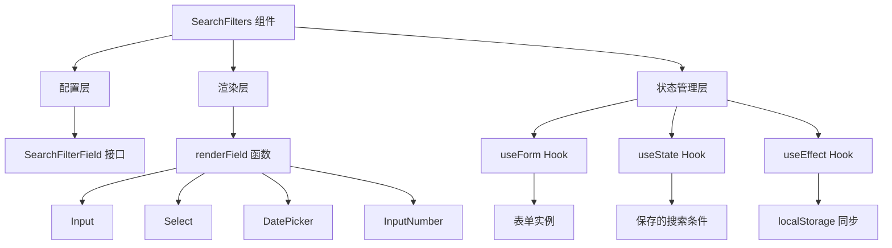
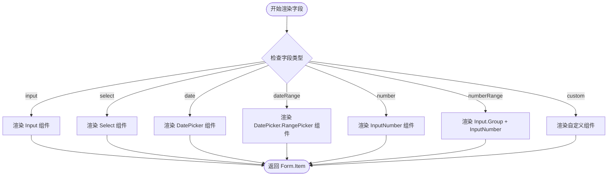
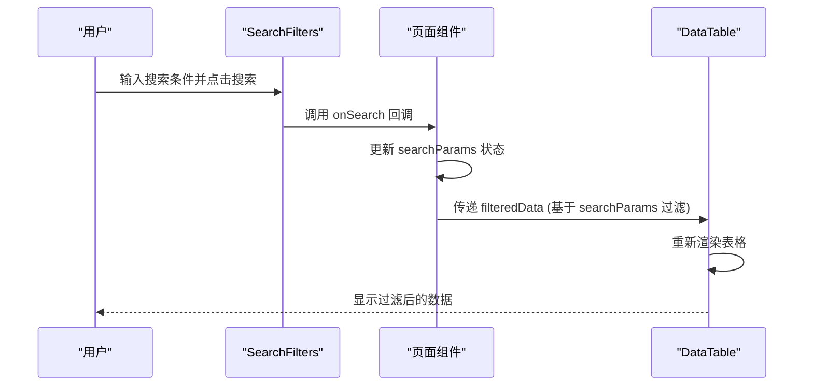
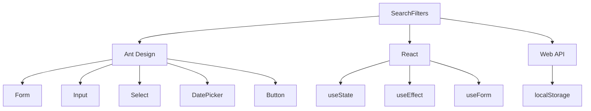
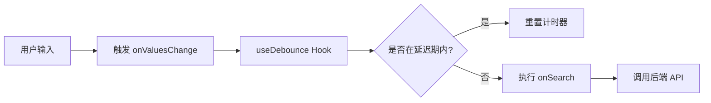

# 搜索过滤器 (SearchFilters)

<cite>
**本文档引用的文件**
- [SearchFilters.tsx](file://frontend/src/components/common/SearchFilters.tsx)
- [DataTable.tsx](file://frontend/src/components/common/DataTable.tsx)
- [expense.schema.ts](file://frontend/src/validations/expense.schema.ts)
- [employee.schema.ts](file://frontend/src/validations/employee.schema.ts)
- [department.schema.ts](file://frontend/src/validations/department.schema.ts)
- [ExpenseReimbursementPage.tsx](file://frontend/src/features/hr/pages/ExpenseReimbursementPage.tsx)
- [useDebounce.ts](file://frontend/src/hooks/useDebounce.ts)
</cite>

## 目录
1. [简介](#简介)
2. [核心组件](#核心组件)
3. [架构概述](#架构概述)
4. [详细组件分析](#详细组件分析)
5. [依赖分析](#依赖分析)
6. [性能考虑](#性能考虑)
7. [故障排除指南](#故障排除指南)
8. [结论](#结论)

## 简介
搜索过滤器 (SearchFilters) 组件是系统中高级查询功能的核心入口，为用户提供了一套统一、灵活且可复用的查询界面。该组件支持动态生成基于 Zod 验证模式的表单控件，能够处理日期范围、金额区间、多选下拉等复杂筛选条件。它与 DataTable 组件紧密集成，实现查询参数的同步更新，并支持保存和加载常用筛选模板，极大地提升了用户的操作效率和体验。

## 核心组件

[SearchFilters 组件作为高级查询入口，其设计围绕动态表单生成、状态管理和用户交互展开。它通过配置化的 `fields` 属性定义过滤条件，利用 Ant Design 的 Form 组件进行渲染和值管理，并通过 `onSearch` 回调将处理后的查询参数传递给父组件。]

**组件来源**
- [SearchFilters.tsx](file://frontend/src/components/common/SearchFilters.tsx#L6-L435)

## 架构概述

该组件的架构设计体现了清晰的分层和职责分离原则。上层是配置层，通过 `SearchFilterField` 接口定义过滤字段的元数据；中层是渲染层，`renderField` 函数根据字段类型动态生成对应的 Ant Design 表单控件；底层是状态管理层，利用 React 的 `useState` 和 `useEffect` 管理表单实例、保存的搜索条件以及与 `localStorage` 的同步。



**图表来源**
- [SearchFilters.tsx](file://frontend/src/components/common/SearchFilters.tsx#L94-L274)

## 详细组件分析

### SearchFilters 组件分析

#### 组件接口与配置
`SearchFilters` 组件通过 `SearchFiltersProps` 接口接收配置，其核心是 `fields` 数组，该数组定义了所有可用的过滤条件。每个 `SearchFilterField` 对象指定了字段的名称、标签、类型（如 input, select, dateRange）以及特定于类型的选项（如 `options` 用于下拉框，`showQuickSelect` 用于日期范围）。

```mermaid
classDiagram
class SearchFilterField {
+name : string
+label : string
+type : 'input' | 'select' | 'date' | 'dateRange' | 'number' | 'numberRange' | 'custom'
+placeholder? : string
+options? : Array<{ label : string; value : string | number }>
+allowClear? : boolean
+mode? : 'multiple' | 'tags'
+min? : number
+max? : number
+precision? : number
+showQuickSelect? : boolean
+showTime? : boolean
}
class SearchFiltersProps {
+fields : SearchFilterField[]
+onSearch : (values : Record<string, any>) => void
+onReset? : () => void
+initialValues? : Record<string, any>
+layout? : 'horizontal' | 'vertical' | 'inline'
+showCard? : boolean
+enableSaveSearch? : boolean
+saveSearchKey? : string
+onValuesChange? : (values : Record<string, any>) => void
}
SearchFiltersProps --> SearchFilterField : "包含"
```

**图表来源**
- [SearchFilters.tsx](file://frontend/src/components/common/SearchFilters.tsx#L94-L125)

#### 动态表单渲染流程
组件的渲染流程始于 `renderField` 函数，它根据 `fields` 数组中的 `type` 字段，使用 `switch` 语句选择并返回相应的 Ant Design 表单控件。例如，当 `type` 为 `select` 时，会渲染一个 `Select` 组件，并将 `options` 属性传递给它。



**图表来源**
- [SearchFilters.tsx](file://frontend/src/components/common/SearchFilters.tsx#L276-L370)

#### 与 DataTable 的集成
`SearchFilters` 组件与 `DataTable` 组件通过受控组件模式进行集成。在 `ExpenseReimbursementPage` 等页面中，`SearchFilters` 的 `onSearch` 回调函数会更新一个状态（如 `searchParams`），这个状态随后被传递给 `DataTable` 的 `data` 属性，从而实现数据的过滤和同步更新。



**图表来源**
- [SearchFilters.tsx](file://frontend/src/components/common/SearchFilters.tsx#L202-L249)
- [ExpenseReimbursementPage.tsx](file://frontend/src/features/hr/pages/ExpenseReimbursementPage.tsx#L265-L279)
- [DataTable.tsx](file://frontend/src/components/common/DataTable.tsx#L174-L184)

#### 保存筛选模板功能
该组件支持通过 `enableSaveSearch` 和 `saveSearchKey` 属性启用保存搜索条件的功能。当用户点击“保存搜索”时，当前表单的值会被序列化并存储在 `localStorage` 中，键名为 `searchFilters_${saveSearchKey}`。加载时，组件会从 `localStorage` 中读取已保存的搜索条件列表，并提供一个下拉菜单供用户选择和加载。

```mermaid
flowchart TD
A[用户点击 "保存搜索"] --> B[调用 handleSaveSearch]
B --> C[获取表单当前值]
C --> D[提示用户输入名称]
D --> E{用户输入名称?}
E --> |否| F[取消保存]
E --> |是| G[创建新保存项 {name, values}]
G --> H[更新 savedSearches 状态]
H --> I[序列化并存入 localStorage]
I --> J[保存成功]
K[用户从下拉菜单选择已保存项] --> L[调用 handleLoadSearch]
L --> M[调用 form.setFieldsValue]
M --> N[调用 handleSearch]
N --> O[触发搜索并更新数据]
```

**图表来源**
- [SearchFilters.tsx](file://frontend/src/components/common/SearchFilters.tsx#L160-L200)

### 布局优化与性能表现

对于包含数十个过滤条件的场景，`SearchFilters` 组件本身不直接处理折叠面板，但其设计允许父组件通过 CSS 或其他布局组件（如 Collapse）来实现。其性能表现良好，因为核心逻辑是声明式的，且利用了 React 的虚拟 DOM 进行高效更新。主要的性能优化点在于减少不必要的后端查询。

## 依赖分析

`SearchFilters` 组件依赖于 Ant Design 的 Form、Input、Select、DatePicker 等 UI 组件来构建界面，并依赖于 React 的核心 Hooks（如 `useState`, `useEffect`, `useForm`）来管理状态。它与 `DataTable` 组件形成紧密的协作关系，共同完成数据的展示和过滤。此外，它还依赖于浏览器的 `localStorage` API 来持久化保存的搜索条件。



**图表来源**
- [SearchFilters.tsx](file://frontend/src/components/common/SearchFilters.tsx#L6-L11)

## 性能考虑

在处理大量过滤条件时，虽然 `SearchFilters` 组件本身渲染性能良好，但频繁的搜索操作会给后端 API 带来压力。为解决此问题，系统采用了 `useDebounce` Hook 来实现防抖机制。该 Hook 会延迟 `onSearch` 回调的执行，只有当用户停止输入一段时间后，才会真正触发搜索请求，从而有效减少了 API 的调用次数。



**图表来源**
- [useDebounce.ts](file://frontend/src/hooks/useDebounce.ts#L3-L17)
- [SearchFilters.tsx](file://frontend/src/components/common/SearchFilters.tsx#L253-L258)

## 故障排除指南

如果 `SearchFilters` 组件未能正确工作，请检查以下几点：
1.  **字段配置**：确保 `fields` 数组中的每个对象都正确指定了 `name` 和 `type`。
2.  **onSearch 回调**：确认 `onSearch` 回调函数已正确定义，并能接收和处理查询参数。
3.  **保存功能**：如果启用了保存功能，请确保 `saveSearchKey` 属性已设置，且浏览器允许使用 `localStorage`。
4.  **数据集成**：检查 `onSearch` 回调是否正确地更新了用于过滤 `DataTable` 数据的状态。

**组件来源**
- [SearchFilters.tsx](file://frontend/src/components/common/SearchFilters.tsx#L138-L267)

## 结论

`SearchFilters` 组件是一个设计精良、功能强大的高级查询入口。它通过配置化的方式实现了高度的灵活性和可复用性，能够动态生成复杂的过滤表单。其与 `DataTable` 的集成模式简洁高效，而保存搜索模板和防抖机制则显著提升了用户体验和系统性能。该组件是构建复杂数据管理界面的理想选择。