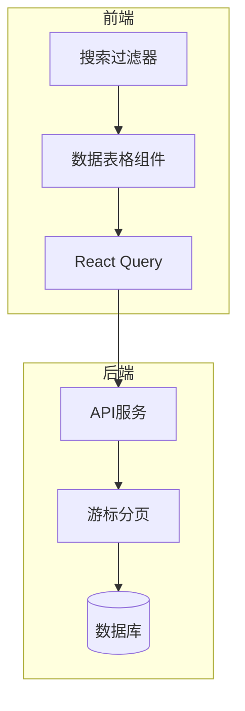
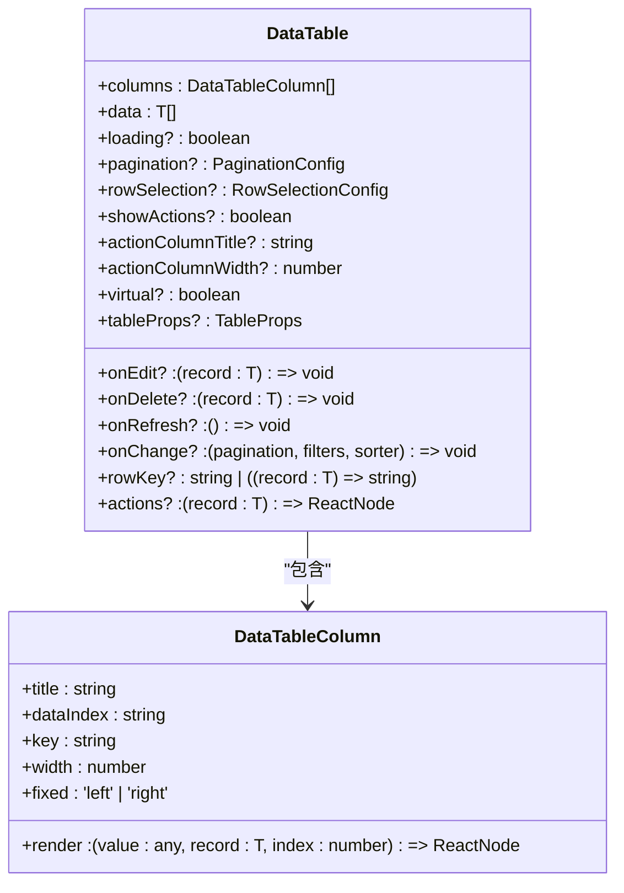
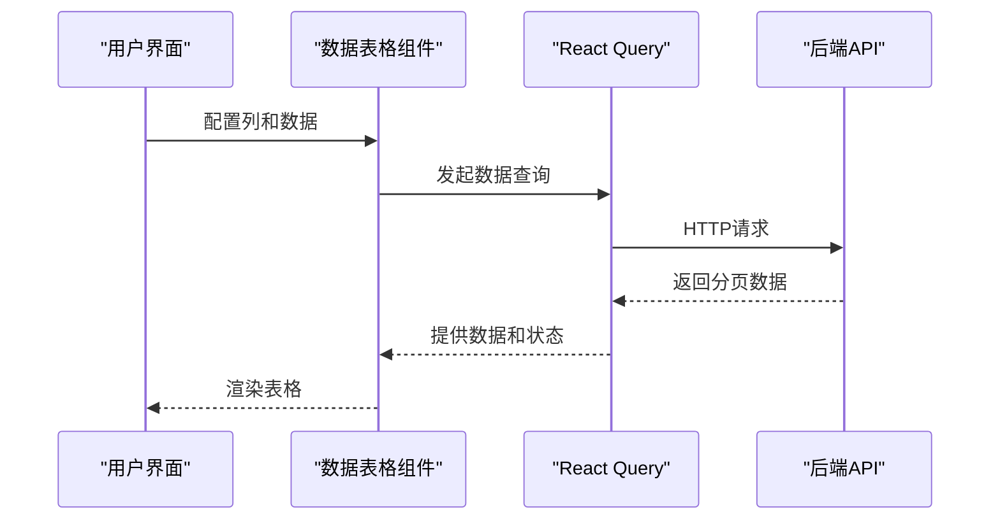
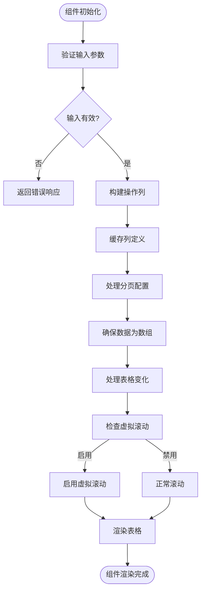
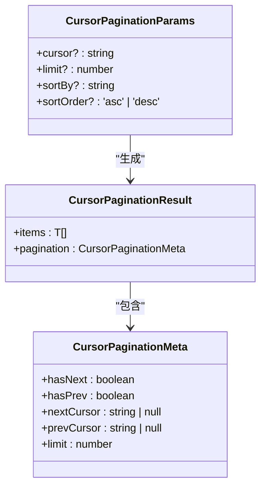
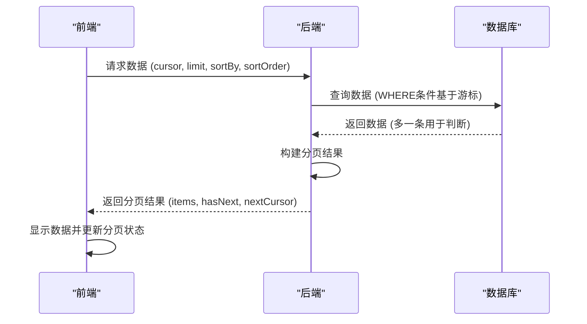
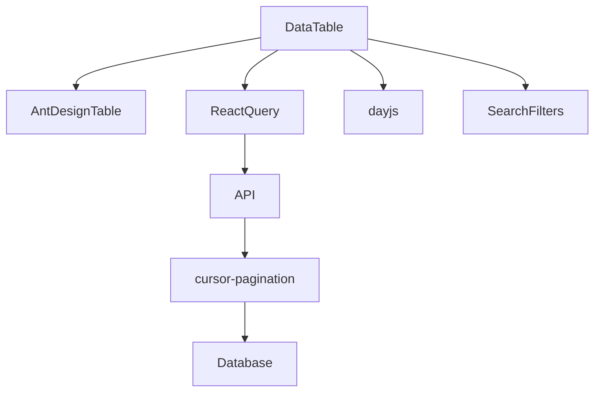

# 数据表格 (DataTable)

<cite>
**本文档引用的文件**   
- [DataTable.tsx](file://frontend/src/components/common/DataTable.tsx)
- [SearchFilters.tsx](file://frontend/src/components/common/SearchFilters.tsx)
- [cursor-pagination.ts](file://backend/src/utils/cursor-pagination.ts)
- [useApiQuery.ts](file://frontend/src/utils/useApiQuery.ts)
- [useFlows.ts](file://frontend/src/hooks/business/useFlows.ts)
- [useAccountTransactions.ts](file://frontend/src/hooks/business/useAccountTransactions.ts)
- [useSalaryPayments.ts](file://frontend/src/hooks/business/useSalaryPayments.ts)
- [AmountDisplay.tsx](file://frontend/src/components/common/AmountDisplay.tsx)
- [StatusTag.tsx](file://frontend/src/components/common/StatusTag.tsx)
- [VirtualTable.tsx](file://frontend/src/components/common/VirtualTable.tsx)
- [FlowsPage.tsx](file://frontend/src/features/finance/pages/FlowsPage.tsx)
- [AccountTransactionsPage.tsx](file://frontend/src/features/finance/pages/AccountTransactionsPage.tsx)
- [SalaryPaymentsPage.tsx](file://frontend/src/features/hr/pages/SalaryPaymentsPage.tsx)
</cite>

## 目录
1. [简介](#简介)
2. [核心组件](#核心组件)
3. [架构概述](#架构概述)
4. [详细组件分析](#详细组件分析)
5. [依赖分析](#依赖分析)
6. [性能考虑](#性能考虑)
7. [故障排除指南](#故障排除指南)
8. [结论](#结论)

## 简介
数据表格 (DataTable) 组件是本系统中的核心UI组件，用于展示和管理财务流水、员工薪资等复杂业务数据。该组件基于Ant Design的Table进行封装，提供了丰富的功能扩展，包括分页、排序、筛选、操作按钮等。组件设计遵循可复用性和可扩展性原则，通过配置化的方式支持不同业务场景的需求。DataTable与React Query深度集成，实现了高效的数据获取和状态管理，同时通过cursor-pagination机制优化了大数据量下的分页性能。

## 核心组件

数据表格 (DataTable) 组件是系统中用于展示结构化数据的核心UI组件。它封装了常用的表格功能，包括列定义、分页、加载状态、操作按钮、排序和筛选等。组件通过泛型支持不同类型的数据，具有良好的类型安全性和可复用性。DataTable基于Ant Design的Table组件进行封装，提供了更简洁的API和额外的功能扩展。

**Section sources**
- [DataTable.tsx](file://frontend/src/components/common/DataTable.tsx#L1-L189)

## 架构概述

数据表格 (DataTable) 的架构设计体现了分层和关注点分离的原则。组件位于前端展示层，与业务逻辑层和数据访问层紧密协作。通过React Query实现数据获取和缓存，利用cursor-pagination机制优化分页性能。组件与SearchFilters组件协同工作，实现复杂的多条件查询功能。整体架构支持服务器端排序、过滤和分页的协同工作流程，确保了大数据量场景下的良好性能表现。

**Diagram sources **
- [DataTable.tsx](file://frontend/src/components/common/DataTable.tsx#L1-L189)
- [SearchFilters.tsx](file://frontend/src/components/common/SearchFilters.tsx#L1-L435)
- [cursor-pagination.ts](file://backend/src/utils/cursor-pagination.ts#L1-L218)

## 详细组件分析

### 数据表格组件分析
数据表格 (DataTable) 组件通过props接收列定义、数据、分页配置等参数，实现了灵活的配置化渲染。组件使用useMemo优化性能，缓存操作列和最终列定义，避免不必要的重新渲染。支持虚拟滚动，通过virtual属性启用，适用于大数据量场景。组件提供了onEdit、onDelete等回调函数，支持行内编辑和删除操作，并通过actions属性支持自定义操作按钮。

#### 对象导向组件：

**Diagram sources **
- [DataTable.tsx](file://frontend/src/components/common/DataTable.tsx#L13-L44)

#### API/服务组件：

**Diagram sources **
- [DataTable.tsx](file://frontend/src/components/common/DataTable.tsx#L46-L187)
- [useApiQuery.ts](file://frontend/src/utils/useApiQuery.ts#L11-L41)

#### 复杂逻辑组件：

**Diagram sources **
- [DataTable.tsx](file://frontend/src/components/common/DataTable.tsx#L64-L164)

**Section sources**
- [DataTable.tsx](file://frontend/src/components/common/DataTable.tsx#L1-L189)

### 搜索过滤器组件分析
搜索过滤器 (SearchFilters) 组件为数据表格提供了强大的查询功能。组件支持多种过滤字段类型，包括输入框、选择器、日期范围等，并提供了快捷日期选择功能。通过表单布局和卡片容器，实现了统一的搜索界面。组件支持保存和加载搜索条件，提升了用户体验。与数据表格组件联动，实现了多条件组合查询的完整功能。

**Section sources**
- [SearchFilters.tsx](file://frontend/src/components/common/SearchFilters.tsx#L1-L435)

### 游标分页机制分析
游标分页 (cursor-pagination) 机制是系统中用于处理大数据量分页的核心技术。与传统的基于offset的分页不同，游标分页使用排序字段的值作为游标，避免了offset在大数据量下的性能问题。机制通过base64编码的JSON对象存储游标值，包含排序字段的值和ID，确保了分页的唯一性和准确性。后端返回hasNext标志和nextCursor，前端根据这些信息判断是否显示"下一页"按钮。

#### 对象导向组件：

**Diagram sources **
- [cursor-pagination.ts](file://backend/src/utils/cursor-pagination.ts#L12-L40)

#### API/服务组件：

**Diagram sources **
- [cursor-pagination.ts](file://backend/src/utils/cursor-pagination.ts#L114-L144)

**Section sources**
- [cursor-pagination.ts](file://backend/src/utils/cursor-pagination.ts#L1-L218)

## 依赖分析

数据表格 (DataTable) 组件依赖于多个核心模块和工具库。主要依赖包括Ant Design的Table组件、React Query用于数据获取和状态管理、dayjs用于日期处理。组件与SearchFilters组件紧密协作，实现完整的查询功能。后端依赖cursor-pagination工具实现高效的分页查询。整体依赖关系清晰，各模块职责明确，便于维护和扩展。

**Diagram sources **
- [DataTable.tsx](file://frontend/src/components/common/DataTable.tsx#L6-L8)
- [useApiQuery.ts](file://frontend/src/utils/useApiQuery.ts#L5-L6)
- [cursor-pagination.ts](file://backend/src/utils/cursor-pagination.ts#L7-L8)

**Section sources**
- [DataTable.tsx](file://frontend/src/components/common/DataTable.tsx#L1-L189)
- [useApiQuery.ts](file://frontend/src/utils/useApiQuery.ts#L1-L103)
- [cursor-pagination.ts](file://backend/src/utils/cursor-pagination.ts#L1-L218)

## 性能考虑

数据表格 (DataTable) 组件在设计时充分考虑了性能优化。通过React.memo和useMemo等React优化技术，避免不必要的重新渲染。对于大数据量场景，支持虚拟滚动，只渲染可视区域的行，显著提升了渲染性能。与React Query结合，实现了数据的智能缓存和去抖，减少了不必要的网络请求。游标分页机制避免了传统分页在大数据量下的性能瓶颈，确保了查询效率。

**Section sources**
- [DataTable.tsx](file://frontend/src/components/common/DataTable.tsx#L64-L164)
- [VirtualTable.tsx](file://frontend/src/components/common/VirtualTable.tsx#L1-L150)

## 故障排除指南

在使用数据表格 (DataTable) 组件时，可能遇到一些常见问题。如果数据未正确显示，请检查data属性是否为数组，确保数据格式正确。分页不工作时，验证pagination配置是否正确传递。自定义渲染函数出现问题时，检查render函数的返回值是否为有效的React节点。性能问题可通过启用虚拟滚动或优化数据查询来解决。错误边界处理通过React的Error Boundary机制实现，确保单个组件的错误不会影响整个应用。

**Section sources**
- [DataTable.tsx](file://frontend/src/components/common/DataTable.tsx#L132-L133)
- [ErrorBoundary.tsx](file://frontend/src/components/ErrorBoundary.tsx)

## 结论

数据表格 (DataTable) 组件是系统中功能强大且灵活的核心UI组件。通过与React Query和游标分页机制的深度集成，实现了高效的数据绑定和分页功能。组件设计充分考虑了可复用性、可扩展性和性能优化，支持财务流水、员工薪资等复杂数据的动态渲染。与SearchFilters组件的联动提供了完整的多条件查询解决方案。整体实现体现了现代前端开发的最佳实践，为系统的数据展示和管理提供了坚实的基础。