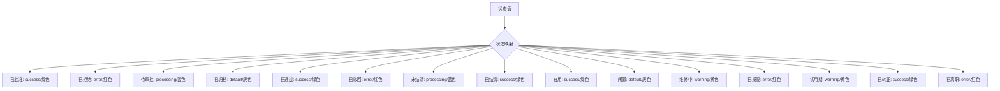
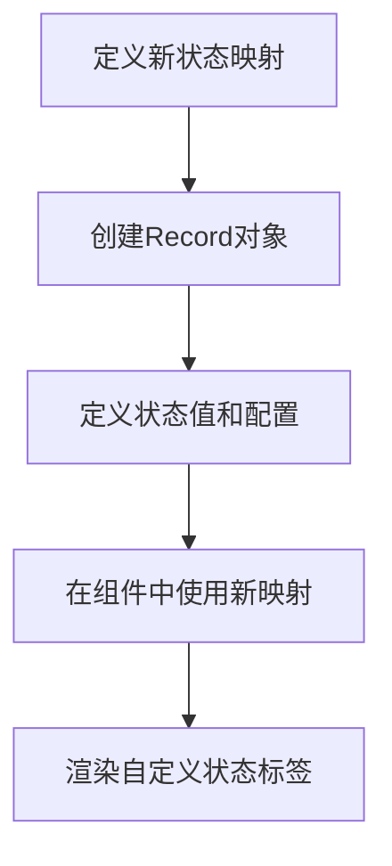
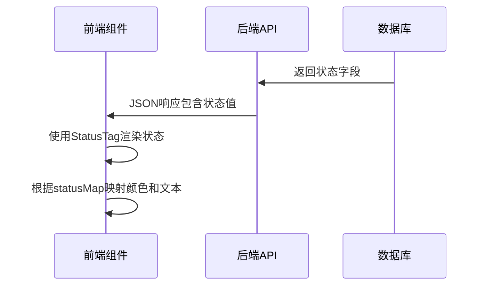
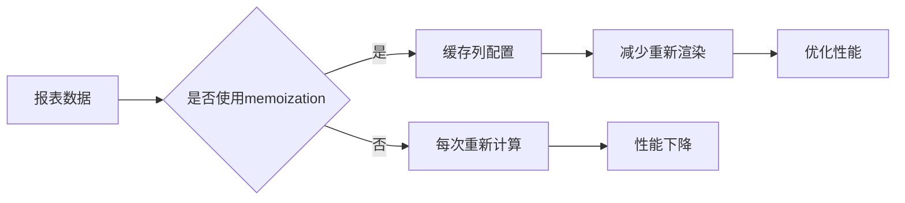

# 状态标签 (StatusTag)

<cite>
**本文档引用的文件**   
- [StatusTag.tsx](file://frontend/src/components/common/StatusTag.tsx)
- [status.tsx](file://frontend/src/utils/status.tsx)
- [variables.css](file://frontend/src/styles/variables.css)
- [EmployeeManagementPage.tsx](file://frontend/src/features/hr/pages/EmployeeManagementPage.tsx)
- [APPage.tsx](file://frontend/src/features/finance/pages/APPage.tsx)
- [ReportEmployeeSalaryPage.tsx](file://frontend/src/features/reports/pages/ReportEmployeeSalaryPage.tsx)
</cite>

## 目录
1. [简介](#简介)
2. [核心语义化设计](#核心语义化设计)
3. [状态类型与视觉规范映射](#状态类型与视觉规范映射)
4. [在核心业务模块中的应用](#在核心业务模块中的应用)
5. [自定义状态扩展](#自定义状态扩展)
6. [主题化定制](#主题化定制)
7. [与API响应的映射逻辑](#与api响应的映射逻辑)
8. [报表中的性能优化](#报表中的性能优化)
9. [结论](#结论)

## 简介
状态标签 (StatusTag) 组件是企业财务系统中用于统一展示业务状态的核心UI组件。它通过预定义的状态类型和颜色映射，确保在审批流、薪资发放、资产状态、员工在职状态等关键模块中保持一致的视觉表达。该组件设计遵循语义化原则，将业务状态与视觉样式解耦，提高了代码的可维护性和可扩展性。

## 核心语义化设计

状态标签组件的设计核心在于将状态的语义（如'approved'、'pending'）与其视觉表现（颜色、文本）分离。组件通过`statusMap`属性接收一个状态配置映射，该映射定义了每个状态值对应的显示文本和颜色。

组件接收以下属性：
- **status**: 当前状态值，可以是字符串、null或undefined
- **statusMap**: 状态映射配置，定义了状态值到显示配置的映射
- **emptyText**: 当状态为空时的显示文本，默认为'-'
- **style**: 自定义样式

当状态值在`statusMap`中存在时，组件渲染为Ant Design的Tag标签，应用对应的颜色和文本；当状态值不存在或为空时，组件渲染为普通文本。

**Section sources**
- [StatusTag.tsx](file://frontend/src/components/common/StatusTag.tsx#L1-L40)

## 状态类型与视觉规范映射

系统定义了多个预定义的状态映射，每个映射都遵循企业财务系统的视觉规范。这些映射使用Ant Design的预设颜色（success、error、warning、processing、default）来确保视觉一致性。



**Diagram sources**
- [status.tsx](file://frontend/src/utils/status.tsx#L20-L154)

## 在核心业务模块中的应用

### 审批流模块
在审批流中，状态标签用于展示借款、请假、报销等流程的状态。例如，借款状态包括'待审批'、'已通过'、'已驳回'等，分别映射到不同的颜色。

### 薪资发放模块
薪资发放状态包括'待员工确认'、'待财务审批'、'待支付'、'已完成'等，通过不同的颜色区分流程的不同阶段。

### 资产状态模块
固定资产状态包括'在用'、'闲置'、'维修中'、'已报废'等，帮助用户快速识别资产的使用情况。

### 员工在职状态模块
员工状态包括'试用期'、'已转正'、'已离职'等，用于人力资源管理。

```mermaid
classDiagram
class StatusTag {
+status : string
+statusMap : Record
+emptyText : string
+style : CSSProperties
-config : StatusConfig
+render()
}
class EMPLOYEE_STATUS {
+probation : {text : '试用期', color : 'warning'}
+regular : {text : '已转正', color : 'success'}
+resigned : {text : '已离职', color : 'error'}
}
class SALARY_PAYMENT_STATUS {
+pending_employee_confirmation : {text : '待员工确认', color : 'processing'}
+pending_finance_approval : {text : '待财务审批', color : 'warning'}
+completed : {text : '已完成', color : 'success'}
}
class FIXED_ASSET_STATUS {
+in_use : {text : '在用', color : 'success'}
+idle : {text : '闲置', color : 'default'}
+maintenance : {text : '维修中', color : 'warning'}
+scrapped : {text : '已报废', color : 'error'}
}
StatusTag --> EMPLOYEE_STATUS : "使用"
StatusTag --> SALARY_PAYMENT_STATUS : "使用"
StatusTag --> FIXED_ASSET_STATUS : "使用"
```

**Diagram sources**
- [status.tsx](file://frontend/src/utils/status.tsx#L114-L130)
- [EmployeeManagementPage.tsx](file://frontend/src/features/hr/pages/EmployeeManagementPage.tsx#L109)
- [APPage.tsx](file://frontend/src/features/finance/pages/APPage.tsx#L155)

## 自定义状态扩展

系统提供了灵活的机制来扩展自定义状态类型。开发者可以通过创建新的状态映射对象来定义特定业务场景的状态。



例如，可以创建一个新的项目状态映射：
```typescript
export const PROJECT_STATUS: Record<string, StatusConfig> = {
  draft: { text: '草稿', color: 'default' },
  active: { text: '进行中', color: 'success' },
  paused: { text: '已暂停', color: 'warning' },
  completed: { text: '已完成', color: 'success' },
  cancelled: { text: '已取消', color: 'error' },
}
```

**Section sources**
- [status.tsx](file://frontend/src/utils/status.tsx#L12-L15)

## 主题化定制

系统通过CSS变量实现了主题化定制，允许在不同主题下调整状态标签的颜色。颜色定义位于`variables.css`文件中，支持亮色和暗色两种主题。

```css
:root {
    --color-success: #10b981;
    --color-warning: #f59e0b;
    --color-error: #ef4444;
    --color-info: #3b82f6;
}

[data-theme='dark'] {
    --color-success: #34d399;
    --color-warning: #fbbf24;
    --color-error: #f87171;
    --color-info: #60a5fa;
}
```

这种设计确保了状态标签在不同主题下都能保持良好的可读性和视觉一致性。

**Section sources**
- [variables.css](file://frontend/src/styles/variables.css#L8-L12)
- [variables.css](file://frontend/src/styles/variables.css#L84-L88)

## 与API响应的映射逻辑

状态标签组件与后端API响应状态码的映射通过统一的状态配置实现。后端返回的状态值（如'status: "pending_employee_confirmation"')直接传递给StatusTag组件，并通过相应的statusMap进行映射。

这种设计确保了前后端状态的一致性，避免了在多个地方维护状态映射的冗余代码。



**Diagram sources**
- [status.tsx](file://frontend/src/utils/status.tsx#L159-L165)
- [APPage.tsx](file://frontend/src/features/finance/pages/APPage.tsx#L155)

## 报表中的性能优化

在报表中批量渲染状态标签时，系统采用了以下性能优化策略：

1. **状态映射缓存**: 状态映射对象在组件外部定义，避免在每次渲染时重新创建
2. **memoization**: 使用React的useMemo钩子缓存列配置，避免不必要的重新计算
3. **虚拟滚动**: 在大数据量表格中使用VirtualTable组件，只渲染可见区域的行



**Section sources**
- [ReportEmployeeSalaryPage.tsx](file://frontend/src/features/reports/pages/ReportEmployeeSalaryPage.tsx#L51-L167)

## 结论
状态标签组件通过语义化设计实现了业务状态与视觉表现的分离，提高了代码的可维护性和可扩展性。它在企业财务系统的各个核心模块中提供了一致的视觉表达，确保了用户体验的统一性。通过预定义的状态映射、灵活的扩展机制和主题化定制，该组件能够满足不同业务场景的需求，同时通过性能优化策略确保在大数据量场景下的流畅运行。