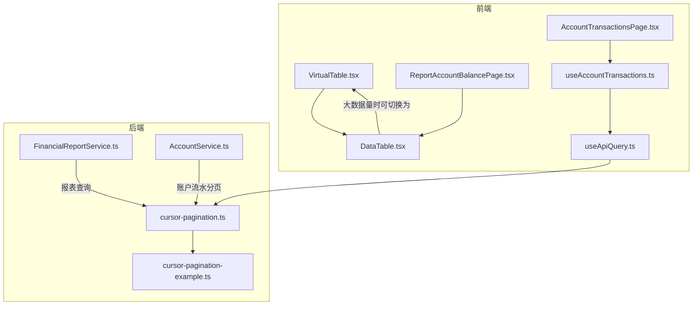
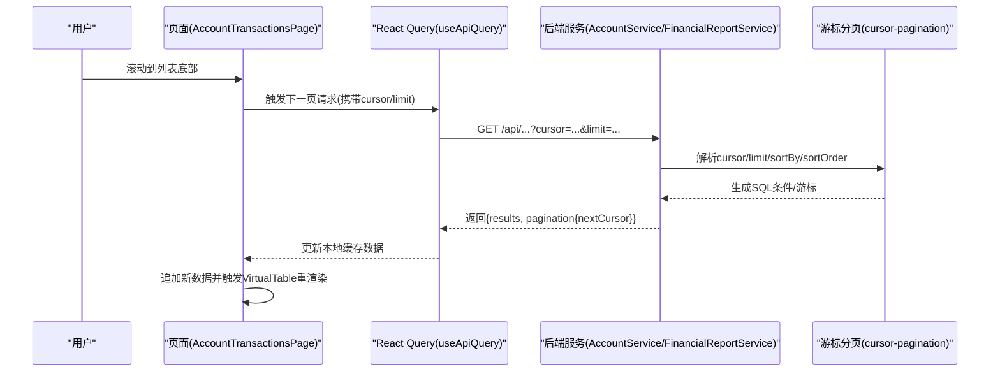
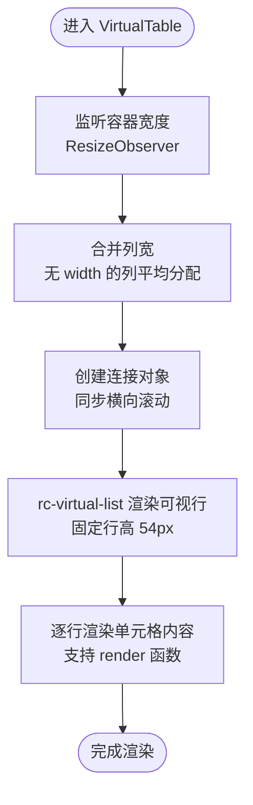
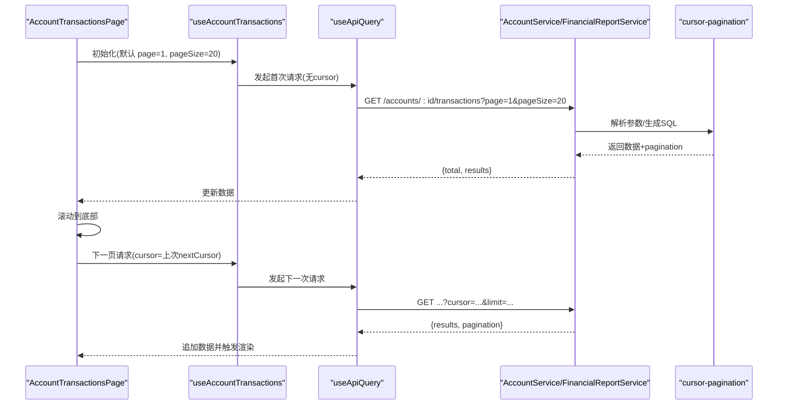
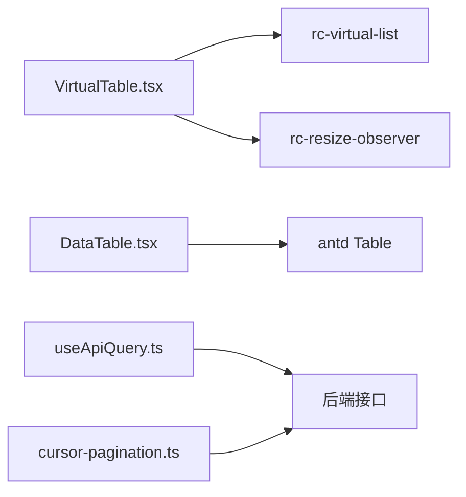

# 虚拟滚动表格 (VirtualTable)

<cite>
**本文引用的文件**
- [VirtualTable.tsx](file://frontend/src/components/common/VirtualTable.tsx)
- [DataTable.tsx](file://frontend/src/components/common/DataTable.tsx)
- [cursor-pagination-example.ts](file://backend/src/utils/cursor-pagination-example.ts)
- [cursor-pagination.ts](file://backend/src/utils/cursor-pagination.ts)
- [AccountTransactionsPage.tsx](file://frontend/src/features/finance/pages/AccountTransactionsPage.tsx)
- [ReportAccountBalancePage.tsx](file://frontend/src/features/reports/pages/ReportAccountBalancePage.tsx)
- [useAccountTransactions.ts](file://frontend/src/hooks/business/useAccountTransactions.ts)
- [useApiQuery.ts](file://frontend/src/utils/useApiQuery.ts)
- [FinancialReportService.ts](file://backend/src/services/FinancialReportService.ts)
- [AccountService.ts](file://backend/src/services/AccountService.ts)
</cite>

## 目录
1. [简介](#简介)
2. [项目结构](#项目结构)
3. [核心组件](#核心组件)
4. [架构总览](#架构总览)
5. [详细组件分析](#详细组件分析)
6. [依赖关系分析](#依赖关系分析)
7. [性能考量](#性能考量)
8. [故障排查指南](#故障排查指南)
9. [结论](#结论)
10. [附录](#附录)

## 简介
本文件围绕 VirtualTable 组件在处理大规模财务数据集（如会计流水、账户余额明细、交易日志等）中的核心价值进行系统化阐述。VirtualTable 基于 rc-virtual-list 实现虚拟滚动，通过“只渲染可视区域内的行”显著降低 DOM 数量，从而在渲染 10 万+ 条会计流水记录时大幅减少内存占用与重排重绘开销，提升滚动帧率与交互流畅度。同时，文档对比了与传统 DataTable 的差异，并给出与后端游标分页（cursor pagination）结合的完整前端集成方案，覆盖无限滚动加载、行高策略、滚动同步、以及与固定表头/列冻结的集成挑战与解决方案。

## 项目结构
VirtualTable 位于前端通用组件目录，配合 DataTable 提供统一的表格封装；后端提供游标分页工具与示例，支撑前端实现“无限滚动加载”。

图表来源
- [VirtualTable.tsx](file://frontend/src/components/common/VirtualTable.tsx#L1-L149)
- [DataTable.tsx](file://frontend/src/components/common/DataTable.tsx#L1-L189)
- [AccountTransactionsPage.tsx](file://frontend/src/features/finance/pages/AccountTransactionsPage.tsx#L1-L199)
- [ReportAccountBalancePage.tsx](file://frontend/src/features/reports/pages/ReportAccountBalancePage.tsx#L1-L384)
- [useAccountTransactions.ts](file://frontend/src/hooks/business/useAccountTransactions.ts#L1-L24)
- [useApiQuery.ts](file://frontend/src/utils/useApiQuery.ts#L1-L102)
- [cursor-pagination-example.ts](file://backend/src/utils/cursor-pagination-example.ts#L1-L114)
- [cursor-pagination.ts](file://backend/src/utils/cursor-pagination.ts#L1-L218)
- [FinancialReportService.ts](file://backend/src/services/FinancialReportService.ts#L1-L175)
- [AccountService.ts](file://backend/src/services/AccountService.ts#L1-L82)

章节来源
- [VirtualTable.tsx](file://frontend/src/components/common/VirtualTable.tsx#L1-L149)
- [DataTable.tsx](file://frontend/src/components/common/DataTable.tsx#L1-L189)

## 核心组件
- VirtualTable：基于 rc-virtual-list 的虚拟滚动表格，通过固定行高与可视区渲染，显著降低大列表渲染成本。
- DataTable：通用表格封装，内置分页、加载态、排序/筛选联动、可选虚拟滚动开关，便于在不同场景灵活切换。
- 后端游标分页工具：提供 cursor、limit、sortBy、sortOrder 的解析与 SQL 条件生成，支持无限滚动加载。

章节来源
- [VirtualTable.tsx](file://frontend/src/components/common/VirtualTable.tsx#L1-L149)
- [DataTable.tsx](file://frontend/src/components/common/DataTable.tsx#L1-L189)
- [cursor-pagination.ts](file://backend/src/utils/cursor-pagination.ts#L1-L218)

## 架构总览
前端通过 React Query 获取数据，后端以游标分页返回“下一页”的游标值，前端在滚动接近底部时发起下一次请求，形成“无限滚动加载”。VirtualTable 仅负责渲染可见行，保证滚动性能。

图表来源
- [AccountTransactionsPage.tsx](file://frontend/src/features/finance/pages/AccountTransactionsPage.tsx#L1-L199)
- [useAccountTransactions.ts](file://frontend/src/hooks/business/useAccountTransactions.ts#L1-L24)
- [useApiQuery.ts](file://frontend/src/utils/useApiQuery.ts#L1-L102)
- [cursor-pagination.ts](file://backend/src/utils/cursor-pagination.ts#L1-L218)
- [AccountService.ts](file://backend/src/services/AccountService.ts#L1-L82)
- [FinancialReportService.ts](file://backend/src/services/FinancialReportService.ts#L1-L175)

## 详细组件分析

### VirtualTable 组件分析
- 虚拟滚动原理
  - 使用 rc-virtual-list 的 List 组件，仅渲染可视区域内的行，itemHeight 固定为 54px，总高度 = 行数 × 54。
  - 通过 ResizeObserver 监听容器宽度，动态分配列宽，避免列宽缺失导致布局抖动。
  - 通过 connectObject 将 rc-virtual-list 的横向滚动同步到 Ant Design Table 的滚动条，保持左右滚动一致。
- 行高策略
  - 当前列实现采用固定行高（54px），复杂场景建议改为动态高度计算（见“性能考量”与“行高预估/动态高度计算”章节）。
- 滚动同步
  - 通过 Object.defineProperty 定义 scrollLeft 的 getter/setter，使 rc-virtual-list 与 Ant Design Table 的横向滚动保持一致。
- 与 DataTable 的关系
  - DataTable 支持 virtual 开关，在大数据量时自动切换到 VirtualTable；小数据量则使用原生 Table。
- 限制与注意事项
  - 未实现 rowSelection 的完整支持（注释说明），若需选择框，需自定义行渲染或改用原生 Table。

图表来源
- [VirtualTable.tsx](file://frontend/src/components/common/VirtualTable.tsx#L1-L149)

章节来源
- [VirtualTable.tsx](file://frontend/src/components/common/VirtualTable.tsx#L1-L149)

### DataTable 组件分析
- 功能特性
  - 统一封装列定义、分页、加载态、排序/筛选联动、操作列、动作栏等。
  - 支持 virtual 开关：当数据量超过阈值（例如 100）且开启 virtual 时，自动设置固定高度并启用虚拟滚动。
- 与 VirtualTable 的协作
  - 当 virtual=true 且数据量较大时，DataTable 内部会传入 scroll.y 并交由 VirtualTable 渲染。
- 与固定表头/列冻结的兼容性
  - DataTable 使用 Ant Design Table 的 scroll.x/y 配置，天然支持固定表头；列冻结可通过 Ant Design 的 fixed 属性实现，但与 rc-virtual-list 的组合需谨慎处理（见“固定表头/列冻结集成挑战”）。

章节来源
- [DataTable.tsx](file://frontend/src/components/common/DataTable.tsx#L1-L189)

### 后端游标分页工具与示例
- 工具能力
  - 解析 cursor、limit、sortBy、sortOrder，生成游标值与 SQL 条件片段，支持 hasNext/nextCursor 计算。
  - 提供 OpenAPI Schema，便于前后端契约一致。
- 示例路由
  - 提供在路由中使用 cursorPaginationSchema、getCursorPaginationParams、buildCursorPaginationResult 的完整示例，包括 where 条件拼接与分页结果构建。
- 与前端的对接
  - 前端每次请求携带 cursor 与 limit，后端返回 nextCursor；前端在滚动到底部时继续请求，直至 hasNext=false。

章节来源
- [cursor-pagination.ts](file://backend/src/utils/cursor-pagination.ts#L1-L218)
- [cursor-pagination-example.ts](file://backend/src/utils/cursor-pagination-example.ts#L1-L114)

### 前端与后端联调示例（无限滚动加载）
- 页面与 Hook
  - AccountTransactionsPage 使用 useAccountTransactions 获取账户流水，内部通过 useApiQuery 与后端通信。
  - useAccountTransactions 默认使用 keepPreviousData，保障滚动过程中的平滑过渡。
- 游标分页流程
  - 首次请求：不带 cursor，limit=默认值。
  - 后续请求：携带上次返回的 nextCursor，limit 不变。
  - 当 hasNext=false 时停止加载。
- 与 VirtualTable 的结合
  - 在大数据量场景下，将 DataTable 的 virtual 设为 true，即可自动切换到 VirtualTable 渲染。

图表来源
- [AccountTransactionsPage.tsx](file://frontend/src/features/finance/pages/AccountTransactionsPage.tsx#L1-L199)
- [useAccountTransactions.ts](file://frontend/src/hooks/business/useAccountTransactions.ts#L1-L24)
- [useApiQuery.ts](file://frontend/src/utils/useApiQuery.ts#L1-L102)
- [AccountService.ts](file://backend/src/services/AccountService.ts#L1-L82)
- [cursor-pagination.ts](file://backend/src/utils/cursor-pagination.ts#L1-L218)

章节来源
- [AccountTransactionsPage.tsx](file://frontend/src/features/finance/pages/AccountTransactionsPage.tsx#L1-L199)
- [useAccountTransactions.ts](file://frontend/src/hooks/business/useAccountTransactions.ts#L1-L24)
- [useApiQuery.ts](file://frontend/src/utils/useApiQuery.ts#L1-L102)
- [AccountService.ts](file://backend/src/services/AccountService.ts#L1-L82)
- [cursor-pagination.ts](file://backend/src/utils/cursor-pagination.ts#L1-L218)

### 场景应用优势
- 会计流水（Account Transactions）
  - 数据量通常很大，使用 VirtualTable 可显著降低 DOM 数量，提升滚动帧率与交互流畅度。
  - 结合游标分页，实现“无限滚动加载”，无需一次性拉取全量数据。
- 资产负债表（报表页）
  - 报表明细页通常以 DataTable 展示，若数据量较大，可开启 virtual 切换到 VirtualTable。
  - 报表服务层已提供多表联结查询与排序，前端只需按游标分页拉取。
- 交易日志（审计/流水）
  - 日志类数据同样适合虚拟滚动，结合固定高度与固定列，可满足大量字段的展示需求。

章节来源
- [ReportAccountBalancePage.tsx](file://frontend/src/features/reports/pages/ReportAccountBalancePage.tsx#L1-L384)
- [FinancialReportService.ts](file://backend/src/services/FinancialReportService.ts#L1-L175)

## 依赖关系分析
- 组件耦合
  - VirtualTable 与 rc-virtual-list、rc-resize-observer 强耦合，负责滚动与列宽计算。
  - DataTable 与 Ant Design Table 强耦合，负责通用表格行为与分页。
- 数据流
  - 前端通过 useApiQuery 与后端游标分页工具交互，形成“请求-响应-追加”的循环。
- 外部依赖
  - rc-virtual-list：虚拟滚动核心。
  - rc-resize-observer：容器尺寸监听。
  - @ant-design/icons、antd：UI 组件与主题 Token。

图表来源
- [VirtualTable.tsx](file://frontend/src/components/common/VirtualTable.tsx#L1-L149)
- [DataTable.tsx](file://frontend/src/components/common/DataTable.tsx#L1-L189)
- [useApiQuery.ts](file://frontend/src/utils/useApiQuery.ts#L1-L102)
- [cursor-pagination.ts](file://backend/src/utils/cursor-pagination.ts#L1-L218)

章节来源
- [VirtualTable.tsx](file://frontend/src/components/common/VirtualTable.tsx#L1-L149)
- [DataTable.tsx](file://frontend/src/components/common/DataTable.tsx#L1-L189)
- [useApiQuery.ts](file://frontend/src/utils/useApiQuery.ts#L1-L102)
- [cursor-pagination.ts](file://backend/src/utils/cursor-pagination.ts#L1-L218)

## 性能考量
- 与普通 DataTable 的对比
  - 普通 DataTable：渲染所有行，DOM 数量与数据量线性增长，滚动时重排重绘开销大，内存占用高。
  - VirtualTable：仅渲染可视区域行，DOM 数量近似为可视行数，内存占用与滚动性能显著改善。
- 行高策略
  - 当前实现固定行高（54px）。对于复杂单元格（长文本、图片、多行渲染），建议改为动态高度计算：
    - 预估高度：根据列宽与字体大小估算行高。
    - 实测高度：首屏渲染后测量真实高度并缓存，后续复用。
    - 混合策略：对简单列使用固定高度，复杂列使用动态高度。
- 滚动同步
  - 通过 connectObject 同步横向滚动，避免左右滚动不一致导致的视觉错位。
- 与固定表头/列冻结的集成
  - 固定表头：Ant Design Table 原生支持，VirtualTable 亦可正常工作。
  - 列冻结：Ant Design 的 fixed 属性与 rc-virtual-list 的组合可能产生布局冲突，建议：
    - 冻结列数量不宜过多（建议不超过 2 列）。
    - 冻结列使用固定宽度，避免 ResizeObserver 重复计算。
    - 若出现滚动不同步，优先检查 connectObject 的 scrollLeft 设置是否生效。
- 无限滚动加载
  - 前端在滚动接近底部时触发下一页请求，后端返回 nextCursor；前端将新数据追加到现有列表末尾，VirtualTable 自动渲染新增行。
  - 建议使用 keepPreviousData，避免滚动过程中出现闪烁或空白。

章节来源
- [VirtualTable.tsx](file://frontend/src/components/common/VirtualTable.tsx#L1-L149)
- [DataTable.tsx](file://frontend/src/components/common/DataTable.tsx#L1-L189)
- [useApiQuery.ts](file://frontend/src/utils/useApiQuery.ts#L1-L102)
- [cursor-pagination.ts](file://backend/src/utils/cursor-pagination.ts#L1-L218)

## 故障排查指南
- 滚动不同步
  - 检查 connectObject 的 scrollLeft getter/setter 是否正确绑定到 rc-virtual-list。
  - 确认 rc-virtual-list 的 ref 是否正确传递给 List。
- 列宽异常
  - 确保 columns 中至少有一个列设置了 width，否则会触发平均分配逻辑。
  - 使用 ResizeObserver 监听容器宽度变化，避免列宽计算错误。
- 选择框不生效
  - VirtualTable 未实现完整的 rowSelection 支持，如需选择框，请使用原生 Table 或自定义行渲染。
- 无限滚动未触发
  - 确认后端返回的 pagination.hasNext 与 nextCursor 是否正确。
  - 前端滚动事件监听是否在可视区域底部触发。
- 内存占用仍高
  - 检查是否启用了 keepPreviousData，以及是否频繁切换虚拟滚动开关。
  - 复杂单元格渲染（图片、富文本）会增加内存占用，建议优化渲染逻辑或使用动态高度。

章节来源
- [VirtualTable.tsx](file://frontend/src/components/common/VirtualTable.tsx#L1-L149)
- [DataTable.tsx](file://frontend/src/components/common/DataTable.tsx#L1-L189)
- [useApiQuery.ts](file://frontend/src/utils/useApiQuery.ts#L1-L102)
- [cursor-pagination.ts](file://backend/src/utils/cursor-pagination.ts#L1-L218)

## 结论
VirtualTable 在处理大规模财务数据集时具有显著优势：通过虚拟滚动大幅降低 DOM 数量与内存占用，提升滚动帧率与交互体验。结合后端游标分页，可实现“无限滚动加载”，在 10 万+ 条会计流水场景下依然保持流畅。对于复杂场景，建议采用动态高度计算与合理的列冻结策略，并在必要时回退到原生 Table 以获得更完整的功能支持。

## 附录
- 与固定表头/列冻结集成的实践要点
  - 固定表头：天然支持，无需额外处理。
  - 列冻结：控制冻结列数量，使用固定宽度，避免与 rc-virtual-list 的布局冲突。
  - 滚动同步：确保 connectObject 的 scrollLeft 生效，避免左右滚动不同步。
- 与 Backend 的 cursor-pagination 集成清单
  - 前端：携带 cursor 与 limit，接收 nextCursor，追加数据。
  - 后端：解析参数，生成 SQL 条件，返回 hasNext/nextCursor。