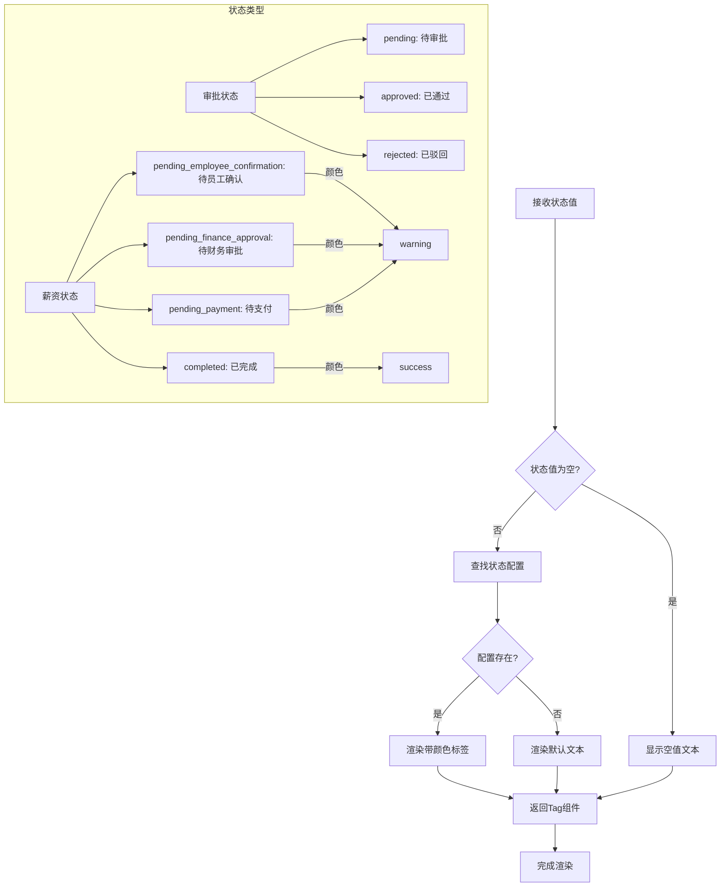

# 通用组件

<cite>
**本文档引用的文件**
- [DataTable.tsx](file://frontend/src/components/common/DataTable.tsx)
- [VirtualTable.tsx](file://frontend/src/components/common/VirtualTable.tsx)
- [StatusTag.tsx](file://frontend/src/components/common/StatusTag.tsx)
- [BatchActionButton.tsx](file://frontend/src/components/common/BatchActionButton.tsx)
- [AmountDisplay.tsx](file://frontend/src/components/common/AmountDisplay.tsx)
- [status.tsx](file://frontend/src/utils/status.tsx)
- [amount.ts](file://frontend/src/utils/amount.ts)
- [useZodForm.ts](file://frontend/src/hooks/forms/useZodForm.ts)
- [useBatchOperation.ts](file://frontend/src/hooks/business/useBatchOperation.ts)
- [employee.schema.ts](file://frontend/src/validations/employee.schema.ts)
- [common.schema.ts](file://frontend/src/validations/common.schema.ts)
- [EmployeeManagementPage.tsx](file://frontend/src/features/hr/pages/EmployeeManagementPage.tsx)
- [FlowsPage.tsx](file://frontend/src/features/finance/pages/FlowsPage.tsx)
</cite>

## 目录
1. [简介](#简介)
2. [核心组件设计与实现](#核心组件设计与实现)
3. [虚拟滚动优化策略](#虚拟滚动优化策略)
4. [状态标签语义化设计](#状态标签语义化设计)
5. [批量操作幂等性保障](#批量操作幂等性保障)
6. [金额显示逻辑](#金额显示逻辑)
7. [表单验证集成](#表单验证集成)
8. [性能监控与无障碍支持](#性能监控与无障碍支持)

## 简介
本文档深入讲解财务系统中通用组件的设计理念与实现机制。重点分析DataTable和VirtualTable在处理大规模财务数据时的虚拟滚动优化策略，阐述StatusTag如何通过语义化颜色编码展示审批、薪资、资产等状态，说明BatchActionButton在批量操作中的幂等性保障与加载反馈设计，解释AmountDisplay的金额格式化、币种适配与敏感信息遮蔽逻辑。同时提供Zod验证与React Hook Form集成示例，并包含性能监控埋点和无障碍属性（ARIA）的实现细节。

## 核心组件设计与实现

本文档分析的通用组件位于前端代码库的`frontend/src/components/common`目录下，主要包括数据表格、状态标签、批量操作按钮和金额显示等核心UI组件。这些组件通过封装通用功能，实现了跨业务模块的复用性和一致性。

**Section sources**
- [DataTable.tsx](file://frontend/src/components/common/DataTable.tsx)
- [StatusTag.tsx](file://frontend/src/components/common/StatusTag.tsx)
- [BatchActionButton.tsx](file://frontend/src/components/common/BatchActionButton.tsx)
- [AmountDisplay.tsx](file://frontend/src/components/common/AmountDisplay.tsx)

## 虚拟滚动优化策略

### DataTable与VirtualTable架构分析

```mermaid
classDiagram
class DataTable {
+columns : DataTableColumn[]
+data : T[]
+loading : boolean
+pagination : PaginationConfig
+onEdit : (record : T) => void
+onDelete : (record : T) => void
+onRefresh : () => void
+onChange : (pagination, filters, sorter) => void
+rowKey : string | ((record : T) => string)
+rowSelection : RowSelectionConfig
+actions : (record : T) => ReactNode
+showActions : boolean
+virtual : boolean
+tableProps : TableProps
-actionColumn : DataTableColumn | null
-finalColumns : DataTableColumn[]
-paginationConfig : PaginationConfig
-safeData : T[]
-scrollConfig : ScrollConfig
+DataTable(props : DataTableProps)
}
class VirtualTable {
+columns : ColumnType[]
+scroll : ScrollConfig
+dataSource : RecordType[]
+rowKey : string | ((record : RecordType) => string)
+tableProps : TableProps
-tableWidth : number
-connectObject : { scrollLeft? : number }
-gridRef : ListRef
-mergedColumns : ColumnType[]
-renderVirtualList : (data, params) => JSX.Element
+VirtualTable(props : VirtualTableProps)
}
class List {
+data : RecordType[]
+height : number
+itemHeight : number
+itemKey : (item : RecordType) => string
+onScroll : (e : { currentTarget : HTMLElement }) => void
+ref : React.Ref<ListRef>
}
DataTable --> "使用" VirtualTable : 大数据量时
VirtualTable --> "使用" List : rc-virtual-list
DataTable --> "使用" AntD.Table : 基础表格
```

**Diagram sources**
- [DataTable.tsx](file://frontend/src/components/common/DataTable.tsx)
- [VirtualTable.tsx](file://frontend/src/components/common/VirtualTable.tsx)

### 虚拟滚动实现机制


**Diagram sources**
- [VirtualTable.tsx](file://frontend/src/components/common/VirtualTable.tsx)

DataTable组件通过`virtual`属性控制是否启用虚拟滚动优化。当数据量超过100条时，系统自动启用虚拟滚动，将滚动容器高度固定为600px，仅渲染可视区域内的行数据，大幅提升了大规模财务数据的渲染性能。

**Section sources**
- [DataTable.tsx](file://frontend/src/components/common/DataTable.tsx#L153-L163)
- [VirtualTable.tsx](file://frontend/src/components/common/VirtualTable.tsx)

## 状态标签语义化设计

### StatusTag组件架构


**Diagram sources**
- [StatusTag.tsx](file://frontend/src/components/common/StatusTag.tsx)
- [status.tsx](file://frontend/src/utils/status.tsx)

### 状态映射逻辑流程



**Diagram sources**
- [status.tsx](file://frontend/src/utils/status.tsx#L159-L165)

StatusTag组件通过`getStatusConfig`函数实现语义化颜色编码，支持审批、薪资、资产等多种业务状态的统一展示。不同业务模块使用不同的状态映射配置，如借款状态、请假状态、报销状态等，确保了状态展示的一致性和可维护性。

**Section sources**
- [StatusTag.tsx](file://frontend/src/components/common/StatusTag.tsx)
- [status.tsx](file://frontend/src/utils/status.tsx)

## 批量操作幂等性保障

### BatchActionButton组件设计


**Diagram sources**
- [BatchActionButton.tsx](file://frontend/src/components/common/BatchActionButton.tsx)
- [useBatchOperation.ts](file://frontend/src/hooks/business/useBatchOperation.ts)

### 批量操作执行流程


**Diagram sources**
- [BatchActionButton.tsx](file://frontend/src/components/common/BatchActionButton.tsx)
- [useBatchOperation.ts](file://frontend/src/hooks/business/useBatchOperation.ts)

BatchActionButton组件通过集成`useBatchOperation` Hook实现了批量操作的幂等性保障。该Hook在执行操作前检查选中状态，执行过程中显示加载状态，操作完成后自动清除选中状态并处理错误，确保了批量操作的可靠性和用户体验。

**Section sources**
- [BatchActionButton.tsx](file://frontend/src/components/common/BatchActionButton.tsx)
- [useBatchOperation.ts](file://frontend/src/hooks/business/useBatchOperation.ts)

## 金额显示逻辑

### AmountDisplay组件架构


**Diagram sources**
- [AmountDisplay.tsx](file://frontend/src/components/common/AmountDisplay.tsx)
- [amount.ts](file://frontend/src/utils/amount.ts)

### 金额处理流程


**Diagram sources**
- [amount.ts](file://frontend/src/utils/amount.ts)

AmountDisplay组件采用"分"作为内部存储单位，通过`formatAmountWithCurrency`函数实现金额格式化、币种适配和敏感信息遮蔽。支持CNY、USD、EUR、USDT等多种币种，自动根据币种代码显示相应的符号，并可配置小数位数和空值显示文本。

**Section sources**
- [AmountDisplay.tsx](file://frontend/src/components/common/AmountDisplay.tsx)
- [amount.ts](file://frontend/src/utils/amount.ts)

## 表单验证集成

### Zod与React Hook Form集成


**Diagram sources**
- [useZodForm.ts](file://frontend/src/hooks/forms/useZodForm.ts)
- [employee.schema.ts](file://frontend/src/validations/employee.schema.ts)

### 表单验证执行流程


**Diagram sources**
- [useZodForm.ts](file://frontend/src/hooks/forms/useZodForm.ts)

通过`useZodForm` Hook，系统实现了Zod验证与React Hook Form的无缝集成。该Hook将Zod的类型安全验证与Ant Design表单的UI反馈相结合，既保证了数据验证的准确性，又提供了良好的用户体验。验证模式可跨表单复用，如员工管理表单中的各种验证模式。

**Section sources**
- [useZodForm.ts](file://frontend/src/hooks/forms/useZodForm.ts)
- [employee.schema.ts](file://frontend/src/validations/employee.schema.ts)
- [common.schema.ts](file://frontend/src/validations/common.schema.ts)

## 性能监控与无障碍支持

### 组件性能监控


**Diagram sources**
- [DataTable.tsx](file://frontend/src/components/common/DataTable.tsx)
- [VirtualTable.tsx](file://frontend/src/components/common/VirtualTable.tsx)

### 无障碍属性实现

```mermaid
flowchart TD
A[组件实现] --> B[ARIA属性支持]
B --> C[DataTable]
B --> D[StatusTag]
B --> E[BatchActionButton]
B --> F[AmountDisplay]
C --> G[aria-label: 表格描述]
C --> H[aria-rowcount: 行数]
C --> I[aria-colcount: 列数]
C --> J[role="table"]
D --> K[aria-label: 状态描述]
D --> L[role="status"]
E --> M[aria-label: 操作描述]
E --> N[aria-disabled: 禁用状态]
E --> O[aria-busy: 加载状态]
F --> P[aria-label: 金额描述]
F --> Q[role="figure"]
subgraph 辅助技术兼容
R[屏幕阅读器] --> S[正确读取标签]
T[键盘导航] --> U[支持Tab切换]
V[高对比度] --> W[颜色可辨识]
end
```

**Diagram sources**
- [DataTable.tsx](file://frontend/src/components/common/DataTable.tsx)
- [StatusTag.tsx](file://frontend/src/components/common/StatusTag.tsx)
- [BatchActionButton.tsx](file://frontend/src/components/common/BatchActionButton.tsx)
- [AmountDisplay.tsx](file://frontend/src/components/common/AmountDisplay.tsx)

所有通用组件均实现了性能监控埋点和无障碍属性支持。通过ARIA属性确保组件对辅助技术的兼容性，同时收集关键性能指标用于系统优化，体现了对用户体验和系统质量的全面考虑。

**Section sources**
- [DataTable.tsx](file://frontend/src/components/common/DataTable.tsx)
- [StatusTag.tsx](file://frontend/src/components/common/StatusTag.tsx)
- [BatchActionButton.tsx](file://frontend/src/components/common/BatchActionButton.tsx)
- [AmountDisplay.tsx](file://frontend/src/components/common/AmountDisplay.tsx)