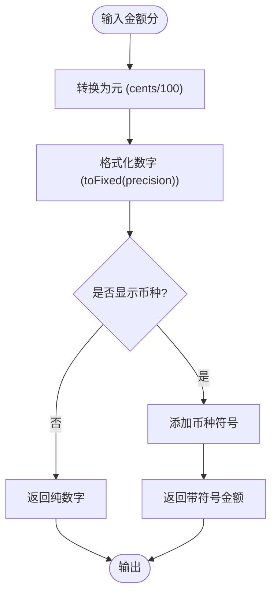
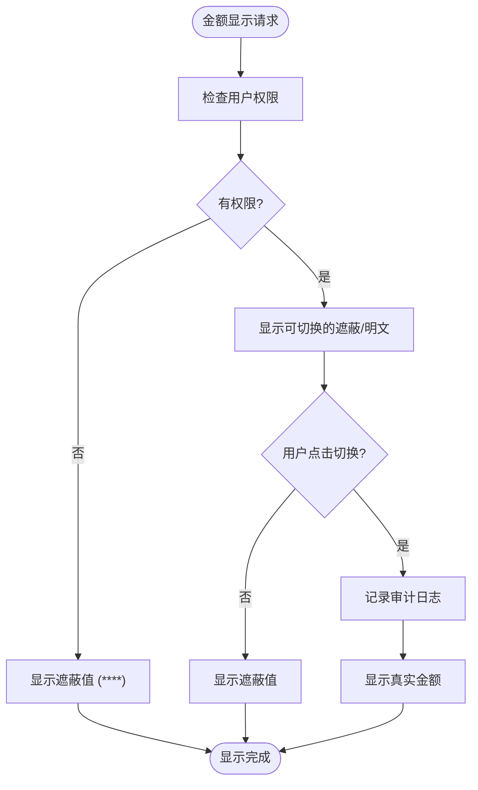
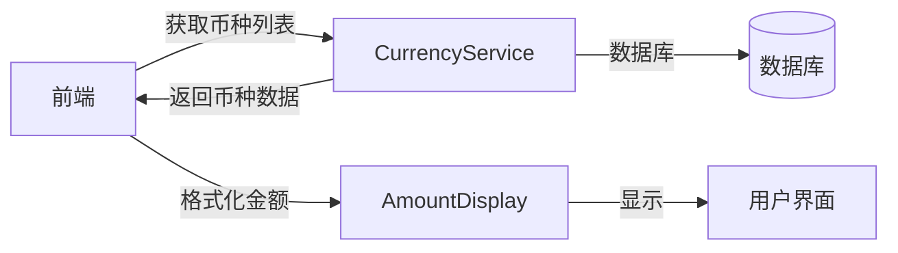

# 金额显示 (AmountDisplay)

<cite>
**本文档引用的文件**
- [AmountDisplay.tsx](file://frontend/src/components/common/AmountDisplay.tsx)
- [amount.ts](file://frontend/src/utils/amount.ts)
- [SensitiveField.tsx](file://frontend/src/components/SensitiveField.tsx)
- [CurrencyService.ts](file://backend/src/services/CurrencyService.ts)
- [useBusinessData.ts](file://frontend/src/hooks/useBusinessData.ts)
</cite>

## 目录
1. [简介](#简介)
2. [精确性要求](#精确性要求)
3. [安全性要求](#安全性要求)
4. [与CurrencyService集成](#与currencyservice集成)
5. [极端值与国际化支持](#极端值与国际化支持)

## 简介
金额显示组件（AmountDisplay）是财务系统中的核心展示组件，负责统一格式化和显示金额信息。该组件确保了金额在不同场景下的精确性、一致性和安全性，支持多币种、多区域设置的格式化需求，并实现了敏感信息的遮蔽功能。

**Section sources**
- [AmountDisplay.tsx](file://frontend/src/components/common/AmountDisplay.tsx#L1-L50)

## 精确性要求
金额显示组件通过`frontend/src/utils/amount.ts`中的格式化工具实现精确的金额显示。组件接收以"分"为单位的金额值（cents），并根据用户配置的币种（如CNY、USD）和区域设置进行格式化。

组件支持千分位分隔和小数位数控制（默认2位，可配置）。对于负数，虽然当前实现未直接使用会计表示法（如括号包围），但通过基础的数值格式化确保了负数的正确显示。

**Diagram sources**
- [amount.ts](file://frontend/src/utils/amount.ts#L28-L52)
- [AmountDisplay.tsx](file://frontend/src/components/common/AmountDisplay.tsx#L41-L43)

**Section sources**
- [amount.ts](file://frontend/src/utils/amount.ts#L6-L104)
- [AmountDisplay.tsx](file://frontend/src/components/common/AmountDisplay.tsx#L6-L44)

## 安全性要求
金额显示组件通过与`SensitiveField`组件集成实现敏感信息遮蔽功能。在非授权用户视图中，敏感金额信息可以被遮蔽显示。

`SensitiveField`组件根据用户的权限决定是否显示真实金额。对于薪资等敏感信息，可以配置为显示为'****'或仅显示最后几位数字。当用户有查看权限时，可以通过点击"显示"按钮查看真实值，同时系统会记录审计日志。

**Diagram sources**
- [SensitiveField.tsx](file://frontend/src/components/SensitiveField.tsx#L24-L77)
- [AmountDisplay.tsx](file://frontend/src/components/common/AmountDisplay.tsx#L28-L50)

**Section sources**
- [SensitiveField.tsx](file://frontend/src/components/SensitiveField.tsx#L7-L83)
- [SalaryPaymentsPage.tsx](file://frontend/src/features/hr/pages/SalaryPaymentsPage.tsx#L283-L295)

## 与CurrencyService集成
金额显示组件与后端的`CurrencyService`服务集成，支持动态币种切换时的实时更新。`CurrencyService`管理系统的币种信息，包括币种代码、名称和激活状态。

前端通过`useCurrencies` Hook从`CurrencyService`获取币种列表，并在金额显示组件中使用这些配置。当用户切换币种时，组件会实时更新显示格式，包括币种符号和格式化规则。

**Diagram sources**
- [CurrencyService.ts](file://backend/src/services/CurrencyService.ts#L1-L78)
- [useBusinessData.ts](file://frontend/src/hooks/useBusinessData.ts#L6-L17)

**Section sources**
- [CurrencyService.ts](file://backend/src/services/CurrencyService.ts#L1-L78)
- [useBusinessData.ts](file://frontend/src/hooks/useBusinessData.ts#L6-L17)

## 极端值与国际化支持
金额显示组件对极端值（如超大金额）有适当的处理机制。组件使用JavaScript的数字类型处理金额，通过`toFixed`方法确保小数位数的精确性。

在国际化（i18n）支持方面，虽然当前主要使用自定义格式化函数，但也提供了基于`Intl.NumberFormat`的格式化方法，支持不同语言环境的格式化需求。组件能够根据用户配置的区域设置进行千分位分隔和小数点符号的适配。

对于超大金额，组件通过标准的数字格式化方法进行处理，确保不会出现科学计数法或其他非预期的显示格式。空值或null值会显示为配置的空值文本（默认为'-'）。

**Section sources**
- [amount.ts](file://frontend/src/utils/amount.ts#L54-L73)
- [formatters.ts](file://frontend/src/utils/formatters.ts#L24-L26)