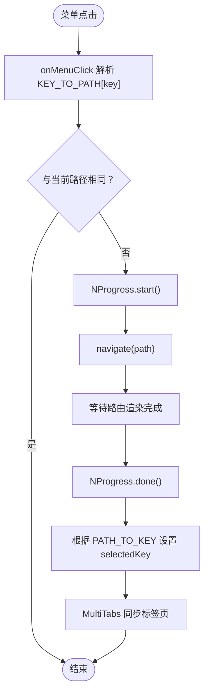

# 主布局与导航集成

<cite>
**本文引用的文件**
- [MainLayout.tsx](file://frontend/src/layouts/MainLayout.tsx)
- [router/index.tsx](file://frontend/src/router/index.tsx)
- [router/PrivateRoute.tsx](file://frontend/src/router/PrivateRoute.tsx)
- [store/useAppStore.ts](file://frontend/src/store/useAppStore.ts)
- [config/menu.ts](file://frontend/src/config/menu.ts)
- [components/layout/MultiTabs.tsx](file://frontend/src/components/layout/MultiTabs.tsx)
- [utils/permissions.ts](file://frontend/src/utils/permissions.ts)
- [main.tsx](file://frontend/src/main.tsx)
- [layouts/MainLayout.css](file://frontend/src/layouts/MainLayout.css)
- [components/layout/MultiTabs.css](file://frontend/src/components/layout/MultiTabs.css)
</cite>

## 目录
1. [引言](#引言)
2. [项目结构](#项目结构)
3. [核心组件](#核心组件)
4. [架构总览](#架构总览)
5. [详细组件分析](#详细组件分析)
6. [依赖关系分析](#依赖关系分析)
7. [性能考量](#性能考量)
8. [故障排查指南](#故障排查指南)
9. [结论](#结论)

## 引言
本文件围绕前端主布局组件 MainLayout 的设计与实现，系统阐述其作为应用根布局容器如何组织 Sider、Header 和 Content 区域；如何通过 React Router 的 useNavigate 与 useLocation 实现路由驱动的界面更新；NProgress 在路由切换时的加载进度条管理机制；onMenuClick 事件处理器如何借助 KEY_TO_PATH 映射将菜单项与具体路由关联；collapsed 状态如何控制侧边栏展开/折叠；hover 展开动画的实现原理及性能优化策略；以及用户头像下拉菜单如何集成登出功能并与全局状态管理（useAppStore）协同工作。

## 项目结构
- 主布局位于 frontend/src/layouts/MainLayout.tsx，负责整体布局、菜单交互、头部用户菜单、多标签页等。
- 路由配置位于 frontend/src/router/index.tsx，包含懒加载路由映射与预加载函数。
- 私有路由守卫位于 frontend/src/router/PrivateRoute.tsx，确保登录态校验。
- 全局状态管理位于 frontend/src/store/useAppStore.ts，提供 collapsed、themeMode、userInfo、token、logout 等状态与方法。
- 菜单构建与映射位于 frontend/src/config/menu.ts，提供 buildMenuItems、KEY_TO_PATH、PATH_TO_KEY。
- 多标签页组件位于 frontend/src/components/layout/MultiTabs.tsx，负责标签页同步与上下文菜单。
- 权限工具位于 frontend/src/utils/permissions.ts，用于菜单项按权限动态生成。
- 应用入口位于 frontend/src/main.tsx，注册 RouterProvider、ConfigProvider、错误边界与持久化查询客户端。

图表来源
- [main.tsx](file://frontend/src/main.tsx#L1-L78)
- [router/index.tsx](file://frontend/src/router/index.tsx#L1-L256)
- [router/PrivateRoute.tsx](file://frontend/src/router/PrivateRoute.tsx#L1-L16)
- [layouts/MainLayout.tsx](file://frontend/src/layouts/MainLayout.tsx#L1-L286)
- [config/menu.ts](file://frontend/src/config/menu.ts#L1-L313)
- [store/useAppStore.ts](file://frontend/src/store/useAppStore.ts#L1-L90)
- [components/layout/MultiTabs.tsx](file://frontend/src/components/layout/MultiTabs.tsx#L1-L165)
- [utils/permissions.ts](file://frontend/src/utils/permissions.ts#L1-L100)
- [layouts/MainLayout.css](file://frontend/src/layouts/MainLayout.css#L1-L728)
- [components/layout/MultiTabs.css](file://frontend/src/components/layout/MultiTabs.css#L1-L194)

章节来源
- [main.tsx](file://frontend/src/main.tsx#L1-L78)
- [router/index.tsx](file://frontend/src/router/index.tsx#L1-L256)

## 核心组件
- MainLayout：根布局容器，承载 Sider（侧边栏）、Header（头部）、Content（内容区），并集成菜单、用户下拉菜单、主题切换、多标签页。
- 路由系统：基于 createBrowserRouter，支持懒加载与预加载，提供 preloadRoute。
- 私有路由守卫：确保未认证用户跳转登录。
- 全局状态：useAppStore 提供 collapsed、themeMode、userInfo、token、logout 等。
- 菜单系统：buildMenuItems 根据权限动态生成菜单树，KEY_TO_PATH/PATH_TO_KEY 实现菜单 key 与路径互转。
- 多标签页：MultiTabs 同步路由位置，支持右键上下文菜单与关闭操作。

章节来源
- [layouts/MainLayout.tsx](file://frontend/src/layouts/MainLayout.tsx#L1-L286)
- [router/index.tsx](file://frontend/src/router/index.tsx#L1-L256)
- [router/PrivateRoute.tsx](file://frontend/src/router/PrivateRoute.tsx#L1-L16)
- [store/useAppStore.ts](file://frontend/src/store/useAppStore.ts#L1-L90)
- [config/menu.ts](file://frontend/src/config/menu.ts#L1-L313)
- [components/layout/MultiTabs.tsx](file://frontend/src/components/layout/MultiTabs.tsx#L1-L165)

## 架构总览
MainLayout 作为应用的根布局容器，通过 React Router 的 useNavigate/useLocation 与路由系统深度集成，实现菜单点击即路由跳转、路由变更即菜单高亮与标签页同步。NProgress 在路由切换时启动/结束，提供即时反馈。菜单项通过 KEY_TO_PATH 映射到具体路径，collapsed 控制侧边栏宽度与图标展示，hover 展开采用 transform 动画与 overlay 结构，兼顾流畅性与性能。用户头像下拉菜单集成“修改密码”和“退出登录”，退出登录时调用后端接口并清空本地状态，随后导航至登录页。

图表来源
- [layouts/MainLayout.tsx](file://frontend/src/layouts/MainLayout.tsx#L1-L286)
- [router/index.tsx](file://frontend/src/router/index.tsx#L1-L256)
- [components/layout/MultiTabs.tsx](file://frontend/src/components/layout/MultiTabs.tsx#L1-L165)
- [store/useAppStore.ts](file://frontend/src/store/useAppStore.ts#L1-L90)
- [config/menu.ts](file://frontend/src/config/menu.ts#L249-L313)

## 详细组件分析

### MainLayout：根布局容器与路由集成
- 布局结构
  - Sider：固定左侧，宽度随 collapsed 切换；折叠态下启用 hover 展开 overlay，避免频繁状态更新带来的卡顿。
  - Header：包含折叠按钮、主题切换按钮、用户下拉菜单。
  - Content：Outlet 渲染当前路由页面，上方为多标签页。
- 路由驱动更新
  - 使用 useNavigate/navigate 实现编程式导航；使用 useLocation 监听路由变化，基于 PATH_TO_KEY 将当前路径映射为菜单 key 并设置 selectedKeys，实现菜单高亮与标签页标题同步。
- NProgress 加载进度
  - 在菜单点击时调用 NProgress.start()，在 useEffect 中监听 location 变更后调用 NProgress.done()，形成“点击—开始—渲染完成—结束”的闭环。
- 菜单点击处理
  - onMenuClick 通过 KEY_TO_PATH[key] 获取目标路径，若与当前路径不同则启动 NProgress 并执行 navigate，避免重复导航。
- 侧边栏展开/折叠与 hover 动画
  - collapsed 由 useAppStore 管理，toggleCollapsed 切换状态；折叠态下通过 handleSiderMouseEnter/handleSiderMouseLeave 控制 hoverExpanded，overlay 使用 transform: translate3d 实现平滑滑入，禁用所有 transition 以减少重排。
- 用户头像下拉菜单与登出
  - 下拉菜单包含“修改密码”和“退出登录”；退出登录时先尝试调用后端登出接口（携带 Authorization），无论成功与否均调用 logout 清空本地状态并导航至登录页。
- 多标签页集成
  - MultiTabs 根据 location 同步标签页，支持右键上下文菜单（刷新、关闭、关闭其他、关闭右侧、关闭全部）。

图表来源
- [layouts/MainLayout.tsx](file://frontend/src/layouts/MainLayout.tsx#L1-L286)
- [config/menu.ts](file://frontend/src/config/menu.ts#L249-L313)
- [components/layout/MultiTabs.tsx](file://frontend/src/components/layout/MultiTabs.tsx#L1-L165)

章节来源
- [layouts/MainLayout.tsx](file://frontend/src/layouts/MainLayout.tsx#L1-L286)
- [config/menu.ts](file://frontend/src/config/menu.ts#L249-L313)
- [components/layout/MultiTabs.tsx](file://frontend/src/components/layout/MultiTabs.tsx#L1-L165)

### 路由系统与懒加载/预加载
- 路由配置
  - 使用 createBrowserRouter 定义路由树，根路径 '/' 由 PrivateRoute 包裹，内部嵌套 MainLayout，子路由包含 dashboard、各业务模块页面等。
- 懒加载与预加载
  - 通过 loaders 对象维护 key 到异步 import 的映射；preloadRoute 接收路径字符串，命中 loaders 则提前触发 import，提升后续导航的首屏渲染速度。
- 私有路由守卫
  - PrivateRoute 读取 useAppStore 的 isAuthenticated/token/userInfo，若任一缺失则重定向到登录页。

图表来源
- [router/index.tsx](file://frontend/src/router/index.tsx#L1-L256)
- [router/PrivateRoute.tsx](file://frontend/src/router/PrivateRoute.tsx#L1-L16)

章节来源
- [router/index.tsx](file://frontend/src/router/index.tsx#L1-L256)
- [router/PrivateRoute.tsx](file://frontend/src/router/PrivateRoute.tsx#L1-L16)

### 菜单构建与权限控制
- 菜单构建
  - buildMenuItems 根据 userInfo 动态生成菜单树，支持多级子菜单；通过 hasPermission 判断模块/子模块/操作权限，决定菜单项显示。
- 映射关系
  - KEY_TO_PATH：菜单 key -> 完整路径；PATH_TO_KEY：路径 -> 菜单 key；用于菜单高亮与点击跳转。
- 图标与标题
  - 通过 menuIcons 与 pageTitles 提供图标与中文标题，增强可读性。

图表来源
- [config/menu.ts](file://frontend/src/config/menu.ts#L64-L247)
- [utils/permissions.ts](file://frontend/src/utils/permissions.ts#L1-L100)

章节来源
- [config/menu.ts](file://frontend/src/config/menu.ts#L1-L313)
- [utils/permissions.ts](file://frontend/src/utils/permissions.ts#L1-L100)

### 多标签页与上下文菜单
- 同步逻辑
  - 监听 location 变化，根据 PATH_TO_KEY 与 pageTitles 为新路径创建标签页；activeKey 与当前路径保持一致。
- 上下文菜单
  - 支持刷新、关闭当前、关闭其他、关闭右侧、关闭全部等操作；关闭后自动切换到合适标签页并导航。

图表来源
- [components/layout/MultiTabs.tsx](file://frontend/src/components/layout/MultiTabs.tsx#L1-L165)
- [config/menu.ts](file://frontend/src/config/menu.ts#L1-L63)

章节来源
- [components/layout/MultiTabs.tsx](file://frontend/src/components/layout/MultiTabs.tsx#L1-L165)
- [config/menu.ts](file://frontend/src/config/menu.ts#L1-L63)

### 全局状态管理与主题切换
- useAppStore
  - 管理 collapsed、themeMode、userInfo、token、isAuthenticated；提供 toggleCollapsed、toggleTheme、logout 等方法。
- 主题同步
  - main.tsx 将 themeMode 同步到 documentElement 的 data-theme，配合 CSS 变量实现暗/亮主题切换。

图表来源
- [store/useAppStore.ts](file://frontend/src/store/useAppStore.ts#L1-L90)
- [main.tsx](file://frontend/src/main.tsx#L1-L78)

章节来源
- [store/useAppStore.ts](file://frontend/src/store/useAppStore.ts#L1-L90)
- [main.tsx](file://frontend/src/main.tsx#L1-L78)

## 依赖关系分析
- MainLayout 依赖
  - 路由：useNavigate/useLocation、router/index.tsx 的 preloadRoute
  - 状态：useAppStore（collapsed、themeMode、userInfo、logout）
  - 菜单：config/menu.ts（buildMenuItems、KEY_TO_PATH、PATH_TO_KEY）
  - 多标签页：components/layout/MultiTabs.tsx
  - 权限：utils/permissions.ts
- 路由系统依赖
  - PrivateRoute 依赖 useAppStore 的认证状态
  - preloadRoute 依赖 router/index.tsx 的 loaders 映射

图表来源
- [layouts/MainLayout.tsx](file://frontend/src/layouts/MainLayout.tsx#L1-L286)
- [router/index.tsx](file://frontend/src/router/index.tsx#L1-L256)
- [router/PrivateRoute.tsx](file://frontend/src/router/PrivateRoute.tsx#L1-L16)
- [store/useAppStore.ts](file://frontend/src/store/useAppStore.ts#L1-L90)
- [config/menu.ts](file://frontend/src/config/menu.ts#L1-L313)
- [components/layout/MultiTabs.tsx](file://frontend/src/components/layout/MultiTabs.tsx#L1-L165)
- [utils/permissions.ts](file://frontend/src/utils/permissions.ts#L1-L100)

章节来源
- [layouts/MainLayout.tsx](file://frontend/src/layouts/MainLayout.tsx#L1-L286)
- [router/index.tsx](file://frontend/src/router/index.tsx#L1-L256)
- [router/PrivateRoute.tsx](file://frontend/src/router/PrivateRoute.tsx#L1-L16)
- [store/useAppStore.ts](file://frontend/src/store/useAppStore.ts#L1-L90)
- [config/menu.ts](file://frontend/src/config/menu.ts#L1-L313)
- [components/layout/MultiTabs.tsx](file://frontend/src/components/layout/MultiTabs.tsx#L1-L165)
- [utils/permissions.ts](file://frontend/src/utils/permissions.ts#L1-L100)

## 性能考量
- hover 展开动画
  - 使用 transform: translate3d 与 will-change: transform，避免布局重排；overlay 禁用所有 transition，减少节点级动画开销；hoverExpanded 通过定时器延迟收起，避免频繁 enter/leave 导致的状态抖动。
- 菜单渲染优化
  - 折叠态下主菜单透明且禁用交互，overlay 使用非受控 openKeys，避免每次展开触发 React 状态更新导致卡顿。
- 路由懒加载与预加载
  - preloadRoute 预热关键页面模块，降低首次渲染延迟；路由组件使用 Suspense 提升用户体验。
- 样式层面
  - 使用 contain: layout paint style 限制样式影响范围；禁用菜单自身过渡，统一动画策略；通过 CSS 变量与 data-theme 切换主题，避免运行时样式计算。

章节来源
- [layouts/MainLayout.tsx](file://frontend/src/layouts/MainLayout.tsx#L1-L286)
- [layouts/MainLayout.css](file://frontend/src/layouts/MainLayout.css#L1-L728)
- [router/index.tsx](file://frontend/src/router/index.tsx#L144-L153)

## 故障排查指南
- 登录态异常
  - 现象：进入主页面被重定向到登录页。
  - 排查：确认 useAppStore 的 isAuthenticated/token/userInfo 是否齐全；检查 PrivateRoute 的判断逻辑。
  - 参考
    - [router/PrivateRoute.tsx](file://frontend/src/router/PrivateRoute.tsx#L1-L16)
    - [store/useAppStore.ts](file://frontend/src/store/useAppStore.ts#L1-L90)
- 菜单高亮不生效
  - 现象：点击菜单后选中态未更新。
  - 排查：确认 PATH_TO_KEY 是否包含当前路径；检查 selectedKey 设置逻辑。
  - 参考
    - [layouts/MainLayout.tsx](file://frontend/src/layouts/MainLayout.tsx#L37-L45)
    - [config/menu.ts](file://frontend/src/config/menu.ts#L305-L313)
- 路由切换无进度条
  - 现象：点击菜单无进度条。
  - 排查：确认 onMenuClick 中调用了 NProgress.start()；确认 useEffect 中调用了 NProgress.done()。
  - 参考
    - [layouts/MainLayout.tsx](file://frontend/src/layouts/MainLayout.tsx#L123-L130)
    - [layouts/MainLayout.tsx](file://frontend/src/layouts/MainLayout.tsx#L37-L45)
- 退出登录无效
  - 现象：点击退出后仍停留在当前页面。
  - 排查：确认 handleLogout 是否调用了 logout 并 navigate 到 /login；后端登出接口是否返回 2xx。
  - 参考
    - [layouts/MainLayout.tsx](file://frontend/src/layouts/MainLayout.tsx#L77-L95)
    - [store/useAppStore.ts](file://frontend/src/store/useAppStore.ts#L60-L70)
- 多标签页标题不正确
  - 现象：标签页标题显示为“未命名页面”。
  - 排查：确认 PATH_TO_KEY 与 pageTitles 是否包含对应键值；检查 MultiTabs 的同步逻辑。
  - 参考
    - [components/layout/MultiTabs.tsx](file://frontend/src/components/layout/MultiTabs.tsx#L22-L46)
    - [config/menu.ts](file://frontend/src/config/menu.ts#L1-L63)

章节来源
- [router/PrivateRoute.tsx](file://frontend/src/router/PrivateRoute.tsx#L1-L16)
- [store/useAppStore.ts](file://frontend/src/store/useAppStore.ts#L1-L90)
- [layouts/MainLayout.tsx](file://frontend/src/layouts/MainLayout.tsx#L37-L45)
- [config/menu.ts](file://frontend/src/config/menu.ts#L1-L63)
- [components/layout/MultiTabs.tsx](file://frontend/src/components/layout/MultiTabs.tsx#L22-L46)

## 结论
MainLayout 通过与 React Router 的深度集成，实现了菜单驱动的路由导航、路由变更的菜单高亮与标签页同步、以及 NProgress 的无缝加载反馈。通过 KEY_TO_PATH/PATH_TO_KEY 映射，菜单项与路径解耦，便于维护与扩展。collapsed 与 hover 展开动画在保证视觉效果的同时，通过 transform 与禁用过渡等策略显著提升了性能。用户头像下拉菜单与 useAppStore 协同，确保登出流程的安全与一致性。整体架构清晰、职责明确，具备良好的可扩展性与可维护性。