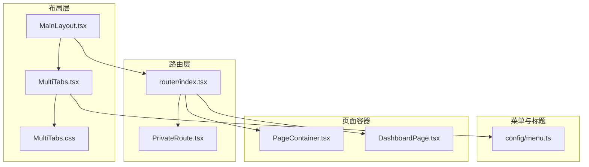
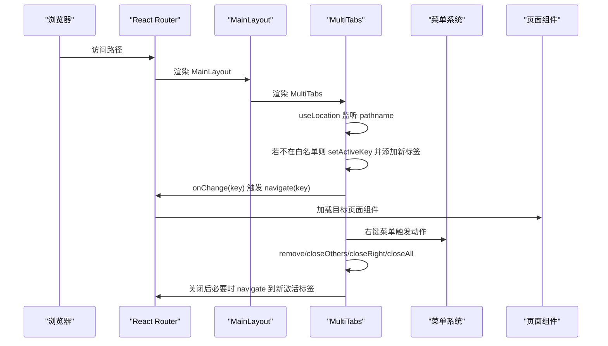
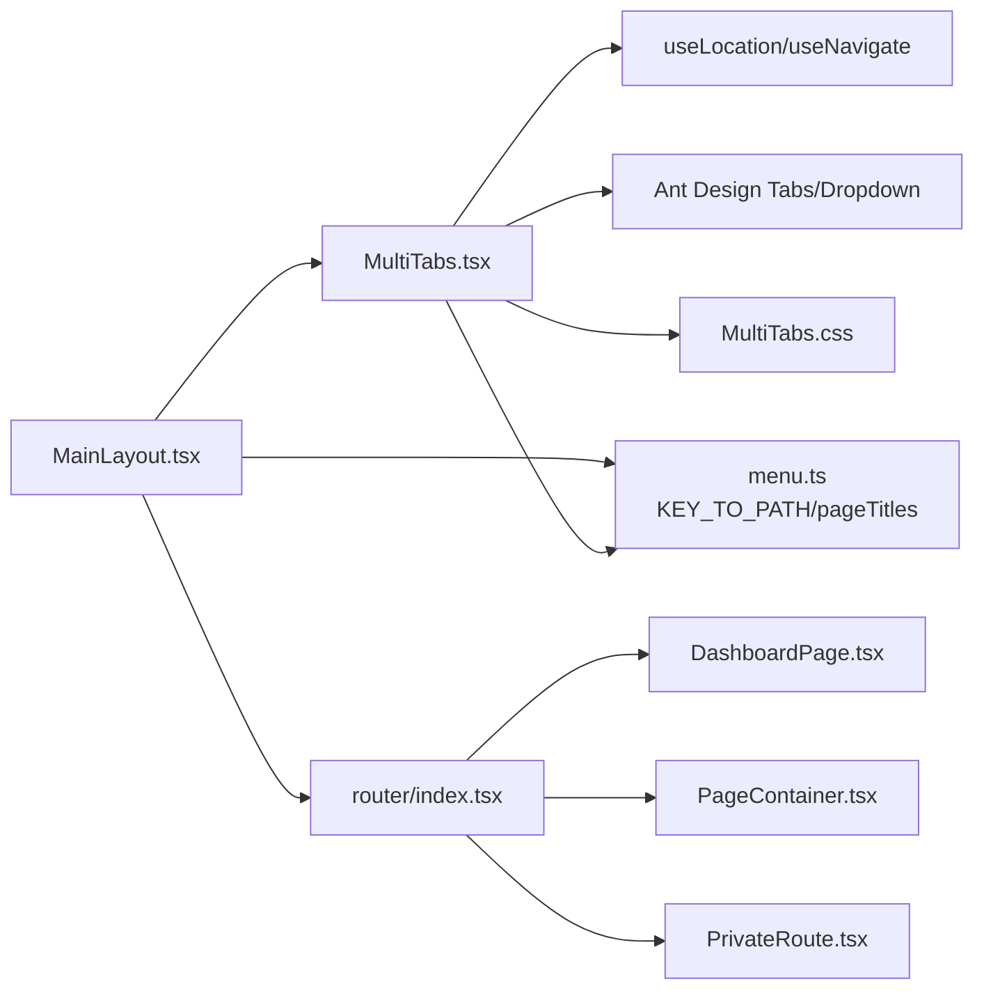

# 多标签页导航系统

<cite>
**本文引用的文件**
- [frontend/src/components/layout/MultiTabs.tsx](file://frontend/src/components/layout/MultiTabs.tsx)
- [frontend/src/components/layout/MultiTabs.css](file://frontend/src/components/layout/MultiTabs.css)
- [frontend/src/config/menu.ts](file://frontend/src/config/menu.ts)
- [frontend/src/layouts/MainLayout.tsx](file://frontend/src/layouts/MainLayout.tsx)
- [frontend/src/router/index.tsx](file://frontend/src/router/index.tsx)
- [frontend/src/features/dashboard/pages/DashboardPage.tsx](file://frontend/src/features/dashboard/pages/DashboardPage.tsx)
- [frontend/src/components/PageContainer.tsx](file://frontend/src/components/PageContainer.tsx)
- [frontend/src/router/PrivateRoute.tsx](file://frontend/src/router/PrivateRoute.tsx)
</cite>

## 目录
1. [简介](#简介)
2. [项目结构](#项目结构)
3. [核心组件](#核心组件)
4. [架构总览](#架构总览)
5. [详细组件分析](#详细组件分析)
6. [依赖关系分析](#依赖关系分析)
7. [性能考量](#性能考量)
8. [故障排查指南](#故障排查指南)
9. [结论](#结论)

## 简介
本文件全面解析 MultiTabs 组件如何实现类似浏览器的多标签页导航功能。重点覆盖：
- 如何监听路由变化（useLocation）并动态添加、激活标签页
- 如何通过 onChange 回调实现标签页切换时的路由跳转
- onEdit 和 remove 函数如何处理标签页的关闭操作，以及关闭后激活标签的选择逻辑
- 右键上下文菜单的实现机制，包括“刷新”、“关闭当前/其他/右侧/全部”等操作
- tabLabels 如何通过 KEY_TO_PATH 查找对应页面标题
- 仪表盘标签不可关闭的设计意图与实现细节

## 项目结构
MultiTabs 位于前端布局层，作为主布局的一部分嵌入，负责将路由导航与标签页体验融合，提供类浏览器的多标签页交互。

图表来源
- [frontend/src/layouts/MainLayout.tsx](file://frontend/src/layouts/MainLayout.tsx#L270-L286)
- [frontend/src/components/layout/MultiTabs.tsx](file://frontend/src/components/layout/MultiTabs.tsx#L1-L165)
- [frontend/src/components/layout/MultiTabs.css](file://frontend/src/components/layout/MultiTabs.css#L1-L194)
- [frontend/src/config/menu.ts](file://frontend/src/config/menu.ts#L1-L313)
- [frontend/src/router/index.tsx](file://frontend/src/router/index.tsx#L165-L256)
- [frontend/src/router/PrivateRoute.tsx](file://frontend/src/router/PrivateRoute.tsx#L1-L16)
- [frontend/src/features/dashboard/pages/DashboardPage.tsx](file://frontend/src/features/dashboard/pages/DashboardPage.tsx#L1-L98)
- [frontend/src/components/PageContainer.tsx](file://frontend/src/components/PageContainer.tsx#L1-L82)

章节来源
- [frontend/src/layouts/MainLayout.tsx](file://frontend/src/layouts/MainLayout.tsx#L270-L286)
- [frontend/src/router/index.tsx](file://frontend/src/router/index.tsx#L165-L256)

## 核心组件
- MultiTabs：基于 Ant Design Tabs 的可编辑卡片式标签页，监听路由变化动态增删标签，支持右键上下文菜单。
- MainLayout：应用主布局，包含侧边栏、头部、内容区与 MultiTabs。
- 路由系统：基于 react-router-dom 的懒加载路由，支持预加载与私有路由保护。
- 菜单与标题：通过 KEY_TO_PATH 将菜单 key 映射到路径，pageTitles 提供页面标题。

章节来源
- [frontend/src/components/layout/MultiTabs.tsx](file://frontend/src/components/layout/MultiTabs.tsx#L1-L165)
- [frontend/src/config/menu.ts](file://frontend/src/config/menu.ts#L1-L313)
- [frontend/src/router/index.tsx](file://frontend/src/router/index.tsx#L1-L256)
- [frontend/src/layouts/MainLayout.tsx](file://frontend/src/layouts/MainLayout.tsx#L1-L286)

## 架构总览
MultiTabs 与路由系统的交互流程如下：

图表来源
- [frontend/src/components/layout/MultiTabs.tsx](file://frontend/src/components/layout/MultiTabs.tsx#L1-L165)
- [frontend/src/layouts/MainLayout.tsx](file://frontend/src/layouts/MainLayout.tsx#L120-L175)
- [frontend/src/router/index.tsx](file://frontend/src/router/index.tsx#L165-L256)
- [frontend/src/config/menu.ts](file://frontend/src/config/menu.ts#L249-L313)

## 详细组件分析

### MultiTabs 组件实现要点
- 路由监听与动态添加标签
  - 使用 useLocation 获取当前路径，过滤掉根路径与登录页，然后 setActiveKey 并检查是否已有该标签；若无则根据 KEY_TO_PATH 查找对应的菜单 key，再从 pageTitles 获取标题，最后添加一个可关闭的新标签。
- 标签页切换与路由跳转
  - onChange 接收当前激活的 key，直接调用 navigate(key) 实现路由跳转。
- 关闭标签与激活选择逻辑
  - onEdit 在 action 为 remove 时调用 remove(targetKey)。
  - remove(targetKey) 执行以下步骤：
    - 定位目标索引并过滤出新的 items。
    - 如果存在新标签且被关闭的是当前激活标签，则选择“目标索引处或末尾”的前一个标签作为新的 activeKey，并调用 navigate(key)。
    - 最后更新 items。
- 右键上下文菜单
  - renderTabLabel 包裹在 Dropdown 中，触发方式为 contextMenu。
  - 菜单项包括：刷新、关闭当前、关闭其他、关闭右侧、关闭全部。
  - 对应 handleMenuClick 的行为：
    - 刷新：navigate(0) 触发浏览器刷新。
    - 关闭当前：remove(key)。
    - 关闭其他：仅保留当前标签与仪表盘，若当前不是激活标签则切换并跳转。
    - 关闭右侧：保留当前标签及左侧所有标签，若当前激活标签在右侧则切换并跳转。
    - 关闭全部：仅保留仪表盘，切换并跳转至仪表盘。
- 标题映射与仪表盘不可关闭
  - tabLabels 通过 KEY_TO_PATH 查找对应页面标题：先在 KEY_TO_PATH 中按值（路径）查找 key，再从 pageTitles 中取标题；若找不到则使用默认标题。
  - 仪表盘标签初始化时 closable=false，确保其不可关闭。

章节来源
- [frontend/src/components/layout/MultiTabs.tsx](file://frontend/src/components/layout/MultiTabs.tsx#L1-L165)
- [frontend/src/config/menu.ts](file://frontend/src/config/menu.ts#L1-L62)
- [frontend/src/config/menu.ts](file://frontend/src/config/menu.ts#L249-L313)

### MultiTabs 样式与交互
- 样式方面，MultiTabs.css 为标签页提供了粘性定位、悬停与激活态样式、关闭按钮与更多菜单的 hover 效果，以及深色主题适配。
- 交互方面，editable-card 类型的 Tabs 支持 onEdit/remove 动作，hideAdd 防止手动新增标签。

章节来源
- [frontend/src/components/layout/MultiTabs.css](file://frontend/src/components/layout/MultiTabs.css#L1-L194)

### 菜单与标题映射
- KEY_TO_PATH：将菜单 key 映射到完整路径，用于在 MultiTabs 中根据路径查找对应的菜单 key，从而获取页面标题。
- pageTitles：提供菜单 key 对应的中文标题，用于展示在标签页上。
- PATH_TO_KEY：反向映射，用于在 MainLayout 中根据路径高亮选中菜单项。

章节来源
- [frontend/src/config/menu.ts](file://frontend/src/config/menu.ts#L1-L62)
- [frontend/src/config/menu.ts](file://frontend/src/config/menu.ts#L249-L313)

### 主布局与路由集成
- MainLayout 将 MultiTabs 嵌入布局顶部，同时维护菜单点击与高亮逻辑，菜单点击会通过 KEY_TO_PATH 转换为路径并触发导航。
- 路由系统采用懒加载与预加载策略，支持私有路由保护（未认证自动跳转登录）。

章节来源
- [frontend/src/layouts/MainLayout.tsx](file://frontend/src/layouts/MainLayout.tsx#L120-L175)
- [frontend/src/router/index.tsx](file://frontend/src/router/index.tsx#L1-L256)
- [frontend/src/router/PrivateRoute.tsx](file://frontend/src/router/PrivateRoute.tsx#L1-L16)

### 页面容器与仪表盘
- PageContainer 提供页面头部、面包屑与错误边界封装。
- DashboardPage 作为仪表盘页面，配合路由系统与 MultiTabs 形成完整的导航体验。

章节来源
- [frontend/src/components/PageContainer.tsx](file://frontend/src/components/PageContainer.tsx#L1-L82)
- [frontend/src/features/dashboard/pages/DashboardPage.tsx](file://frontend/src/features/dashboard/pages/DashboardPage.tsx#L1-L98)

## 依赖关系分析

图表来源
- [frontend/src/components/layout/MultiTabs.tsx](file://frontend/src/components/layout/MultiTabs.tsx#L1-L165)
- [frontend/src/config/menu.ts](file://frontend/src/config/menu.ts#L1-L313)
- [frontend/src/layouts/MainLayout.tsx](file://frontend/src/layouts/MainLayout.tsx#L1-L286)
- [frontend/src/router/index.tsx](file://frontend/src/router/index.tsx#L1-L256)
- [frontend/src/features/dashboard/pages/DashboardPage.tsx](file://frontend/src/features/dashboard/pages/DashboardPage.tsx#L1-L98)
- [frontend/src/components/PageContainer.tsx](file://frontend/src/components/PageContainer.tsx#L1-L82)
- [frontend/src/router/PrivateRoute.tsx](file://frontend/src/router/PrivateRoute.tsx#L1-L16)

## 性能考量
- 懒加载与预加载：路由系统对大量页面组件进行懒加载，并在菜单 hover 时预加载目标路由组件，降低首次访问延迟。
- 标签页数量控制：通过右键菜单的“关闭其他/右侧/全部”可快速清理标签，避免过多标签导致内存与渲染压力。
- 仪表盘不可关闭：保证用户始终可回到首页，减少不必要的导航成本。

章节来源
- [frontend/src/router/index.tsx](file://frontend/src/router/index.tsx#L1-L256)
- [frontend/src/components/layout/MultiTabs.tsx](file://frontend/src/components/layout/MultiTabs.tsx#L70-L103)

## 故障排查指南
- 标签页标题为空或显示“未命名页面”
  - 检查 KEY_TO_PATH 是否包含当前路径；若不存在，将无法通过路径查找菜单 key，进而无法从 pageTitles 获取标题。
  - 确认路由路径与 KEY_TO_PATH 的映射一致。
- 仪表盘标签无法关闭
  - 该行为为设计预期：初始化时 closable=false，确保用户始终可回到仪表盘。
- 右键菜单“关闭当前”不可用
  - 当前标签 closable=false 时，菜单项会被禁用；确认目标标签是否为仪表盘或其他不可关闭标签。
- 切换标签后页面未更新
  - 确认 onChange 已正确调用 navigate(key)，且路由配置中存在该路径的页面组件。
- 刷新无效
  - “刷新”通过 navigate(0) 触发浏览器刷新，若页面仍不更新，检查页面组件是否正确响应路由参数或是否存在缓存。

章节来源
- [frontend/src/components/layout/MultiTabs.tsx](file://frontend/src/components/layout/MultiTabs.tsx#L1-L165)
- [frontend/src/config/menu.ts](file://frontend/src/config/menu.ts#L249-L313)
- [frontend/src/router/index.tsx](file://frontend/src/router/index.tsx#L165-L256)

## 结论
MultiTabs 通过监听路由变化、动态增删标签、结合右键上下文菜单与标题映射，实现了接近浏览器的多标签页导航体验。其关键设计点包括：
- 使用 KEY_TO_PATH 与 pageTitles 将路径映射为页面标题，保证标签页标题一致性。
- 仪表盘标签不可关闭，确保用户始终可回到首页。
- 通过 onChange 与 navigate 实现标签切换即路由跳转，保持 UI 与 URL 同步。
- 右键菜单提供“刷新/关闭当前/其他/右侧/全部”，满足复杂场景下的标签页管理需求。