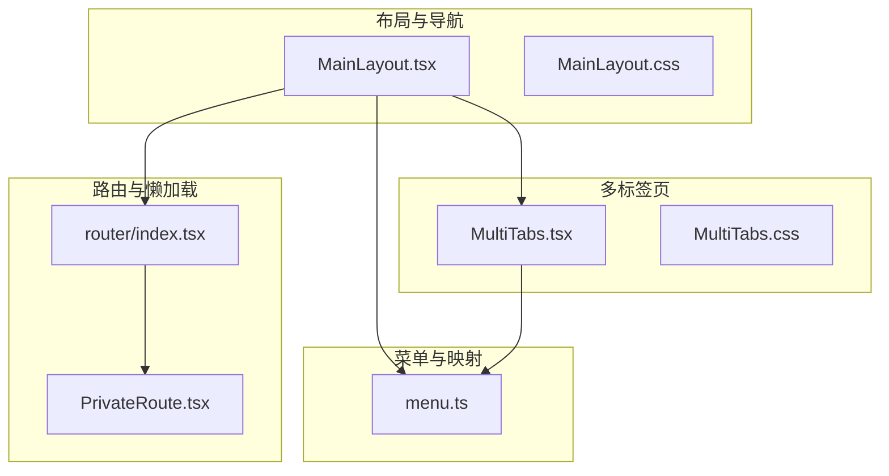
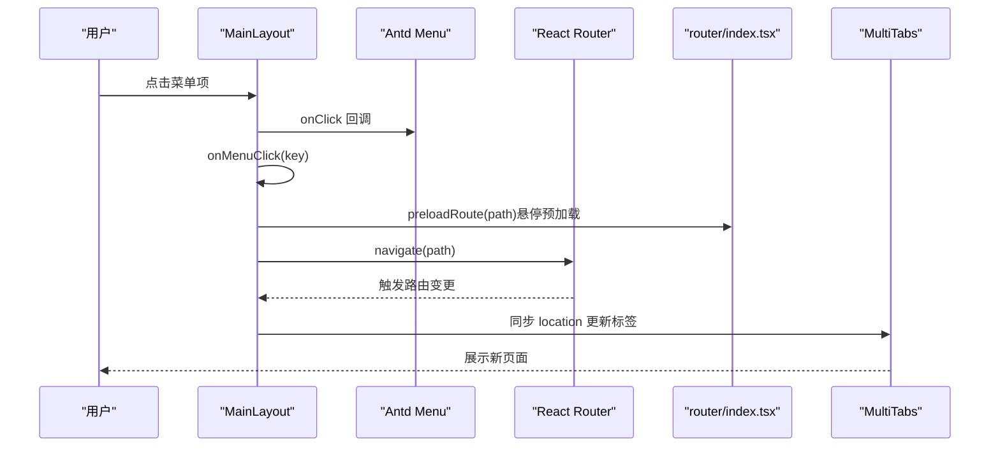
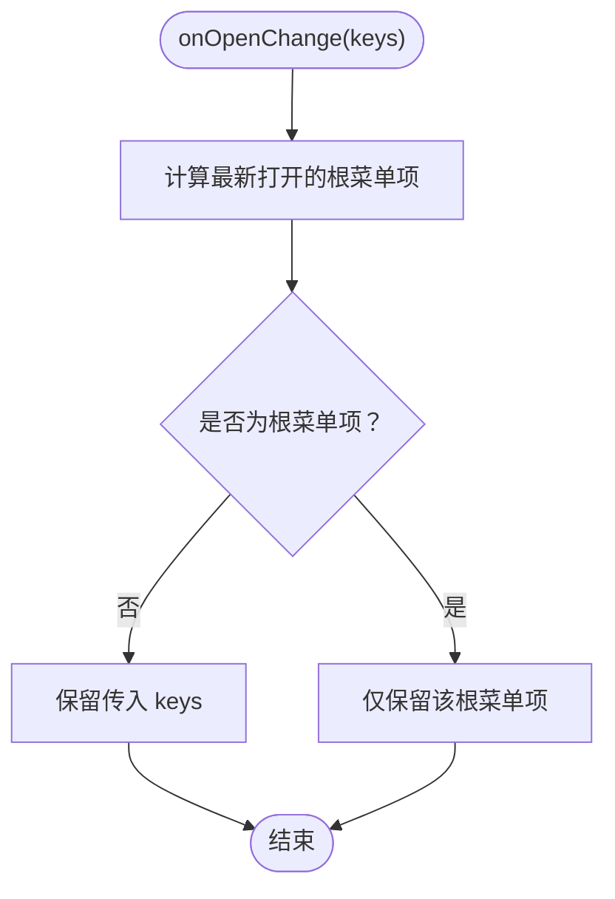
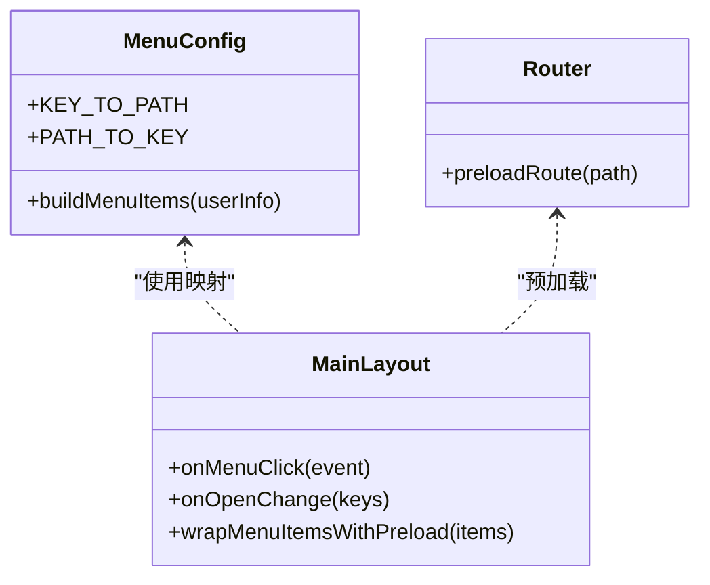
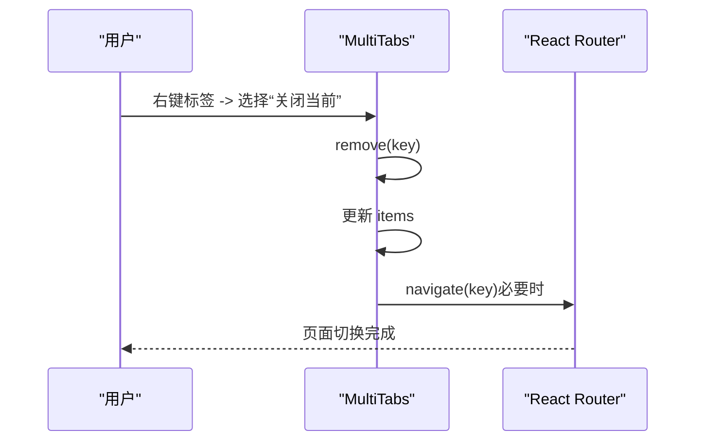
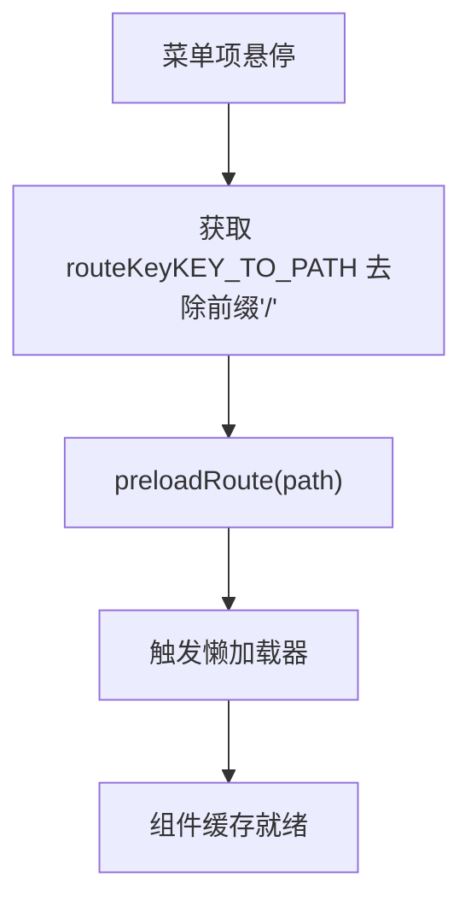
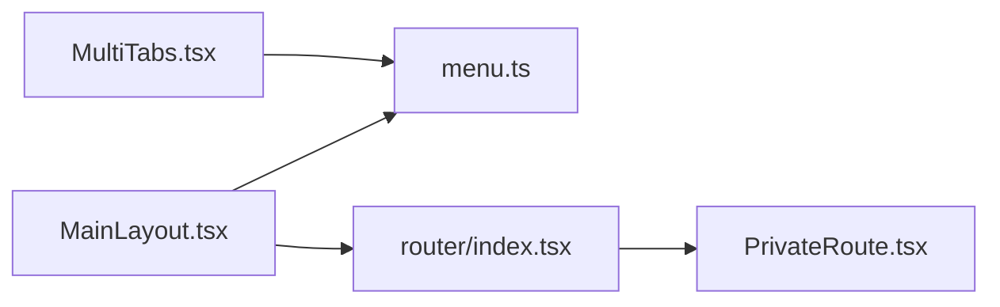

# 导航布局与菜单集成

<cite>
**本文引用的文件**
- [MainLayout.tsx](file://frontend/src/layouts/MainLayout.tsx)
- [menu.ts](file://frontend/src/config/menu.ts)
- [MultiTabs.tsx](file://frontend/src/components/layout/MultiTabs.tsx)
- [router/index.tsx](file://frontend/src/router/index.tsx)
- [PrivateRoute.tsx](file://frontend/src/router/PrivateRoute.tsx)
- [MainLayout.css](file://frontend/src/layouts/MainLayout.css)
- [MultiTabs.css](file://frontend/src/components/layout/MultiTabs.css)
</cite>

## 目录
1. [引言](#引言)
2. [项目结构](#项目结构)
3. [核心组件](#核心组件)
4. [架构总览](#架构总览)
5. [详细组件分析](#详细组件分析)
6. [依赖关系分析](#依赖关系分析)
7. [性能考量](#性能考量)
8. [故障排查指南](#故障排查指南)
9. [结论](#结论)

## 引言
本文聚焦前端导航布局与菜单集成，围绕 MainLayout 组件如何与路由系统协同工作，重点阐述以下要点：
- onMenuClick 事件处理器如何根据菜单 key 匹配 KEY_TO_PATH 映射并触发 navigate 实现页面跳转；
- onOpenChange 对菜单展开状态的控制逻辑，特别是根菜单项的单展开行为；
- wrapMenuItemsWithPreload 函数如何在鼠标悬停时预加载对应路由组件以优化性能；
- MultiTabs 组件如何实现多标签页导航，包括刷新、关闭当前/其他/右侧/全部标签等上下文菜单操作，并说明其与路由系统的协同方式。

## 项目结构
导航与布局相关的核心文件组织如下：
- 布局与导航：MainLayout.tsx、MainLayout.css
- 菜单配置与映射：menu.ts（包含 buildMenuItems、KEY_TO_PATH、PATH_TO_KEY）
- 多标签页：MultiTabs.tsx、MultiTabs.css
- 路由与懒加载：router/index.tsx（含 preloadRoute）、PrivateRoute.tsx（鉴权守卫）

图表来源
- [MainLayout.tsx](file://frontend/src/layouts/MainLayout.tsx#L1-L286)
- [menu.ts](file://frontend/src/config/menu.ts#L1-L313)
- [MultiTabs.tsx](file://frontend/src/components/layout/MultiTabs.tsx#L1-L165)
- [router/index.tsx](file://frontend/src/router/index.tsx#L1-L256)
- [PrivateRoute.tsx](file://frontend/src/router/PrivateRoute.tsx#L1-L16)

章节来源
- [MainLayout.tsx](file://frontend/src/layouts/MainLayout.tsx#L1-L286)
- [menu.ts](file://frontend/src/config/menu.ts#L1-L313)
- [MultiTabs.tsx](file://frontend/src/components/layout/MultiTabs.tsx#L1-L165)
- [router/index.tsx](file://frontend/src/router/index.tsx#L1-L256)
- [PrivateRoute.tsx](file://frontend/src/router/PrivateRoute.tsx#L1-L16)

## 核心组件
- MainLayout：提供侧边菜单、头部用户下拉、内容区域与多标签页容器；负责菜单点击跳转、菜单展开控制、菜单项预加载包装。
- menu.ts：构建动态菜单树、维护 KEY_TO_PATH/PATH_TO_KEY 映射。
- MultiTabs：基于 react-router-dom 的 Tabs 实现多标签页导航，支持右键上下文菜单操作。
- router/index.tsx：定义路由表、懒加载映射、预加载函数 preloadRoute。
- PrivateRoute：鉴权守卫，确保受保护路由仅在登录状态下访问。

章节来源
- [MainLayout.tsx](file://frontend/src/layouts/MainLayout.tsx#L1-L286)
- [menu.ts](file://frontend/src/config/menu.ts#L1-L313)
- [MultiTabs.tsx](file://frontend/src/components/layout/MultiTabs.tsx#L1-L165)
- [router/index.tsx](file://frontend/src/router/index.tsx#L1-L256)
- [PrivateRoute.tsx](file://frontend/src/router/PrivateRoute.tsx#L1-L16)

## 架构总览
MainLayout 作为顶层布局，承载菜单、头部与内容区域；MultiTabs 置于 Header 下方，作为页面级标签容器；路由系统通过 createBrowserRouter 定义各页面懒加载组件；menu.ts 提供菜单树与 key/path 映射；preloadRoute 在用户悬停时预取目标组件，降低首次渲染延迟。

图表来源
- [MainLayout.tsx](file://frontend/src/layouts/MainLayout.tsx#L120-L186)
- [router/index.tsx](file://frontend/src/router/index.tsx#L144-L154)
- [MultiTabs.tsx](file://frontend/src/components/layout/MultiTabs.tsx#L22-L46)

## 详细组件分析

### MainLayout 导航与菜单集成
- 菜单高亮与选中
  - 使用 PATH_TO_KEY 将当前路径映射为菜单 key，设置 selectedKeys，确保菜单与当前路由一致。
- 菜单点击跳转
  - onMenuClick 接收菜单 key，优先从 KEY_TO_PATH 获取完整路径，否则回退为 “/” + key，若当前路径不同则启动进度条并调用 navigate。
- 菜单展开控制（手风琴）
  - onOpenChange 记录 openKeys，计算最新打开的根菜单项（一级菜单）。若最新打开的是根菜单，则强制仅保留该根菜单展开，实现“单根菜单展开”的手风琴效果；否则保留传入 keys。
- 菜单项预加载包装
  - wrapMenuItemsWithPreload 递归包装菜单项，在 label 外层包裹一个 div 并监听 onMouseEnter，当悬停时调用 preloadRoute(routeKey)，routeKey 优先使用 KEY_TO_PATH 中的值去掉开头 “/” 的路径形式，从而触发对应懒加载模块的预取。
- 折叠态悬停展开
  - 通过 handleSiderMouseEnter/handleSiderMouseLeave 控制 hoverExpanded，配合 hover overlay 渲染完整菜单，提升折叠态下的交互流畅度。

图表来源
- [MainLayout.tsx](file://frontend/src/layouts/MainLayout.tsx#L132-L148)

章节来源
- [MainLayout.tsx](file://frontend/src/layouts/MainLayout.tsx#L37-L45)
- [MainLayout.tsx](file://frontend/src/layouts/MainLayout.tsx#L123-L131)
- [MainLayout.tsx](file://frontend/src/layouts/MainLayout.tsx#L132-L148)
- [MainLayout.tsx](file://frontend/src/layouts/MainLayout.tsx#L150-L186)
- [menu.ts](file://frontend/src/config/menu.ts#L249-L313)
- [router/index.tsx](file://frontend/src/router/index.tsx#L144-L154)

### 菜单构建与映射
- buildMenuItems：按用户权限动态生成菜单树，包含多个一级分组（我的工作台、财务管理、人力资源、站点管理、资产管理、报表中心、系统设置），每个分组下可能包含二级子菜单。
- KEY_TO_PATH/PATH_TO_KEY：提供菜单 key 到路径的双向映射，用于菜单高亮与跳转。

图表来源
- [menu.ts](file://frontend/src/config/menu.ts#L64-L247)
- [menu.ts](file://frontend/src/config/menu.ts#L249-L313)
- [MainLayout.tsx](file://frontend/src/layouts/MainLayout.tsx#L123-L186)
- [router/index.tsx](file://frontend/src/router/index.tsx#L144-L154)

章节来源
- [menu.ts](file://frontend/src/config/menu.ts#L64-L247)
- [menu.ts](file://frontend/src/config/menu.ts#L249-L313)

### 多标签页导航（MultiTabs）
- 标签同步
  - 监听 location 变化，当路径变化且非根或登录页时，设置 activeKey 并尝试根据 PATH_TO_KEY 找到对应菜单 key，再从 pageTitles 获取标题，若找不到则使用默认标题，创建新的可关闭标签。
- 切换与关闭
  - onChange 直接调用 navigate 切换标签；
  - onEdit 当 action 为 remove 时执行 remove，移除目标标签，若当前激活标签被移除则选择相邻标签并导航。
- 上下文菜单操作
  - 刷新：navigate(0) 触发浏览器刷新；
  - 关闭当前：remove(key)；
  - 关闭其他：仅保留当前标签与仪表盘；
  - 关闭右侧：截取当前标签右侧部分；
  - 关闭全部：仅保留仪表盘并导航至仪表盘。

图表来源
- [MultiTabs.tsx](file://frontend/src/components/layout/MultiTabs.tsx#L48-L103)

章节来源
- [MultiTabs.tsx](file://frontend/src/components/layout/MultiTabs.tsx#L14-L164)
- [menu.ts](file://frontend/src/config/menu.ts#L1-L62)
- [menu.ts](file://frontend/src/config/menu.ts#L249-L313)

### 路由系统与懒加载
- 路由表：router/index.tsx 定义了完整的路由表，涵盖系统、财务、站点、资产、HR、报表、我的中心等模块，并对每个路径绑定对应的懒加载组件。
- 预加载：preloadRoute(path) 根据路径从 loaders 映射中取出对应 loader 并立即调用，提前触发模块打包与下载，减少首次渲染等待。
- 鉴权守卫：PrivateRoute 在渲染受保护路由前检查认证状态，未通过则重定向到登录页。

图表来源
- [MainLayout.tsx](file://frontend/src/layouts/MainLayout.tsx#L160-L176)
- [router/index.tsx](file://frontend/src/router/index.tsx#L144-L154)

章节来源
- [router/index.tsx](file://frontend/src/router/index.tsx#L1-L256)
- [router/index.tsx](file://frontend/src/router/index.tsx#L144-L154)
- [PrivateRoute.tsx](file://frontend/src/router/PrivateRoute.tsx#L1-L16)

## 依赖关系分析
- MainLayout 依赖 menu.ts 的菜单构建与映射，依赖 router/index.tsx 的 preloadRoute 与路由表；
- MultiTabs 依赖 menu.ts 的 KEY_TO_PATH/PATH_TO_KEY 与 pageTitles，用于标签标题解析；
- 路由系统通过 createBrowserRouter 组织页面，结合 PrivateRoute 实现鉴权。

图表来源
- [MainLayout.tsx](file://frontend/src/layouts/MainLayout.tsx#L1-L286)
- [menu.ts](file://frontend/src/config/menu.ts#L1-L313)
- [MultiTabs.tsx](file://frontend/src/components/layout/MultiTabs.tsx#L1-L165)
- [router/index.tsx](file://frontend/src/router/index.tsx#L1-L256)
- [PrivateRoute.tsx](file://frontend/src/router/PrivateRoute.tsx#L1-L16)

章节来源
- [MainLayout.tsx](file://frontend/src/layouts/MainLayout.tsx#L1-L286)
- [MultiTabs.tsx](file://frontend/src/components/layout/MultiTabs.tsx#L1-L165)
- [router/index.tsx](file://frontend/src/router/index.tsx#L1-L256)
- [PrivateRoute.tsx](file://frontend/src/router/PrivateRoute.tsx#L1-L16)

## 性能考量
- 菜单悬停预加载：通过 wrapMenuItemsWithPreload 在 onMouseEnter 时调用 preloadRoute，提前触发懒加载，显著降低首屏渲染延迟。
- 折叠态 hover overlay：折叠态下使用 hover overlay 渲染完整菜单，避免频繁状态切换带来的重排与重绘，提升交互流畅度。
- 菜单动画禁用：主菜单与 overlay 菜单均禁用过渡动画，减少大量节点同时过渡造成的卡顿。
- 多标签页懒加载：MultiTabs 本身不直接懒加载页面，但与路由懒加载配合，确保标签切换时页面组件已就绪。

章节来源
- [MainLayout.tsx](file://frontend/src/layouts/MainLayout.tsx#L150-L186)
- [MainLayout.css](file://frontend/src/layouts/MainLayout.css#L30-L71)
- [MainLayout.css](file://frontend/src/layouts/MainLayout.css#L118-L127)

## 故障排查指南
- 菜单点击无反应
  - 检查 onMenuClick 是否正确匹配 KEY_TO_PATH；确认当前路径与目标路径不同才触发 navigate。
  - 章节来源
    - [MainLayout.tsx](file://frontend/src/layouts/MainLayout.tsx#L123-L131)
    - [menu.ts](file://frontend/src/config/menu.ts#L249-L313)
- 菜单无法手风琴展开
  - 检查 onOpenChange 的根菜单判断逻辑，确认传入 keys 是否包含根菜单项。
  - 章节来源
    - [MainLayout.tsx](file://frontend/src/layouts/MainLayout.tsx#L132-L148)
- 预加载无效
  - 确认 wrapMenuItemsWithPreload 是否正确包裹 label 并在 onMouseEnter 调用 preloadRoute；检查 KEY_TO_PATH 中是否存在对应映射。
  - 章节来源
    - [MainLayout.tsx](file://frontend/src/layouts/MainLayout.tsx#L150-L186)
    - [router/index.tsx](file://frontend/src/router/index.tsx#L144-L154)
- 多标签页标题异常
  - 检查 PATH_TO_KEY 与 pageTitles 是否存在对应映射；若不存在则使用默认标题。
  - 章节来源
    - [MultiTabs.tsx](file://frontend/src/components/layout/MultiTabs.tsx#L22-L46)
    - [menu.ts](file://frontend/src/config/menu.ts#L1-L62)
    - [menu.ts](file://frontend/src/config/menu.ts#L249-L313)
- 登录态失效导致页面无法访问
  - 检查 PrivateRoute 的鉴权逻辑，确认 isAuthenticated、token、userInfo 是否齐全。
  - 章节来源
    - [PrivateRoute.tsx](file://frontend/src/router/PrivateRoute.tsx#L1-L16)

## 结论
MainLayout 通过菜单 key 与路径映射、手风琴展开控制、悬停预加载与多标签页协同，构建了高效、流畅的导航体系。配合路由懒加载与鉴权守卫，既保证了用户体验，又兼顾了性能与安全性。MultiTabs 的上下文菜单进一步提升了多页面场景下的操作效率，与路由系统无缝衔接。