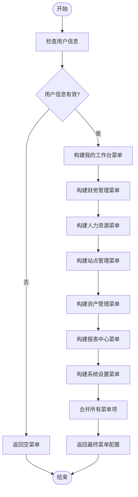
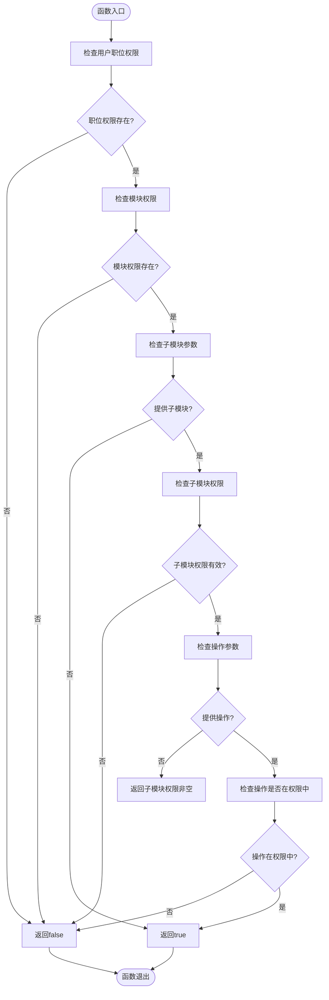
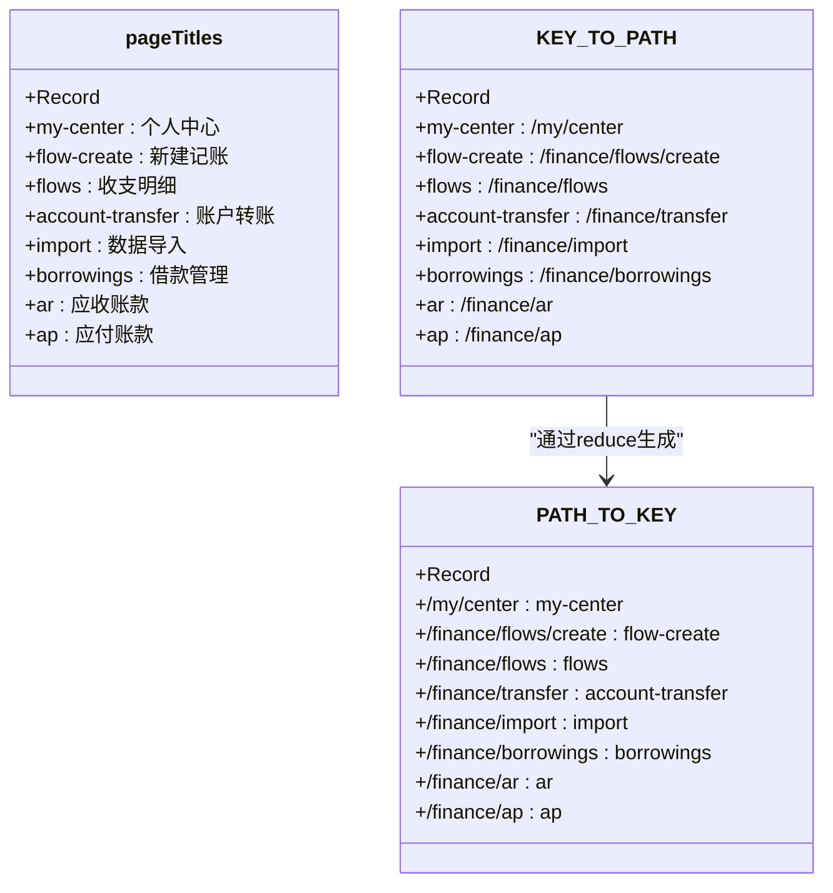
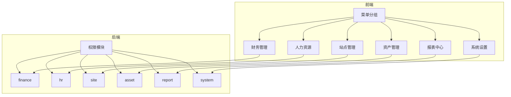
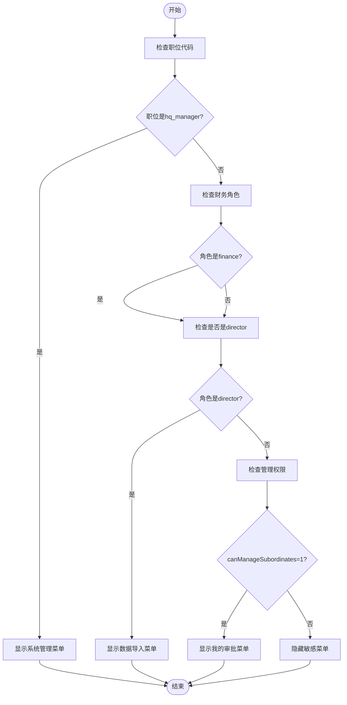
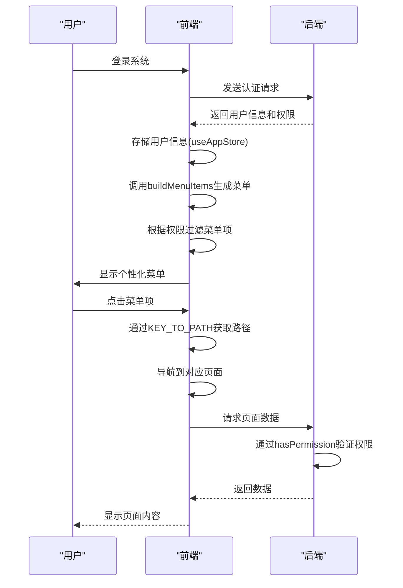

# 菜单配置与权限控制

<cite>
**本文档引用文件**  
- [menu.ts](file://frontend/src/config/menu.ts)
- [permissions.ts](file://frontend/src/utils/permissions.ts)
- [menuIcons.tsx](file://frontend/src/config/menuIcons.tsx)
- [useAppStore.ts](file://frontend/src/store/useAppStore.ts)
- [MainLayout.tsx](file://frontend/src/layouts/MainLayout.tsx)
- [router/index.tsx](file://frontend/src/router/index.tsx)
- [PermissionService.ts](file://backend/src/services/PermissionService.ts)
- [position-permissions.ts](file://backend/src/routes/v2/position-permissions.ts)
- [permissions.ts](file://backend/src/utils/permissions.ts)
- [permission.ts](file://backend/src/middleware/permission.ts)
- [PrivateRoute.tsx](file://frontend/src/router/PrivateRoute.tsx)
</cite>

## 目录
1. [菜单系统概述](#菜单系统概述)
2. [动态菜单生成机制](#动态菜单生成机制)
3. [权限控制实现](#权限控制实现)
4. [页面标题与路径映射](#页面标题与路径映射)
5. [菜单分组与后端权限体系](#菜单分组与后端权限体系)
6. [敏感菜单项访问控制](#敏感菜单项访问控制)
7. [系统架构与数据流](#系统架构与数据流)

## 菜单系统概述

本系统采用基于用户角色和权限的动态菜单生成机制，通过前端配置与后端权限体系的紧密结合，实现细粒度的菜单可见性控制。菜单系统主要由以下几个核心组件构成：`buildMenuItems`函数负责根据用户权限动态生成菜单项；`hasPermission`工具函数实现权限检查；`pageTitles`对象为每个路由提供友好的页面标题；`KEY_TO_PATH`和`PATH_TO_KEY`双向映射表实现菜单key与URL路径的精准转换。

**Section sources**
- [menu.ts](file://frontend/src/config/menu.ts#L5-L313)

## 动态菜单生成机制

`buildMenuItems`函数是菜单系统的核心，它根据用户信息动态生成菜单项。该函数接收用户信息作为参数，返回符合用户权限的菜单配置。菜单生成过程遵循以下逻辑：

1. **我的工作台**：对所有用户可见，包含个人中心、请假、报销等基础功能。
2. **财务管理**：根据用户在财务模块的权限动态显示相关菜单项，如新建记账、收支明细等。
3. **人力资源**：根据用户职位和权限显示相应的HR功能，如人员管理、薪资发放等。
4. **站点管理**：根据用户对站点信息和账单的查看权限决定是否显示相关菜单。
5. **资产管理**：根据用户对固定资产和租房管理的权限动态生成菜单。
6. **报表中心**：根据用户报表查看权限，分组显示财务、往来和运营报表。
7. **系统设置**：仅对具有相应权限的用户显示，如项目管理、权限管理等。

**Diagram sources**
- [menu.ts](file://frontend/src/config/menu.ts#L64-L247)

**Section sources**
- [menu.ts](file://frontend/src/config/menu.ts#L64-L247)

## 权限控制实现

权限控制通过`hasPermission`工具函数实现，该函数基于用户的职位权限系统进行权限检查。权限结构采用三级模型：模块（module）、子模块（subModule）和操作（action）。函数实现逻辑如下：

1. 首先检查用户职位是否存在权限配置。
2. 检查指定模块是否存在权限定义。
3. 如果只检查模块权限，则返回true。
4. 检查指定子模块是否存在权限定义。
5. 如果只检查子模块权限，则返回子模块权限数组是否非空。
6. 最后检查具体操作权限是否包含在权限数组中。

**Diagram sources**
- [permissions.ts](file://frontend/src/utils/permissions.ts#L21-L43)

**Section sources**
- [permissions.ts](file://frontend/src/utils/permissions.ts#L21-L43)
- [menu.ts](file://frontend/src/config/menu.ts#L2)

## 页面标题与路径映射

系统通过`pageTitles`对象为每个路由提供友好的页面标题，提升用户体验。同时，通过`KEY_TO_PATH`和`PATH_TO_KEY`双向映射表实现菜单key与URL路径的精准转换。

`pageTitles`对象定义了菜单key与中文标题的映射关系，如`'flow-create'`对应`'新建记账'`。这种设计使得页面标题的维护更加集中和方便。

`KEY_TO_PATH`映射表将菜单key转换为实际的URL路径，如`'flow-create'`映射到`'/finance/flows/create'`。`PATH_TO_KEY`则是反向映射，通过`Object.entries(KEY_TO_PATH).reduce`方法动态生成，实现了路径到菜单key的快速查找。

**Diagram sources**
- [menu.ts](file://frontend/src/config/menu.ts#L5-L313)

**Section sources**
- [menu.ts](file://frontend/src/config/menu.ts#L5-L313)

## 菜单分组与后端权限体系

菜单系统与后端权限体系紧密对应，形成了完整的权限控制闭环。前端菜单分组逻辑与后端权限模块一一对应：

1. **财务管理**：对应后端`finance`模块，包含`flow`、`transfer`、`borrowing`等子模块。
2. **人力资源**：对应后端`hr`模块，包含`employee`、`salary`、`leave`等子模块。
3. **站点管理**：对应后端`site`模块，包含`info`、`bill`等子模块。
4. **资产管理**：对应后端`asset`模块，包含`fixed`、`rental`等子模块。
5. **报表中心**：对应后端`report`模块，包含各类报表查看权限。
6. **系统设置**：对应后端`system`模块，包含`department`、`category`、`position`等子模块。

后端通过`PermissionService`类实现权限检查，结合用户职位层级和部门信息，确保数据访问的安全性。权限中间件`requirePermission`在路由层面进行权限验证，与前端菜单权限检查形成双重保障。

**Diagram sources**
- [menu.ts](file://frontend/src/config/menu.ts#L14-L61)
- [permissions.ts](file://backend/src/utils/permissions.ts#L99-L125)

**Section sources**
- [menu.ts](file://frontend/src/config/menu.ts#L14-L61)
- [permissions.ts](file://backend/src/utils/permissions.ts#L99-L125)
- [PermissionService.ts](file://backend/src/services/PermissionService.ts#L6-L147)

## 敏感菜单项访问控制

系统对敏感菜单项实施严格的访问控制策略，确保只有授权用户才能访问关键功能。主要控制策略包括：

1. **系统管理菜单**：只有`hq_manager`（总部主管）职位的用户才能看到权限管理、IP白名单、审计日志等敏感菜单项。
2. **数据导入功能**：需要同时具备财务权限和负责人权限，防止普通财务人员随意导入数据。
3. **财务基础数据管理**：整合为"财务设置"菜单，只有具有系统模块部门管理权限的用户才能访问。
4. **审批功能**：只有`canManageSubordinates`为1的管理者才能看到"我的审批"菜单。

这些控制策略通过前端`buildMenuItems`函数中的条件判断实现，与后端权限体系保持一致，形成前后端协同的权限控制机制。

**Diagram sources**
- [menu.ts](file://frontend/src/config/menu.ts#L236-L241)
- [menu.ts](file://frontend/src/config/menu.ts#L104-L106)
- [menu.ts](file://frontend/src/config/menu.ts#L76-L78)

**Section sources**
- [menu.ts](file://frontend/src/config/menu.ts#L236-L241)
- [menu.ts](file://frontend/src/config/menu.ts#L104-L106)
- [menu.ts](file://frontend/src/config/menu.ts#L76-L78)

## 系统架构与数据流

整个菜单系统的架构和数据流如下图所示：

**Diagram sources**
- [useAppStore.ts](file://frontend/src/store/useAppStore.ts#L43-L89)
- [MainLayout.tsx](file://frontend/src/layouts/MainLayout.tsx#L14-L286)
- [router/index.tsx](file://frontend/src/router/index.tsx#L165-L256)
- [permission.ts](file://backend/src/middleware/permission.ts#L12-L19)

**Section sources**
- [useAppStore.ts](file://frontend/src/store/useAppStore.ts#L43-L89)
- [MainLayout.tsx](file://frontend/src/layouts/MainLayout.tsx#L14-L286)
- [router/index.tsx](file://frontend/src/router/index.tsx#L165-L256)
- [permission.ts](file://backend/src/middleware/permission.ts#L12-L19)