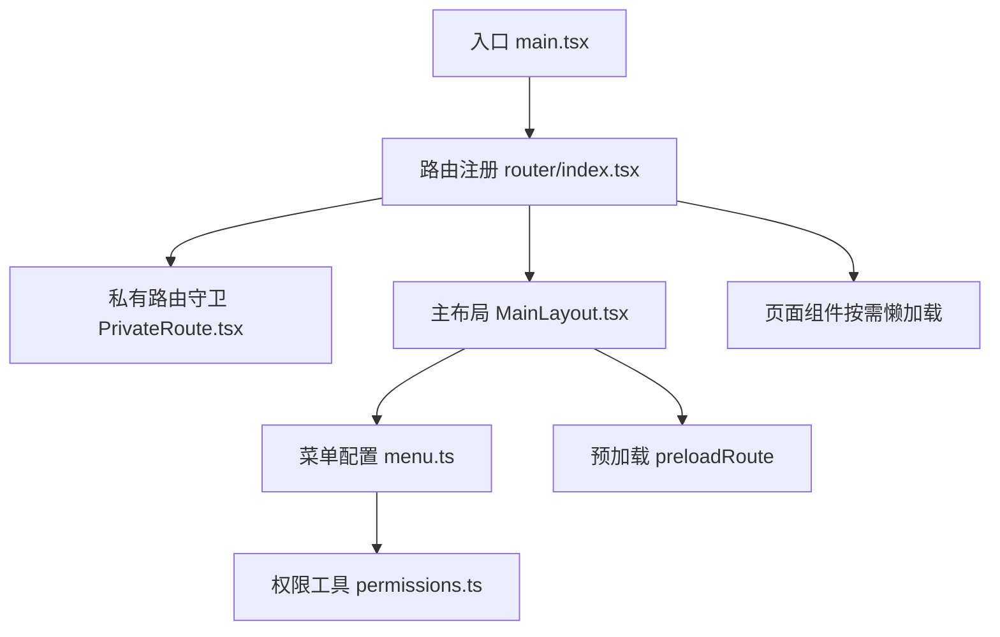
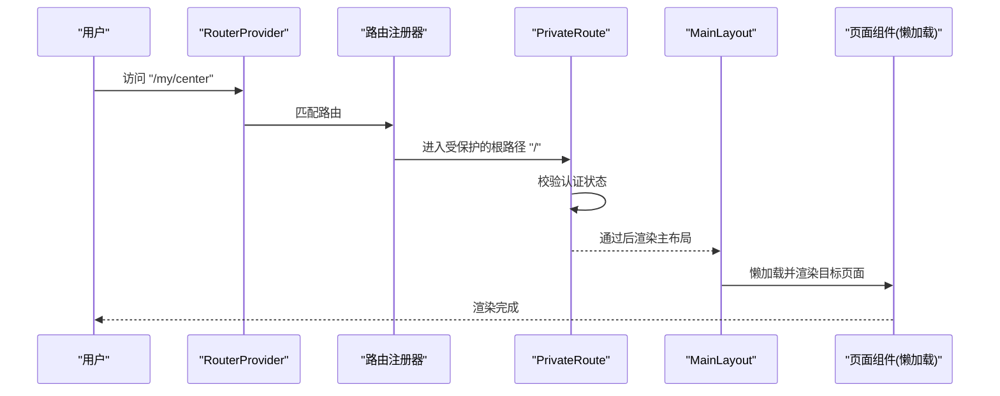
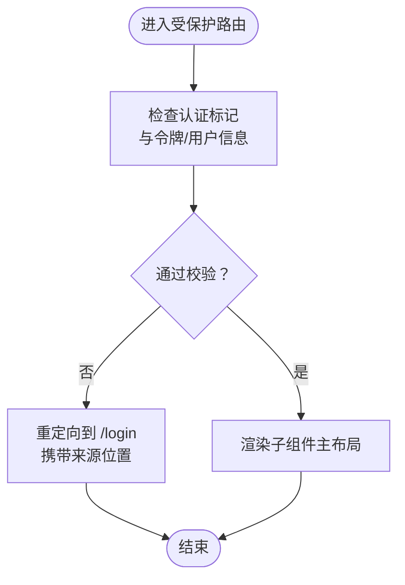
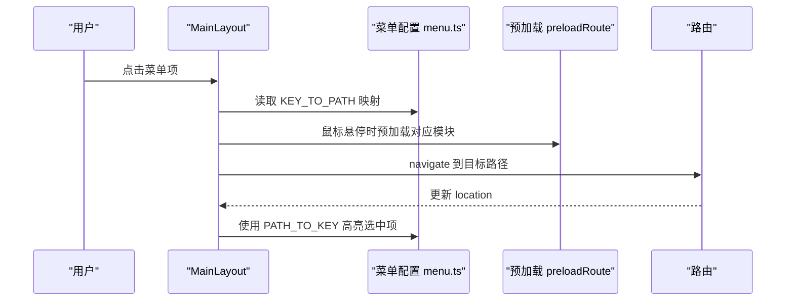
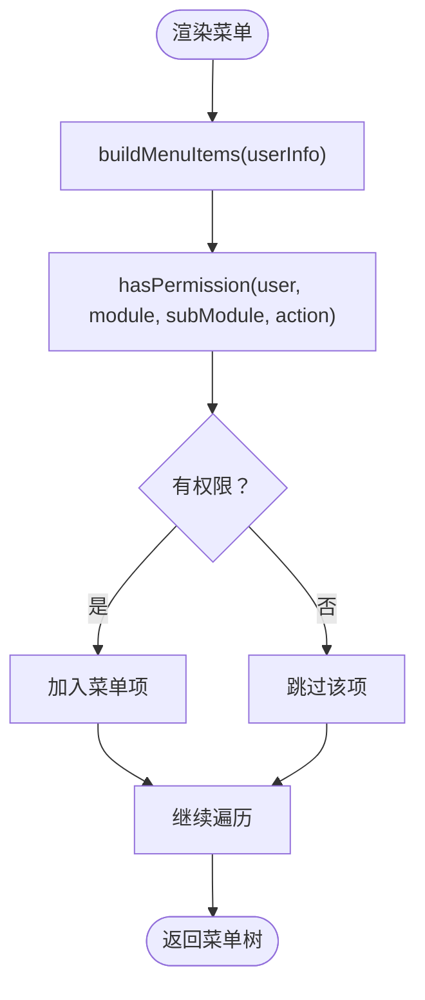
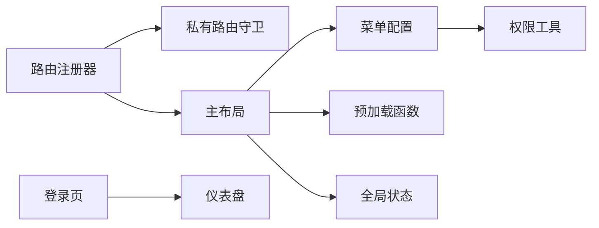

# 路由与导航

<cite>
**本文引用的文件**
- [frontend/src/main.tsx](file://frontend/src/main.tsx)
- [frontend/src/router/index.tsx](file://frontend/src/router/index.tsx)
- [frontend/src/router/PrivateRoute.tsx](file://frontend/src/router/PrivateRoute.tsx)
- [frontend/src/layouts/MainLayout.tsx](file://frontend/src/layouts/MainLayout.tsx)
- [frontend/src/config/menu.ts](file://frontend/src/config/menu.ts)
- [frontend/src/utils/permissions.ts](file://frontend/src/utils/permissions.ts)
- [frontend/src/store/useAppStore.ts](file://frontend/src/store/useAppStore.ts)
- [frontend/src/features/auth/pages/LoginPage.tsx](file://frontend/src/features/auth/pages/LoginPage.tsx)
- [frontend/src/features/dashboard/pages/DashboardPage.tsx](file://frontend/src/features/dashboard/pages/DashboardPage.tsx)
</cite>

## 目录
1. [简介](#简介)
2. [项目结构](#项目结构)
3. [核心组件](#核心组件)
4. [架构总览](#架构总览)
5. [详细组件分析](#详细组件分析)
6. [依赖关系分析](#依赖关系分析)
7. [性能考量](#性能考量)
8. [故障排查指南](#故障排查指南)
9. [结论](#结论)
10. [附录](#附录)

## 简介
本文件围绕基于 React Router 的前端路由体系进行系统性梳理，重点说明：
- 路由注册机制与懒加载策略
- 私有路由守卫的权限与身份验证实现
- 主布局与菜单配置的联动，实现动态导航栏
- 路由结构树与 URL 参数、导航守卫的实现细节
- 代码分割与性能优化建议

## 项目结构
前端路由位于 frontend/src/router，主布局与菜单配置位于 frontend/src/layouts 和 frontend/src/config，全局状态与权限校验位于 frontend/src/store 与 frontend/src/utils。

图表来源
- [frontend/src/main.tsx](file://frontend/src/main.tsx#L1-L78)
- [frontend/src/router/index.tsx](file://frontend/src/router/index.tsx#L1-L256)
- [frontend/src/router/PrivateRoute.tsx](file://frontend/src/router/PrivateRoute.tsx#L1-L16)
- [frontend/src/layouts/MainLayout.tsx](file://frontend/src/layouts/MainLayout.tsx#L1-L286)
- [frontend/src/config/menu.ts](file://frontend/src/config/menu.ts#L1-L313)
- [frontend/src/utils/permissions.ts](file://frontend/src/utils/permissions.ts#L1-L100)
- [frontend/src/store/useAppStore.ts](file://frontend/src/store/useAppStore.ts#L1-L90)

章节来源
- [frontend/src/main.tsx](file://frontend/src/main.tsx#L1-L78)
- [frontend/src/router/index.tsx](file://frontend/src/router/index.tsx#L1-L256)

## 核心组件
- 路由注册器：集中声明公共路由（登录、激活、重置密码等）与私有路由（仪表盘、财务、人事、站点、资产、报表、系统设置等），并启用懒加载与骨架屏。
- 私有路由守卫：在进入受保护的主布局前，对认证状态进行双重校验，未通过则重定向至登录页并携带来源位置。
- 主布局与菜单：通过菜单配置构建动态导航，支持主题切换、侧边栏折叠、多标签页、用户下拉菜单；菜单项与路由路径映射，点击即导航。
- 权限工具：基于用户职位权限结构进行细粒度权限判断，菜单项按权限动态显隐。
- 全局状态：维护用户信息、令牌、认证状态与主题等，供守卫与菜单使用。

章节来源
- [frontend/src/router/index.tsx](file://frontend/src/router/index.tsx#L1-L256)
- [frontend/src/router/PrivateRoute.tsx](file://frontend/src/router/PrivateRoute.tsx#L1-L16)
- [frontend/src/layouts/MainLayout.tsx](file://frontend/src/layouts/MainLayout.tsx#L1-L286)
- [frontend/src/config/menu.ts](file://frontend/src/config/menu.ts#L1-L313)
- [frontend/src/utils/permissions.ts](file://frontend/src/utils/permissions.ts#L1-L100)
- [frontend/src/store/useAppStore.ts](file://frontend/src/store/useAppStore.ts#L1-L90)

## 架构总览
React Router v6 + createBrowserRouter 提供声明式路由树；路由树分为两层：
- 公共路由：登录、账户激活、重置密码、请求重置TOTP、确认重置TOTP
- 私有路由：根路径 '/' 下的子路由，均被 PrivateRoute 包裹，进入前进行认证校验

懒加载采用 React.lazy + Suspense，按模块分组预加载，提升首屏与常用功能的加载体验。

```mermaid
graph TB
subgraph "公共路由"
L["/login"]
A["/auth/activate"]
RP["/auth/reset-password"]
RTR["/auth/request-totp-reset"]
RTC["/auth/reset-totp"]
end
subgraph "私有路由受 PrivateRoute 保护"
ROOT["/"]
D["/dashboard"]
CP["/change-password"]
subgraph "我的工作台"
MC["/my/center"]
ML["/my/leaves"]
MR["/my/reimbursements"]
MB["/my/borrowings"]
MA["/my/assets"]
MP["/my/policies"]
MYA["/my/approvals"]
end
subgraph "财务管理"
FFL["/finance/flows"]
FFC["/finance/flows/create"]
FAT["/finance/transfer"]
FATX["/finance/transactions"]
FIM["/finance/import"]
FBO["/finance/borrowings"]
FRP["/finance/repayments"]
FAR["/finance/ar"]
FAP["/finance/ap"]
end
subgraph "站点管理"
SL["/sites/list"]
SB["/sites/bills"]
end
subgraph "资产管理"
AL["/assets/list"]
AR["/assets/rental"]
end
subgraph "人力资源"
EM["/hr/employees"]
RS["/hr/salary-report"]
SP["/hr/salary-payments"]
AP["/hr/allowance-payments"]
LE["/hr/leaves"]
ER["/hr/reimbursements"]
end
subgraph "报表中心"
RDC["/reports/dept-cash"]
RSG["/reports/site-growth"]
RAS["/reports/ar-summary"]
RAD["/reports/ar-detail"]
PAS["/reports/ap-summary"]
PAD["/reports/ap-detail"]
RED["/reports/expense-summary"]
RED2["/reports/expense-detail"]
RAB["/reports/account-balance"]
RB["/reports/borrowing"]
end
subgraph "系统设置"
SD["/system/departments"]
SC["/system/categories"]
SA["/system/accounts"]
SU["/system/currencies"]
SV["/system/vendors"]
SPER["/system/permissions"]
SE["/system/email"]
SI["/system/ip-whitelist"]
SAU["/system/audit"]
end
end
ROOT --> D
ROOT --> CP
ROOT --> MC
ROOT --> ML
ROOT --> MR
ROOT --> MB
ROOT --> MA
ROOT --> MP
ROOT --> MYA
ROOT --> FFL
ROOT --> FFC
ROOT --> FAT
ROOT --> FATX
ROOT --> FIM
ROOT --> FBO
ROOT --> FRP
ROOT --> FAR
ROOT --> FAP
ROOT --> SL
ROOT --> SB
ROOT --> AL
ROOT --> AR
ROOT --> EM
ROOT --> RS
ROOT --> SP
ROOT --> AP
ROOT --> LE
ROOT --> ER
ROOT --> RDC
ROOT --> RSG
ROOT --> RAS
ROOT --> RAD
ROOT --> PAS
ROOT --> PAD
ROOT --> RED
ROOT --> RED2
ROOT --> RAB
ROOT --> RB
ROOT --> SD
ROOT --> SC
ROOT --> SA
ROOT --> SU
ROOT --> SV
ROOT --> SPER
ROOT --> SE
ROOT --> SI
ROOT --> SAU
```

图表来源
- [frontend/src/router/index.tsx](file://frontend/src/router/index.tsx#L165-L256)

## 详细组件分析

### 路由注册机制与懒加载
- 路由注册：通过 createBrowserRouter 定义路由树，公共路由直接挂载；私有路由根路径 '/' 下包含仪表盘、我的工作台、财务、站点、资产、人力资源、报表、系统设置等子路由。
- 懒加载策略：使用 loaders 映射与 React.lazy 实现按模块分组的代码分割；每个子路由元素包裹 Suspense 并提供骨架屏，提升用户体验。
- 预加载：提供 preloadRoute(path) 方法，允许在鼠标悬停等时机提前触发模块加载，降低首次访问延迟。

图表来源
- [frontend/src/main.tsx](file://frontend/src/main.tsx#L1-L78)
- [frontend/src/router/index.tsx](file://frontend/src/router/index.tsx#L165-L256)
- [frontend/src/router/PrivateRoute.tsx](file://frontend/src/router/PrivateRoute.tsx#L1-L16)
- [frontend/src/layouts/MainLayout.tsx](file://frontend/src/layouts/MainLayout.tsx#L1-L286)

章节来源
- [frontend/src/router/index.tsx](file://frontend/src/router/index.tsx#L1-L256)

### 私有路由守卫（PrivateRoute）
- 双重校验：同时检查认证标记与令牌/用户信息是否存在，防止本地存储被篡改导致的越权访问。
- 导航行为：未通过校验时重定向至登录页，并携带来源位置，便于登录后返回原页面。
- 适用范围：所有私有路由均被该守卫包裹，确保受保护内容的安全访问。

图表来源
- [frontend/src/router/PrivateRoute.tsx](file://frontend/src/router/PrivateRoute.tsx#L1-L16)
- [frontend/src/store/useAppStore.ts](file://frontend/src/store/useAppStore.ts#L1-L90)

章节来源
- [frontend/src/router/PrivateRoute.tsx](file://frontend/src/router/PrivateRoute.tsx#L1-L16)
- [frontend/src/store/useAppStore.ts](file://frontend/src/store/useAppStore.ts#L1-L90)

### 主布局与动态导航（MainLayout + menu.ts）
- 菜单构建：基于用户权限与职位信息生成菜单树，支持模块化聚合（如“财务设置”、“报表中心”等分组）。
- 路径映射：menu.ts 提供 KEY_TO_PATH 与 PATH_TO_KEY，实现菜单 key 与路由路径的双向映射，保证点击导航与高亮同步。
- 导航高亮：监听 location 变化，使用 PATH_TO_KEY 将当前路径映射为菜单 key，实现选中态同步。
- 预加载集成：在菜单项 hover 时触发 preloadRoute，提升后续跳转体验。
- 用户交互：提供修改密码、退出登录等用户下拉菜单项，退出登录会尝试调用后端登出接口并清空本地状态。

图表来源
- [frontend/src/layouts/MainLayout.tsx](file://frontend/src/layouts/MainLayout.tsx#L1-L286)
- [frontend/src/config/menu.ts](file://frontend/src/config/menu.ts#L1-L313)

章节来源
- [frontend/src/layouts/MainLayout.tsx](file://frontend/src/layouts/MainLayout.tsx#L1-L286)
- [frontend/src/config/menu.ts](file://frontend/src/config/menu.ts#L1-L313)

### 权限检查与菜单动态生成
- 权限模型：用户职位对象包含权限集合，按模块/子模块/操作维度进行授权。
- 动态显隐：根据 hasPermission 判断结果决定菜单项是否显示；部分菜单项还结合职能角色、层级等条件。
- 菜单标题：pageTitles 提供中文标题映射，用于面包屑与页面标题。

图表来源
- [frontend/src/config/menu.ts](file://frontend/src/config/menu.ts#L1-L313)
- [frontend/src/utils/permissions.ts](file://frontend/src/utils/permissions.ts#L1-L100)

章节来源
- [frontend/src/config/menu.ts](file://frontend/src/config/menu.ts#L1-L313)
- [frontend/src/utils/permissions.ts](file://frontend/src/utils/permissions.ts#L1-L100)

### URL 参数与导航守卫实现细节
- URL 参数：当前路由注册未见显式的动态段参数（如 :id）。导航守卫主要通过 PrivateRoute 的状态传递与菜单映射实现。
- 导航守卫：PrivateRoute 在未认证时重定向并携带 from 字段；菜单点击通过 KEY_TO_PATH/PATH_TO_KEY 实现路径映射与高亮同步。
- 页面示例：登录页在认证成功后自动跳转至仪表盘；仪表盘页面用于展示用户信息与权限标签。

章节来源
- [frontend/src/router/PrivateRoute.tsx](file://frontend/src/router/PrivateRoute.tsx#L1-L16)
- [frontend/src/layouts/MainLayout.tsx](file://frontend/src/layouts/MainLayout.tsx#L1-L286)
- [frontend/src/features/auth/pages/LoginPage.tsx](file://frontend/src/features/auth/pages/LoginPage.tsx#L1-L194)
- [frontend/src/features/dashboard/pages/DashboardPage.tsx](file://frontend/src/features/dashboard/pages/DashboardPage.tsx#L1-L98)

## 依赖关系分析
- 路由注册器依赖：
  - 私有路由守卫：用于保护根路径下的所有子路由
  - 主布局：作为私有路由的容器，承载菜单与内容区域
  - 懒加载模块：按模块分组的页面组件
- 主布局依赖：
  - 菜单配置：构建菜单树与路径映射
  - 权限工具：动态控制菜单项显隐
  - 预加载函数：提升导航体验
  - 全局状态：用户信息、主题、折叠状态等
- 登录页与仪表盘：
  - 登录页在认证成功后跳转至仪表盘
  - 仪表盘页面用于展示用户权限信息

图表来源
- [frontend/src/router/index.tsx](file://frontend/src/router/index.tsx#L165-L256)
- [frontend/src/router/PrivateRoute.tsx](file://frontend/src/router/PrivateRoute.tsx#L1-L16)
- [frontend/src/layouts/MainLayout.tsx](file://frontend/src/layouts/MainLayout.tsx#L1-L286)
- [frontend/src/config/menu.ts](file://frontend/src/config/menu.ts#L1-L313)
- [frontend/src/utils/permissions.ts](file://frontend/src/utils/permissions.ts#L1-L100)
- [frontend/src/store/useAppStore.ts](file://frontend/src/store/useAppStore.ts#L1-L90)
- [frontend/src/features/auth/pages/LoginPage.tsx](file://frontend/src/features/auth/pages/LoginPage.tsx#L1-L194)
- [frontend/src/features/dashboard/pages/DashboardPage.tsx](file://frontend/src/features/dashboard/pages/DashboardPage.tsx#L1-L98)

章节来源
- [frontend/src/router/index.tsx](file://frontend/src/router/index.tsx#L1-L256)
- [frontend/src/layouts/MainLayout.tsx](file://frontend/src/layouts/MainLayout.tsx#L1-L286)

## 性能考量
- 代码分割：按模块分组懒加载，减少初始包体积，提升首屏加载速度。
- 骨架屏：Suspense fallback 提供加载指示，改善感知性能。
- 预加载：在菜单 hover 时触发 preloadRoute，降低后续跳转等待时间。
- 缓存与持久化：全局状态持久化，减少重复登录成本；React Query 持久化与垃圾回收策略提升数据复用效率。
- 服务端登出：退出登录时尝试调用后端登出接口，清理本地状态并重定向至登录页。

章节来源
- [frontend/src/router/index.tsx](file://frontend/src/router/index.tsx#L1-L256)
- [frontend/src/layouts/MainLayout.tsx](file://frontend/src/layouts/MainLayout.tsx#L1-L286)
- [frontend/src/main.tsx](file://frontend/src/main.tsx#L1-L78)

## 故障排查指南
- 登录后无法进入受保护页面
  - 检查全局状态中的认证标记、令牌与用户信息是否正确设置
  - 确认 PrivateRoute 的双重校验逻辑未被绕过
- 菜单点击无响应或跳转异常
  - 检查 KEY_TO_PATH/PATH_TO_KEY 映射是否正确
  - 确认菜单项 key 与路由路径一致
- 首次访问页面卡顿
  - 确认 preloadRoute 是否在 hover 时触发
  - 检查 Suspense fallback 是否正常显示
- 退出登录后仍可访问受保护页面
  - 确认后端登出接口调用成功或至少清理了本地状态
  - 检查浏览器缓存与持久化存储

章节来源
- [frontend/src/router/PrivateRoute.tsx](file://frontend/src/router/PrivateRoute.tsx#L1-L16)
- [frontend/src/config/menu.ts](file://frontend/src/config/menu.ts#L1-L313)
- [frontend/src/layouts/MainLayout.tsx](file://frontend/src/layouts/MainLayout.tsx#L1-L286)
- [frontend/src/store/useAppStore.ts](file://frontend/src/store/useAppStore.ts#L1-L90)

## 结论
该路由系统以 React Router v6 为核心，结合自研的懒加载与预加载策略、严格的私有路由守卫、以及基于权限的动态菜单，实现了安全、可扩展且高性能的前端导航体系。通过清晰的模块化组织与路径映射，既保证了开发可维护性，也为未来新增模块提供了良好的扩展空间。

## 附录
- 路由结构树（按模块分组）
  - 公共路由：/login、/auth/activate、/auth/reset-password、/auth/request-totp-reset、/auth/reset-totp
  - 私有路由：
    - 仪表盘与通用：/dashboard、/change-password
    - 我的工作台：/my/center、/my/leaves、/my/reimbursements、/my/borrowings、/my/assets、/my/policies、/my/approvals
    - 财务管理：/finance/flows、/finance/flows/create、/finance/transfer、/finance/transactions、/finance/import、/finance/borrowings、/finance/repayments、/finance/ar、/finance/ap
    - 站点管理：/sites/list、/sites/bills
    - 资产管理：/assets/list、/assets/rental
    - 人力资源：/hr/employees、/hr/salary-report、/hr/salary-payments、/hr/allowance-payments、/hr/leaves、/hr/reimbursements
    - 报表中心：/reports/dept-cash、/reports/site-growth、/reports/ar-summary、/reports/ar-detail、/reports/ap-summary、/reports/ap-detail、/reports/expense-summary、/reports/expense-detail、/reports/account-balance、/reports/borrowing
    - 系统设置：/system/departments、/system/categories、/system/accounts、/system/currencies、/system/vendors、/system/permissions、/system/email、/system/ip-whitelist、/system/audit

章节来源
- [frontend/src/router/index.tsx](file://frontend/src/router/index.tsx#L165-L256)
- [frontend/src/config/menu.ts](file://frontend/src/config/menu.ts#L249-L313)