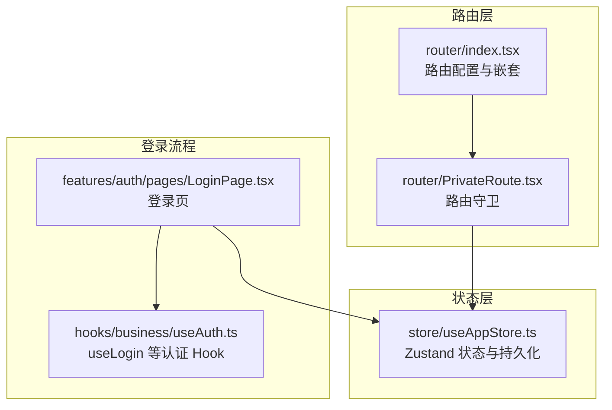
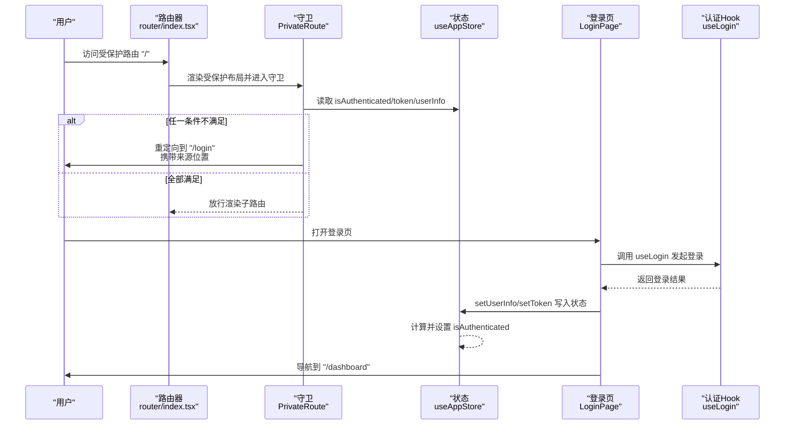
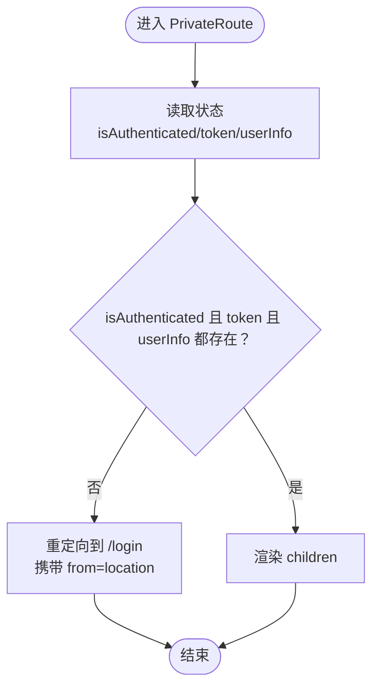
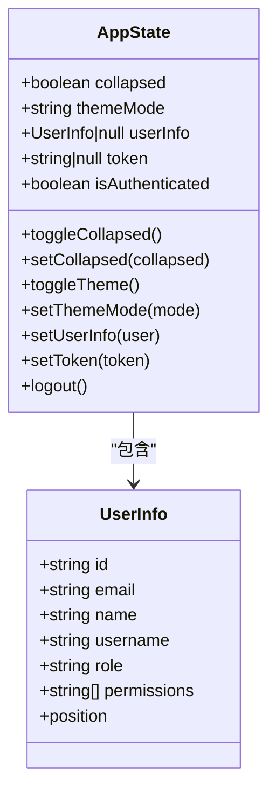
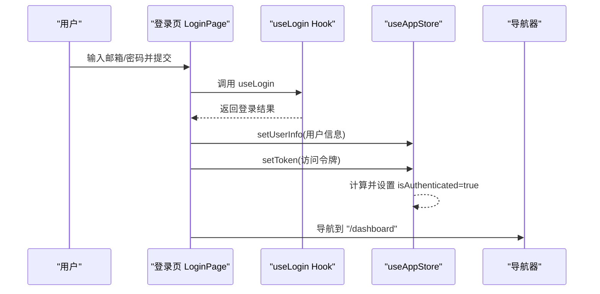
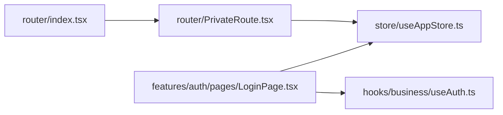

# 路由守卫与权限控制

<cite>
**本文引用的文件**
- [PrivateRoute.tsx](file://frontend/src/router/PrivateRoute.tsx)
- [index.tsx](file://frontend/src/router/index.tsx)
- [useAppStore.ts](file://frontend/src/store/useAppStore.ts)
- [LoginPage.tsx](file://frontend/src/features/auth/pages/LoginPage.tsx)
- [useAuth.ts](file://frontend/src/hooks/business/useAuth.ts)
</cite>

## 目录
1. [引言](#引言)
2. [项目结构](#项目结构)
3. [核心组件](#核心组件)
4. [架构总览](#架构总览)
5. [详细组件分析](#详细组件分析)
6. [依赖分析](#依赖分析)
7. [性能考虑](#性能考虑)
8. [故障排查指南](#故障排查指南)
9. [结论](#结论)

## 引言
本文件系统性地文档化前端路由守卫 PrivateRoute 的实现原理与安全边界控制机制，重点说明其如何通过全局状态管理 useAppStore 获取认证状态（isAuthenticated、token、userInfo），执行“双重校验”以抵御本地存储被篡改后的非法访问；同时解释 useLocation 保存跳转来源的实现逻辑，以及 Navigate 组件在未认证时的重定向行为。文档还提供调用方式与集成关系说明，帮助开发者快速理解并正确使用该守卫。

## 项目结构
本项目的前端路由守卫位于路由层，结合全局状态管理与登录流程共同构成权限控制闭环：
- 路由层：在路由配置中包裹受保护的页面，统一由 PrivateRoute 进行认证校验
- 全局状态：useAppStore 提供用户信息、令牌与认证标志，并持久化到本地存储
- 登录页：登录成功后写入 token 与 userInfo，触发 isAuthenticated 的计算与更新
- 认证 Hook：封装登录请求，返回登录结果供登录页写入状态

图表来源
- [index.tsx](file://frontend/src/router/index.tsx#L163-L193)
- [PrivateRoute.tsx](file://frontend/src/router/PrivateRoute.tsx#L1-L16)
- [useAppStore.ts](file://frontend/src/store/useAppStore.ts#L43-L89)
- [LoginPage.tsx](file://frontend/src/features/auth/pages/LoginPage.tsx#L26-L111)
- [useAuth.ts](file://frontend/src/hooks/business/useAuth.ts#L27-L34)

章节来源
- [index.tsx](file://frontend/src/router/index.tsx#L163-L193)
- [PrivateRoute.tsx](file://frontend/src/router/PrivateRoute.tsx#L1-L16)
- [useAppStore.ts](file://frontend/src/store/useAppStore.ts#L43-L89)
- [LoginPage.tsx](file://frontend/src/features/auth/pages/LoginPage.tsx#L26-L111)
- [useAuth.ts](file://frontend/src/hooks/business/useAuth.ts#L27-L34)

## 核心组件
- 路由守卫 PrivateRoute：对受保护路由进行认证校验，未通过则重定向至登录页并携带来源位置
- 全局状态 useAppStore：集中管理用户信息、令牌与认证标志，支持持久化与恢复
- 登录页 LoginPage：发起登录请求，成功后写入 token 与 userInfo，触发 isAuthenticated 更新
- 认证 Hook useLogin：封装登录 API 调用，返回登录结果

章节来源
- [PrivateRoute.tsx](file://frontend/src/router/PrivateRoute.tsx#L1-L16)
- [useAppStore.ts](file://frontend/src/store/useAppStore.ts#L43-L89)
- [LoginPage.tsx](file://frontend/src/features/auth/pages/LoginPage.tsx#L26-L111)
- [useAuth.ts](file://frontend/src/hooks/business/useAuth.ts#L27-L34)

## 架构总览
下图展示了从路由配置到守卫校验、状态更新与重定向的整体流程：

图表来源
- [index.tsx](file://frontend/src/router/index.tsx#L163-L193)
- [PrivateRoute.tsx](file://frontend/src/router/PrivateRoute.tsx#L1-L16)
- [useAppStore.ts](file://frontend/src/store/useAppStore.ts#L43-L89)
- [LoginPage.tsx](file://frontend/src/features/auth/pages/LoginPage.tsx#L26-L111)
- [useAuth.ts](file://frontend/src/hooks/business/useAuth.ts#L27-L34)

## 详细组件分析

### 路由守卫 PrivateRoute 实现原理
- 双重校验策略
  - 同时检查认证标志 isAuthenticated 与实际数据 token、userInfo 是否存在
  - 这种设计可有效防止仅篡改本地存储中的标志位而绕过校验的情况
- 未认证重定向
  - 使用 Navigate 组件重定向到登录页，并通过 state.from 传递当前 location
  - replace=true 确保回退栈中不会出现被拒绝的原始访问记录
- 子组件渲染
  - 当三者均满足时，直接渲染 children，允许进入受保护页面

图表来源
- [PrivateRoute.tsx](file://frontend/src/router/PrivateRoute.tsx#L1-L16)

章节来源
- [PrivateRoute.tsx](file://frontend/src/router/PrivateRoute.tsx#L1-L16)

### 全局状态 useAppStore 的认证状态管理
- 状态字段
  - userInfo：用户信息对象或空
  - token：访问令牌或空
  - isAuthenticated：是否已认证（布尔）
- 状态更新与计算
  - setUserInfo：写入用户信息后，isAuthenticated = !!（userInfo 且 token）
  - setToken：写入令牌后，isAuthenticated = !!（token 且 userInfo）
  - logout：清空用户信息、令牌与认证标志
- 持久化与恢复
  - 使用 persist 中间件，仅持久化必要的字段
  - onRehydrateStorage 回调在从本地存储恢复后重新计算 isAuthenticated，确保一致性

图表来源
- [useAppStore.ts](file://frontend/src/store/useAppStore.ts#L23-L89)

章节来源
- [useAppStore.ts](file://frontend/src/store/useAppStore.ts#L23-L89)

### 登录流程与状态写入
- 登录页 LoginPage
  - 使用 useLogin 发起登录请求
  - 登录成功后调用 setUserInfo 与 setToken 写入状态
  - 写入后 isAuthenticated 自动根据上述规则计算为 true
  - 成功后导航到仪表盘
- 认证 Hook useLogin
  - 封装登录 API 调用，返回登录响应数据（包含 token 与用户信息）

图表来源
- [LoginPage.tsx](file://frontend/src/features/auth/pages/LoginPage.tsx#L26-L111)
- [useAuth.ts](file://frontend/src/hooks/business/useAuth.ts#L27-L34)
- [useAppStore.ts](file://frontend/src/store/useAppStore.ts#L43-L89)

章节来源
- [LoginPage.tsx](file://frontend/src/features/auth/pages/LoginPage.tsx#L26-L111)
- [useAuth.ts](file://frontend/src/hooks/business/useAuth.ts#L27-L34)
- [useAppStore.ts](file://frontend/src/store/useAppStore.ts#L43-L89)

### 路由配置中的守卫集成
- 在根路由 "/" 下，使用 PrivateRoute 包裹主布局 MainLayout
- 子路由均为受保护页面，进入前会先经过 PrivateRoute 校验
- 登录页与其它公开路由不被 PrivateRoute 包裹

章节来源
- [index.tsx](file://frontend/src/router/index.tsx#L163-L193)

## 依赖分析
- 路由层依赖守卫
  - router/index.tsx 通过 import 引入 PrivateRoute，并将其作为根路由的包装组件
- 守卫依赖状态
  - PrivateRoute 依赖 useAppStore 读取认证状态
- 登录页依赖状态与认证 Hook
  - LoginPage 依赖 useAppStore 写入状态，依赖 useLogin 发起登录请求
- 状态依赖持久化
  - useAppStore 使用 persist 中间件，确保重启后能恢复认证状态

图表来源
- [index.tsx](file://frontend/src/router/index.tsx#L163-L193)
- [PrivateRoute.tsx](file://frontend/src/router/PrivateRoute.tsx#L1-L16)
- [useAppStore.ts](file://frontend/src/store/useAppStore.ts#L43-L89)
- [LoginPage.tsx](file://frontend/src/features/auth/pages/LoginPage.tsx#L26-L111)
- [useAuth.ts](file://frontend/src/hooks/business/useAuth.ts#L27-L34)

章节来源
- [index.tsx](file://frontend/src/router/index.tsx#L163-L193)
- [PrivateRoute.tsx](file://frontend/src/router/PrivateRoute.tsx#L1-L16)
- [useAppStore.ts](file://frontend/src/store/useAppStore.ts#L43-L89)
- [LoginPage.tsx](file://frontend/src/features/auth/pages/LoginPage.tsx#L26-L111)
- [useAuth.ts](file://frontend/src/hooks/business/useAuth.ts#L27-L34)

## 性能考虑
- 路由守卫为轻量级判断，读取状态字段与一次条件判断，开销极低
- 登录流程使用 mutation，避免不必要的缓存与重复请求
- 状态持久化仅保存必要字段，减少本地存储体积与序列化成本
- 路由懒加载与 Suspense 配合，保证受保护页面按需加载

## 故障排查指南
- 症状：访问受保护路由被重定向到登录页
  - 可能原因：isAuthenticated 为 false 或 token 为空 或 userInfo 为空
  - 排查步骤：
    - 检查本地存储中持久化的状态字段是否完整
    - 确认登录流程是否成功调用 setUserInfo 与 setToken
    - 确认 onRehydrateStorage 回调是否正确计算 isAuthenticated
- 症状：登录成功但立即被重定向
  - 可能原因：登录成功后未正确写入状态或写入时机导致守卫在渲染前读取旧状态
  - 排查步骤：
    - 确认 LoginPage 在登录成功后调用 setUserInfo 与 setToken
    - 确认写入顺序与导航顺序正确
- 症状：刷新后认证状态丢失
  - 可能原因：本地存储被清理或持久化配置异常
  - 排查步骤：
    - 检查 persist 配置与 onRehydrateStorage 回调
    - 确认仅持久化了必要的字段

章节来源
- [useAppStore.ts](file://frontend/src/store/useAppStore.ts#L43-L89)
- [LoginPage.tsx](file://frontend/src/features/auth/pages/LoginPage.tsx#L26-L111)
- [PrivateRoute.tsx](file://frontend/src/router/PrivateRoute.tsx#L1-L16)

## 结论
PrivateRoute 通过“双重校验”与 Navigate 的来源位置传递，构建了可靠的前端路由安全边界。配合 useAppStore 的状态持久化与恢复、登录页的状态写入流程，形成了从登录到受保护路由的完整闭环。开发者在新增受保护页面时，只需将其置于 PrivateRoute 包裹的路由树内，即可自动获得一致的安全保障。建议在扩展新功能时遵循现有模式，确保状态更新与守卫逻辑的一致性与可维护性。