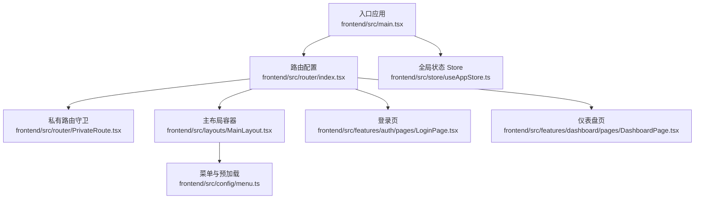
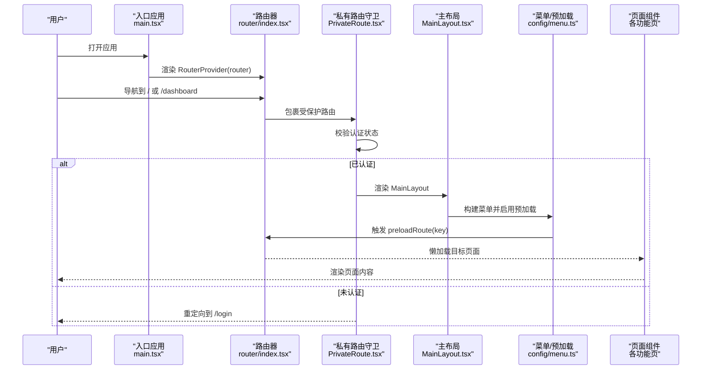
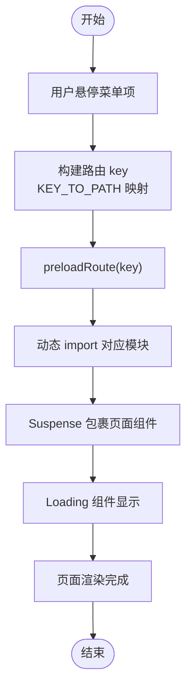
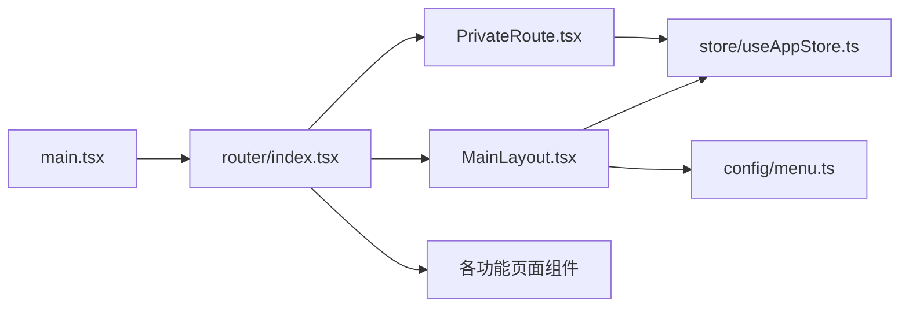

# 路由实现机制

<cite>
**本文引用的文件**
- [frontend/src/router/index.tsx](file://frontend/src/router/index.tsx)
- [frontend/src/router/PrivateRoute.tsx](file://frontend/src/router/PrivateRoute.tsx)
- [frontend/src/main.tsx](file://frontend/src/main.tsx)
- [frontend/src/layouts/MainLayout.tsx](file://frontend/src/layouts/MainLayout.tsx)
- [frontend/src/config/menu.ts](file://frontend/src/config/menu.ts)
- [frontend/src/features/auth/pages/LoginPage.tsx](file://frontend/src/features/auth/pages/LoginPage.tsx)
- [frontend/src/features/dashboard/pages/DashboardPage.tsx](file://frontend/src/features/dashboard/pages/DashboardPage.tsx)
- [frontend/src/store/useAppStore.ts](file://frontend/src/store/useAppStore.ts)
</cite>

## 目录
1. [引言](#引言)
2. [项目结构](#项目结构)
3. [核心组件](#核心组件)
4. [架构总览](#架构总览)
5. [详细组件分析](#详细组件分析)
6. [依赖分析](#依赖分析)
7. [性能考虑](#性能考虑)
8. [故障排查指南](#故障排查指南)
9. [结论](#结论)

## 引言
本文件围绕前端路由实现机制进行深入解析，重点覆盖以下方面：
- createBrowserRouter 在入口文件中的配置方式与路由结构树组织
- 路由懒加载（lazy）与 Suspense 结合的代码分割策略
- Loading 组件的统一加载反馈设计
- 根路径重定向、公共路由（登录、密码重置等）与私有路由的分离
- 通过 preloadRoute 函数实现路由预加载以提升用户体验
- 各路由路径与功能模块页面的映射关系

## 项目结构
前端路由相关的核心文件集中在 frontend/src/router 与 frontend/src/layouts 下，入口应用在 main.tsx 中挂载 RouterProvider 并注入全局状态与错误边界。

图表来源
- [frontend/src/main.tsx](file://frontend/src/main.tsx#L1-L78)
- [frontend/src/router/index.tsx](file://frontend/src/router/index.tsx#L1-L256)
- [frontend/src/router/PrivateRoute.tsx](file://frontend/src/router/PrivateRoute.tsx#L1-L16)
- [frontend/src/layouts/MainLayout.tsx](file://frontend/src/layouts/MainLayout.tsx#L1-L286)
- [frontend/src/config/menu.ts](file://frontend/src/config/menu.ts#L1-L313)
- [frontend/src/features/auth/pages/LoginPage.tsx](file://frontend/src/features/auth/pages/LoginPage.tsx#L1-L194)
- [frontend/src/features/dashboard/pages/DashboardPage.tsx](file://frontend/src/features/dashboard/pages/DashboardPage.tsx#L1-L98)
- [frontend/src/store/useAppStore.ts](file://frontend/src/store/useAppStore.ts#L1-L90)

章节来源
- [frontend/src/main.tsx](file://frontend/src/main.tsx#L1-L78)
- [frontend/src/router/index.tsx](file://frontend/src/router/index.tsx#L1-L256)

## 核心组件
- createBrowserRouter：在入口文件中创建路由器实例，集中声明所有路由规则与懒加载页面。
- PrivateRoute：私有路由守卫，基于全局认证状态决定是否放行至受保护页面。
- MainLayout：主布局容器，承载菜单、面包屑、标签页与 Outlet，负责导航与预加载。
- 菜单与映射：通过 KEY_TO_PATH/PATH_TO_KEY 实现菜单 key 与路由路径的双向映射。
- 预加载函数 preloadRoute：按路径触发对应模块的动态 import，提前完成代码分割与资源加载。
- Loading 组件：统一的骨架屏反馈，配合 Suspense 提升首次渲染体验。

章节来源
- [frontend/src/router/index.tsx](file://frontend/src/router/index.tsx#L1-L256)
- [frontend/src/router/PrivateRoute.tsx](file://frontend/src/router/PrivateRoute.tsx#L1-L16)
- [frontend/src/layouts/MainLayout.tsx](file://frontend/src/layouts/MainLayout.tsx#L1-L286)
- [frontend/src/config/menu.ts](file://frontend/src/config/menu.ts#L249-L313)

## 架构总览
下图展示从入口到路由层、布局层、菜单层与页面层的整体交互流程。

图表来源
- [frontend/src/main.tsx](file://frontend/src/main.tsx#L1-L78)
- [frontend/src/router/index.tsx](file://frontend/src/router/index.tsx#L165-L256)
- [frontend/src/router/PrivateRoute.tsx](file://frontend/src/router/PrivateRoute.tsx#L1-L16)
- [frontend/src/layouts/MainLayout.tsx](file://frontend/src/layouts/MainLayout.tsx#L1-L286)
- [frontend/src/config/menu.ts](file://frontend/src/config/menu.ts#L249-L313)

## 详细组件分析

### 路由器与路由结构树
- 路由器创建：在入口文件中通过 createBrowserRouter 创建路由器实例，集中声明所有路由规则。
- 根路径重定向：根路径 "/" 重定向到 "/dashboard"，确保首次进入即跳转到仪表盘。
- 私有路由与公共路由分离：
  - 公共路由：包含登录、账户激活、密码重置、TOTP 重置确认等无需认证即可访问的页面。
  - 私有路由：根路径下的所有业务页面均包裹在 PrivateRoute 中，仅在认证状态下可访问。
- 子路由组织：根路由下按功能域划分子路由，涵盖“我的工作台”、“财务管理”、“站点管理”、“资产管理”、“人力资源”、“报表中心”、“系统设置”等。

章节来源
- [frontend/src/router/index.tsx](file://frontend/src/router/index.tsx#L165-L256)

### 路由懒加载与 Suspense 的代码分割策略
- 动态导入映射：通过 loaders 对象将路径映射到对应的动态 import 函数，实现按需加载。
- 页面懒加载：每个页面组件均通过 lazy(loaders[路径]) 方式进行懒加载。
- 统一加载反馈：使用 Suspense 包裹每个懒加载组件，并提供 Loading 组件作为 fallback，保证切换过程中的流畅体验。
- 预加载触发：在菜单项上绑定鼠标悬停事件，调用 preloadRoute(key) 提前触发 import，降低首次访问延迟。

图表来源
- [frontend/src/router/index.tsx](file://frontend/src/router/index.tsx#L1-L160)
- [frontend/src/layouts/MainLayout.tsx](file://frontend/src/layouts/MainLayout.tsx#L150-L186)
- [frontend/src/config/menu.ts](file://frontend/src/config/menu.ts#L249-L313)

章节来源
- [frontend/src/router/index.tsx](file://frontend/src/router/index.tsx#L1-L160)
- [frontend/src/layouts/MainLayout.tsx](file://frontend/src/layouts/MainLayout.tsx#L150-L186)
- [frontend/src/config/menu.ts](file://frontend/src/config/menu.ts#L249-L313)

### Loading 组件的统一加载反馈设计
- 统一骨架屏：Loading 组件采用居中布局与大型旋转指示器，提供一致的加载视觉反馈。
- 作用范围：所有懒加载页面均通过 Suspense fallback 使用该 Loading 组件，确保切换时的平滑过渡。
- 性能影响：在首次加载时，Loading 会短暂出现；通过 preloadRoute 预热可显著减少 Loading 时间。

章节来源
- [frontend/src/router/index.tsx](file://frontend/src/router/index.tsx#L157-L162)

### 私有路由守卫与认证状态
- 守卫逻辑：PrivateRoute 读取全局认证状态（isAuthenticated、token、userInfo），若任一条件不满足则重定向到登录页。
- 双重校验：同时检查标志位与实际令牌/用户信息存在性，防止本地存储被篡改导致的越权访问。
- 重定向携带来源：登录后可根据 state.from 进行精准回跳。

章节来源
- [frontend/src/router/PrivateRoute.tsx](file://frontend/src/router/PrivateRoute.tsx#L1-L16)
- [frontend/src/store/useAppStore.ts](file://frontend/src/store/useAppStore.ts#L1-L90)

### 根路径重定向与公共路由
- 根路径重定向：根路径 "/" 重定向到 "/dashboard"，保证新用户首先进入仪表盘。
- 公共路由：登录、账户激活、密码重置、TOTP 重置请求与确认等页面无需认证即可访问。
- 登录页行为：登录成功后自动跳转到 "/dashboard"，并在需要时进入二次验证流程。

章节来源
- [frontend/src/router/index.tsx](file://frontend/src/router/index.tsx#L188-L193)
- [frontend/src/features/auth/pages/LoginPage.tsx](file://frontend/src/features/auth/pages/LoginPage.tsx#L1-L194)

### 路由预加载（preloadRoute）与用户体验优化
- 预加载触发点：在菜单项的鼠标悬停事件中调用 preloadRoute(key)，提前触发 import。
- 路径映射：通过 KEY_TO_PATH 将菜单 key 映射为完整路径，再交给 preloadRoute 使用。
- 效果：预加载可显著降低首次访问某个页面时的等待时间，提升交互流畅度。

章节来源
- [frontend/src/layouts/MainLayout.tsx](file://frontend/src/layouts/MainLayout.tsx#L150-L186)
- [frontend/src/router/index.tsx](file://frontend/src/router/index.tsx#L144-L153)
- [frontend/src/config/menu.ts](file://frontend/src/config/menu.ts#L249-L313)

### 路由路径与功能模块页面映射关系
- 仪表盘与修改密码：/dashboard、/change-password
- 我的工作台：/my/center、/my/leaves、/my/reimbursements、/my/borrowings、/my/assets、/my/policies、/my/approvals
- 财务管理：/finance/flows、/finance/flows/create、/finance/transfer、/finance/transactions、/finance/import、/finance/borrowings、/finance/repayments、/finance/ar、/finance/ap
- 站点管理：/sites/list、/sites/bills
- 资产管理：/assets/list、/assets/rental
- 人力资源：/hr/employees、/hr/salary-report、/hr/salary-payments、/hr/allowance-payments、/hr/leaves、/hr/reimbursements
- 报表中心：/reports/dept-cash、/reports/site-growth、/reports/ar-summary、/reports/ar-detail、/reports/ap-summary、/reports/ap-detail、/reports/expense-summary、/reports/expense-detail、/reports/account-balance、/reports/borrowing
- 系统设置：/system/departments、/system/categories、/system/accounts、/system/currencies、/system/vendors、/system/permissions、/system/email、/system/ip-whitelist、/system/audit

章节来源
- [frontend/src/router/index.tsx](file://frontend/src/router/index.tsx#L165-L256)
- [frontend/src/config/menu.ts](file://frontend/src/config/menu.ts#L249-L313)

## 依赖分析
- 路由器依赖：main.tsx 依赖 router/index.tsx 提供的 router 实例；router/index.tsx 依赖 PrivateRoute、MainLayout、各页面组件。
- 私有路由依赖：PrivateRoute 依赖全局状态 store（useAppStore）中的认证信息。
- 菜单与预加载：MainLayout 依赖 config/menu.ts 的菜单构建与路径映射，并调用 preloadRoute 实现预加载。
- 页面依赖：各页面组件依赖各自的功能模块与 UI 组件库。

图表来源
- [frontend/src/main.tsx](file://frontend/src/main.tsx#L1-L78)
- [frontend/src/router/index.tsx](file://frontend/src/router/index.tsx#L1-L256)
- [frontend/src/router/PrivateRoute.tsx](file://frontend/src/router/PrivateRoute.tsx#L1-L16)
- [frontend/src/layouts/MainLayout.tsx](file://frontend/src/layouts/MainLayout.tsx#L1-L286)
- [frontend/src/config/menu.ts](file://frontend/src/config/menu.ts#L1-L313)
- [frontend/src/store/useAppStore.ts](file://frontend/src/store/useAppStore.ts#L1-L90)

章节来源
- [frontend/src/main.tsx](file://frontend/src/main.tsx#L1-L78)
- [frontend/src/router/index.tsx](file://frontend/src/router/index.tsx#L1-L256)
- [frontend/src/router/PrivateRoute.tsx](file://frontend/src/router/PrivateRoute.tsx#L1-L16)
- [frontend/src/layouts/MainLayout.tsx](file://frontend/src/layouts/MainLayout.tsx#L1-L286)
- [frontend/src/config/menu.ts](file://frontend/src/config/menu.ts#L1-L313)
- [frontend/src/store/useAppStore.ts](file://frontend/src/store/useAppStore.ts#L1-L90)

## 性能考虑
- 代码分割：通过动态 import 与 lazy 实现按需加载，减小初始包体积，提升首屏加载速度。
- 预加载策略：在菜单悬停时预热目标路由，降低首次渲染等待时间，改善交互体验。
- Suspense 降级：Loading 组件提供一致的加载反馈，避免页面闪烁与空白。
- 缓存与持久化：全局状态持久化与查询客户端缓存策略有助于减少重复请求与刷新成本。

[本节为通用性能建议，不直接分析具体文件]

## 故障排查指南
- 认证失败重定向：若访问受保护路由被重定向到登录页，检查全局状态 store 中的 token 与 userInfo 是否正确设置。
- 预加载无效：确认菜单 key 与路径映射是否正确，preloadRoute 是否被正确调用。
- 首次加载慢：检查目标页面是否被正确懒加载，确认 Suspense fallback 是否生效。
- 登录后未跳转：确认登录成功后的跳转逻辑与路由守卫是否正常执行。

章节来源
- [frontend/src/router/PrivateRoute.tsx](file://frontend/src/router/PrivateRoute.tsx#L1-L16)
- [frontend/src/layouts/MainLayout.tsx](file://frontend/src/layouts/MainLayout.tsx#L150-L186)
- [frontend/src/features/auth/pages/LoginPage.tsx](file://frontend/src/features/auth/pages/LoginPage.tsx#L1-L194)
- [frontend/src/store/useAppStore.ts](file://frontend/src/store/useAppStore.ts#L1-L90)

## 结论
本项目采用 createBrowserRouter 集中管理路由，结合 PrivateRoute 实现私有路由守卫，通过 loaders 映射与 lazy/Suspense 实现代码分割与统一加载反馈。菜单层通过 KEY_TO_PATH/PATH_TO_KEY 实现路径与 key 的双向映射，并在 MainLayout 中利用 preloadRoute 提前加载目标模块，有效提升用户体验。整体架构清晰、职责明确，具备良好的扩展性与维护性。