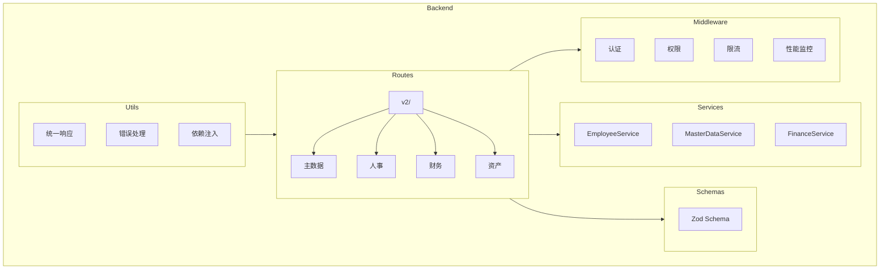
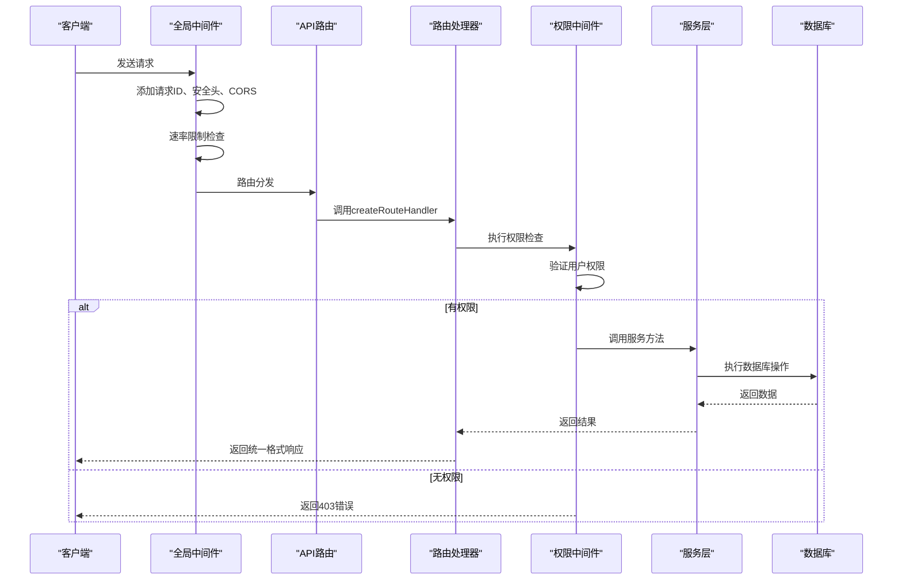
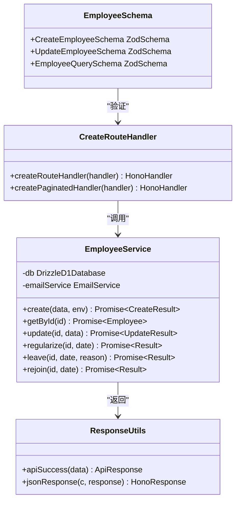
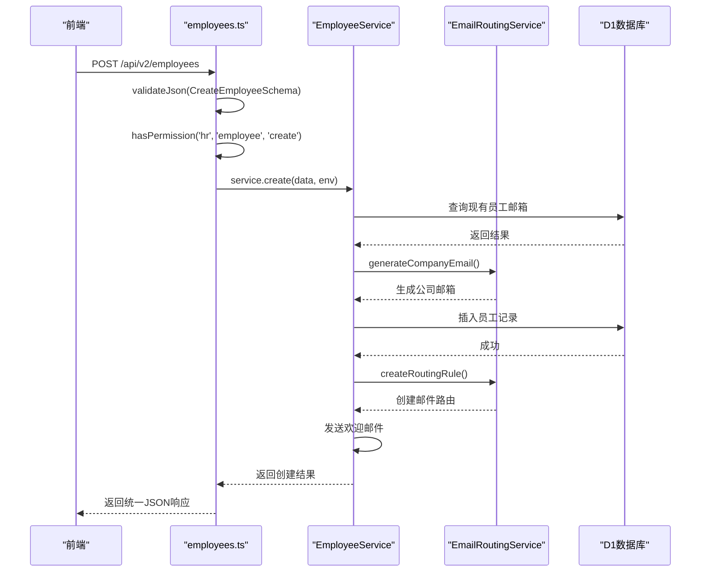
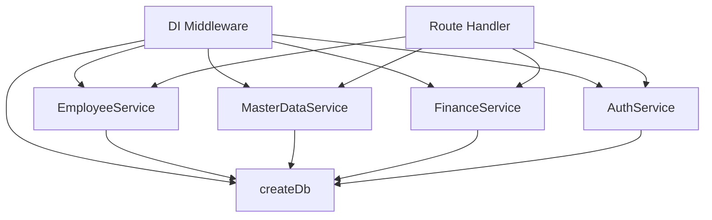

# API路由设计

<cite>
**本文档引用的文件**
- [index.ts](file://backend/src/index.ts)
- [middleware.ts](file://backend/src/middleware.ts)
- [di.ts](file://backend/src/middleware/di.ts)
- [route-helpers.ts](file://backend/src/utils/route-helpers.ts)
- [response.ts](file://backend/src/utils/response.ts)
- [errors.ts](file://backend/src/utils/errors.ts)
- [validator.ts](file://backend/src/utils/validator.ts)
- [employees.ts](file://backend/src/routes/v2/employees.ts)
- [master-data.ts](file://backend/src/routes/v2/master-data.ts)
- [employee.schema.ts](file://backend/src/schemas/employee.schema.ts)
- [EmployeeService.ts](file://backend/src/services/EmployeeService.ts)
- [permission.ts](file://backend/src/middleware/permission.ts)
- [rateLimit.ts](file://backend/src/middleware/rateLimit.ts)
- [performance.ts](file://backend/src/middleware/performance.ts)
- [requestId.ts](file://backend/src/middleware/requestId.ts)
</cite>

## 目录
1. [简介](#简介)
2. [项目结构](#项目结构)
3. [核心组件](#核心组件)
4. [架构概述](#架构概述)
5. [详细组件分析](#详细组件分析)
6. [依赖分析](#依赖分析)
7. [性能考虑](#性能考虑)
8. [故障排除指南](#故障排除指南)
9. [结论](#结论)

## 简介
本文档全面解析了基于Hono框架的后端API路由系统。该系统采用RESTful设计原则，实现了/api/v2版本化的API接口，涵盖了主数据管理、财务、人事、资产等多个业务模块。文档详细阐述了路由的组织结构、统一的响应格式封装、基于Zod的请求数据验证、权限控制机制、错误处理策略以及与OpenAPI的集成方式。通过深入分析员工管理模块的完整实现流程，展示了从路由定义、数据验证、权限检查到服务调用的完整链条。系统通过依赖注入（DI）和中间件链（认证、日志、性能监控）实现了高内聚、低耦合的架构设计。

## 项目结构
项目后端采用模块化设计，API路由集中在`backend/src/routes/v2/`目录下，按业务功能进行分组。主数据管理、财务、人事、资产等核心模块各自拥有独立的路由文件。`middleware`目录包含了认证、权限、限流、性能监控等通用中间件。`services`目录实现了业务逻辑层，与路由层分离。`schemas`目录使用Zod定义了所有API的请求和响应数据结构，确保了类型安全和数据完整性。

**图表来源**
- [index.ts](file://backend/src/index.ts#L26-L48)
- [middleware.ts](file://backend/src/middleware.ts)
- [di.ts](file://backend/src/middleware/di.ts#L41-L155)

**本节来源**
- [index.ts](file://backend/src/index.ts#L1-L362)
- [project_structure](file://)

## 核心组件
系统的核心组件包括基于Hono的API路由框架、统一的响应和错误处理机制、Zod数据验证、权限控制中间件以及依赖注入系统。`createRouteHandler`函数是路由处理的核心，它封装了异步处理逻辑和统一的响应格式。`apiSuccess`和`jsonResponse`工具函数确保了所有API响应都遵循一致的结构。`di`中间件负责初始化所有服务实例并将其注入到请求上下文中，实现了服务层的解耦。

**本节来源**
- [route-helpers.ts](file://backend/src/utils/route-helpers.ts#L16-L27)
- [response.ts](file://backend/src/utils/response.ts#L53-L132)
- [di.ts](file://backend/src/middleware/di.ts#L41-L155)

## 架构概述
系统采用分层架构，从上至下分为路由层、服务层和数据访问层。API请求首先经过全局中间件链（请求ID、安全头、CORS、速率限制、日志），然后进入版本化的API路由。每个API端点通过`createRouteHandler`包装，确保了统一的异常处理和响应格式。权限控制通过`requirePermission`中间件实现，基于用户的角色和部门进行细粒度的访问控制。服务层通过依赖注入获取数据库连接和其他服务实例，实现了业务逻辑的集中管理。

**图表来源**
- [index.ts](file://backend/src/index.ts#L53-L89)
- [route-helpers.ts](file://backend/src/utils/route-helpers.ts#L16-L27)
- [permission.ts](file://backend/src/middleware/permission.ts#L12-L18)
- [di.ts](file://backend/src/middleware/di.ts#L41-L155)

## 详细组件分析

### 员工管理模块分析
员工管理模块展示了API端点的完整定义流程。以创建员工为例，路由首先定义了OpenAPI规范，包括路径、请求方法、请求体验证（使用`CreateEmployeeSchema`）和响应格式。`createRouteHandler`包装了实际的业务逻辑，确保了异常的统一处理。在处理函数中，首先通过`hasPermission`检查用户权限，然后从上下文中获取`employeeService`实例，调用其`create`方法完成业务逻辑。整个过程集成了数据验证、权限控制、审计日志记录和错误处理。

#### 对象导向组件

**图表来源**
- [EmployeeService.ts](file://backend/src/services/EmployeeService.ts#L11-L200)
- [employee.schema.ts](file://backend/src/schemas/employee.schema.ts#L71-L117)
- [route-helpers.ts](file://backend/src/utils/route-helpers.ts#L16-L27)
- [response.ts](file://backend/src/utils/response.ts#L53-L132)

#### API/服务组件

**图表来源**
- [employees.ts](file://backend/src/routes/v2/employees.ts#L156-L241)
- [EmployeeService.ts](file://backend/src/services/EmployeeService.ts#L20-L200)

**本节来源**
- [employees.ts](file://backend/src/routes/v2/employees.ts#L1-L602)
- [EmployeeService.ts](file://backend/src/services/EmployeeService.ts#L1-L758)
- [employee.schema.ts](file://backend/src/schemas/employee.schema.ts#L1-L118)

### 主数据管理模块
主数据管理模块通过`master-data.ts`文件统一挂载了多个子模块的路由，如总部、部门、账户、货币、分类、职位和供应商。这种设计模式实现了路由的模块化和层次化，使得API路径清晰且易于维护。每个子模块都遵循相同的实现模式，确保了代码的一致性和可维护性。

**本节来源**
- [master-data.ts](file://backend/src/routes/v2/master-data.ts#L1-L23)

## 依赖分析
系统通过`di`中间件实现了依赖注入，解决了服务实例的创建和生命周期管理问题。`di`中间件在请求开始时初始化所有服务（如`EmployeeService`, `MasterDataService`, `FinanceService`等），并将它们注入到Hono的上下文（Context）中。路由处理函数通过`c.var.services`即可访问所需的服务实例，无需关心服务的创建细节，实现了松耦合。这种设计也便于单元测试，可以轻松地注入模拟（mock）服务。

**图表来源**
- [di.ts](file://backend/src/middleware/di.ts#L41-L155)
- [employees.ts](file://backend/src/routes/v2/employees.ts#L55)

**本节来源**
- [di.ts](file://backend/src/middleware/di.ts#L1-L156)
- [employees.ts](file://backend/src/routes/v2/employees.ts#L1-L602)

## 性能考虑
系统集成了全面的性能监控机制。`performanceMonitor`中间件记录了每个请求的处理时间，并通过`monitorDbQuery`装饰器监控数据库查询性能。系统会自动记录慢请求（>1秒）和慢查询（>500ms），并生成相应的性能指标。`recordMemoryUsage`函数在支持的环境中记录内存使用情况。这些监控数据被发送到监控服务，可用于生成性能报告和告警。此外，系统使用KV缓存来缓存用户会话和权限信息，减少了数据库查询次数，提升了响应速度。

**本节来源**
- [performance.ts](file://backend/src/middleware/performance.ts#L14-L160)
- [middleware.ts](file://backend/src/middleware.ts#L40-L58)

## 故障排除指南
当API调用出现问题时，应首先检查响应状态码和错误码。401表示未授权，需检查认证令牌；403表示权限不足，需确认用户角色和权限配置；404表示资源不存在；409表示数据冲突，如邮箱重复。对于500错误，应检查服务端日志。审计日志（Audit Logs）记录了所有关键操作，可用于追踪问题。如果遇到限流问题（429），请稍后重试。确保请求体符合Zod Schema定义，否则会返回400错误和详细的验证失败信息。

**本节来源**
- [errors.ts](file://backend/src/utils/errors.ts#L35-L228)
- [rateLimit.ts](file://backend/src/middleware/rateLimit.ts#L66-L119)

## 结论
本文档详细解析了基于Hono框架的后端API路由设计。系统通过模块化的路由组织、统一的响应格式、严格的Zod数据验证、细粒度的权限控制和强大的中间件链，构建了一个健壮、安全、可维护的API系统。依赖注入机制有效地管理了服务间的依赖关系，而OpenAPI集成则确保了API文档的自动生成和类型安全。该设计模式为系统的持续扩展和维护提供了坚实的基础。