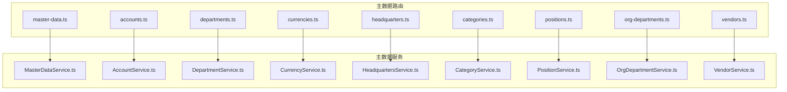
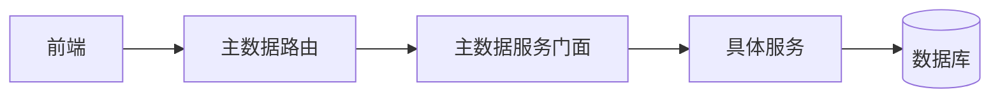
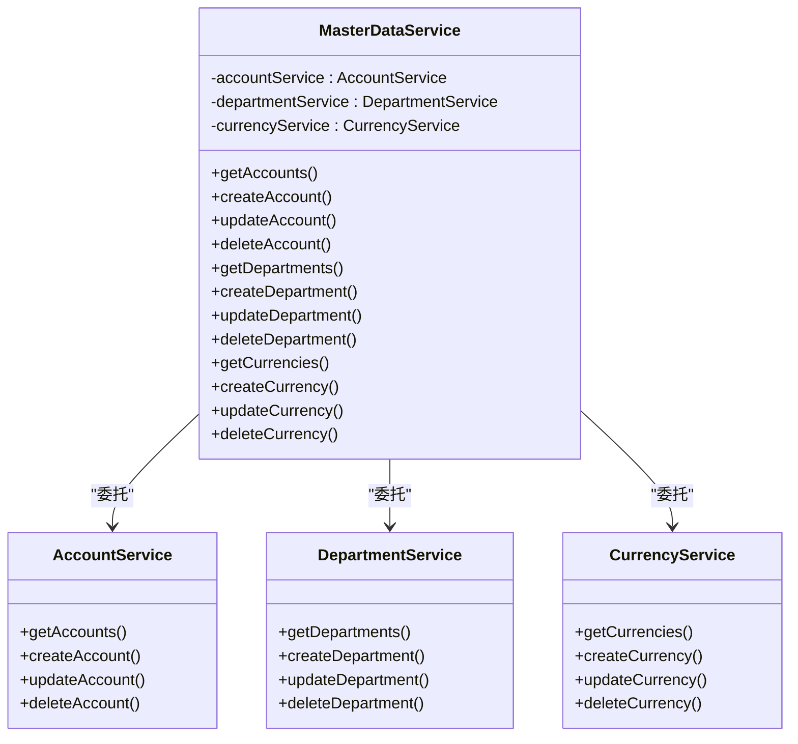
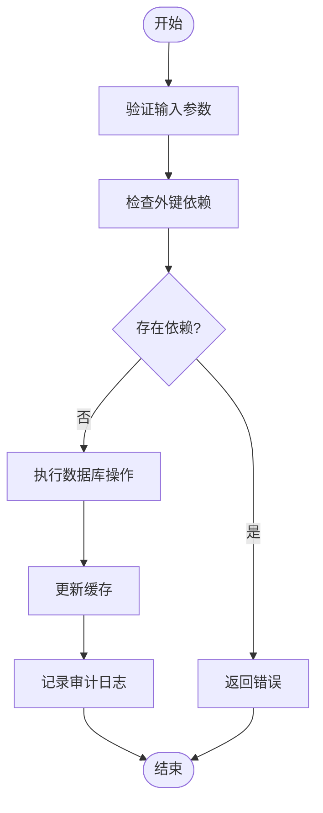
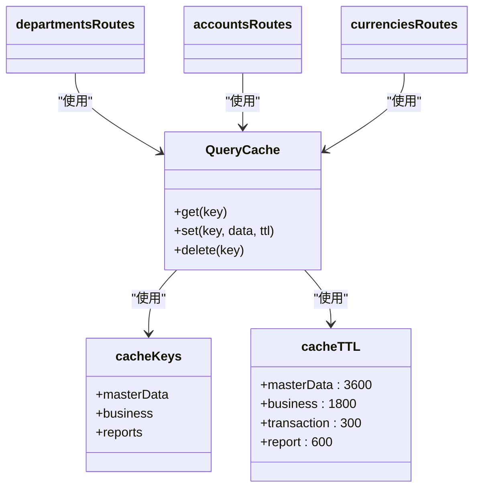
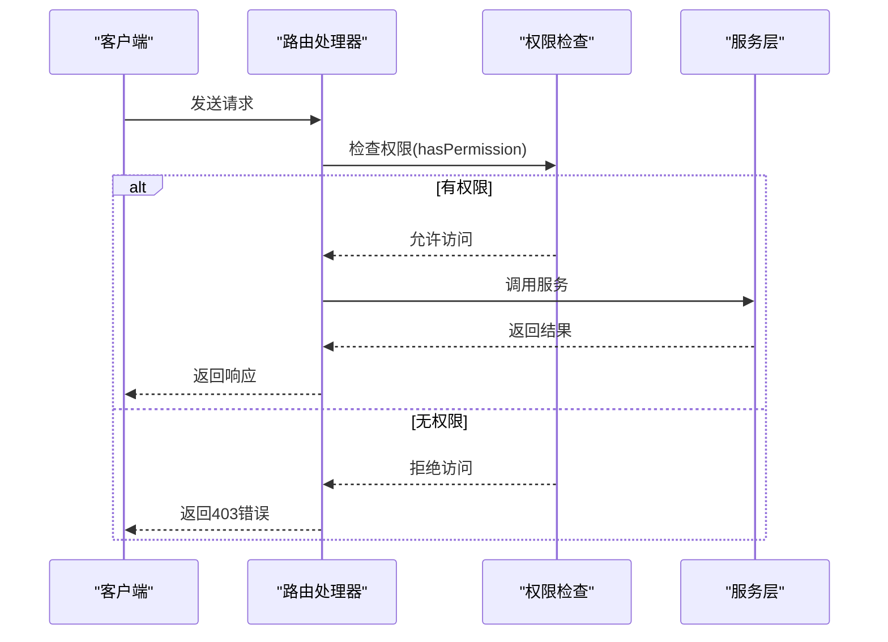
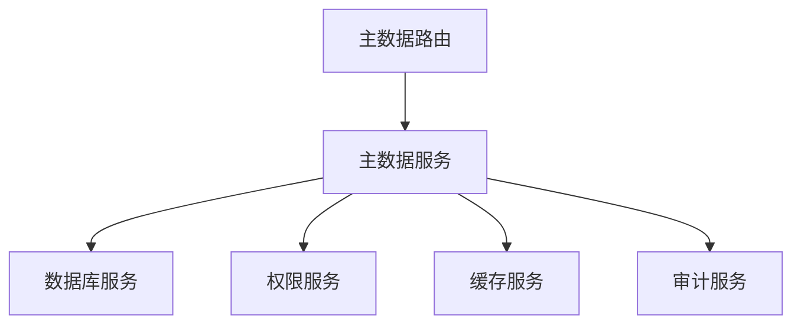

# 主数据管理路由

<cite>
**本文档引用的文件**  
- [master-data.ts](file://backend/src/routes/v2/master-data.ts)
- [MasterDataService.ts](file://backend/src/services/MasterDataService.ts)
- [master-data.schema.ts](file://backend/src/schemas/master-data.schema.ts)
- [departments.ts](file://backend/src/routes/v2/master-data/departments.ts)
- [accounts.ts](file://backend/src/routes/v2/master-data/accounts.ts)
- [currencies.ts](file://backend/src/routes/v2/master-data/currencies.ts)
- [headquarters.ts](file://backend/src/routes/v2/master-data/headquarters.ts)
- [categories.ts](file://backend/src/routes/v2/master-data/categories.ts)
- [positions.ts](file://backend/src/routes/v2/master-data/positions.ts)
- [org-departments.ts](file://backend/src/routes/v2/master-data/org-departments.ts)
- [vendors.ts](file://backend/src/routes/v2/master-data/vendors.ts)
- [query-cache.ts](file://backend/src/utils/query-cache.ts)
- [permissions.ts](file://backend/src/utils/permissions.ts)
</cite>

## 目录
1. [简介](#简介)
2. [项目结构](#项目结构)
3. [核心组件](#核心组件)
4. [架构概述](#架构概述)
5. [详细组件分析](#详细组件分析)
6. [依赖分析](#依赖分析)
7. [性能考虑](#性能考虑)
8. [故障排除指南](#故障排除指南)
9. [结论](#结论)

## 简介
本文档全面阐述了财务管理系统中主数据管理（Master Data Management）领域的API设计。系统涵盖了账户、分类、币种、部门、总部、组织部门、职位和供应商等基础数据的增删改查（CRUD）接口。文档详细说明了主数据路由的统一设计模式，包括模块化文件结构、通用CRUD服务、数据一致性保障机制、缓存策略以及多租户数据隔离方案。

## 项目结构
主数据管理功能位于`backend/src/routes/v2/master-data/`目录下，采用模块化设计，每个实体（如账户、部门等）都有独立的路由文件。这些路由通过`master-data.ts`文件统一挂载。服务层位于`backend/src/services/`目录，每个实体有对应的服务类，并通过`MasterDataService`作为门面统一对外提供接口。



**图示来源**
- [master-data.ts](file://backend/src/routes/v2/master-data.ts)
- [MasterDataService.ts](file://backend/src/services/MasterDataService.ts)

## 核心组件
核心组件包括主数据路由模块、主数据服务门面、数据验证Schema和辅助工具。路由模块负责定义API端点和请求处理；服务门面封装了具体的业务逻辑；Schema文件定义了数据结构和验证规则；工具类则提供了缓存、权限控制等通用功能。

**组件来源**
- [master-data.ts](file://backend/src/routes/v2/master-data.ts)
- [MasterDataService.ts](file://backend/src/services/MasterDataService.ts)
- [master-data.schema.ts](file://backend/src/schemas/master-data.schema.ts)

## 架构概述
系统采用分层架构，前端通过API与后端交互，后端路由层接收请求并进行权限和参数验证，然后调用服务层进行业务处理，服务层最终与数据库交互。主数据服务通过门面模式（Facade Pattern）统一管理多个具体服务，简化了路由层的调用。



**图示来源**
- [master-data.ts](file://backend/src/routes/v2/master-data.ts)
- [MasterDataService.ts](file://backend/src/services/MasterDataService.ts)

## 详细组件分析

### 路由设计模式
主数据路由采用模块化设计，每个实体的CRUD操作在独立的文件中定义。所有路由通过`master-data.ts`文件集中挂载，实现了路由的清晰分离和统一管理。

#### 路由挂载
```mermaid
classDiagram
class masterDataRoutes {
+route(path, routes)
}
class accountsRoutes {
+get("/")
+post("/")
+put("/{id}")
+delete("/{id}")
}
class departmentsRoutes {
+get("/departments")
+post("/departments")
+put("/departments/{id}")
+delete("/departments/{id}")
}
masterDataRoutes --> accountsRoutes : "挂载"
masterDataRoutes --> departmentsRoutes : "挂载"
```

**图示来源**
- [master-data.ts](file://backend/src/routes/v2/master-data.ts)
- [accounts.ts](file://backend/src/routes/v2/master-data/accounts.ts)
- [departments.ts](file://backend/src/routes/v2/master-data/departments.ts)

### 通用CRUD服务
`MasterDataService`作为门面服务，封装了所有主数据实体的CRUD操作。它通过组合具体的实体服务（如`AccountService`、`DepartmentService`等）来实现功能，避免了代码重复。

#### 服务门面模式


**图示来源**
- [MasterDataService.ts](file://backend/src/services/MasterDataService.ts)
- [AccountService.ts](file://backend/src/services/AccountService.ts)
- [DepartmentService.ts](file://backend/src/services/DepartmentService.ts)
- [CurrencyService.ts](file://backend/src/services/CurrencyService.ts)

### 数据一致性保障
系统通过API层面的处理来保障数据一致性。例如，在删除一个部门时，会先检查是否有相关联的数据（如员工、站点等），如果有则阻止删除操作。此外，通过事务处理确保操作的原子性。

#### 数据一致性流程


**图示来源**
- [MasterDataService.ts](file://backend/src/services/MasterDataService.ts)
- [departments.ts](file://backend/src/routes/v2/master-data/departments.ts)

### 缓存策略
系统使用`query-cache.ts`工具实现缓存策略。主数据（如部门、币种）变化较少，因此设置了较长的缓存时间（1小时）。当数据被创建、更新或删除时，相关的缓存会被清除，以保证数据的一致性。

#### 缓存策略


**图示来源**
- [query-cache.ts](file://backend/src/utils/query-cache.ts)
- [departments.ts](file://backend/src/routes/v2/master-data/departments.ts)
- [accounts.ts](file://backend/src/routes/v2/master-data/accounts.ts)
- [currencies.ts](file://backend/src/routes/v2/master-data/currencies.ts)

### 权限控制与多租户数据隔离
系统通过`permissions.ts`工具实现权限控制。用户根据其职位（如总部主管、项目主管等）被赋予不同的权限。数据访问范围根据用户职位层级进行过滤，实现了多租户场景下的数据隔离。

#### 权限控制流程


**图示来源**
- [permissions.ts](file://backend/src/utils/permissions.ts)
- [departments.ts](file://backend/src/routes/v2/master-data/departments.ts)

## 依赖分析
主数据管理模块依赖于数据库服务、权限服务、缓存服务和审计服务。这些依赖通过依赖注入的方式提供给各个服务类。



**图示来源**
- [MasterDataService.ts](file://backend/src/services/MasterDataService.ts)
- [permissions.ts](file://backend/src/utils/permissions.ts)
- [query-cache.ts](file://backend/src/utils/query-cache.ts)

## 性能考虑
系统通过缓存、分页和异步操作来提升性能。主数据被缓存以减少数据库查询，列表接口支持分页以避免一次性加载大量数据，缓存更新操作使用`waitUntil`异步执行，不阻塞主请求流程。

## 故障排除指南
- **缓存未更新**：检查`waitUntil`是否正常执行，确保缓存清除逻辑被调用。
- **权限不足**：确认用户职位和权限配置是否正确，检查`hasPermission`函数的调用参数。
- **数据不一致**：检查外键约束和级联更新的实现，确保在删除或更新操作时正确处理依赖关系。

**组件来源**
- [query-cache.ts](file://backend/src/utils/query-cache.ts)
- [permissions.ts](file://backend/src/utils/permissions.ts)
- [MasterDataService.ts](file://backend/src/services/MasterDataService.ts)

## 结论
该主数据管理API设计采用了模块化、分层和门面模式，具有良好的可维护性和扩展性。通过统一的CRUD服务减少了代码重复，通过缓存策略提升了性能，通过权限控制实现了多租户数据隔离。整体设计合理，能够满足复杂的业务需求。