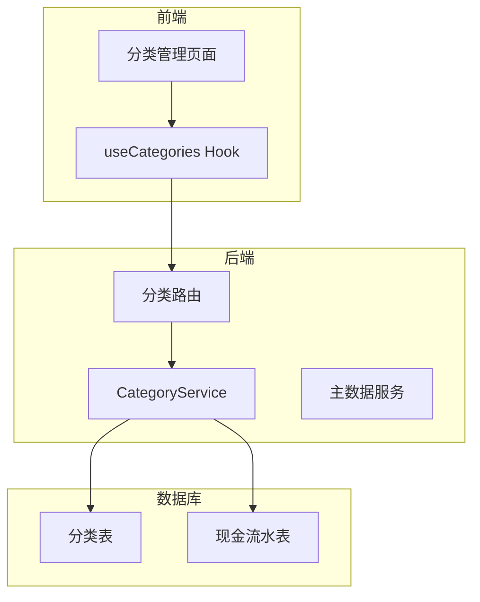
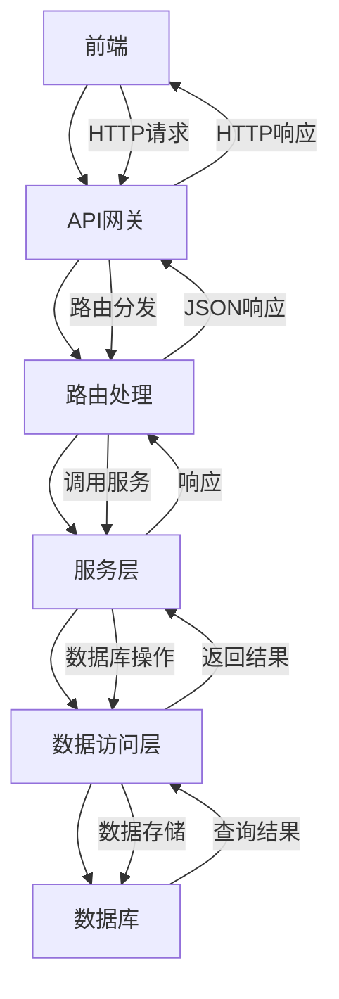
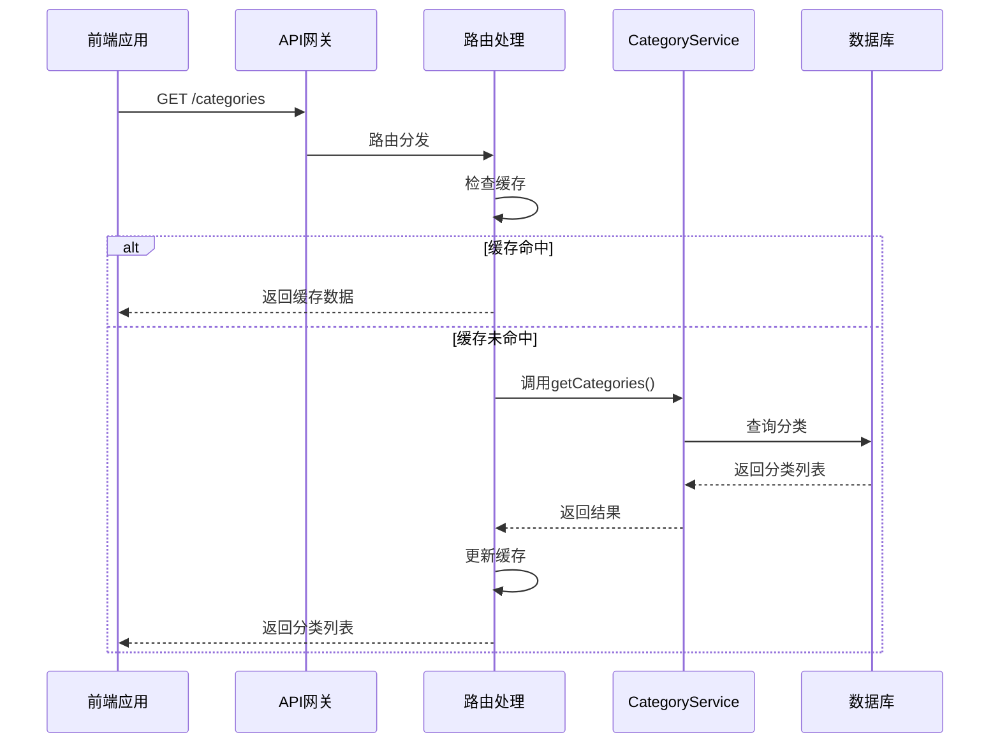
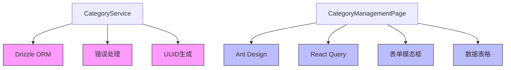

# 分类管理

<cite>
**本文档引用文件**   
- [CategoryService.ts](file://backend/src/services/CategoryService.ts)
- [categories.ts](file://backend/src/routes/v2/master-data/categories.ts)
- [master-data.schema.ts](file://backend/src/schemas/master-data.schema.ts)
- [schema.ts](file://backend/src/db/schema.ts)
- [CategoryManagementPage.tsx](file://frontend/src/features/system/pages/CategoryManagementPage.tsx)
- [useCategories.ts](file://frontend/src/hooks/business/useCategories.ts)
</cite>

## 目录
1. [项目结构](#项目结构)
2. [核心组件](#核心组件)
3. [架构概述](#架构概述)
4. [详细组件分析](#详细组件分析)
5. [依赖分析](#依赖分析)
6. [性能考虑](#性能考虑)
7. [故障排除指南](#故障排除指南)
8. [结论](#结论)

## 项目结构

财务管理系统中的分类管理模块主要位于后端的 `backend/src/services/CategoryService.ts` 和前端的 `frontend/src/features/system/pages/CategoryManagementPage.tsx`。该模块支持收入/支出分类的层级结构，通过 `parentId` 字段实现树形结构。分类数据存储在数据库的 `categories` 表中，与 `cash_flows` 表通过 `categoryId` 字段关联。



**图表来源**
- [CategoryService.ts](file://backend/src/services/CategoryService.ts)
- [categories.ts](file://backend/src/routes/v2/master-data/categories.ts)
- [CategoryManagementPage.tsx](file://frontend/src/features/system/pages/CategoryManagementPage.tsx)

**章节来源**
- [CategoryService.ts](file://backend/src/services/CategoryService.ts#L1-L76)
- [categories.ts](file://backend/src/routes/v2/master-data/categories.ts#L1-L231)

## 核心组件

分类管理模块的核心组件包括 `CategoryService` 服务类，负责处理分类的创建、更新、删除和查询操作。该服务通过 `parentId` 字段支持分类的层级结构，允许创建父子分类关系。在创建分类时，系统会检查分类名称的唯一性，防止重复。删除分类时，会检查该分类是否已被流水记录引用，如果存在引用则不允许删除，确保数据完整性。

**章节来源**
- [CategoryService.ts](file://backend/src/services/CategoryService.ts#L1-L76)

## 架构概述

分类管理模块采用分层架构，前端通过 React 组件和自定义 Hook 与后端 API 交互。后端采用 Hono 框架提供 RESTful API，通过 `CategoryService` 处理业务逻辑，最终与数据库交互。系统使用 Drizzle ORM 进行数据库操作，确保类型安全和查询效率。



**图表来源**
- [categories.ts](file://backend/src/routes/v2/master-data/categories.ts#L1-L231)
- [CategoryService.ts](file://backend/src/services/CategoryService.ts#L1-L76)

## 详细组件分析

### 分类服务分析

`CategoryService` 类提供了分类管理的核心功能，包括获取所有分类、创建分类、更新分类和删除分类。服务通过 `getCategories` 方法获取所有分类，并按类型和名称排序。`createCategory` 方法创建新分类时会检查名称唯一性。`deleteCategory` 方法在删除前会检查该分类是否被流水记录引用。

#### 类图
```mermaid
classDiagram
class CategoryService {
+db : DrizzleD1Database
+constructor(db : DrizzleD1Database)
+getCategories() : Promise~Category[]~
+createCategory(data : {name : string, kind : string, parentId? : string}) : Promise~{id : string, ...data}~
+updateCategory(id : string, data : {name? : string, kind? : string}) : Promise~{ok : boolean}~
+deleteCategory(id : string) : Promise~{ok : boolean, name : string}~
}
class Category {
+id : string
+name : string
+kind : string
+parentId? : string
+active : number
}
CategoryService --> Category : "使用"
```

**图表来源**
- [CategoryService.ts](file://backend/src/services/CategoryService.ts#L12-L76)

### API接口分析

分类管理API提供了创建、读取、更新和删除分类的功能。API使用 OpenAPI 规范定义接口，确保前后端契约清晰。`GET /categories` 接口获取所有分类，支持缓存以提高性能。`POST /categories` 接口创建新分类，需要权限验证。`DELETE /categories/{id}` 接口删除分类，会检查使用状态。

#### 序列图


**图表来源**
- [categories.ts](file://backend/src/routes/v2/master-data/categories.ts#L1-L231)
- [CategoryService.ts](file://backend/src/services/CategoryService.ts#L15-L17)

## 依赖分析

分类管理模块依赖于多个核心组件和服务。`CategoryService` 依赖于 Drizzle ORM 进行数据库操作，依赖于 `errors.js` 提供错误处理机制。前端组件依赖于 Ant Design 的 UI 组件库和 React Query 进行数据获取和状态管理。系统通过 `MasterDataService` 作为门面模式，统一管理主数据服务。



**图表来源**
- [CategoryService.ts](file://backend/src/services/CategoryService.ts#L5-L10)
- [CategoryManagementPage.tsx](file://frontend/src/features/system/pages/CategoryManagementPage.tsx#L2-L5)

**章节来源**
- [CategoryService.ts](file://backend/src/services/CategoryService.ts#L1-L76)
- [CategoryManagementPage.tsx](file://frontend/src/features/system/pages/CategoryManagementPage.tsx#L1-L180)

## 性能考虑

分类管理模块在性能方面做了多项优化。首先，`GET /categories` 接口实现了缓存机制，使用 `createQueryCache` 和 `cacheKeys.masterData.categories()` 进行缓存管理，减少数据库查询压力。其次，服务层的 `getCategories` 方法使用数据库索引按 `kind` 和 `name` 排序，提高查询效率。前端使用 React Query 的 `staleTime` 配置，合理设置数据缓存时间，平衡数据新鲜度和性能。

## 故障排除指南

在使用分类管理功能时，可能会遇到以下常见问题：

1. **无法删除分类**：当分类已被流水记录引用时，系统会返回"无法删除，该类别还有流水记录"的错误。解决方案是先处理或删除相关流水记录，再尝试删除分类。

2. **分类名称重复**：创建或更新分类时，如果名称已存在，系统会返回"已存在"的错误。需要使用唯一的分类名称。

3. **权限不足**：执行创建、更新或删除操作时，如果用户没有相应权限，系统会返回"禁止访问"的错误。需要检查用户权限设置。

4. **缓存问题**：前端可能显示旧的分类数据。可以通过刷新页面或等待缓存过期来解决。

**章节来源**
- [CategoryService.ts](file://backend/src/services/CategoryService.ts#L68-L71)
- [categories.ts](file://backend/src/routes/v2/master-data/categories.ts#L94-L95)

## 结论

分类管理模块通过 `CategoryService` 提供了完整的分类生命周期管理功能，支持层级结构和使用状态检查。系统通过缓存机制和数据库索引优化性能，确保在大数据量下的响应速度。前端通过 React 组件和自定义 Hook 提供友好的用户界面，与后端 API 紧密配合。整体设计遵循 RESTful 原则，接口清晰，易于维护和扩展。未来可以考虑增加循环引用检测功能，防止创建无限嵌套的分类结构。