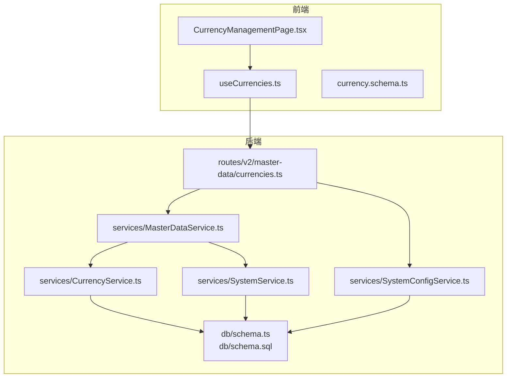
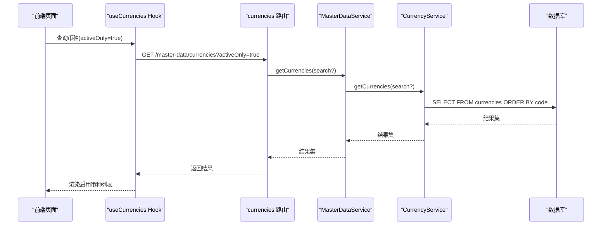
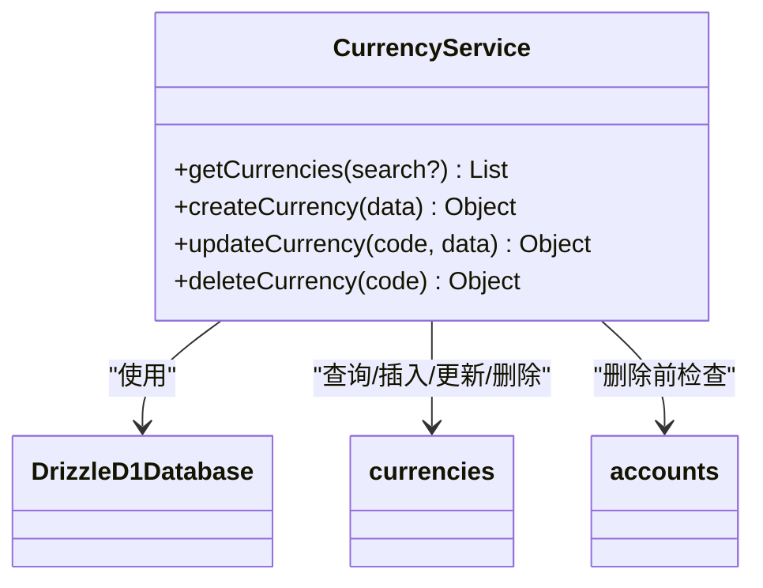
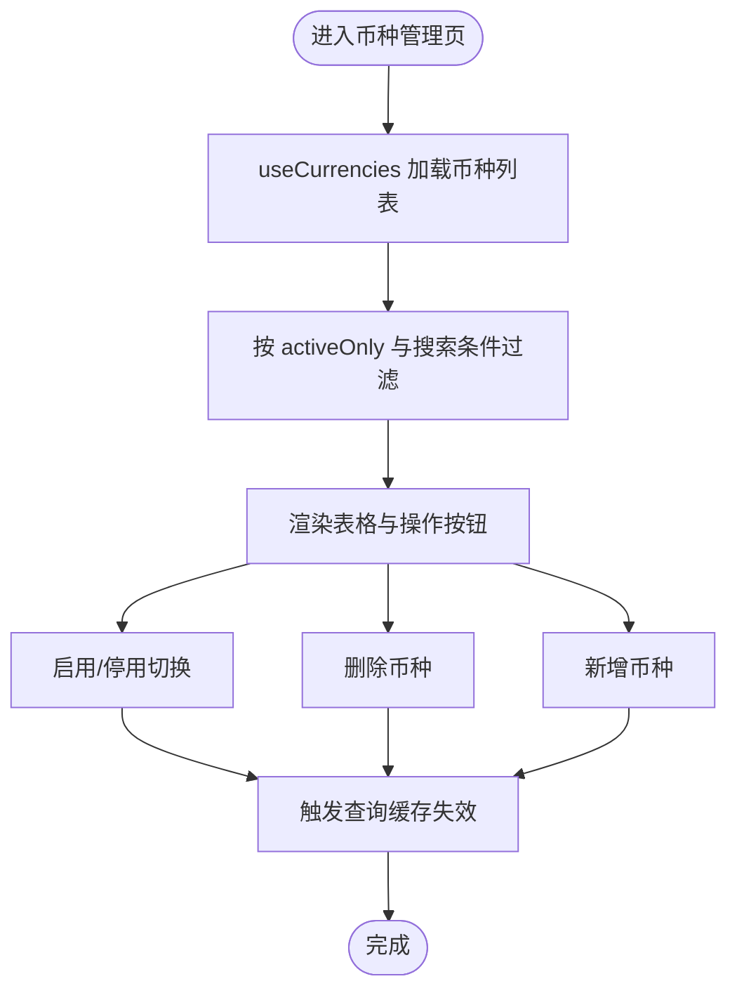
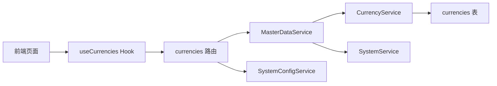

# 币种管理

<cite>
**本文档引用的文件**
- [backend/src/services/CurrencyService.ts](file://backend/src/services/CurrencyService.ts)
- [backend/src/routes/v2/master-data/currencies.ts](file://backend/src/routes/v2/master-data/currencies.ts)
- [backend/src/db/schema.ts](file://backend/src/db/schema.ts)
- [backend/src/db/schema.sql](file://backend/src/db/schema.sql)
- [backend/src/services/MasterDataService.ts](file://backend/src/services/MasterDataService.ts)
- [backend/src/services/SystemService.ts](file://backend/src/services/SystemService.ts)
- [backend/src/schemas/master-data.schema.ts](file://backend/src/schemas/master-data.schema.ts)
- [backend/src/routes/v2/system-config.ts](file://backend/src/routes/v2/system-config.ts)
- [backend/src/services/SystemConfigService.ts](file://backend/src/services/SystemConfigService.ts)
- [frontend/src/features/system/pages/CurrencyManagementPage.tsx](file://frontend/src/features/system/pages/CurrencyManagementPage.tsx)
- [frontend/src/hooks/business/useCurrencies.ts](file://frontend/src/hooks/business/useCurrencies.ts)
- [frontend/src/validations/currency.schema.ts](file://frontend/src/validations/currency.schema.ts)
- [frontend/src/types/domain.ts](file://frontend/src/types/domain.ts)
- [backend/test/services/CurrencyService.test.ts](file://backend/test/services/CurrencyService.test.ts)
- [backend/test/services/SystemService.test.ts](file://backend/test/services/SystemService.test.ts)
- [backend/test/routes/v2/master-data.test.ts](file://backend/test/routes/v2/master-data.test.ts)
</cite>

## 目录
1. [简介](#简介)
2. [项目结构](#项目结构)
3. [核心组件](#核心组件)
4. [架构总览](#架构总览)
5. [详细组件分析](#详细组件分析)
6. [依赖关系分析](#依赖关系分析)
7. [性能与一致性考虑](#性能与一致性考虑)
8. [故障排查指南](#故障排查指南)
9. [结论](#结论)
10. [附录：API 使用示例与最佳实践](#附录api-使用示例与最佳实践)

## 简介
本文件系统化梳理“币种管理”能力，覆盖币种的增删改查、启用/停用控制、批量操作、默认币种初始化、汇率基准预留接口，以及前端页面与后端服务的协同。重点说明 CurrencyService 如何通过数据库唯一约束与业务规则维护系统内多币种环境的一致性；如何通过启用状态控制防止已停用币种被新业务引用；如何在跨币种交易中预留汇率转换接口；以及数据库层的唯一码约束与精度配置如何保障财务计算准确性。

## 项目结构
围绕币种管理的关键文件分布如下：
- 后端服务层：CurrencyService 提供币种 CRUD 与校验；MasterDataService 作为门面委托；SystemService 提供默认币种初始化；SystemConfigService 提供系统配置读写。
- 后端路由层：currencies 路由提供币种列表、创建、更新、删除、批量操作等 API。
- 数据库层：currencies 表定义币种主键、名称、启用状态等字段；schema.ts 与 schema.sql 定义表结构与索引。
- 前端层：CurrencyManagementPage 页面负责展示与交互；useCurrencies Hook 负责查询与缓存；currency.schema 校验表单输入。

图表来源
- [backend/src/routes/v2/master-data/currencies.ts](file://backend/src/routes/v2/master-data/currencies.ts#L1-L78)
- [backend/src/services/MasterDataService.ts](file://backend/src/services/MasterDataService.ts#L170-L221)
- [backend/src/services/CurrencyService.ts](file://backend/src/services/CurrencyService.ts#L1-L78)
- [backend/src/services/SystemService.ts](file://backend/src/services/SystemService.ts#L45-L71)
- [backend/src/services/SystemConfigService.ts](file://backend/src/services/SystemConfigService.ts#L1-L61)
- [backend/src/db/schema.ts](file://backend/src/db/schema.ts#L213-L218)
- [backend/src/db/schema.sql](file://backend/src/db/schema.sql#L148-L154)

章节来源
- [backend/src/routes/v2/master-data/currencies.ts](file://backend/src/routes/v2/master-data/currencies.ts#L1-L78)
- [backend/src/services/MasterDataService.ts](file://backend/src/services/MasterDataService.ts#L170-L221)
- [backend/src/services/CurrencyService.ts](file://backend/src/services/CurrencyService.ts#L1-L78)
- [backend/src/services/SystemService.ts](file://backend/src/services/SystemService.ts#L45-L71)
- [backend/src/services/SystemConfigService.ts](file://backend/src/services/SystemConfigService.ts#L1-L61)
- [backend/src/db/schema.ts](file://backend/src/db/schema.ts#L213-L218)
- [backend/src/db/schema.sql](file://backend/src/db/schema.sql#L148-L154)

## 核心组件
- CurrencyService：提供币种列表检索、创建、更新、删除；对币种代码进行唯一性校验；对删除前的关联账户进行约束检查；返回标准化结果。
- MasterDataService：作为门面，统一调度各主数据服务；提供币种批量操作入口。
- SystemService：提供默认币种初始化（确保常用币种存在），避免业务启动时缺失基础币种。
- SystemConfigService：提供系统配置读取/写入能力，可用于未来扩展“默认币种”等配置项。
- 前端 useCurrencies：封装币种查询、选项转换、缓存失效策略；支持启用/停用切换与批量操作。
- 前端 CurrencyManagementPage：提供币种列表、搜索、启用/停用、删除、新增等 UI 操作。

章节来源
- [backend/src/services/CurrencyService.ts](file://backend/src/services/CurrencyService.ts#L1-L78)
- [backend/src/services/MasterDataService.ts](file://backend/src/services/MasterDataService.ts#L170-L221)
- [backend/src/services/SystemService.ts](file://backend/src/services/SystemService.ts#L45-L71)
- [backend/src/services/SystemConfigService.ts](file://backend/src/services/SystemConfigService.ts#L1-L61)
- [frontend/src/hooks/business/useCurrencies.ts](file://frontend/src/hooks/business/useCurrencies.ts#L1-L122)
- [frontend/src/features/system/pages/CurrencyManagementPage.tsx](file://frontend/src/features/system/pages/CurrencyManagementPage.tsx#L1-L238)

## 架构总览
币种管理采用“前端 Hook + 后端路由 + 服务层 + 数据库”的分层架构。前端通过 useCurrencies 获取币种列表并按启用状态过滤；后端路由基于权限与缓存策略调用 MasterDataService，再委派到 CurrencyService；数据库层通过唯一主键与外键约束保证一致性。

图表来源
- [frontend/src/hooks/business/useCurrencies.ts](file://frontend/src/hooks/business/useCurrencies.ts#L15-L31)
- [backend/src/routes/v2/master-data/currencies.ts](file://backend/src/routes/v2/master-data/currencies.ts#L44-L78)
- [backend/src/services/MasterDataService.ts](file://backend/src/services/MasterDataService.ts#L172-L174)
- [backend/src/services/CurrencyService.ts](file://backend/src/services/CurrencyService.ts#L14-L26)
- [backend/src/db/schema.ts](file://backend/src/db/schema.ts#L213-L218)

## 详细组件分析

### CurrencyService 组件分析
- 列表查询：支持按代码/名称模糊检索，按 code 升序返回。
- 创建币种：自动将代码转为大写；若重复则抛出重复错误；默认启用。
- 更新币种：支持更新名称与启用状态；大小写不敏感。
- 删除币种：先检查是否存在关联账户；若存在则阻止删除；删除成功后返回名称用于审计记录。
- 错误处理：统一使用错误工具抛出业务错误与重复错误。

图表来源
- [backend/src/services/CurrencyService.ts](file://backend/src/services/CurrencyService.ts#L1-L78)
- [backend/src/db/schema.ts](file://backend/src/db/schema.ts#L139-L149)
- [backend/src/db/schema.ts](file://backend/src/db/schema.ts#L213-L218)

章节来源
- [backend/src/services/CurrencyService.ts](file://backend/src/services/CurrencyService.ts#L14-L75)
- [backend/test/services/CurrencyService.test.ts](file://backend/test/services/CurrencyService.test.ts#L43-L180)

### 前端组件与 Hook 分析
- CurrencyManagementPage：提供币种列表、搜索、启用/停用、删除、新增等操作；支持本地过滤与排序。
- useCurrencies：封装查询、选项转换、缓存失效；支持 activeOnly 过滤；统一缓存时间。
- 表单校验：前端对币种代码格式、长度、是否大写进行校验。

图表来源
- [frontend/src/features/system/pages/CurrencyManagementPage.tsx](file://frontend/src/features/system/pages/CurrencyManagementPage.tsx#L1-L238)
- [frontend/src/hooks/business/useCurrencies.ts](file://frontend/src/hooks/business/useCurrencies.ts#L1-L122)
- [frontend/src/validations/currency.schema.ts](file://frontend/src/validations/currency.schema.ts#L1-L12)

章节来源
- [frontend/src/features/system/pages/CurrencyManagementPage.tsx](file://frontend/src/features/system/pages/CurrencyManagementPage.tsx#L1-L238)
- [frontend/src/hooks/business/useCurrencies.ts](file://frontend/src/hooks/business/useCurrencies.ts#L1-L122)
- [frontend/src/validations/currency.schema.ts](file://frontend/src/validations/currency.schema.ts#L1-L12)

### 默认币种初始化与系统配置
- SystemService.ensureDefaultCurrencies：启动时确保常用币种（如 CNY、USD）存在，避免业务缺失基础币种。
- SystemConfigService：提供系统配置读取/写入能力，可用于未来扩展“默认币种”等配置项。

章节来源
- [backend/src/services/SystemService.ts](file://backend/src/services/SystemService.ts#L45-L71)
- [backend/test/services/SystemService.test.ts](file://backend/test/services/SystemService.test.ts#L51-L79)
- [backend/src/services/SystemConfigService.ts](file://backend/src/services/SystemConfigService.ts#L1-L61)
- [backend/src/routes/v2/system-config.ts](file://backend/src/routes/v2/system-config.ts#L1-L243)

### 数据模型与约束
- currencies 表：code 为主键，name 必填，active 默认启用。
- schema.sql 中定义了相同结构，确保迁移与运行时一致。
- 币种代码唯一性由主键约束保证，避免重复创建。

章节来源
- [backend/src/db/schema.ts](file://backend/src/db/schema.ts#L213-L218)
- [backend/src/db/schema.sql](file://backend/src/db/schema.sql#L148-L154)

## 依赖关系分析
- 路由层依赖权限校验与缓存；调用 MasterDataService；返回审计日志。
- MasterDataService 依赖 CurrencyService 与 SystemService；提供批量操作入口。
- CurrencyService 依赖 Drizzle ORM 访问数据库；依赖错误工具抛出业务异常。
- 前端依赖 useCurrencies Hook 与表单校验；UI 与服务层解耦。

图表来源
- [backend/src/routes/v2/master-data/currencies.ts](file://backend/src/routes/v2/master-data/currencies.ts#L1-L78)
- [backend/src/services/MasterDataService.ts](file://backend/src/services/MasterDataService.ts#L170-L221)
- [backend/src/services/CurrencyService.ts](file://backend/src/services/CurrencyService.ts#L1-L78)
- [backend/src/services/SystemService.ts](file://backend/src/services/SystemService.ts#L45-L71)
- [backend/src/services/SystemConfigService.ts](file://backend/src/services/SystemConfigService.ts#L1-L61)
- [frontend/src/hooks/business/useCurrencies.ts](file://frontend/src/hooks/business/useCurrencies.ts#L1-L122)

章节来源
- [backend/src/routes/v2/master-data/currencies.ts](file://backend/src/routes/v2/master-data/currencies.ts#L1-L78)
- [backend/src/services/MasterDataService.ts](file://backend/src/services/MasterDataService.ts#L170-L221)
- [backend/src/services/CurrencyService.ts](file://backend/src/services/CurrencyService.ts#L1-L78)
- [backend/src/services/SystemService.ts](file://backend/src/services/SystemService.ts#L45-L71)
- [backend/src/services/SystemConfigService.ts](file://backend/src/services/SystemConfigService.ts#L1-L61)
- [frontend/src/hooks/business/useCurrencies.ts](file://frontend/src/hooks/business/useCurrencies.ts#L1-L122)

## 性能与一致性考虑
- 列表查询与缓存：currencies 路由实现查询缓存，支持后端过滤 activeOnly，减少数据库压力。
- 唯一约束：currencies.code 为主键，避免重复币种代码；删除前检查账户关联，防止破坏业务一致性。
- 财务精度：涉及金额的字段普遍使用整数“分”单位存储（如 amount_cents、opening_cents），避免浮点误差；汇率字段在转账场景使用 REAL 存储，便于后续扩展。
- 启用状态控制：前端与后端均支持 activeOnly 过滤，确保仅显示启用币种，防止已停用币种参与新业务。

章节来源
- [backend/src/routes/v2/master-data/currencies.ts](file://backend/src/routes/v2/master-data/currencies.ts#L44-L78)
- [backend/src/services/CurrencyService.ts](file://backend/src/services/CurrencyService.ts#L60-L75)
- [backend/src/db/schema.ts](file://backend/src/db/schema.ts#L139-L149)
- [backend/src/db/schema.ts](file://backend/src/db/schema.ts#L448-L476)

## 故障排查指南
- 重复币种代码：创建时若币种代码已存在，会抛出重复错误；前端表单校验可提前拦截非法输入。
- 删除失败：若币种仍有账户使用，删除会被拒绝；需先迁移或删除相关账户后再尝试删除。
- 启用状态异常：若启用状态未生效，检查 activeOnly 参数与前端过滤逻辑。
- 批量操作：批量删除/停用/启用时，失败项会记录原因，便于定位问题。

章节来源
- [backend/src/services/CurrencyService.ts](file://backend/src/services/CurrencyService.ts#L28-L75)
- [backend/test/services/CurrencyService.test.ts](file://backend/test/services/CurrencyService.test.ts#L131-L180)
- [backend/test/routes/v2/master-data.test.ts](file://backend/test/routes/v2/master-data.test.ts#L30-L43)

## 结论
币种管理通过“唯一约束 + 启用状态 + 关联检查 + 缓存策略 + 前后端协同”的方式，实现了高一致性与可维护性。当前系统已具备默认币种初始化能力与启用状态控制机制；在跨币种交易方面，转账模块已预留汇率字段，为后续扩展提供接口基础。建议在后续迭代中完善“默认币种”系统配置项与汇率基准管理，以进一步提升财务计算的准确性与可追溯性。

## 附录：API 使用示例与最佳实践

### API 使用示例
- 获取启用币种列表
  - 方法与路径：GET /v2/master-data/currencies?activeOnly=true
  - 请求参数：activeOnly=true/false，search=关键词
  - 响应：返回启用币种列表（按 code 升序）
- 创建币种
  - 方法与路径：POST /v2/master-data/currencies
  - 请求体：{ code: "字符串(3位大写)", name: "字符串" }
  - 响应：返回新建币种的 code、name、active
- 更新币种
  - 方法与路径：PUT /v2/master-data/currencies/{code}
  - 请求体：{ name: "字符串", active: 0/1 }
  - 响应：空对象
- 删除币种
  - 方法与路径：DELETE /v2/master-data/currencies/{code}
  - 响应：空对象（若成功）
- 批量操作币种
  - 方法与路径：POST /v2/master-data/currencies/batch
  - 请求体：{ ids: ["CNY","USD"], operation: "delete|activate|deactivate" }
  - 响应：包含成功/失败计数与失败原因

章节来源
- [backend/src/routes/v2/master-data/currencies.ts](file://backend/src/routes/v2/master-data/currencies.ts#L44-L78)
- [backend/src/routes/v2/master-data/currencies.ts](file://backend/src/routes/v2/master-data/currencies.ts#L108-L141)
- [backend/src/routes/v2/master-data/currencies.ts](file://backend/src/routes/v2/master-data/currencies.ts#L174-L203)
- [backend/src/routes/v2/master-data/currencies.ts](file://backend/src/routes/v2/master-data/currencies.ts#L229-L254)
- [backend/src/routes/v2/master-data/currencies.ts](file://backend/src/routes/v2/master-data/currencies.ts#L288-L318)

### 最佳实践
- 初始化默认币种：在系统启动时调用 SystemService.ensureDefaultCurrencies，确保常用币种存在。
- 启用状态控制：前端与后端均使用 activeOnly 过滤，避免已停用币种参与新业务。
- 批量导入常用币种：可通过批量操作接口一次性激活/停用多个币种，减少人工干预。
- 跨币种交易：转账模块已预留汇率字段，建议在业务流程中明确汇率来源与计算规则，确保金额换算准确。
- 财务精度：统一使用“分”为最小单位存储金额，避免浮点误差；汇率字段使用 REAL 存储，便于后续扩展。

章节来源
- [backend/src/services/SystemService.ts](file://backend/src/services/SystemService.ts#L45-L71)
- [backend/src/services/MasterDataService.ts](file://backend/src/services/MasterDataService.ts#L188-L221)
- [backend/src/db/schema.ts](file://backend/src/db/schema.ts#L448-L476)
- [frontend/src/hooks/business/useCurrencies.ts](file://frontend/src/hooks/business/useCurrencies.ts#L1-L122)