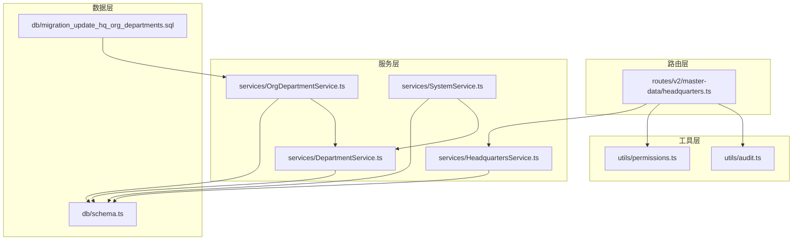
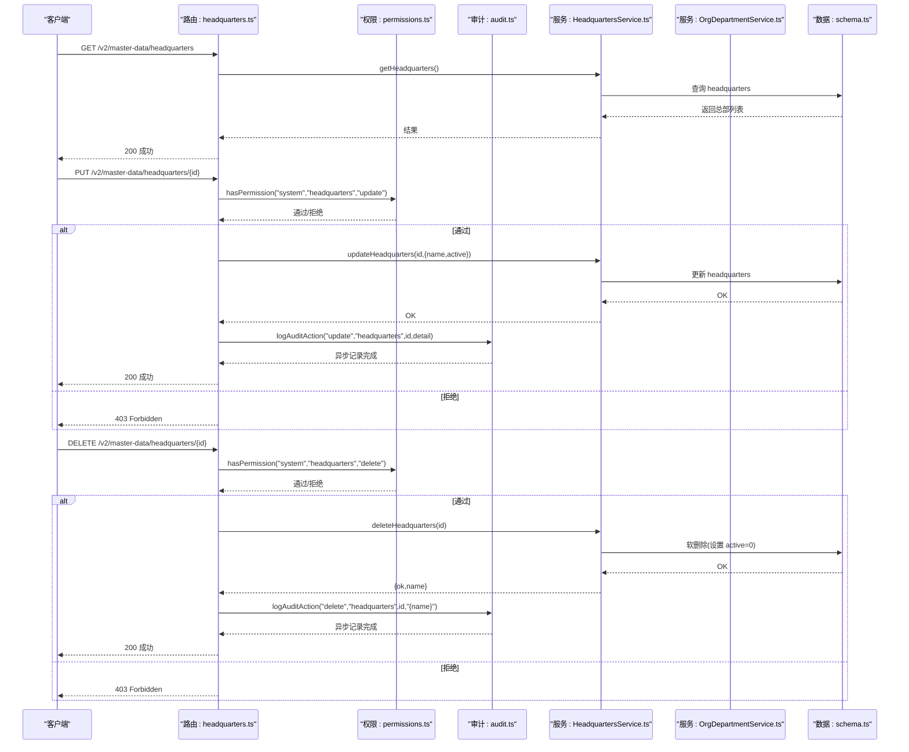
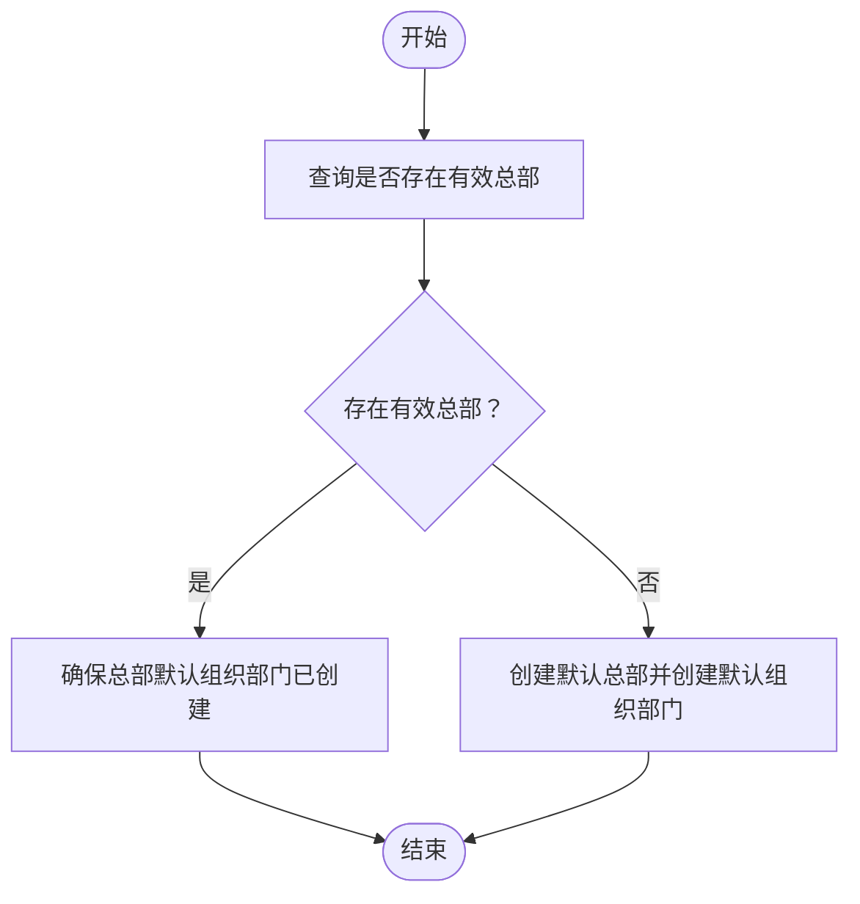
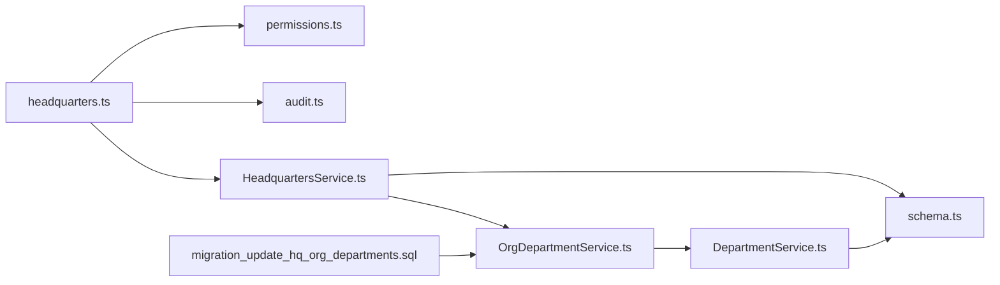

# 总部管理

<cite>
**本文引用的文件**
- [HeadquartersService.ts](file://backend/src/services/HeadquartersService.ts)
- [headquarters.ts](file://backend/src/routes/v2/master-data/headquarters.ts)
- [schema.ts](file://backend/src/db/schema.ts)
- [master-data.schema.ts](file://backend/src/schemas/master-data.schema.ts)
- [audit.ts](file://backend/src/utils/audit.ts)
- [permissions.ts](file://backend/src/utils/permissions.ts)
- [SystemService.ts](file://backend/src/services/SystemService.ts)
- [OrgDepartmentService.ts](file://backend/src/services/OrgDepartmentService.ts)
- [DepartmentService.ts](file://backend/src/services/DepartmentService.ts)
- [migration_update_hq_org_departments.sql](file://backend/src/db/migration_update_hq_org_departments.sql)
- [generate-seed.ts](file://backend/scripts/generate-seed.ts)
- [index.ts](file://backend/src/index.ts)
</cite>

## 目录
1. [简介](#简介)
2. [项目结构](#项目结构)
3. [核心组件](#核心组件)
4. [架构总览](#架构总览)
5. [详细组件分析](#详细组件分析)
6. [依赖分析](#依赖分析)
7. [性能考虑](#性能考虑)
8. [故障排查指南](#故障排查指南)
9. [结论](#结论)
10. [附录：API 调用示例与最佳实践](#附录api-调用示例与最佳实践)

## 简介
本文件面向“总部管理”功能，系统性阐述总部实体作为组织顶层节点的特殊语义，以及其与部门、员工的归属关系；重点说明 HeadquartersService 中对唯一性约束的强制校验逻辑（系统仅允许一个有效总部），文档化总部信息变更时的审计日志记录机制，并解释其与组织架构同步更新的事件驱动模式。同时提供 API 调用示例，展示如何初始化总部信息及后续维护操作，并强调该功能在多分支机构场景下的核心作用。

## 项目结构
围绕“总部管理”的关键文件分布如下：
- 路由层：负责对外暴露 API，进行权限校验与审计日志记录
- 服务层：实现业务逻辑，包括唯一性约束校验、组织架构同步触发
- 数据层：定义表结构与迁移脚本，支撑总部与组织架构的持久化
- 工具层：提供审计日志、权限控制等通用能力

图表来源
- [headquarters.ts](file://backend/src/routes/v2/master-data/headquarters.ts#L1-L166)
- [HeadquartersService.ts](file://backend/src/services/HeadquartersService.ts#L1-L45)
- [OrgDepartmentService.ts](file://backend/src/services/OrgDepartmentService.ts#L1-L129)
- [DepartmentService.ts](file://backend/src/services/DepartmentService.ts#L54-L97)
- [SystemService.ts](file://backend/src/services/SystemService.ts#L1-L43)
- [schema.ts](file://backend/src/db/schema.ts#L50-L93)
- [audit.ts](file://backend/src/utils/audit.ts#L1-L90)
- [permissions.ts](file://backend/src/utils/permissions.ts#L1-L273)
- [migration_update_hq_org_departments.sql](file://backend/src/db/migration_update_hq_org_departments.sql#L1-L16)

章节来源
- [headquarters.ts](file://backend/src/routes/v2/master-data/headquarters.ts#L1-L166)
- [HeadquartersService.ts](file://backend/src/services/HeadquartersService.ts#L1-L45)
- [schema.ts](file://backend/src/db/schema.ts#L50-L93)

## 核心组件
- 路由层（headquarters.ts）：提供总部列表查询、创建（禁用）、更新、删除接口；在更新/删除时进行权限校验并记录审计日志。
- 服务层（HeadquartersService.ts）：提供总部查询、更新、软删除（将 active 设为 0）能力；对更新字段做选择性写入。
- 数据层（schema.ts）：定义 headquarters 表结构；departments 表通过 hqId 关联总部。
- 工具层（audit.ts、permissions.ts）：提供审计日志异步记录与权限校验能力。
- 组织同步（OrgDepartmentService.ts、DepartmentService.ts、SystemService.ts）：在总部存在时，自动为总部创建默认组织部门；迁移脚本将旧的“项目级组织部门”统一迁移到总部部门下。
- 初始化（index.ts、generate-seed.ts）：系统启动或种子脚本会插入一条总部记录，确保系统具备顶层组织节点。

章节来源
- [headquarters.ts](file://backend/src/routes/v2/master-data/headquarters.ts#L1-L166)
- [HeadquartersService.ts](file://backend/src/services/HeadquartersService.ts#L1-L45)
- [schema.ts](file://backend/src/db/schema.ts#L50-L93)
- [audit.ts](file://backend/src/utils/audit.ts#L1-L90)
- [permissions.ts](file://backend/src/utils/permissions.ts#L1-L273)
- [OrgDepartmentService.ts](file://backend/src/services/OrgDepartmentService.ts#L1-L129)
- [DepartmentService.ts](file://backend/src/services/DepartmentService.ts#L54-L97)
- [SystemService.ts](file://backend/src/services/SystemService.ts#L1-L43)
- [migration_update_hq_org_departments.sql](file://backend/src/db/migration_update_hq_org_departments.sql#L1-L16)
- [index.ts](file://backend/src/index.ts#L200-L234)
- [generate-seed.ts](file://backend/scripts/generate-seed.ts#L2-L17)

## 架构总览
总部管理采用“路由-服务-数据-工具”的分层设计，结合审计日志与权限控制，形成可追溯、可治理的变更闭环。组织架构同步通过服务层在必要时触发默认组织部门创建，确保总部作为顶层节点的语义得到一致体现。

图表来源
- [headquarters.ts](file://backend/src/routes/v2/master-data/headquarters.ts#L1-L166)
- [HeadquartersService.ts](file://backend/src/services/HeadquartersService.ts#L1-L45)
- [audit.ts](file://backend/src/utils/audit.ts#L1-L90)
- [permissions.ts](file://backend/src/utils/permissions.ts#L1-L273)
- [schema.ts](file://backend/src/db/schema.ts#L50-L93)

## 详细组件分析

### 路由层：总部 API
- 列表查询：返回所有总部记录，供前端展示与选择。
- 创建接口：当前被禁用（抛出业务错误），以保证系统仅保留一个有效总部。
- 更新接口：校验权限后调用服务层更新；更新完成后记录审计日志。
- 删除接口：校验权限后执行软删除（将 active 设为 0），并记录审计日志。

章节来源
- [headquarters.ts](file://backend/src/routes/v2/master-data/headquarters.ts#L1-L166)

### 服务层：HeadquartersService
- getHeadquarters：查询所有总部记录。
- updateHeadquarters：按需更新 name/active 字段；若传入空对象则直接返回成功。
- deleteHeadquarters：软删除（设置 active=0），返回被删除总部的名称。

注意：当前服务层未实现“唯一有效总部”的数据库级约束校验，唯一性约束主要通过业务流程保障（例如初始化与迁移脚本）。

章节来源
- [HeadquartersService.ts](file://backend/src/services/HeadquartersService.ts#L1-L45)

### 数据层：headquarters 与 departments
- headquarters 表：保存总部标识、名称与激活状态。
- departments 表：通过 hqId 关联总部，体现“部门隶属于总部”的归属关系。

章节来源
- [schema.ts](file://backend/src/db/schema.ts#L50-L93)

### 审计日志与权限控制
- 审计日志：logAuditAction 在路由层调用，异步记录操作人、动作、实体、详情与 IP 地址等信息。
- 权限控制：hasPermission 对“system.headquarters.update/delete”进行授权校验，防止越权操作。

章节来源
- [audit.ts](file://backend/src/utils/audit.ts#L1-L90)
- [permissions.ts](file://backend/src/utils/permissions.ts#L1-L273)
- [headquarters.ts](file://backend/src/routes/v2/master-data/headquarters.ts#L1-L166)

### 组织架构同步与事件驱动模式
- SystemService.getOrCreateDefaultHQ：若不存在有效总部，则创建默认总部并为其创建默认组织部门。
- OrgDepartmentService.getOrgDepartments：当查询项目组织部门且该项目即为“总部部门”时，若尚未存在组织部门，则自动创建默认组织部门。
- DepartmentService.createDefaultOrgDepartments：为项目（或总部）创建一组默认组织部门（如“项目人事/财务/行政/开发部”等），并支持幂等。
- 迁移脚本 migration_update_hq_org_departments.sql：将旧的“项目级组织部门”统一迁移到总部部门下，确保总部作为顶层节点的语义。

图表来源
- [SystemService.ts](file://backend/src/services/SystemService.ts#L1-L43)
- [OrgDepartmentService.ts](file://backend/src/services/OrgDepartmentService.ts#L1-L129)
- [DepartmentService.ts](file://backend/src/services/DepartmentService.ts#L54-L97)
- [migration_update_hq_org_departments.sql](file://backend/src/db/migration_update_hq_org_departments.sql#L1-L16)

章节来源
- [SystemService.ts](file://backend/src/services/SystemService.ts#L1-L43)
- [OrgDepartmentService.ts](file://backend/src/services/OrgDepartmentService.ts#L1-L129)
- [DepartmentService.ts](file://backend/src/services/DepartmentService.ts#L54-L97)
- [migration_update_hq_org_departments.sql](file://backend/src/db/migration_update_hq_org_departments.sql#L1-L16)

### 唯一性约束与强制校验逻辑
- 当前服务层未实现数据库级唯一约束；业务上通过以下方式保障“仅有一个有效总部”：
  - 初始化脚本与系统启动时插入一条总部记录；
  - 种子脚本固定插入一条总部记录；
  - 路由层创建接口被禁用，避免重复创建；
  - 若需切换总部，应通过更新现有总部或迁移脚本进行。

章节来源
- [index.ts](file://backend/src/index.ts#L200-L234)
- [generate-seed.ts](file://backend/scripts/generate-seed.ts#L2-L17)
- [headquarters.ts](file://backend/src/routes/v2/master-data/headquarters.ts#L44-L75)

## 依赖分析
- 路由层依赖权限与审计工具，调用服务层执行业务操作。
- 服务层依赖数据层进行持久化；在需要时调用组织部门服务创建默认组织部门。
- 数据层定义表结构，迁移脚本确保历史数据与新架构的一致性。

图表来源
- [headquarters.ts](file://backend/src/routes/v2/master-data/headquarters.ts#L1-L166)
- [HeadquartersService.ts](file://backend/src/services/HeadquartersService.ts#L1-L45)
- [OrgDepartmentService.ts](file://backend/src/services/OrgDepartmentService.ts#L1-L129)
- [DepartmentService.ts](file://backend/src/services/DepartmentService.ts#L54-L97)
- [schema.ts](file://backend/src/db/schema.ts#L50-L93)
- [audit.ts](file://backend/src/utils/audit.ts#L1-L90)
- [permissions.ts](file://backend/src/utils/permissions.ts#L1-L273)
- [migration_update_hq_org_departments.sql](file://backend/src/db/migration_update_hq_org_departments.sql#L1-L16)

章节来源
- [headquarters.ts](file://backend/src/routes/v2/master-data/headquarters.ts#L1-L166)
- [HeadquartersService.ts](file://backend/src/services/HeadquartersService.ts#L1-L45)
- [OrgDepartmentService.ts](file://backend/src/services/OrgDepartmentService.ts#L1-L129)
- [DepartmentService.ts](file://backend/src/services/DepartmentService.ts#L54-L97)
- [schema.ts](file://backend/src/db/schema.ts#L50-L93)
- [audit.ts](file://backend/src/utils/audit.ts#L1-L90)
- [permissions.ts](file://backend/src/utils/permissions.ts#L1-L273)
- [migration_update_hq_org_departments.sql](file://backend/src/db/migration_update_hq_org_departments.sql#L1-L16)

## 性能考虑
- 审计日志采用异步记录（waitUntil），避免阻塞主请求路径，提升响应性能。
- 路由层对更新字段做选择性写入，减少不必要的数据库写操作。
- 组织部门的默认创建在首次缺失时触发，避免重复创建带来的开销。

[本节为通用建议，不直接分析具体文件]

## 故障排查指南
- 403 Forbidden：检查当前用户是否具备 system.headquarters.update 或 system.headquarters.delete 权限。
- 404 Not Found：更新/删除的总部 ID 不存在。
- 审计日志未记录：确认上下文中有 userId 或 session 可用，且 AuditService 注入正常。
- 组织部门未同步：确认查询的项目是否为“总部部门”，并在 OrgDepartmentService 中触发了默认组织部门创建逻辑。

章节来源
- [headquarters.ts](file://backend/src/routes/v2/master-data/headquarters.ts#L1-L166)
- [audit.ts](file://backend/src/utils/audit.ts#L1-L90)
- [permissions.ts](file://backend/src/utils/permissions.ts#L1-L273)
- [OrgDepartmentService.ts](file://backend/src/services/OrgDepartmentService.ts#L1-L129)

## 结论
总部管理通过严格的权限控制与审计日志，确保组织顶层节点的唯一性与可追溯性；通过服务层在必要时自动创建默认组织部门，形成“总部—部门—站点/项目”的清晰层级关系。尽管当前未在数据库层面强制唯一性约束，但通过初始化、迁移与路由层策略共同保障了系统一致性。在多分支机构场景下，总部作为顶层节点，是组织架构与财务核算的中枢，其稳定性与可维护性至关重要。

[本节为总结性内容，不直接分析具体文件]

## 附录：API 调用示例与最佳实践

- 初始化总部信息
  - 方式一：系统启动时自动初始化（幂等插入）
  - 方式二：种子脚本批量插入
  - 方式三：系统服务在首次调用时创建默认总部并默认组织部门

- 后续维护操作
  - 更新总部名称或激活状态：PUT /v2/master-data/headquarters/{id}
  - 删除总部（软删除）：DELETE /v2/master-data/headquarters/{id}

- 多分支机构场景的最佳实践
  - 保持仅有一个有效总部，其他机构以“部门/项目”形式存在
  - 通过组织部门默认模板统一各机构的组织结构
  - 使用审计日志追踪总部信息变更，便于合规与审计

章节来源
- [index.ts](file://backend/src/index.ts#L200-L234)
- [generate-seed.ts](file://backend/scripts/generate-seed.ts#L2-L17)
- [SystemService.ts](file://backend/src/services/SystemService.ts#L1-L43)
- [headquarters.ts](file://backend/src/routes/v2/master-data/headquarters.ts#L1-L166)