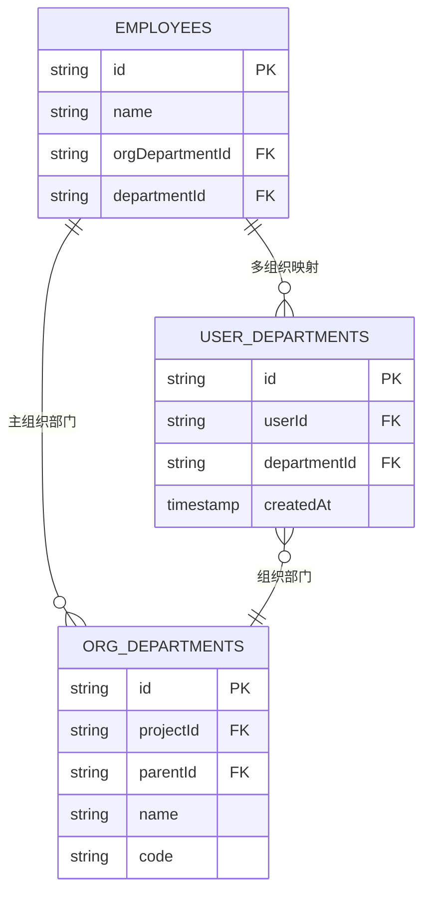
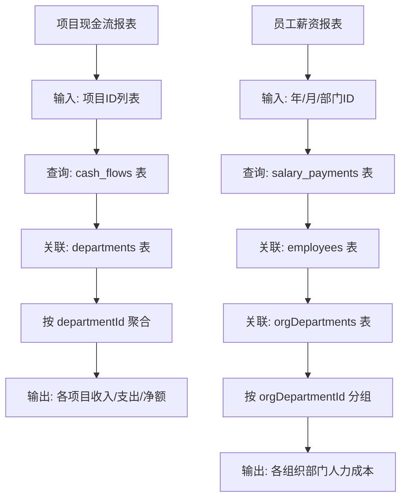
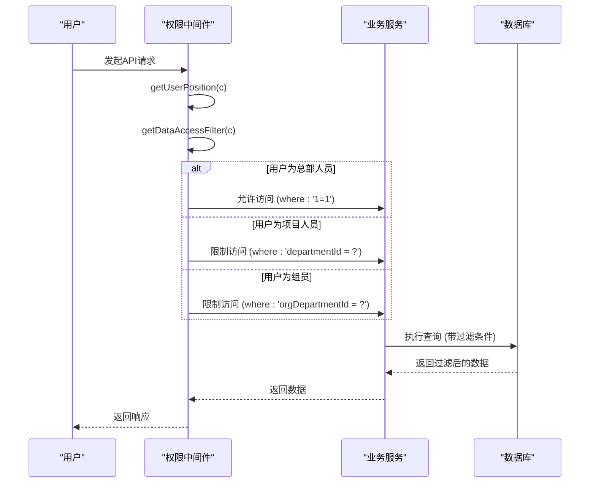

# 组织部门管理

<cite>
**本文档引用文件**   
- [org-departments.ts](file://backend/src/routes/v2/master-data/org-departments.ts)
- [OrgDepartmentService.ts](file://backend/src/services/OrgDepartmentService.ts)
- [schema.ts](file://backend/src/db/schema.ts)
- [permissions.ts](file://backend/src/utils/permissions.ts)
- [EmployeeService.ts](file://backend/src/services/EmployeeService.ts)
- [ReportService.ts](file://backend/src/services/ReportService.ts)
</cite>

## 目录
1. [引言](#引言)
2. [组织部门与普通部门的区别](#组织部门与普通部门的区别)
3. [OrgDepartmentService 核心功能](#orgdepartmentservice-核心功能)
4. [灵活的组织映射关系](#灵活的组织映射关系)
5. [报表统计中的关键作用](#报表统计中的关键作用)
6. [API 示例：为员工分配多组织角色](#api-示例为员工分配多组织角色)
7. [基于组织部门的数据访问隔离](#基于组织部门的数据访问隔离)

## 引言
组织部门（Org Department）是本财务管理系统中用于实现跨项目、跨业务线虚拟组织划分的核心概念。与传统的、基于物理项目或实体部门的管理方式不同，组织部门提供了一种更加灵活和动态的员工分组机制。它允许员工同时隶属于多个不同的组织部门，从而支持复杂的业务场景，如矩阵式管理、跨项目协作和多维度成本归集。本文档将深入阐述组织部门管理接口的设计与实现，重点说明其与普通部门管理的区别，以及如何通过 `OrgDepartmentService` 支持灵活的组织映射关系。

**Section sources**
- [OrgDepartmentService.ts](file://backend/src/services/OrgDepartmentService.ts#L1-L127)
- [schema.ts](file://backend/src/db/schema.ts#L95-L109)

## 组织部门与普通部门的区别
在本系统中，"部门"（Department）和"组织部门"（Org Department）是两个不同的概念，服务于不同的管理目的。

- **普通部门 (Department)**：通常代表一个具体的项目、业务线或实体组织单元。它在系统中是员工的主要归属单位，与财务核算、项目管理等实体业务紧密绑定。例如，一个名为"项目A"的部门，其ID会作为 `projectId` 用于关联该项目下的所有财务流水、站点等资源。

- **组织部门 (Org Department)**：是一个虚拟的、逻辑上的组织单元，用于在普通部门内部进行更细粒度的划分。它不直接对应一个独立的财务核算主体，而是用于实现权限控制、报表统计和员工角色管理。例如，在"项目A"这个普通部门下，可以创建"开发部"、"测试部"、"产品部"等多个组织部门。这些组织部门可以拥有自己的权限配置和默认职位。

这种设计的关键优势在于解耦了员工的物理归属（项目）和逻辑角色（组）。一个员工可以属于"项目A"这个普通部门，但同时在"开发部"和"产品部"两个组织部门中担任角色，从而实现跨职能协作。

**Section sources**
- [schema.ts](file://backend/src/db/schema.ts#L65-L74)
- [schema.ts](file://backend/src/db/schema.ts#L95-L109)
- [EmployeeService.ts](file://backend/src/services/EmployeeService.ts#L20-L38)

## OrgDepartmentService 核心功能
`OrgDepartmentService` 是管理组织部门的核心服务类，提供了对组织部门的增删改查操作。其主要功能包括：

- **获取组织部门列表**：`getOrgDepartments(projectId?: string)` 方法用于查询指定项目下的所有组织部门。该方法会自动处理总部（HQ）的特殊情况，当查询总部项目时，若未找到任何组织部门，会自动为其创建一套默认的组织部门（如人事、财务、行政等）。
- **获取组织部门详情**：`getOrgDepartment(id: string)` 方法用于获取单个组织部门的详细信息，包括其关联的默认职位名称等。

该服务通过 `orgDepartments` 表进行数据存储，并利用 Drizzle ORM 进行数据库操作。它与 `DepartmentService` 紧密协作，在创建新项目时，会自动调用 `createDefaultOrgDepartments` 方法来初始化该项目的组织架构。

**Section sources**
- [OrgDepartmentService.ts](file://backend/src/services/OrgDepartmentService.ts#L13-L127)
- [DepartmentService.ts](file://backend/src/services/DepartmentService.ts#L88-L135)

## 灵活的组织映射关系
系统通过 `employees` 表中的 `orgDepartmentId` 字段来建立员工与组织部门的映射关系。然而，为了支持员工同时隶属于多个组织部门，系统还引入了 `user_departments` 中间表。

- **单组织映射**：对于大多数员工，其 `orgDepartmentId` 字段会指向其主要的组织部门。这通常用于确定员工的默认职位和权限。
- **多组织映射**：通过 `user_departments` 表，可以为一个员工（`user_id`）关联多个部门（`department_id`）。这里的 `department_id` 实际上指的是 `orgDepartments` 表中的ID。这使得一个员工可以同时是"开发部"的成员，也是"产品部"的成员。

当创建或更新员工时，`EmployeeService` 会负责维护 `user_departments` 表。例如，当为员工分配一个新的组织部门时，服务会检查 `user_departments` 表中是否已存在该关联，若不存在则插入一条新记录。这种设计模式实现了员工与组织部门之间的多对多关系，为灵活的组织结构提供了数据基础。



**Diagram sources **
- [schema.ts](file://backend/src/db/schema.ts#L14-L20)
- [schema.ts](file://backend/src/db/schema.ts#L95-L109)
- [schema.ts](file://backend/src/db/schema.ts#L111-L116)

**Section sources**
- [EmployeeService.ts](file://backend/src/services/EmployeeService.ts#L204-L215)
- [EmployeeService.ts](file://backend/src/services/EmployeeService.ts#L461-L479)

## 报表统计中的关键作用
组织部门在报表统计中扮演着至关重要的角色，尤其是在按项目维度归集人力成本方面。

- **项目维度归集**：系统中的 `BusinessReportService` 提供了 `getDepartmentCashFlow` 等方法，用于生成项目现金流报表。在查询时，可以通过 `departmentIds` 参数指定一个或多个普通部门（即项目）的ID。报表服务会根据这些ID，聚合该部门下所有组织部门的财务数据。
- **人力成本分析**：通过 `ReportService` 的 `getEmployeeSalaryReport` 方法，可以生成员工薪资报表。该报表能够按组织部门进行分组，从而清晰地展示每个组织部门（如开发部、测试部）的人力成本支出。这对于项目成本核算和预算控制至关重要。

例如，一个项目负责人可以查看其项目下所有组织部门的总支出，也可以深入查看"开发部"的具体薪资构成。这种多维度的统计能力，正是建立在组织部门这一灵活的虚拟划分基础之上的。



**Diagram sources **
- [ReportService.ts](file://backend/src/services/ReportService.ts#L32-L33)
- [BusinessReportService.ts](file://backend/src/services/BusinessReportService.ts#L40-L68)
- [schema.ts](file://backend/src/db/schema.ts#L172-L182)

**Section sources**
- [ReportService.ts](file://backend/src/services/ReportService.ts#L32-L33)
- [BusinessReportService.ts](file://backend/src/services/BusinessReportService.ts#L40-L68)

## API 示例：为员工分配多组织角色
以下是一个通过 `EmployeeService` 为员工分配多组织角色的代码示例：

```typescript
// 假设已获取员工ID和要分配的组织部门ID
const employeeId = 'emp-123';
const newOrgDeptId = 'org-dev-456';

// 更新员工的主要组织部门（可选）
await employeeService.update(employeeId, { orgDepartmentId: newOrgDeptId });

// 为员工添加额外的组织部门关联（实现多组织角色）
// 这会向 user_departments 表插入一条新记录
await employeeService.addUserDepartment(employeeId, newOrgDeptId);
```

在实际的API层面，前端可以通过调用员工更新接口，传递 `orgDepartmentId` 和 `departmentId` 等参数来实现。后端的 `EmployeeService` 会处理这些参数，并维护相应的数据库关系。

**Section sources**
- [EmployeeService.ts](file://backend/src/services/EmployeeService.ts#L459-L483)

## 基于组织部门的数据访问隔离
系统的权限系统深度集成了组织部门的概念，实现了精细化的数据访问隔离。

- **权限检查**：`permissions.ts` 文件中的 `hasPermission` 函数是权限检查的核心。它首先检查用户职位的权限配置，然后结合 `getDataAccessFilter` 函数生成的数据访问过滤条件。
- **数据访问过滤**：`getDataAccessFilter` 函数根据用户的职位层级（level）返回不同的SQL过滤条件：
  - **总部人员 (level=1)**：可以访问所有数据 (`where: '1=1'`)。
  - **项目人员 (level=2)**：只能访问其 `departmentId` 对应的数据。
  - **组长/组员 (level=3)**：只能访问其 `orgDepartmentId` 对应的数据，或仅限于自己的数据。

这种基于组织部门的访问控制，确保了员工只能查看和操作其权限范围内的数据。例如，一个"开发部"的组长，只能看到"开发部"这个组织部门下的所有员工和财务数据，而无法访问"产品部"的数据，从而保障了数据的安全性和业务的独立性。



**Diagram sources **
- [permissions.ts](file://backend/src/utils/permissions.ts#L196-L263)
- [permission.ts](file://backend/src/middleware/permission.ts#L12-L18)

**Section sources**
- [permissions.ts](file://backend/src/utils/permissions.ts#L99-L125)
- [permissions.ts](file://backend/src/utils/permissions.ts#L196-L263)