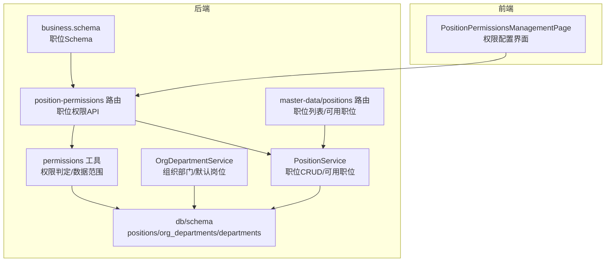
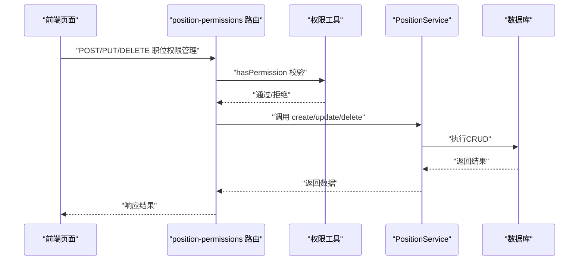
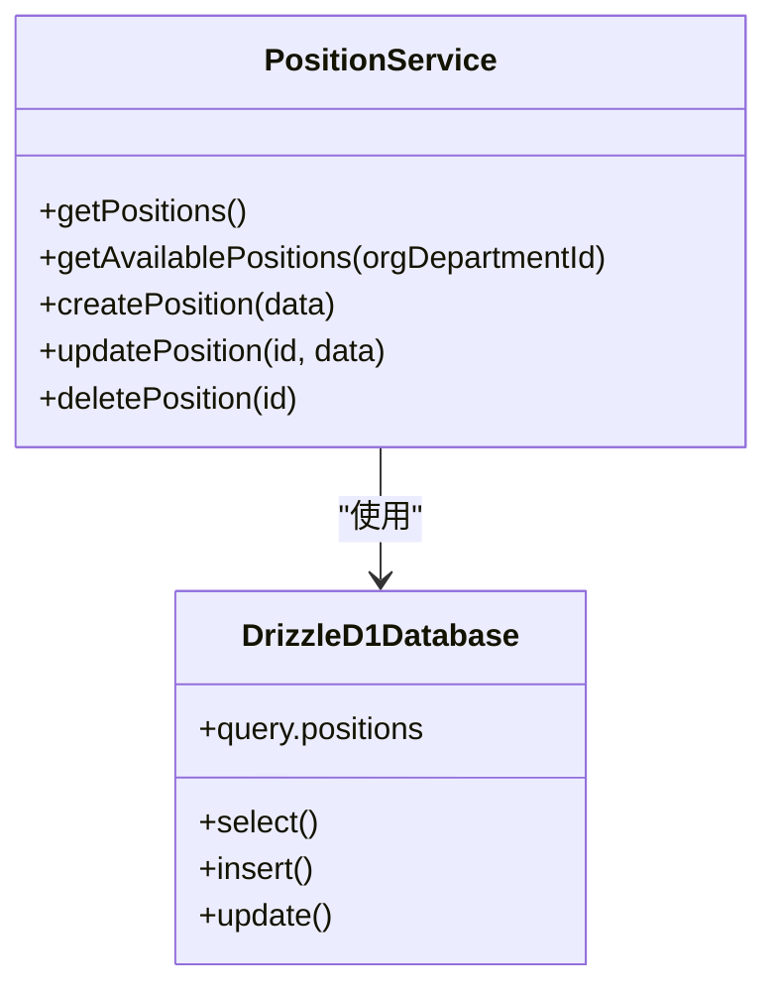
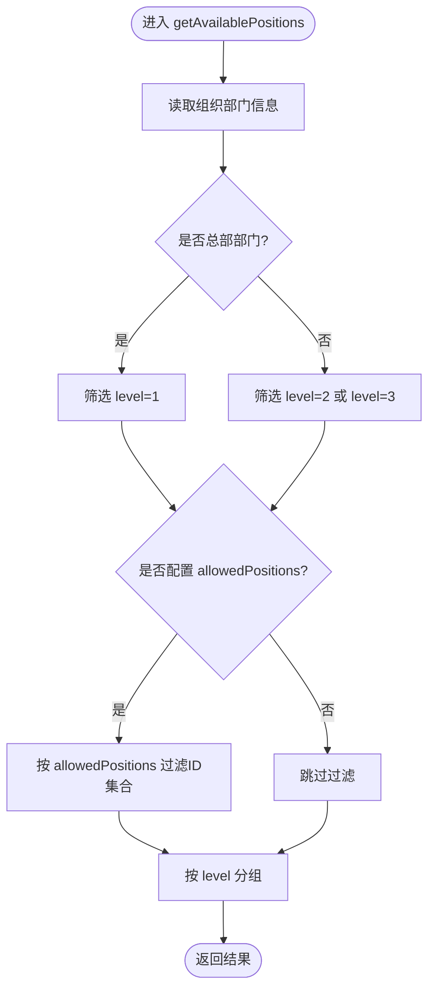
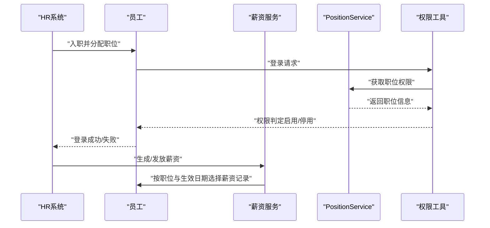
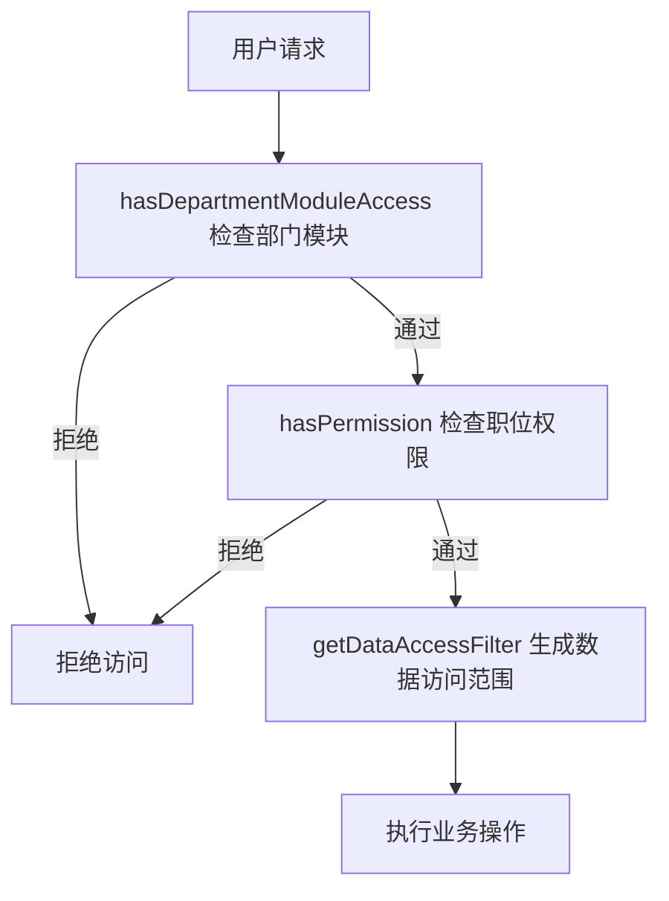
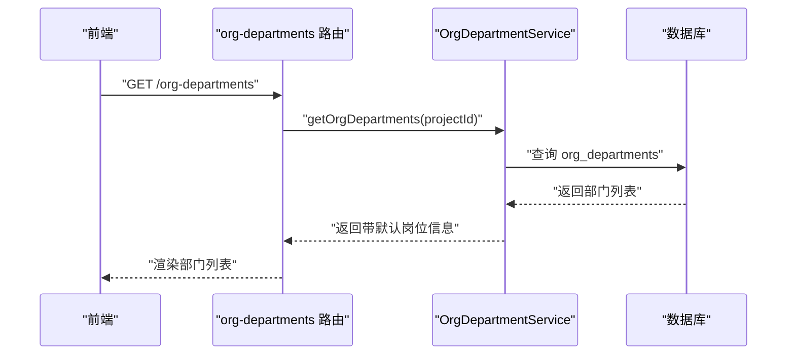
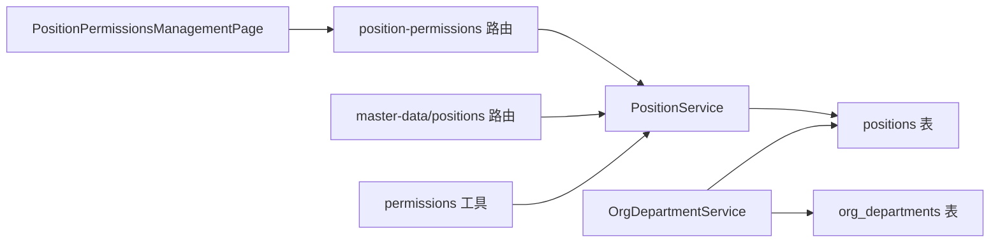

# 职位管理

<cite>
**本文引用的文件**
- [backend/src/services/PositionService.ts](file://backend/src/services/PositionService.ts)
- [backend/src/routes/v2/position-permissions.ts](file://backend/src/routes/v2/position-permissions.ts)
- [backend/src/routes/v2/master-data/positions.ts](file://backend/src/routes/v2/master-data/positions.ts)
- [backend/src/services/OrgDepartmentService.ts](file://backend/src/services/OrgDepartmentService.ts)
- [backend/src/routes/v2/master-data/org-departments.ts](file://backend/src/routes/v2/master-data/org-departments.ts)
- [backend/src/db/schema.ts](file://backend/src/db/schema.ts)
- [backend/src/utils/permissions.ts](file://backend/src/utils/permissions.ts)
- [backend/src/schemas/business.schema.ts](file://backend/src/schemas/business.schema.ts)
- [frontend/src/features/system/pages/PositionPermissionsManagementPage.tsx](file://frontend/src/features/system/pages/PositionPermissionsManagementPage.tsx)
- [backend/test/services/PositionService.test.ts](file://backend/test/services/PositionService.test.ts)
- [backend/test/routes/position-permissions.test.ts](file://backend/test/routes/position-permissions.test.ts)
</cite>

## 目录
1. [简介](#简介)
2. [项目结构](#项目结构)
3. [核心组件](#核心组件)
4. [架构总览](#架构总览)
5. [详细组件分析](#详细组件分析)
6. [依赖关系分析](#依赖关系分析)
7. [性能考量](#性能考量)
8. [故障排查指南](#故障排查指南)
9. [结论](#结论)
10. [附录](#附录)

## 简介
本文件系统性梳理职位管理模块的设计与实现，覆盖以下目标：
- 职位的增删改查与可用职位筛选
- 职级体系（总部/项目/组）与默认岗位配置
- 职位状态（启用/停用）对招聘、薪资等流程的影响
- 职位与权限组的绑定机制，支持基于职位的自动化权限分配
- API 使用指南与示例，包括技术序列与管理序列的职级路径
- 通过职位模板快速生成标准岗位说明书的实践方法

## 项目结构
职位管理涉及后端服务层、路由层、数据库模式、权限工具以及前端页面。关键文件如下：
- 服务层：PositionService（职位CRUD、可用职位筛选）、OrgDepartmentService（组织部门与默认岗位）
- 路由层：position-permissions（职位权限管理API）、master-data/positions（职位列表与可用职位）
- 数据库：positions、org_departments、departments 等表
- 权限：permissions 工具（基于职位的权限判定、数据访问范围）
- 前端：PositionPermissionsManagementPage（职位权限配置UI）

图表来源
- [backend/src/services/PositionService.ts](file://backend/src/services/PositionService.ts#L1-L224)
- [backend/src/services/OrgDepartmentService.ts](file://backend/src/services/OrgDepartmentService.ts#L1-L129)
- [backend/src/routes/v2/position-permissions.ts](file://backend/src/routes/v2/position-permissions.ts#L1-L252)
- [backend/src/routes/v2/master-data/positions.ts](file://backend/src/routes/v2/master-data/positions.ts#L1-L88)
- [backend/src/utils/permissions.ts](file://backend/src/utils/permissions.ts#L1-L273)
- [backend/src/schemas/business.schema.ts](file://backend/src/schemas/business.schema.ts#L442-L471)
- [backend/src/db/schema.ts](file://backend/src/db/schema.ts#L50-L109)

章节来源
- [backend/src/services/PositionService.ts](file://backend/src/services/PositionService.ts#L1-L224)
- [backend/src/routes/v2/position-permissions.ts](file://backend/src/routes/v2/position-permissions.ts#L1-L252)
- [backend/src/routes/v2/master-data/positions.ts](file://backend/src/routes/v2/master-data/positions.ts#L1-L88)
- [backend/src/services/OrgDepartmentService.ts](file://backend/src/services/OrgDepartmentService.ts#L1-L129)
- [backend/src/db/schema.ts](file://backend/src/db/schema.ts#L50-L109)
- [backend/src/utils/permissions.ts](file://backend/src/utils/permissions.ts#L1-L273)
- [backend/src/schemas/business.schema.ts](file://backend/src/schemas/business.schema.ts#L442-L471)
- [frontend/src/features/system/pages/PositionPermissionsManagementPage.tsx](file://frontend/src/features/system/pages/PositionPermissionsManagementPage.tsx#L1-L457)

## 核心组件
- PositionService：提供职位的查询、创建、更新、删除（软删除）能力；支持按组织部门筛选可用职位并按职级分组。
- OrgDepartmentService：提供组织部门查询，含默认岗位关联；在特定场景下自动创建默认组织部门。
- 路由层：position-permissions 提供职位权限管理的完整 CRUD 接口；master-data/positions 提供职位列表与可用职位查询。
- 权限工具：基于职位的权限判定、部门模块访问控制、数据访问范围过滤。
- 数据库模式：positions、org_departments、departments 等表承载职位、组织部门与默认岗位配置。

章节来源
- [backend/src/services/PositionService.ts](file://backend/src/services/PositionService.ts#L15-L224)
- [backend/src/services/OrgDepartmentService.ts](file://backend/src/services/OrgDepartmentService.ts#L16-L126)
- [backend/src/routes/v2/position-permissions.ts](file://backend/src/routes/v2/position-permissions.ts#L31-L251)
- [backend/src/routes/v2/master-data/positions.ts](file://backend/src/routes/v2/master-data/positions.ts#L14-L87)
- [backend/src/utils/permissions.ts](file://backend/src/utils/permissions.ts#L99-L125)
- [backend/src/db/schema.ts](file://backend/src/db/schema.ts#L50-L109)

## 架构总览
职位管理的调用链路如下：
- 前端通过 position-permissions 路由访问职位权限管理接口，后端经权限校验后调用 PositionService 执行业务逻辑。
- master-data/positions 路由用于获取职位列表与可用职位，内部同样依赖 PositionService。
- OrgDepartmentService 与数据库交互，提供默认岗位与部门模块配置，影响可用职位筛选与权限范围。

图表来源
- [backend/src/routes/v2/position-permissions.ts](file://backend/src/routes/v2/position-permissions.ts#L101-L251)
- [backend/src/utils/permissions.ts](file://backend/src/utils/permissions.ts#L99-L125)
- [backend/src/services/PositionService.ts](file://backend/src/services/PositionService.ts#L106-L222)

## 详细组件分析

### PositionService 组件分析
职责与能力：
- 获取所有活跃职位（active=1），按排序与名称排序。
- 获取可用职位：根据组织部门（orgDepartments）筛选，按职级（level=1/2/3）过滤；若配置 allowedPositions 则进一步限制；最终按职级分组返回。
- 创建职位：校验 code 唯一，设置默认值（canManageSubordinates、permissions、sortOrder、active）。
- 更新职位：校验 code 不冲突，支持部分字段更新。
- 删除职位：软删除（active=0），若仍有员工占用则拒绝。

图表来源
- [backend/src/services/PositionService.ts](file://backend/src/services/PositionService.ts#L15-L224)

章节来源
- [backend/src/services/PositionService.ts](file://backend/src/services/PositionService.ts#L15-L224)
- [backend/test/services/PositionService.test.ts](file://backend/test/services/PositionService.test.ts#L34-L84)
- [backend/test/services/PositionService.test.ts](file://backend/test/services/PositionService.test.ts#L281-L327)

### 职位可用性与职级体系
- 职级划分：level=1（总部）、level=2（项目）、level=3（组）。
- 可用职位筛选：总部部门（projectName='总部'）只允许 level=1；非总部部门允许 level=2 或 level=3；若 orgDepartments.allowedPositions 配置了允许的职位ID集合，则进一步过滤。
- 结果分组：按 level 标签分组返回，便于前端展示。

图表来源
- [backend/src/services/PositionService.ts](file://backend/src/services/PositionService.ts#L24-L104)

章节来源
- [backend/src/services/PositionService.ts](file://backend/src/services/PositionService.ts#L24-L104)

### 职位状态（启用/停用）对招聘与薪资的影响
- 职位状态（active）为停用时，系统通过权限与数据访问范围控制，使该职位下的用户无法正常登录或执行受控操作。
- 在薪资计算与发放流程中，职位作为员工属性之一，影响薪资生效日期与货币选择策略（例如优先选择 USDT 薪资记录），但不会因职位停用而强制中断已生效的薪资记录。

图表来源
- [backend/src/utils/permissions.ts](file://backend/src/utils/permissions.ts#L99-L125)
- [backend/src/services/PositionService.ts](file://backend/src/services/PositionService.ts#L15-L22)
- [backend/src/services/BusinessReportService.ts](file://backend/src/services/BusinessReportService.ts#L395-L426)

章节来源
- [backend/src/utils/permissions.ts](file://backend/src/utils/permissions.ts#L99-L125)
- [backend/src/services/PositionService.ts](file://backend/src/services/PositionService.ts#L15-L22)
- [backend/src/services/BusinessReportService.ts](file://backend/src/services/BusinessReportService.ts#L395-L426)

### 职位与权限组的绑定机制
- 职位权限存储在 positions.permissions 字段（JSON），结构为模块-子模块-动作数组。
- 权限判定流程：先检查部门模块访问范围，再检查职位权限配置，最终决定用户是否具备某操作权限。
- 数据访问范围：根据职位层级（总部/项目/组/个人）生成 SQL 过滤条件，限制用户可见数据范围。

图表来源
- [backend/src/utils/permissions.ts](file://backend/src/utils/permissions.ts#L63-L125)
- [backend/src/utils/permissions.ts](file://backend/src/utils/permissions.ts#L196-L263)

章节来源
- [backend/src/utils/permissions.ts](file://backend/src/utils/permissions.ts#L63-L125)
- [backend/src/utils/permissions.ts](file://backend/src/utils/permissions.ts#L196-L263)

### 默认岗位配置与职位模板
- 默认岗位：org_departments 表包含 defaultPositionId 字段，指向 positions 表中的某个职位，作为该部门的默认岗位。
- 自动创建：当查询项目部门且该项目为“总部”时，若未找到组织部门，将自动创建默认组织部门。
- 职位模板：前端 PositionPermissionsManagementPage 提供权限编辑界面，可批量勾选模块/子模块/动作，形成标准化的权限模板，便于复制到多个职位。

图表来源
- [backend/src/routes/v2/master-data/org-departments.ts](file://backend/src/routes/v2/master-data/org-departments.ts#L1-L126)
- [backend/src/services/OrgDepartmentService.ts](file://backend/src/services/OrgDepartmentService.ts#L16-L89)

章节来源
- [backend/src/routes/v2/master-data/org-departments.ts](file://backend/src/routes/v2/master-data/org-departments.ts#L1-L126)
- [backend/src/services/OrgDepartmentService.ts](file://backend/src/services/OrgDepartmentService.ts#L16-L89)
- [frontend/src/features/system/pages/PositionPermissionsManagementPage.tsx](file://frontend/src/features/system/pages/PositionPermissionsManagementPage.tsx#L1-L457)

### API 使用指南
- 职位权限管理（CRUD）：
  - GET /position-permissions：获取所有职位（需权限 system.position.view）
  - GET /position-permissions/{id}：获取职位详情（需权限 system.position.view）
  - POST /position-permissions：创建职位（需权限 system.position.create）
  - PUT /position-permissions/{id}：更新职位（需权限 system.position.update）
  - DELETE /position-permissions/{id}：删除职位（需权限 system.position.delete）
- 职位列表与可用职位：
  - GET /master-data/positions：获取所有活跃职位
  - GET /master-data/positions/available?orgDepartmentId=...：按组织部门获取可用职位

请求体 Schema（节选）：
- 创建职位 Schema：包含 code、name、level、functionRole、permissions、description、sortOrder 等字段
- 更新职位 Schema：支持部分字段更新，包含 active 状态切换

章节来源
- [backend/src/routes/v2/position-permissions.ts](file://backend/src/routes/v2/position-permissions.ts#L31-L251)
- [backend/src/routes/v2/master-data/positions.ts](file://backend/src/routes/v2/master-data/positions.ts#L14-L87)
- [backend/src/schemas/business.schema.ts](file://backend/src/schemas/business.schema.ts#L442-L471)

## 依赖关系分析
- PositionService 依赖数据库 schema 中的 positions、orgDepartments、departments 表进行查询与更新。
- 路由层 position-permissions 依赖权限工具进行权限校验，并调用 PositionService 执行业务。
- OrgDepartmentService 依赖 departments 与 positions 表，用于默认岗位与部门模块配置。
- 前端 PositionPermissionsManagementPage 依赖 position-permissions 路由，实现权限模板化配置。

图表来源
- [backend/src/routes/v2/position-permissions.ts](file://backend/src/routes/v2/position-permissions.ts#L31-L251)
- [backend/src/routes/v2/master-data/positions.ts](file://backend/src/routes/v2/master-data/positions.ts#L14-L87)
- [backend/src/services/PositionService.ts](file://backend/src/services/PositionService.ts#L15-L224)
- [backend/src/services/OrgDepartmentService.ts](file://backend/src/services/OrgDepartmentService.ts#L16-L126)
- [backend/src/db/schema.ts](file://backend/src/db/schema.ts#L50-L109)
- [backend/src/utils/permissions.ts](file://backend/src/utils/permissions.ts#L99-L125)
- [frontend/src/features/system/pages/PositionPermissionsManagementPage.tsx](file://frontend/src/features/system/pages/PositionPermissionsManagementPage.tsx#L1-L457)

## 性能考量
- 职位查询：getPositions 对 positions 表进行 active 过滤与排序，建议在 sortOrder 与 name 上建立索引以提升排序与检索效率。
- 可用职位筛选：getAvailablePositions 涉及多表连接与 JSON 解析（allowedPositions），建议：
  - 对 orgDepartments.projectId、allowedPositions 建立索引
  - 将 allowedPositions 从 JSON 文本改为枚举或专用表以减少解析成本
- 权限判定：hasPermission 与 getDataAccessFilter 为纯内存计算，避免额外数据库往返；但在高并发下仍需注意权限缓存与鉴权中间件的性能开销。

[本节为通用指导，不直接分析具体文件]

## 故障排查指南
- 创建职位时报错“职位代码重复”：检查 positions.code 是否唯一，确保未被其他职位占用。
- 更新职位时报错“职位不存在”：确认传入的 id 是否有效。
- 删除职位失败：“该职位还有员工使用”：需先调整员工职位或迁移至其他职位后再删除。
- 获取可用职位报错“部门不存在”：确认 orgDepartmentId 是否正确。
- 权限不足：检查 position.permissions 配置与 hasPermission 判定逻辑，确认部门模块访问范围与职位动作权限是否匹配。

章节来源
- [backend/src/services/PositionService.ts](file://backend/src/services/PositionService.ts#L106-L222)
- [backend/test/services/PositionService.test.ts](file://backend/test/services/PositionService.test.ts#L34-L84)
- [backend/test/services/PositionService.test.ts](file://backend/test/services/PositionService.test.ts#L281-L327)
- [backend/test/routes/position-permissions.test.ts](file://backend/test/routes/position-permissions.test.ts#L156-L199)

## 结论
职位管理模块通过清晰的服务层与路由层设计，实现了职位的全生命周期管理、职级体系与默认岗位配置，并将职位与权限组绑定，支持基于职位的自动化权限分配。通过权限工具与数据访问范围过滤，系统在招聘与薪资等关键流程中实现了对职位状态的有效约束。前端提供了权限模板化的配置界面，便于标准化与复用。

[本节为总结性内容，不直接分析具体文件]

## 附录

### 技术序列与管理序列的职级路径示例
- 技术序列（以工程类为例）：level=2（项目工程师）→ level=3（技术组长）→ level=2（高级工程师）→ level=1（技术专家/主管）
- 管理序列（以职能类为例）：level=3（部门主管）→ level=2（部门经理）→ level=1（总部总监）

说明：上述路径为组织实践建议，实际职级映射应结合企业内部的职级体系与职位编码约定进行配置。

[本节为概念性内容，不直接分析具体文件]