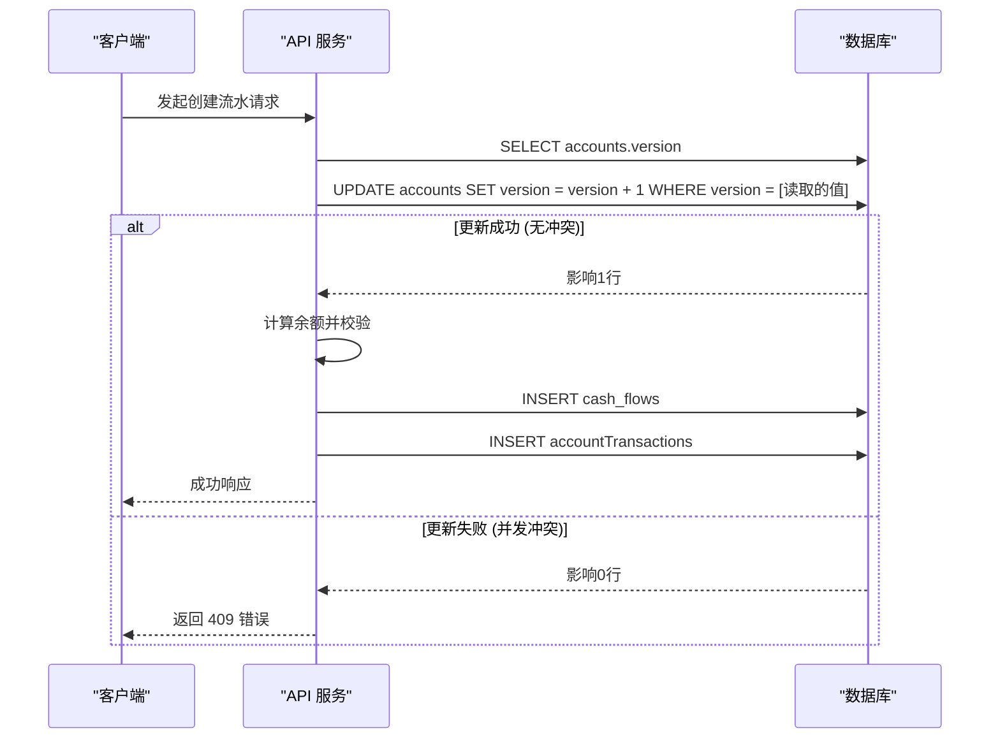
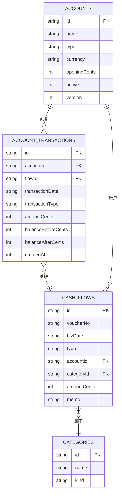
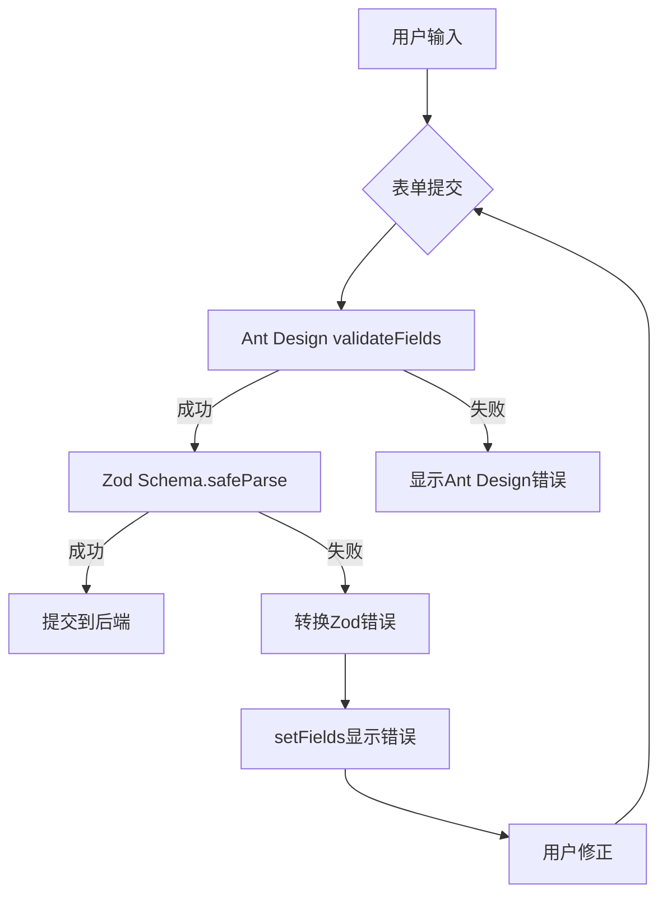
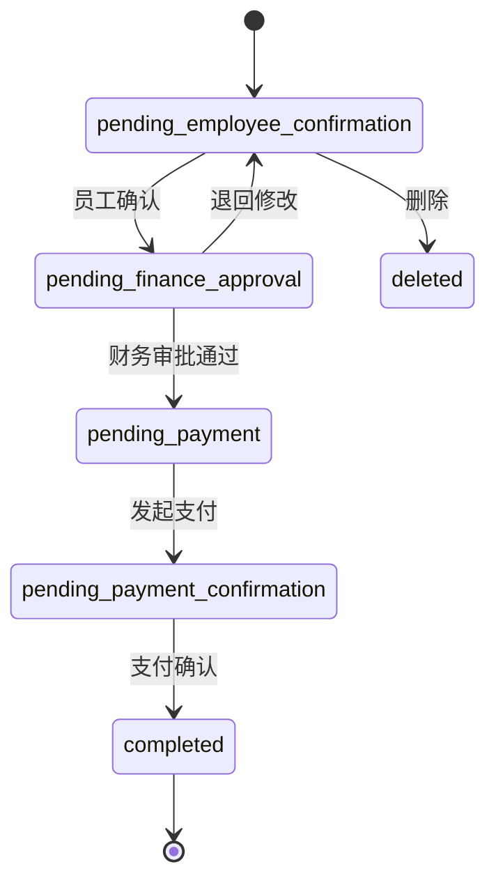

# 账户管理

<cite>
**本文档引用的文件**   
- [AccountService.ts](file://backend/src/services/AccountService.ts)
- [accounts.ts](file://backend/src/routes/v2/master-data/accounts.ts)
- [master-data.schema.ts](file://backend/src/schemas/master-data.schema.ts)
- [account.schema.ts](file://frontend/src/validations/account.schema.ts)
- [schema.ts](file://backend/src/db/schema.ts)
- [state-machine.ts](file://backend/src/utils/state-machine.ts)
- [optimistic-lock.ts](file://backend/src/utils/optimistic-lock.ts)
- [AccountManagementPage.tsx](file://frontend/src/features/system/pages/AccountManagementPage.tsx)
- [useZodForm.ts](file://frontend/src/hooks/forms/useZodForm.ts)
</cite>

## 目录
1. [简介](#简介)
2. [RESTful API 定义](#restful-api-定义)
3. [账户余额一致性校验与并发控制](#账户余额一致性校验与并发控制)
4. [数据关联机制](#数据关联机制)
5. [前端表单验证与后端Zod Schema协同](#前端表单验证与后端zod-schema协同)
6. [状态机控制](#状态机控制)

## 简介
本系统提供了一套完整的账户管理解决方案，支持账户的创建、查询、更新和删除（CRUD）操作。核心功能由 `AccountService` 类实现，通过 RESTful API 暴露给前端应用。系统特别关注账户余额的一致性校验和并发场景下的数据安全，利用乐观锁机制防止重复修改。所有操作均与财务流水（cash_flows）数据表关联，并通过严格的权限控制确保只有财务角色等授权用户才能执行关键操作。

**Section sources**
- [AccountService.ts](file://backend/src/services/AccountService.ts#L1-L168)
- [accounts.ts](file://backend/src/routes/v2/master-data/accounts.ts#L1-L310)

## RESTful API 定义
账户管理模块提供了一组标准化的 RESTful API，用于对账户数据进行操作。所有接口均遵循统一的请求和响应格式，并通过权限中间件进行保护。

### 获取账户列表
- **方法**: `GET`
- **路径**: `/api/v2/master-data/accounts`
- **权限要求**: `system.account.view`
- **请求参数**:
  - `search` (可选): 模糊搜索账户名称、别名或账号
  - `activeOnly` (可选): 是否仅返回启用的账户
  - `accountType` (可选): 按账户类型过滤
  - `currency` (可选): 按币种过滤
- **响应结构**:
  ```json
  {
    "success": true,
    "data": {
      "results": [
        {
          "id": "string",
          "name": "string",
          "type": "cash|bank|alipay|wechat|other",
          "currency": "string",
          "alias": "string",
          "accountNumber": "string",
          "openingCents": "number",
          "active": 0|1,
          "currencyName": "string"
        }
      ]
    }
  }
  ```

### 获取账户交易记录
- **方法**: `GET`
- **路径**: `/api/v2/master-data/accounts/{id}/transactions`
- **权限要求**: `system.account.view`
- **请求参数**:
  - `id` (路径参数): 账户ID
  - `page` (查询参数): 页码
  - `limit` (查询参数): 每页数量
- **响应结构**:
  ```json
  {
    "success": true,
    "data": {
      "items": [
        {
          "id": "string",
          "transactionDate": "string",
          "transactionType": "string",
          "amountCents": "number",
          "balanceBeforeCents": "number",
          "balanceAfterCents": "number",
          "createdAt": "number",
          "voucherNo": "string",
          "memo": "string",
          "counterparty": "string",
          "voucherUrl": "string",
          "categoryName": "string"
        }
      ],
      "pagination": { ... }
    }
  }
  ```

### 创建账户
- **方法**: `POST`
- **路径**: `/api/v2/master-data/accounts`
- **权限要求**: `system.account.create`
- **请求体**:
  ```json
  {
    "name": "string",
    "type": "cash|bank|alipay|wechat|other",
    "currency": "string",
    "alias": "string",
    "accountNumber": "string",
    "openingCents": "number"
  }
  ```
- **响应结构**:
  ```json
  {
    "success": true,
    "data": {
      "id": "string",
      "name": "string",
      "type": "cash|bank|alipay|wechat|other",
      "currency": "string",
      "alias": "string",
      "accountNumber": "string",
      "openingCents": "number",
      "active": 1
    }
  }
  ```

### 更新账户
- **方法**: `PUT`
- **路径**: `/api/v2/master-data/accounts/{id}`
- **权限要求**: `system.account.update`
- **请求参数**:
  - `id` (路径参数): 账户ID
- **请求体**:
  ```json
  {
    "name": "string",
    "type": "cash|bank|alipay|wechat|other",
    "currency": "string",
    "alias": "string",
    "accountNumber": "string",
    "active": 0|1
  }
  ```
- **响应结构**:
  ```json
  {
    "success": true,
    "data": {}
  }
  ```

### 删除账户
- **方法**: `DELETE`
- **路径**: `/api/v2/master-data/accounts/{id}`
- **权限要求**: `system.account.delete`
- **请求参数**:
  - `id` (路径参数): 账户ID
- **响应结构**:
  ```json
  {
    "success": true,
    "data": {}
  }
  ```

**Section sources**
- [accounts.ts](file://backend/src/routes/v2/master-data/accounts.ts#L19-L310)
- [master-data.schema.ts](file://backend/src/schemas/master-data.schema.ts#L55-L69)

## 账户余额一致性校验与并发控制
系统通过一套严谨的机制来确保账户余额的一致性，并在高并发场景下防止数据冲突。

### 余额一致性校验
账户的当前余额并非直接存储在 `accounts` 表中，而是通过计算其初始余额（`openingCents`）和所有关联的财务流水（`cash_flows`）的净变化来动态得出。当创建一笔新的财务流水时，系统会执行以下步骤：
1.  **获取账户信息**: 从 `accounts` 表中读取账户的 `openingCents` 和 `version`。
2.  **计算余额**: 调用 `getAccountBalanceBefore` 方法，该方法会查询 `accountTransactions` 表，找到指定时间点之前最后一笔交易的 `balanceAfterCents` 作为当前余额。如果不存在历史交易，则使用 `openingCents`。
3.  **余额检查**: 对于支出（expense）类型的流水，系统会检查计算出的余额是否足以覆盖本次支出金额，若不足则抛出 `BUSINESS_INSUFFICIENT_BALANCE` 错误。
4.  **记录交易**: 计算出新的余额（`balanceAfterCents`），并将这笔交易记录插入 `accountTransactions` 表。

### 乐观锁实现
为了防止在高并发环境下多个用户同时修改同一账户导致的数据不一致，系统在 `accounts` 表中引入了 `version` 字段作为乐观锁的版本号。

- **实现原理**:
  1.  当一个请求尝试创建财务流水时，它会首先读取账户的当前 `version`。
  2.  在执行数据库操作前，系统会尝试更新账户的 `version` 字段，将其值加1，但更新条件是 `version` 必须等于之前读取的值。
  3.  如果在此期间有其他请求已经修改了该账户，`version` 已经被更新，那么本次 `UPDATE` 操作将不会影响任何行（`changes === 0`）。
  4.  系统检测到更新失败后，会抛出 `BUS_CONCURRENT_MODIFICATION` 错误，提示用户“数据已被其他用户修改，请刷新后重试”。



**Diagram sources**
- [schema.ts](file://backend/src/db/schema.ts#L149)
- [optimistic-lock.ts](file://backend/src/utils/optimistic-lock.ts#L16-L39)
- [FinanceService.ts](file://backend/src/services/FinanceService.ts#L148-L165)

**Section sources**
- [schema.ts](file://backend/src/db/schema.ts#L149)
- [optimistic-lock.ts](file://backend/src/utils/optimistic-lock.ts#L16-L39)
- [FinanceService.ts](file://backend/src/services/FinanceService.ts#L41-L165)

## 数据关联机制
账户数据与系统的其他核心模块紧密关联，形成了一个完整的财务数据链。

### 与财务流水（cash_flows）的关联
每个账户都与多条财务流水记录相关联。这种关联通过 `cash_flows` 表中的 `accountId` 外键实现。当用户查询某个账户的交易记录时，系统会执行一个 `LEFT JOIN` 查询，将 `accountTransactions` 表与 `cash_flows` 表连接起来，从而获取完整的交易信息，包括凭证号、备注、对方单位等。



**Diagram sources**
- [schema.ts](file://backend/src/db/schema.ts#L139-L206)
- [AccountService.ts](file://backend/src/services/AccountService.ts#L46-L79)

**Section sources**
- [schema.ts](file://backend/src/db/schema.ts#L139-L206)
- [AccountService.ts](file://backend/src/services/AccountService.ts#L46-L82)

## 前端表单验证与后端Zod Schema协同
系统采用前后端统一的验证策略，确保数据的完整性和一致性。

### 后端Zod Schema
后端使用 `@hono/zod-openapi` 库定义了严格的输入验证规则。`createAccountSchema` 和 `updateAccountSchema` 定义了创建和更新账户时必须满足的条件，例如：
- `name`: 字符串，不能为空。
- `type`: 枚举值，必须为 `cash`, `bank`, `alipay`, `wechat`, `other` 之一。
- `currency`: 字符串，长度必须为3位。

这些Schema不仅用于运行时验证，还用于自动生成 OpenAPI 文档。

### 前端表单验证
前端使用 `zod` 库定义了 `accountSchema`，其规则与后端保持高度一致。通过 `useZodForm` 自定义Hook，将 Zod Schema 与 Ant Design 的 `Form` 组件集成。

- **协同机制**:
  1.  用户在表单中输入数据。
  2.  提交时，`useZodForm` 的 `validateWithZod` 函数首先调用 Ant Design 的 `validateFields` 进行初步校验。
  3.  然后，使用 Zod Schema 对获取到的值进行深度验证。
  4.  如果 Zod 验证失败，错误信息会被转换成 Ant Design 的 `setFields` 格式，并显示在对应的表单项上。
  5.  只有通过所有验证的数据才会被发送到后端。

这种双重验证机制提供了即时的用户反馈，同时保证了后端接收到的数据是经过严格校验的。



**Diagram sources**
- [master-data.schema.ts](file://backend/src/schemas/master-data.schema.ts#L55-L69)
- [account.schema.ts](file://frontend/src/validations/account.schema.ts#L4-L28)
- [useZodForm.ts](file://frontend/src/hooks/forms/useZodForm.ts#L28-L47)

**Section sources**
- [master-data.schema.ts](file://backend/src/schemas/master-data.schema.ts#L55-L69)
- [account.schema.ts](file://frontend/src/validations/account.schema.ts#L4-L28)
- [useZodForm.ts](file://frontend/src/hooks/forms/useZodForm.ts#L25-L60)
- [AccountManagementPage.tsx](file://frontend/src/features/system/pages/AccountManagementPage.tsx#L38-L40)

## 状态机控制
虽然 `AccountService` 本身不直接使用状态机，但系统中的其他核心业务（如薪资支付、借款、报销）都通过 `state-machine.ts` 模块实现了严格的状态流转控制。

### 状态机实现
`StateMachine` 类是一个通用的状态机工具，它通过一个 `Map` 来定义允许的状态转换。例如，`salaryPaymentStateMachine` 定义了薪资支付从“待员工确认”到“已完成”的合法路径。

- **核心方法**:
  - `canTransition(from, to)`: 检查从状态 `from` 到 `to` 的转换是否被允许。
  - `validateTransition(from, to)`: 执行 `canTransition` 检查，如果不允许则抛出业务错误。

### 在业务服务中的应用
在 `SalaryPaymentService` 等服务中，当需要更改支付状态时，会调用 `salaryPaymentStateMachine.validateTransition(currentStatus, newStatus)`。如果新状态不在当前状态的允许转换列表中，操作将被拒绝，从而保证了业务流程的严谨性。



**Diagram sources**
- [state-machine.ts](file://backend/src/utils/state-machine.ts#L48-L54)
- [schema.ts](file://backend/src/db/schema.ts#L294)

**Section sources**
- [state-machine.ts](file://backend/src/utils/state-machine.ts#L7-L54)
- [schema.ts](file://backend/src/db/schema.ts#L294)