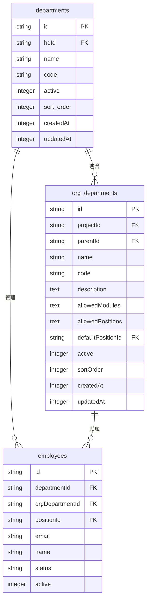
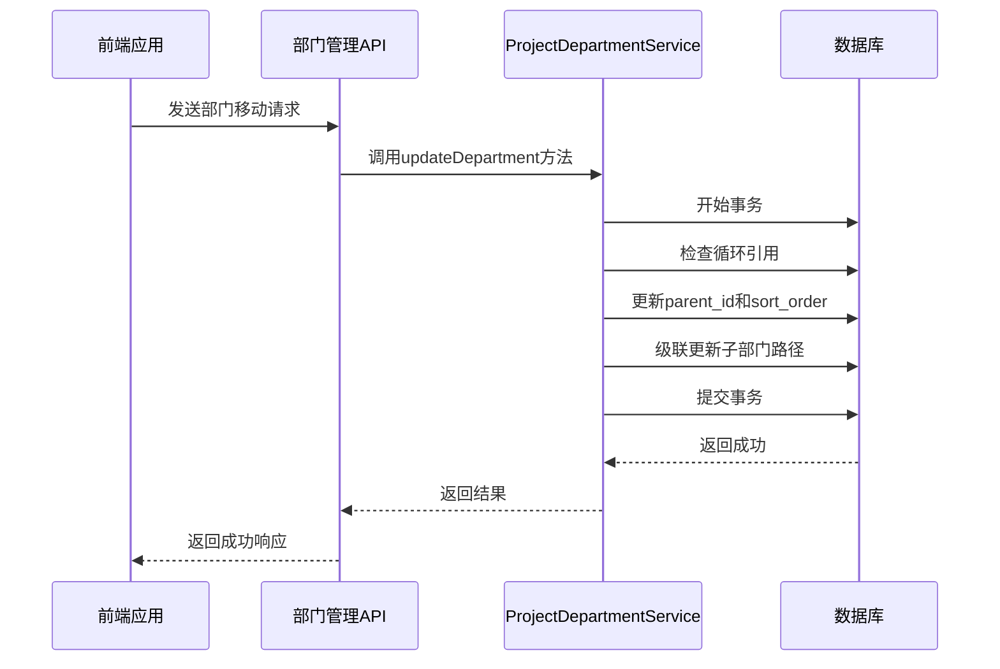
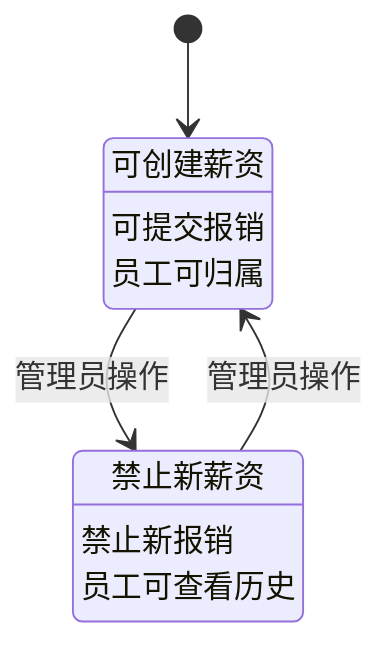
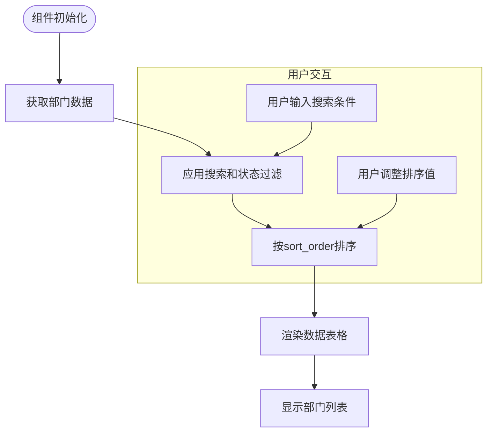
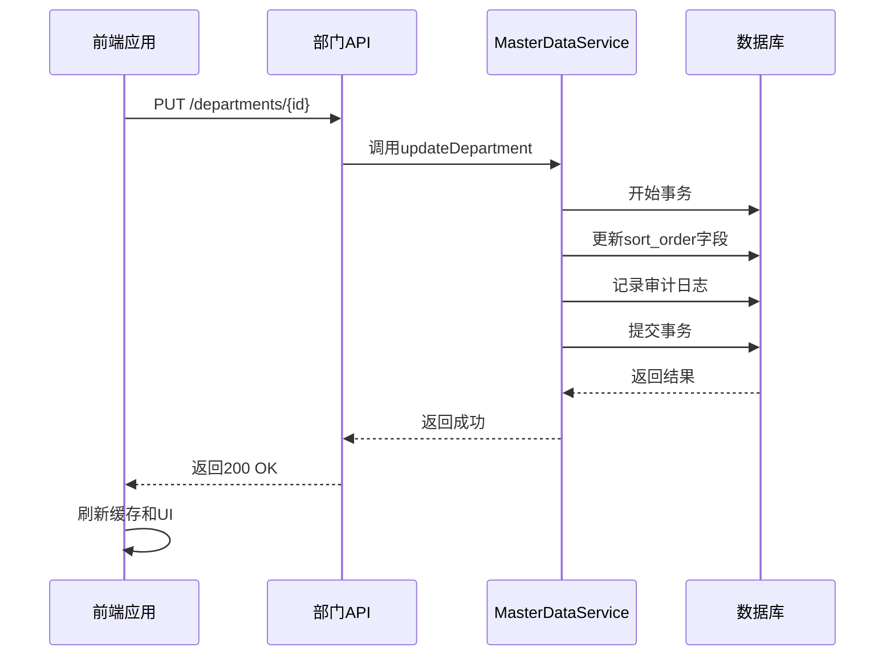

# 部门管理

<cite>
**本文档引用的文件**   
- [DepartmentService.ts](file://backend/src/services/DepartmentService.ts)
- [departments.ts](file://backend/src/routes/v2/master-data/departments.ts)
- [schema.ts](file://backend/src/db/schema.ts)
- [DepartmentManagementPage.tsx](file://frontend/src/features/system/pages/DepartmentManagementPage.tsx)
- [useDepartments.ts](file://frontend/src/hooks/business/useDepartments.ts)
- [master-data.schema.ts](file://backend/src/schemas/master-data.schema.ts)
- [ProjectDepartmentService.ts](file://backend/src/services/ProjectDepartmentService.ts)
- [OrgDepartmentService.ts](file://backend/src/services/OrgDepartmentService.ts)
- [migration_add_departments_sort_order.sql](file://backend/src/db/migration_add_departments_sort_order.sql)
- [domain.ts](file://frontend/src/types/domain.ts)
</cite>

## 目录
1. [简介](#简介)
2. [部门树形结构与排序控制](#部门树形结构与排序控制)
3. [部门移动操作的事务处理](#部门移动操作的事务处理)
4. [部门状态生命周期及其业务影响](#部门状态生命周期及其业务影响)
5. [前端组织架构图数据渲染](#前端组织架构图数据渲染)
6. [批量调整部门顺序API实践](#批量调整部门顺序api实践)

## 简介
本系统采用两级部门架构设计，包含项目部门（departments）和组织部门（org_departments）。项目部门作为顶层组织单元，支持树形结构和排序控制，是薪资、报销等业务的核心关联实体。系统通过`sort_order`字段实现部门排序，总部部门具有最高优先级（sort_order=0）。部门状态（启用/禁用）直接影响相关业务流程，禁用部门下的员工将无法进行薪资计算和报销申请。

## 部门树形结构与排序控制

系统通过`departments`表实现部门的树形结构和排序控制。该表包含`id`、`name`、`parent_id`（用于构建树形结构）、`active`（状态标识）和`sort_order`（排序字段）等关键字段。`sort_order`字段的默认值为100，数值越小排序越靠前。总部部门的`sort_order`被特别设置为0，确保其在列表中始终位于最前面。

**图表来源**
- [schema.ts](file://backend/src/db/schema.ts#L65-L74)
- [schema.ts](file://backend/src/db/schema.ts#L95-L109)
- [schema.ts](file://backend/src/db/schema.ts#L14-L48)

**部门管理接口来源**
- [departments.ts](file://backend/src/routes/v2/master-data/departments.ts#L22-L239)

## 部门移动操作的事务处理

系统通过`ProjectDepartmentService`和`OrgDepartmentService`协同处理部门移动操作。当部门的父节点变更时，系统会启动数据库事务确保数据一致性。事务处理逻辑包括：首先检查目标部门是否存在循环引用，然后更新部门记录的`parent_id`和`sort_order`字段，同时通过级联更新机制确保所有子部门的路径信息正确同步。

**图表来源**
- [ProjectDepartmentService.ts](file://backend/src/services/ProjectDepartmentService.ts#L110-L132)
- [OrgDepartmentService.ts](file://backend/src/services/OrgDepartmentService.ts#L16-L88)

**部门服务来源**
- [ProjectDepartmentService.ts](file://backend/src/services/ProjectDepartmentService.ts#L12-L168)

## 部门状态生命周期及其业务影响

部门状态生命周期由`active`字段控制，取值为1（启用）或0（禁用）。部门状态直接影响薪资、报销等核心业务。当部门被禁用时，系统会阻止在该部门下创建新的薪资记录和报销申请。已存在的业务记录保持不变，但无法进行修改或审批操作。员工调动到禁用部门时，系统会提示相应的业务限制。

**图表来源**
- [ProjectDepartmentService.ts](file://backend/src/services/ProjectDepartmentService.ts#L125-L129)
- [ProjectDepartmentService.ts](file://backend/src/services/ProjectDepartmentService.ts#L142-L163)

**状态影响来源**
- [ProjectDepartmentService.ts](file://backend/src/services/ProjectDepartmentService.ts#L135-L164)
- [EmployeeService.ts](file://backend/src/services/EmployeeService.ts#L200-L220)

## 前端组织架构图数据渲染

前端通过`DepartmentManagementPage`组件实现部门数据的可视化渲染。组件使用`useDepartments` Hook从API获取部门列表，并根据`sort_order`字段进行排序。数据渲染采用`DataTable`组件，支持按名称搜索和状态过滤。排序功能允许用户通过输入数字调整部门显示顺序，数值越小越靠前。

**图表来源**
- [DepartmentManagementPage.tsx](file://frontend/src/features/system/pages/DepartmentManagementPage.tsx#L29-L50)
- [useDepartments.ts](file://frontend/src/hooks/business/useDepartments.ts#L18-L29)

**前端组件来源**
- [DepartmentManagementPage.tsx](file://frontend/src/features/system/pages/DepartmentManagementPage.tsx#L1-L235)
- [useDepartments.ts](file://frontend/src/hooks/business/useDepartments.ts#L1-L97)

## 批量调整部门顺序API实践

系统提供RESTful API支持批量调整部门顺序。通过`PUT /departments/{id}`接口，可以更新单个部门的`sort_order`值。最佳实践是使用事务批量更新多个部门的排序值，确保数据一致性。前端通过`updateDepartment` mutation发送请求，成功后自动刷新缓存并重新获取部门列表。

**图表来源**
- [departments.ts](file://backend/src/routes/v2/master-data/departments.ts#L135-L192)
- [useDepartments.ts](file://frontend/src/hooks/business/useDepartments.ts#L73-L83)

**API实践来源**
- [departments.ts](file://backend/src/routes/v2/master-data/departments.ts#L135-L192)
- [useDepartments.ts](file://frontend/src/hooks/business/useDepartments.ts#L73-L83)