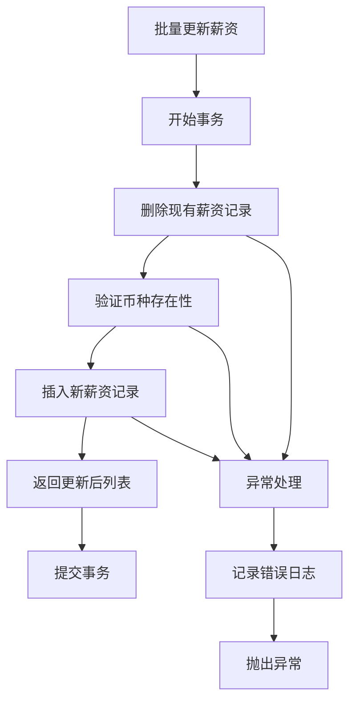
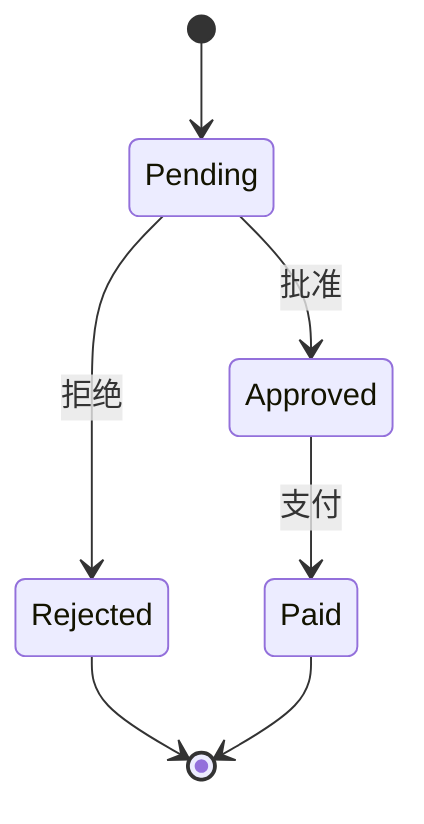
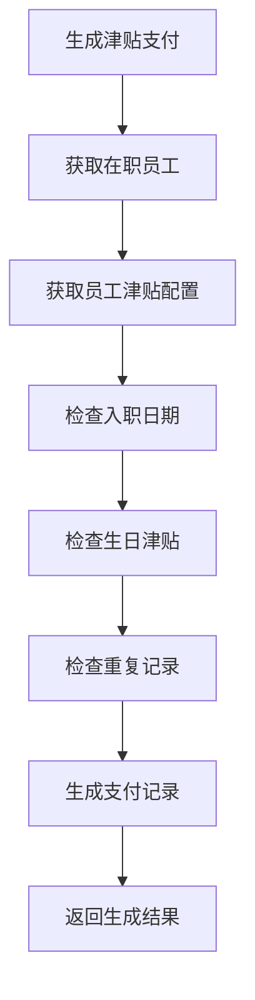
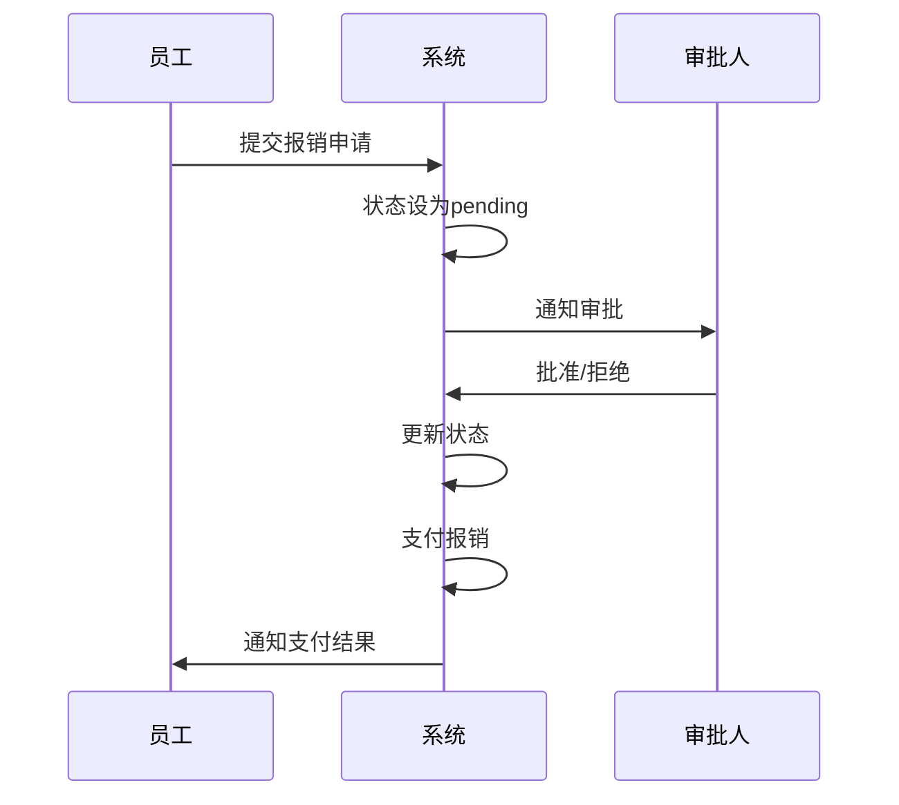
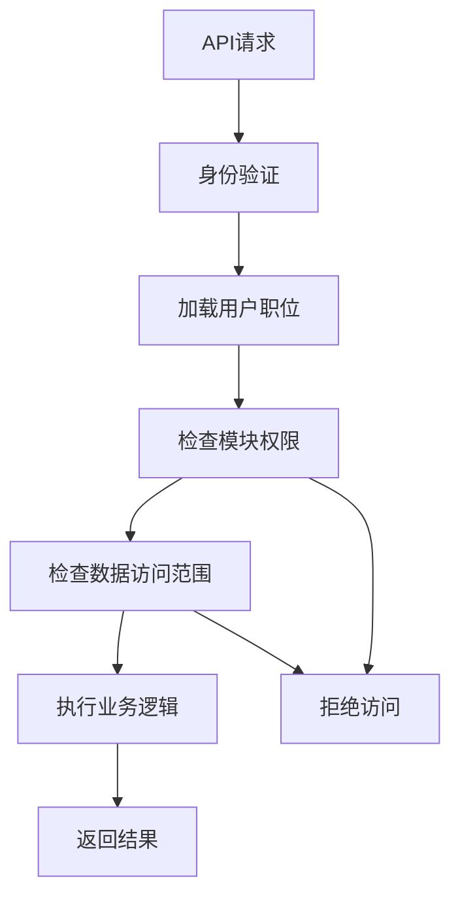
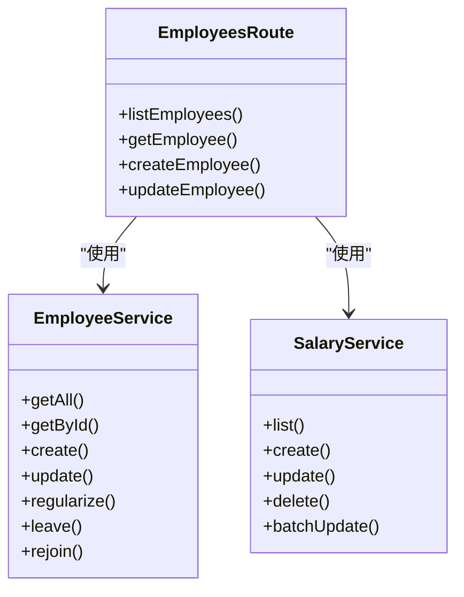

# 人事管理路由

<cite>
**本文档引用的文件**   
- [employees.ts](file://backend/src/routes/v2/employees.ts)
- [employee-salaries.ts](file://backend/src/routes/v2/employee-salaries.ts)
- [employee-leaves.ts](file://backend/src/routes/v2/employee-leaves.ts)
- [allowance-payments.ts](file://backend/src/routes/v2/allowance-payments.ts)
- [expense-reimbursements.ts](file://backend/src/routes/v2/expense-reimbursements.ts)
- [SalaryService.ts](file://backend/src/services/SalaryService.ts)
- [EmployeeService.ts](file://backend/src/services/EmployeeService.ts)
- [EmployeeLeaveService.ts](file://backend/src/services/EmployeeLeaveService.ts)
- [AllowancePaymentService.ts](file://backend/src/services/AllowancePaymentService.ts)
- [ExpenseReimbursementService.ts](file://backend/src/services/ExpenseReimbursementService.ts)
- [permissions.ts](file://backend/src/utils/permissions.ts)
- [permission.ts](file://backend/src/middleware/permission.ts)
- [schema.ts](file://backend/src/db/schema.ts)
</cite>

## 目录
1. [引言](#引言)
2. [员工信息管理](#员工信息管理)
3. [薪资发放管理](#薪资发放管理)
4. [请假管理](#请假管理)
5. [津贴支付管理](#津贴支付管理)
6. [费用报销管理](#费用报销管理)
7. [权限控制机制](#权限控制机制)
8. [服务层集成](#服务层集成)

## 引言
本文档深入解析人事管理相关的API路由，涵盖员工信息、薪资发放、请假管理、津贴支付和费用报销等功能。详细描述各端点的设计原则，包括路径命名规范、状态机驱动的审批流程（如请假申请与审批）、以及与SalaryService、EmployeeService等服务层的集成方式。说明如何通过权限中间件控制不同职位对员工数据的访问级别，并结合实际代码示例展示复杂业务逻辑（如薪资计算）的API封装模式。

## 员工信息管理

员工信息管理API提供了对员工全生命周期的管理功能，包括创建、查询、更新、转正、离职和复职等操作。路由文件`employees.ts`定义了完整的RESTful接口，遵循清晰的路径命名规范。

**员工信息管理API端点**
- `GET /employees`：查询员工列表，支持分页和过滤
- `GET /employees/{id}`：获取单个员工详情
- `POST /employees`：创建新员工并自动创建用户账号
- `PUT /employees/{id}`：更新员工信息
- `POST /employees/{id}/regularize`：员工转正
- `POST /employees/{id}/leave`：员工离职
- `POST /employees/{id}/rejoin`：员工复职
- `POST /employees/{id}/resend-activation`：重新发送激活邮件
- `POST /employees/{id}/reset-totp`：重置TOTP（双因素认证）
- `POST /employees/{id}/reset-password`：重置员工密码

在查询员工列表时，系统通过`getDataAccessFilter`工具函数实现了基于职位层级的数据访问控制。总部人员（level=1）可以查看所有数据，项目主管（level=2）只能查看本项目数据，组长（team_leader）只能查看本组数据，普通员工只能查看自己的数据。

**Section sources**
- [employees.ts](file://backend/src/routes/v2/employees.ts#L22-L602)
- [EmployeeService.ts](file://backend/src/services/EmployeeService.ts#L11-L758)
- [permissions.ts](file://backend/src/utils/permissions.ts#L196-L263)

## 薪资发放管理

薪资发放管理API提供了对员工薪资的增删改查和批量更新功能。路由文件`employee-salaries.ts`定义了清晰的接口，与`SalaryService`服务层紧密集成。

**薪资管理API端点**
- `GET /employee-salaries`：查询员工薪资列表
- `POST /employee-salaries`：创建员工薪资
- `PUT /employee-salaries/batch`：批量更新员工薪资
- `DELETE /employee-salaries/{id}`：删除员工薪资

薪资服务`SalaryService`提供了完整的业务逻辑实现，包括`list`、`create`、`update`、`delete`和`batchUpdate`等方法。`batchUpdate`方法实现了原子性的批量更新操作：先删除该类型的所有现有记录，然后插入新的薪资记录，确保数据一致性。

**Diagram sources**
- [employee-salaries.ts](file://backend/src/routes/v2/employee-salaries.ts#L41-L258)
- [SalaryService.ts](file://backend/src/services/SalaryService.ts#L8-L186)

**Section sources**
- [employee-salaries.ts](file://backend/src/routes/v2/employee-salaries.ts#L41-L258)
- [SalaryService.ts](file://backend/src/services/SalaryService.ts#L8-L186)

## 请假管理

请假管理API实现了状态机驱动的审批流程，从申请到审批的完整生命周期管理。路由文件`employee-leaves.ts`定义了请假相关的接口。

**请假管理API端点**
- `GET /`：查询请假列表
- `POST /`：创建请假申请
- `PUT /{id}/status`：更新请假状态

系统采用状态机模式管理请假流程，状态包括"pending"（待审批）、"approved"（已批准）和"rejected"（已拒绝）。只有具有审批权限的用户才能更新请假状态。

**Diagram sources**
- [employee-leaves.ts](file://backend/src/routes/v2/employee-leaves.ts#L42-L176)
- [EmployeeLeaveService.ts](file://backend/src/services/EmployeeLeaveService.ts#L7-L182)

**Section sources**
- [employee-leaves.ts](file://backend/src/routes/v2/employee-leaves.ts#L42-L176)
- [EmployeeLeaveService.ts](file://backend/src/services/EmployeeLeaveService.ts#L7-L182)

## 津贴支付管理

津贴支付管理API提供了津贴发放的完整流程，包括生成、创建、更新和删除操作。路由文件`allowance-payments.ts`定义了相关接口。

**津贴支付API端点**
- `GET /allowance-payments`：查询津贴支付列表
- `POST /allowance-payments/generate`：生成津贴支付记录
- `POST /allowance-payments`：创建津贴支付记录
- `PUT /allowance-payments/{id}`：更新津贴支付记录
- `DELETE /allowance-payments/{id}`：删除津贴支付记录

`generate`方法实现了智能生成逻辑：根据在职员工和其津贴配置，自动生成当月的津贴支付记录。系统会检查生日津贴等特殊条件，并避免重复生成。

**Diagram sources**
- [allowance-payments.ts](file://backend/src/routes/v2/allowance-payments.ts#L73-L442)
- [AllowancePaymentService.ts](file://backend/src/services/AllowancePaymentService.ts#L9-L269)

**Section sources**
- [allowance-payments.ts](file://backend/src/routes/v2/allowance-payments.ts#L73-L442)
- [AllowancePaymentService.ts](file://backend/src/services/AllowancePaymentService.ts#L9-L269)

## 费用报销管理

费用报销管理API实现了报销申请的完整审批流程。路由文件`expense-reimbursements.ts`定义了相关接口。

**费用报销API端点**
- `GET /`：查询报销列表
- `POST /`：创建报销申请
- `PUT /{id}/status`：更新报销状态
- `POST /{id}/pay`：支付报销

报销流程同样采用状态机驱动，状态包括"pending"（待审批）、"approved"（已批准）、"rejected"（已拒绝）和"paid"（已支付）。支付操作只能对已批准的报销单进行。

**Diagram sources**
- [expense-reimbursements.ts](file://backend/src/routes/v2/expense-reimbursements.ts#L48-L231)
- [ExpenseReimbursementService.ts](file://backend/src/services/ExpenseReimbursementService.ts#L8-L170)

**Section sources**
- [expense-reimbursements.ts](file://backend/src/routes/v2/expense-reimbursements.ts#L48-L231)
- [ExpenseReimbursementService.ts](file://backend/src/services/ExpenseReimbursementService.ts#L8-L170)

## 权限控制机制

系统通过精细化的权限控制机制确保数据安全。权限系统基于职位模型（总部主管、总部专员、项目主管、项目专员、组长、工程师），通过中间件实现访问控制。

**权限控制流程**
1. 用户登录后，系统根据其职位加载权限配置
2. 每个API请求通过`hasPermission`中间件验证
3. 系统检查模块权限和数据访问范围
4. 根据职位层级返回相应的数据

**Diagram sources**
- [permission.ts](file://backend/src/middleware/permission.ts#L1-L43)
- [permissions.ts](file://backend/src/utils/permissions.ts#L99-L125)

**Section sources**
- [permission.ts](file://backend/src/middleware/permission.ts#L1-L43)
- [permissions.ts](file://backend/src/utils/permissions.ts#L1-L273)

## 服务层集成

各API路由与对应的服务层紧密集成，遵循清晰的分层架构。路由层负责HTTP协议处理和参数验证，服务层负责核心业务逻辑。

**服务层集成模式**
- 路由层通过`c.var.services`访问服务实例
- 服务层封装数据库操作和业务逻辑
- 使用依赖注入模式传递数据库连接和环境变量
- 服务间通过接口定义进行通信

**Diagram sources**
- [employees.ts](file://backend/src/routes/v2/employees.ts#L20-L602)
- [EmployeeService.ts](file://backend/src/services/EmployeeService.ts#L11-L758)
- [SalaryService.ts](file://backend/src/services/SalaryService.ts#L8-L186)

**Section sources**
- [employees.ts](file://backend/src/routes/v2/employees.ts#L20-L602)
- [EmployeeService.ts](file://backend/src/services/EmployeeService.ts#L11-L758)
- [SalaryService.ts](file://backend/src/services/SalaryService.ts#L8-L186)