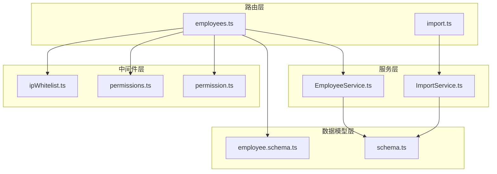
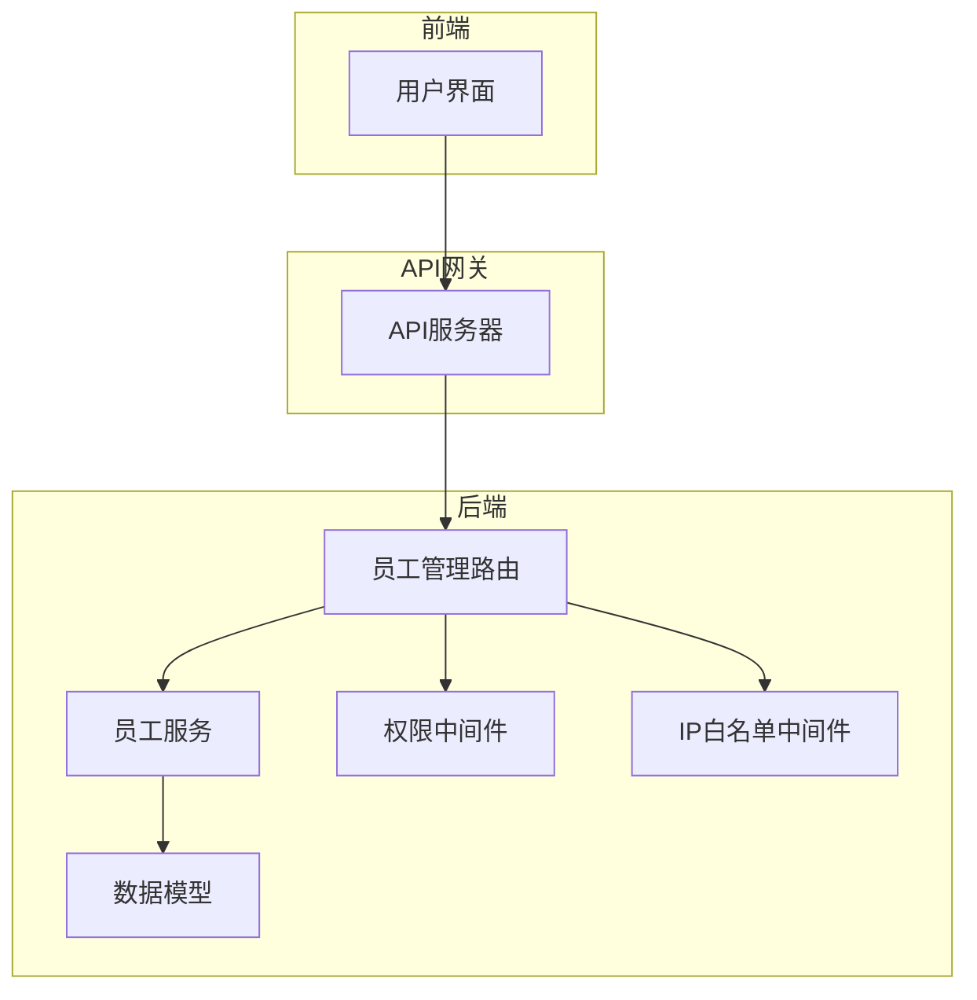
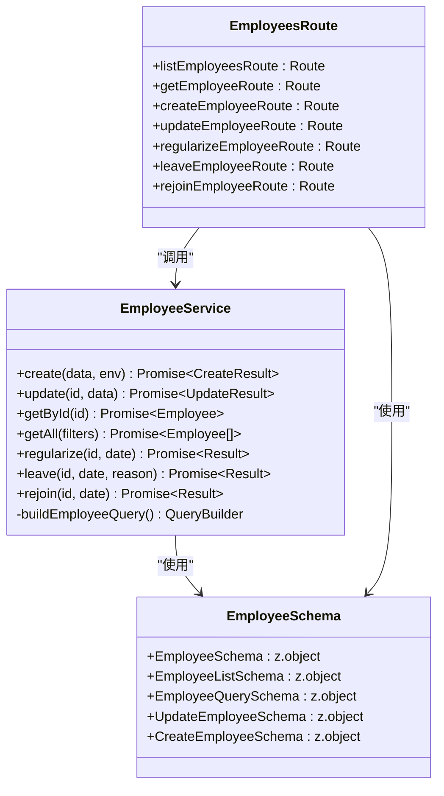
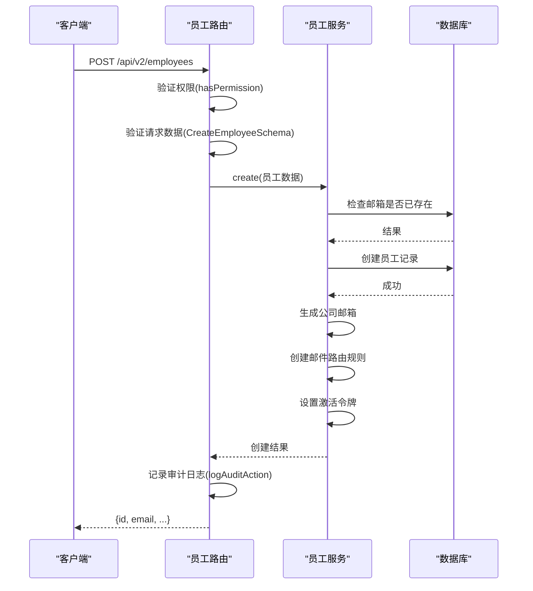
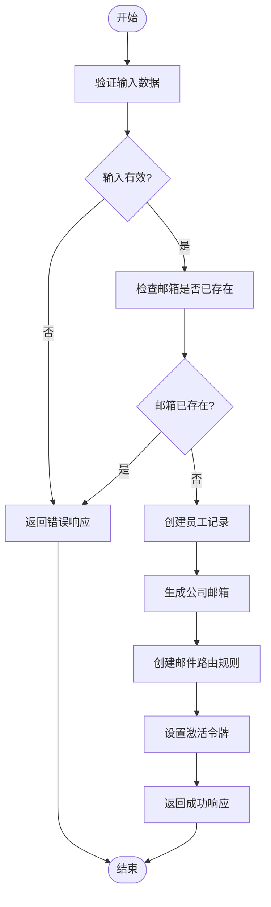
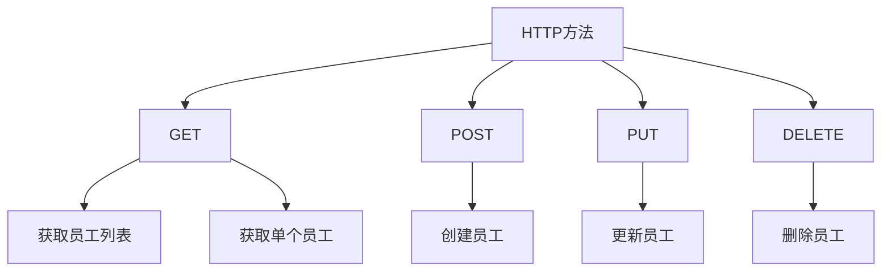
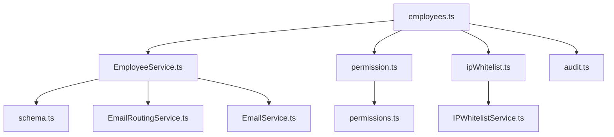
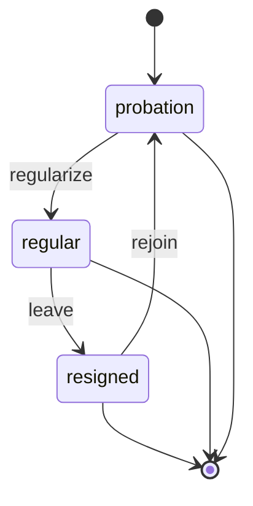
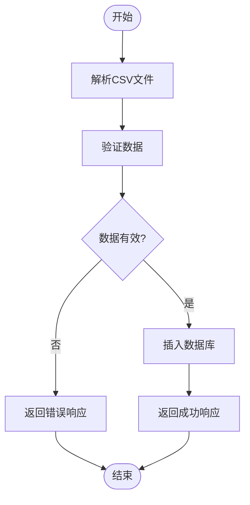

# 员工管理路由

<cite>
**本文档引用的文件**
- [employees.ts](file://backend/src/routes/v2/employees.ts)
- [EmployeeService.ts](file://backend/src/services/EmployeeService.ts)
- [employee.schema.ts](file://backend/src/schemas/employee.schema.ts)
- [permission.ts](file://backend/src/middleware/permission.ts)
- [ipWhitelist.ts](file://backend/src/middleware/ipWhitelist.ts)
- [permissions.ts](file://backend/src/utils/permissions.ts)
- [import.ts](file://backend/src/routes/v2/import.ts)
- [ImportService.ts](file://backend/src/services/ImportService.ts)
- [state-machine.ts](file://backend/src/utils/state-machine.ts)
- [schema.ts](file://backend/src/db/schema.ts)
</cite>

## 目录
1. [简介](#简介)
2. [项目结构](#项目结构)
3. [核心组件](#核心组件)
4. [架构概述](#架构概述)
5. [详细组件分析](#详细组件分析)
6. [依赖分析](#依赖分析)
7. [性能考虑](#性能考虑)
8. [故障排除指南](#故障排除指南)
9. [结论](#结论)
10. [附录](#附录)（如有必要）

## 简介
本文档深入解析员工管理模块的API路由设计，涵盖员工信息的增删改查、状态变更（入职、离职、复职）、批量导入、敏感信息脱敏等核心功能。文档详细说明了路由路径命名规范、HTTP方法使用原则、请求与响应的数据结构定义，以及与EmployeeService服务层的调用关系。同时，结合代码示例展示了如何通过中间件实现权限控制、IP白名单访问限制和操作日志审计。此外，文档还解释了员工状态机在路由中的体现，并提供了常见错误处理模式的解决方案。

## 项目结构
员工管理模块的代码结构遵循清晰的分层设计，主要包含路由、服务、数据模型和中间件等部分。路由文件定义了API接口，服务文件实现了业务逻辑，数据模型文件定义了数据库表结构，中间件文件则提供了权限控制、IP白名单等通用功能。

**图表来源**
- [employees.ts](file://backend/src/routes/v2/employees.ts)
- [EmployeeService.ts](file://backend/src/services/EmployeeService.ts)
- [schema.ts](file://backend/src/db/schema.ts)
- [employee.schema.ts](file://backend/src/schemas/employee.schema.ts)
- [permission.ts](file://backend/src/middleware/permission.ts)
- [permissions.ts](file://backend/src/utils/permissions.ts)
- [ipWhitelist.ts](file://backend/src/middleware/ipWhitelist.ts)
- [import.ts](file://backend/src/routes/v2/import.ts)
- [ImportService.ts](file://backend/src/services/ImportService.ts)

**章节来源**
- [employees.ts](file://backend/src/routes/v2/employees.ts)
- [EmployeeService.ts](file://backend/src/services/EmployeeService.ts)
- [schema.ts](file://backend/src/db/schema.ts)
- [employee.schema.ts](file://backend/src/schemas/employee.schema.ts)
- [permission.ts](file://backend/src/middleware/permission.ts)
- [permissions.ts](file://backend/src/utils/permissions.ts)
- [ipWhitelist.ts](file://backend/src/middleware/ipWhitelist.ts)
- [import.ts](file://backend/src/routes/v2/import.ts)
- [ImportService.ts](file://backend/src/services/ImportService.ts)

## 核心组件
员工管理模块的核心组件包括员工信息的增删改查、状态变更、批量导入等功能。这些功能通过API路由暴露给前端应用，由服务层实现具体的业务逻辑。

**章节来源**
- [employees.ts](file://backend/src/routes/v2/employees.ts)
- [EmployeeService.ts](file://backend/src/services/EmployeeService.ts)

## 架构概述
员工管理模块的架构采用分层设计，包括路由层、服务层、数据模型层和中间件层。路由层负责定义API接口，服务层负责实现业务逻辑，数据模型层负责定义数据库表结构，中间件层负责提供权限控制、IP白名单等通用功能。

**图表来源**
- [employees.ts](file://backend/src/routes/v2/employees.ts)
- [EmployeeService.ts](file://backend/src/services/EmployeeService.ts)
- [schema.ts](file://backend/src/db/schema.ts)
- [permission.ts](file://backend/src/middleware/permission.ts)
- [ipWhitelist.ts](file://backend/src/middleware/ipWhitelist.ts)

## 详细组件分析
### 员工信息管理分析
员工信息管理功能包括员工信息的增删改查、状态变更、批量导入等。这些功能通过API路由暴露给前端应用，由服务层实现具体的业务逻辑。

#### 对象导向组件

**图表来源**
- [EmployeeService.ts](file://backend/src/services/EmployeeService.ts)
- [employee.schema.ts](file://backend/src/schemas/employee.schema.ts)
- [employees.ts](file://backend/src/routes/v2/employees.ts)

#### API/服务组件

**图表来源**
- [employees.ts](file://backend/src/routes/v2/employees.ts)
- [EmployeeService.ts](file://backend/src/services/EmployeeService.ts)
- [schema.ts](file://backend/src/db/schema.ts)

#### 复杂逻辑组件

**图表来源**
- [EmployeeService.ts](file://backend/src/services/EmployeeService.ts)
- [employees.ts](file://backend/src/routes/v2/employees.ts)

**章节来源**
- [employees.ts](file://backend/src/routes/v2/employees.ts)
- [EmployeeService.ts](file://backend/src/services/EmployeeService.ts)
- [employee.schema.ts](file://backend/src/schemas/employee.schema.ts)
- [schema.ts](file://backend/src/db/schema.ts)

### 概念概述
员工管理模块的设计遵循RESTful API原则，使用标准的HTTP方法进行资源操作。GET用于获取资源，POST用于创建资源，PUT用于更新资源，DELETE用于删除资源。路由路径采用复数形式，如`/api/v2/employees`。

## 依赖分析
员工管理模块依赖于多个其他模块和组件，包括数据库、权限控制、IP白名单、邮件服务等。这些依赖通过服务层和中间件层进行管理。

**图表来源**
- [employees.ts](file://backend/src/routes/v2/employees.ts)
- [EmployeeService.ts](file://backend/src/services/EmployeeService.ts)
- [permission.ts](file://backend/src/middleware/permission.ts)
- [ipWhitelist.ts](file://backend/src/middleware/ipWhitelist.ts)
- [schema.ts](file://backend/src/db/schema.ts)
- [permissions.ts](file://backend/src/utils/permissions.ts)
- [audit.ts](file://backend/src/utils/audit.ts)

**章节来源**
- [employees.ts](file://backend/src/routes/v2/employees.ts)
- [EmployeeService.ts](file://backend/src/services/EmployeeService.ts)
- [permission.ts](file://backend/src/middleware/permission.ts)
- [ipWhitelist.ts](file://backend/src/middleware/ipWhitelist.ts)
- [schema.ts](file://backend/src/db/schema.ts)
- [permissions.ts](file://backend/src/utils/permissions.ts)
- [audit.ts](file://backend/src/utils/audit.ts)

## 性能考虑
员工管理模块在设计时考虑了性能优化，包括数据库查询优化、缓存机制、批量操作等。例如，在获取员工列表时，使用了分页查询和索引优化；在批量导入时，使用了事务处理和批量插入。

## 故障排除指南
### 常见错误处理
员工管理模块中常见的错误包括重复身份证号校验失败、权限不足、IP不在白名单内等。对于这些错误，系统会返回相应的错误码和错误信息，帮助前端应用进行错误处理。

**章节来源**
- [errors.ts](file://backend/src/utils/errors.ts)
- [employees.ts](file://backend/src/routes/v2/employees.ts)
- [EmployeeService.ts](file://backend/src/services/EmployeeService.ts)

## 结论
员工管理模块的API路由设计遵循RESTful原则，使用标准的HTTP方法进行资源操作。模块通过分层设计实现了业务逻辑的解耦，通过中间件实现了权限控制和IP白名单等通用功能。未来可以进一步优化性能，增加更多的错误处理机制，提高系统的稳定性和可靠性。

## 附录
### 员工状态机
员工状态机定义了员工状态的转换逻辑，包括`active`、`inactive`、`on_leave`等状态。状态转换通过API路由进行控制，确保状态转换的合法性和一致性。

**图表来源**
- [EmployeeService.ts](file://backend/src/services/EmployeeService.ts)
- [state-machine.ts](file://backend/src/utils/state-machine.ts)

### 批量导入流程
批量导入功能允许用户通过CSV文件批量导入员工信息。导入流程包括解析CSV文件、验证数据、插入数据库等步骤。

**图表来源**
- [import.ts](file://backend/src/routes/v2/import.ts)
- [ImportService.ts](file://backend/src/services/ImportService.ts)
- [csv.ts](file://backend/src/utils/csv.ts)