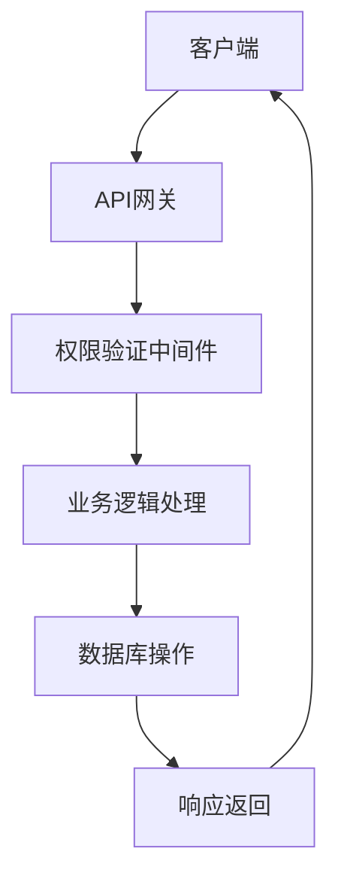
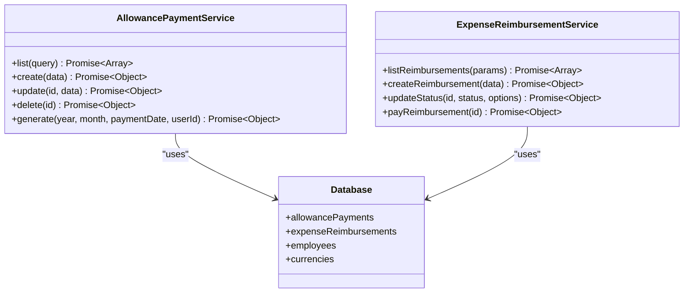
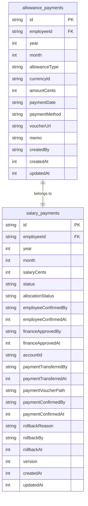
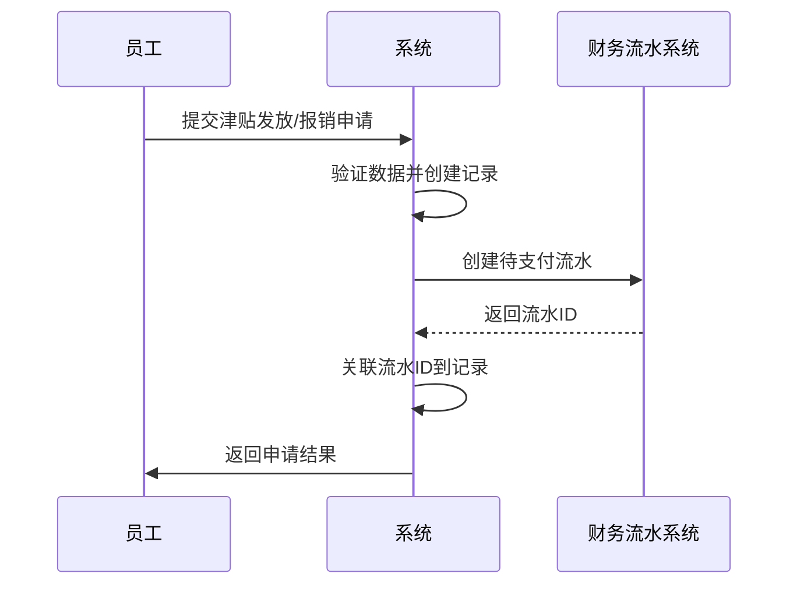

# 津贴与报销管理路由

<cite>
**本文档引用文件**   
- [allowance-payments.ts](file://backend/src/routes/v2/allowance-payments.ts)
- [expense-reimbursements.ts](file://backend/src/routes/v2/expense-reimbursements.ts)
- [AllowancePaymentService.ts](file://backend/src/services/AllowancePaymentService.ts)
- [ExpenseReimbursementService.ts](file://backend/src/services/ExpenseReimbursementService.ts)
- [schema.ts](file://backend/src/db/schema.ts)
- [business.schema.ts](file://backend/src/schemas/business.schema.ts)
- [security.ts](file://backend/src/middleware/security.ts)
</cite>

## 目录
1. [引言](#引言)
2. [API路由设计原则](#apiroute-design-principles)
3. [津贴发放功能分析](#allowance-payment-function-analysis)
4. [费用报销功能分析](#expense-reimbursement-function-analysis)
5. [服务协同工作机制](#service-collaboration-mechanism)
6. [与薪资周期的关联机制](#salary-cycle-association-mechanism)
7. [审批状态同步策略](#approval-status-synchronization-strategy)
8. [财务流水系统对接方式](#financial-flow-system-integration-method)
9. [典型使用场景示例](#typical-use-case-examples)
10. [安全性措施实现](#security-measures-implementation)
11. [结论](#conclusion)

## 引言
本文件旨在整合解析津贴发放与费用报销两大功能的API路由，说明其在人事薪酬体系中的定位与交互关系。通过分析`/api/v2/allowance-payments`和`/api/v2/expense-reimbursements`两个端点的设计原则，详细描述申请创建、附件上传、审批流程集成、支付状态追踪等环节。重点说明与薪资周期的关联机制、审批状态同步策略及与财务流水系统的对接方式，并讨论安全性措施的实现。

## API路由设计原则
津贴发放与费用报销两大功能的API路由遵循RESTful设计原则，采用版本化路径（v2）以确保向后兼容性。路由设计注重权限控制、数据验证和审计日志记录，确保系统的安全性和可追溯性。



**Diagram sources**
- [allowance-payments.ts](file://backend/src/routes/v2/allowance-payments.ts)
- [expense-reimbursements.ts](file://backend/src/routes/v2/expense-reimbursements.ts)

## 津贴发放功能分析
津贴发放功能通过`/api/v2/allowance-payments`端点提供，支持创建、更新、删除和查询津贴支付记录。该功能与员工的薪资周期紧密关联，确保津贴计入当月工资。

### 申请创建
创建津贴发放记录时，需要提供员工ID、年月、津贴类型、货币ID、金额（以分为单位）、支付日期等信息。系统会自动检查重复记录，防止重复发放。

**Section sources**
- [allowance-payments.ts](file://backend/src/routes/v2/allowance-payments.ts#L231-L324)
- [AllowancePaymentService.ts](file://backend/src/services/AllowancePaymentService.ts#L49-L95)

### 附件上传
津贴发放支持上传凭证文件，文件需为WebP格式且大小不超过10MB。前端负责将图片转换为WebP格式后上传，确保文件的一致性和压缩效率。

**Section sources**
- [flows.ts](file://backend/src/routes/v2/flows.ts#L235-L279)
- [image.ts](file://frontend/src/utils/image.ts#L112-L133)

### 审批流程集成
津贴发放记录创建后，需经过财务审批流程。审批通过后，状态更新为"approved"，方可进行支付操作。审批流程由`ApprovalService`统一管理，确保权限控制和操作审计。

**Section sources**
- [ApprovalService.ts](file://backend/src/services/ApprovalService.ts#L378-L415)
- [allowance-payments.ts](file://backend/src/routes/v2/allowance-payments.ts#L326-L406)

### 支付状态追踪
支付状态通过`status`字段追踪，包括"pending"（待支付）、"paid"（已支付）等状态。支付操作会更新状态并记录支付时间，确保财务数据的准确性和可追溯性。

**Section sources**
- [AllowancePaymentService.ts](file://backend/src/services/AllowancePaymentService.ts#L97-L118)
- [allowance-payments.ts](file://backend/src/routes/v2/allowance-payments.ts#L326-L406)

## 费用报销功能分析
费用报销功能通过`/api/v2/expense-reimbursements`端点提供，支持创建、更新、删除和查询报销申请。该功能与员工的日常费用管理紧密关联，确保报销流程的透明和高效。

### 申请创建
创建费用报销申请时，需要提供员工ID、费用类型、金额（以分为单位）、费用日期、描述、凭证URL等信息。系统会自动设置初始状态为"pending"（待审批）。

**Section sources**
- [expense-reimbursements.ts](file://backend/src/routes/v2/expense-reimbursements.ts#L92-L138)
- [ExpenseReimbursementService.ts](file://backend/src/services/ExpenseReimbursementService.ts#L76-L109)

### 附件上传
费用报销支持上传凭证文件，文件需为WebP格式且大小不超过10MB。前端负责将图片转换为WebP格式后上传，确保文件的一致性和压缩效率。

**Section sources**
- [flows.ts](file://backend/src/routes/v2/flows.ts#L235-L279)
- [image.ts](file://frontend/src/utils/image.ts#L112-L133)

### 审批流程集成
费用报销申请创建后，需经过审批流程。审批通过后，状态更新为"approved"，方可进行支付操作。审批流程由`ApprovalService`统一管理，确保权限控制和操作审计。

**Section sources**
- [ApprovalService.ts](file://backend/src/services/ApprovalService.ts#L378-L415)
- [expense-reimbursements.ts](file://backend/src/routes/v2/expense-reimbursements.ts#L140-L190)

### 支付状态追踪
支付状态通过`status`字段追踪，包括"pending"（待审批）、"approved"（已批准）、"rejected"（已拒绝）、"paid"（已支付）等状态。支付操作会更新状态并记录支付时间，确保财务数据的准确性和可追溯性。

**Section sources**
- [ExpenseReimbursementService.ts](file://backend/src/services/ExpenseReimbursementService.ts#L144-L168)
- [expense-reimbursements.ts](file://backend/src/routes/v2/expense-reimbursements.ts#L192-L230)

## 服务协同工作机制
`AllowancePaymentService`与`ExpenseReimbursementService`通过共享数据库和统一的权限控制机制协同工作，确保财务一致性。两个服务均使用Drizzle ORM进行数据库操作，确保数据访问的一致性和安全性。



**Diagram sources**
- [AllowancePaymentService.ts](file://backend/src/services/AllowancePaymentService.ts)
- [ExpenseReimbursementService.ts](file://backend/src/services/ExpenseReimbursementService.ts)
- [schema.ts](file://backend/src/db/schema.ts)

## 与薪资周期的关联机制
津贴发放与薪资周期紧密关联，确保津贴计入当月工资。系统通过`year`和`month`字段标识津贴发放的周期，与`salary_payments`表中的记录对应，确保财务数据的一致性。



**Diagram sources**
- [schema.ts](file://backend/src/db/schema.ts#L241-L316)
- [AllowancePaymentService.ts](file://backend/src/services/AllowancePaymentService.ts#L155-L230)

## 审批状态同步策略
审批状态通过`status`字段同步，确保各系统组件间的状态一致性。审批流程由`ApprovalService`统一管理，审批结果会更新相应记录的状态，并触发后续操作，如创建财务流水。

**Section sources**
- [ApprovalService.ts](file://backend/src/services/ApprovalService.ts#L378-L415)
- [ExpenseReimbursementService.ts](file://backend/src/services/ExpenseReimbursementService.ts#L111-L142)

## 财务流水系统对接方式
津贴发放和费用报销均与财务流水系统对接，确保每笔支付都有对应的财务记录。支付操作会创建`cash_flows`记录，关联到相应的津贴或报销记录，确保财务数据的完整性和可追溯性。



**Diagram sources**
- [AllowancePaymentService.ts](file://backend/src/services/AllowancePaymentService.ts#L209-L227)
- [ExpenseReimbursementService.ts](file://backend/src/services/ExpenseReimbursementService.ts#L158-L167)

## 典型使用场景示例
### 津贴发放场景
```json
POST /api/v2/allowance-payments
{
  "employeeId": "emp123",
  "year": 2023,
  "month": 1,
  "allowanceType": "meal",
  "currencyId": "CNY",
  "amountCents": 50000,
  "paymentDate": "2023-01-01",
  "voucherUrl": "https://example.com/voucher.webp"
}
```

### 费用报销场景
```json
POST /api/v2/expense-reimbursements
{
  "employeeId": "emp123",
  "expenseType": "travel",
  "amountCents": 100000,
  "currencyId": "CNY",
  "expenseDate": "2023-01-01",
  "description": "出差费用",
  "voucherUrl": "https://example.com/voucher.webp"
}
```

**Section sources**
- [allowance-payments.test.ts](file://backend/test/routes/allowance-payments.test.ts#L128-L174)
- [expense-reimbursements.ts](file://backend/src/routes/v2/expense-reimbursements.ts#L92-L138)

## 安全性措施实现
系统实施多层次的安全性措施，包括文件类型校验、金额篡改防护、权限控制和审计日志记录，确保系统的安全性和数据的完整性。

### 文件类型校验
上传的凭证文件需为WebP格式，系统在接收文件时会验证文件类型和大小，防止恶意文件上传。

**Section sources**
- [flows.ts](file://backend/src/routes/v2/flows.ts#L253-L260)
- [image.ts](file://frontend/src/utils/image.ts#L118-L126)

### 金额篡改防护
金额以分为单位存储，系统在接收金额时会验证其为整数且不为负数，防止金额篡改。

**Section sources**
- [amount-validator.ts](file://backend/src/utils/amount-validator.ts#L11-L37)
- [business.schema.ts](file://backend/src/schemas/business.schema.ts#L19-L20)

### 权限控制
所有API端点均需通过权限验证中间件，确保只有授权用户才能访问相应功能。权限控制基于用户角色和功能模块，确保最小权限原则。

**Section sources**
- [security.ts](file://backend/src/middleware/security.ts#L19-L81)
- [permissions.js](file://backend/src/utils/permissions.js)

### 审计日志记录
所有关键操作均会记录审计日志，包括操作类型、实体、操作者、操作时间等信息，确保操作的可追溯性。

**Section sources**
- [audit.js](file://backend/src/utils/audit.js)
- [allowance-payments.ts](file://backend/src/routes/v2/allowance-payments.ts#L210-L221)

## 结论
津贴发放与费用报销两大功能的API路由设计合理，功能完整，安全性高。通过与薪资周期的关联、审批状态的同步和财务流水系统的对接，确保了财务数据的一致性和可追溯性。系统实施了多层次的安全性措施，包括文件类型校验、金额篡改防护、权限控制和审计日志记录，确保系统的安全性和数据的完整性。