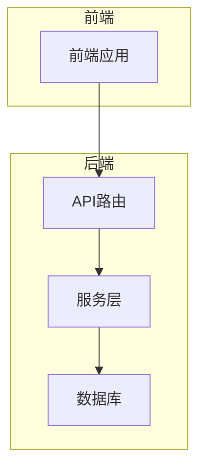
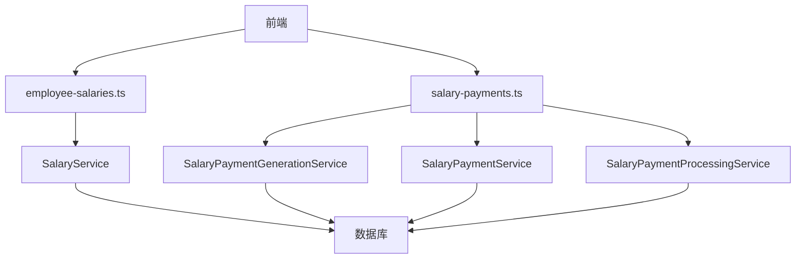
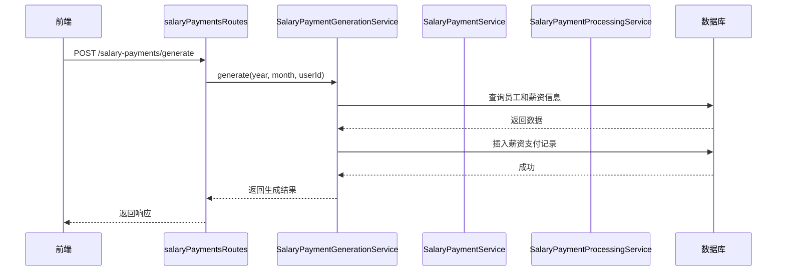
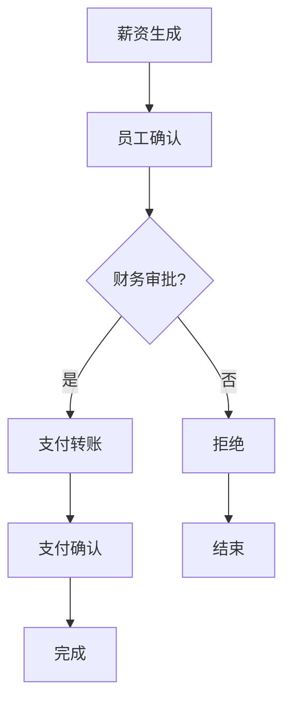
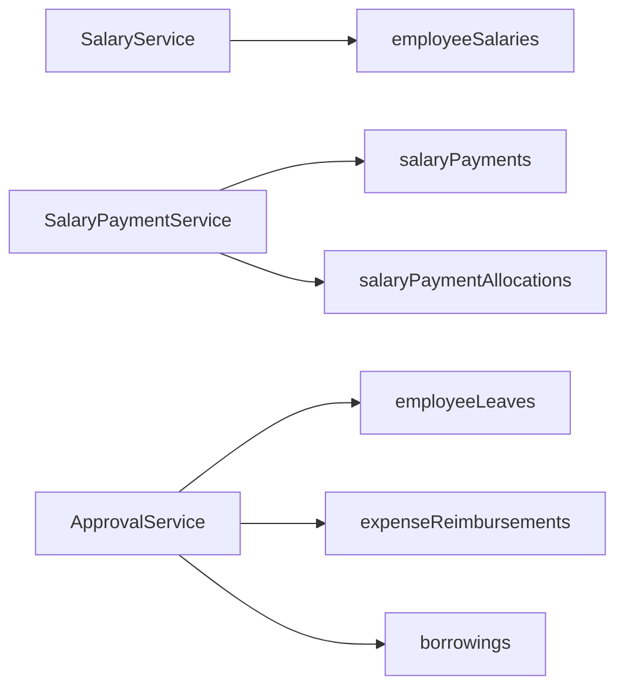

# 薪资管理路由

<cite>
**本文档引用的文件**   
- [employee-salaries.ts](file://backend/src/routes/v2/employee-salaries.ts)
- [SalaryService.ts](file://backend/src/services/SalaryService.ts)
- [salary-payments.ts](file://backend/src/routes/v2/salary-payments.ts)
- [SalaryPaymentService.ts](file://backend/src/services/SalaryPaymentService.ts)
- [SalaryPaymentGenerationService.ts](file://backend/src/services/SalaryPaymentGenerationService.ts)
- [SalaryPaymentProcessingService.ts](file://backend/src/services/SalaryPaymentProcessingService.ts)
- [ApprovalService.ts](file://backend/src/services/ApprovalService.ts)
- [schema.ts](file://backend/src/db/schema.ts)
- [di.ts](file://backend/src/middleware/di.ts)
- [employee-salaries.test.ts](file://backend/test/routes/employee-salaries.test.ts)
- [salary-payments.test.ts](file://backend/test/routes/salary-payments.test.ts)
</cite>

## 目录
1. [简介](#简介)
2. [项目结构](#项目结构)
3. [核心组件](#核心组件)
4. [架构概述](#架构概述)
5. [详细组件分析](#详细组件分析)
6. [依赖分析](#依赖分析)
7. [性能考虑](#性能考虑)
8. [故障排除指南](#故障排除指南)
9. [结论](#结论)

## 简介
本文档全面解析薪资管理相关的API端点，包括薪资结构配置、薪资计算、发放记录查询与导出等功能。重点描述`/api/v2/employee-salaries`路由的设计，说明其如何协调SalaryService、SalaryPaymentService和SalaryPaymentGenerationService完成薪资周期管理。详细阐述薪资计算接口的幂等性设计、审批流程集成（通过ApprovalService）以及与财务流水（cash_flows）的联动机制。提供实际请求示例展示薪资数据的分页查询、条件过滤和敏感字段加密传输策略，并分析性能优化措施（如查询缓存、分批处理）的应用场景。

## 项目结构
项目结构清晰地将薪资管理功能分布在后端的路由、服务和数据库模式中。核心薪资管理逻辑位于`backend/src/routes/v2/`目录下的`employee-salaries.ts`和`salary-payments.ts`文件中，分别处理薪资配置和薪资发放。业务逻辑由`backend/src/services/`目录下的`SalaryService.ts`、`SalaryPaymentService.ts`、`SalaryPaymentGenerationService.ts`和`SalaryPaymentProcessingService.ts`等服务类实现。数据库模式定义在`backend/src/db/schema.ts`中，确保了数据的一致性和完整性。



**图表来源**
- [employee-salaries.ts](file://backend/src/routes/v2/employee-salaries.ts)
- [salary-payments.ts](file://backend/src/routes/v2/salary-payments.ts)
- [SalaryService.ts](file://backend/src/services/SalaryService.ts)
- [schema.ts](file://backend/src/db/schema.ts)

**章节来源**
- [employee-salaries.ts](file://backend/src/routes/v2/employee-salaries.ts)
- [salary-payments.ts](file://backend/src/routes/v2/salary-payments.ts)

## 核心组件
核心组件包括`employee-salaries.ts`中的薪资配置API和`salary-payments.ts`中的薪资发放API。`SalaryService`负责管理员工的薪资结构，而`SalaryPaymentService`、`SalaryPaymentGenerationService`和`SalaryPaymentProcessingService`共同协作完成薪资的生成、审批和支付流程。这些服务通过依赖注入（DI）在`di.ts`中被初始化并注入到请求上下文中。

**章节来源**
- [employee-salaries.ts](file://backend/src/routes/v2/employee-salaries.ts)
- [salary-payments.ts](file://backend/src/routes/v2/salary-payments.ts)
- [SalaryService.ts](file://backend/src/services/SalaryService.ts)
- [SalaryPaymentService.ts](file://backend/src/services/SalaryPaymentService.ts)
- [SalaryPaymentGenerationService.ts](file://backend/src/services/SalaryPaymentGenerationService.ts)
- [SalaryPaymentProcessingService.ts](file://backend/src/services/SalaryPaymentProcessingService.ts)
- [di.ts](file://backend/src/middleware/di.ts)

## 架构概述
薪资管理系统的架构采用分层设计，前端通过API路由与后端交互，后端服务层处理业务逻辑，并与数据库进行数据交换。`SalaryService`处理薪资配置，`SalaryPaymentGenerationService`根据员工信息和薪资标准生成薪资支付记录，`SalaryPaymentService`管理薪资支付的状态流转，而`SalaryPaymentProcessingService`则处理具体的支付操作，如转账和确认。



**图表来源**
- [employee-salaries.ts](file://backend/src/routes/v2/employee-salaries.ts)
- [salary-payments.ts](file://backend/src/routes/v2/salary-payments.ts)
- [SalaryService.ts](file://backend/src/services/SalaryService.ts)
- [SalaryPaymentService.ts](file://backend/src/services/SalaryPaymentService.ts)
- [SalaryPaymentGenerationService.ts](file://backend/src/services/SalaryPaymentGenerationService.ts)
- [SalaryPaymentProcessingService.ts](file://backend/src/services/SalaryPaymentProcessingService.ts)
- [schema.ts](file://backend/src/db/schema.ts)

## 详细组件分析

### 薪资配置分析
`employee-salaries.ts`文件定义了薪资配置的API端点，包括获取、创建、批量更新和删除员工薪资。`SalaryService`提供了相应的服务方法，如`list`、`create`、`batchUpdate`和`delete`，用于处理这些请求。这些方法通过Drizzle ORM与数据库交互，确保数据的准确性和一致性。

```mermaid
classDiagram
class SalaryService {
+list(employeeId : string, salaryType? : string)
+create(data : { employeeId : string, salaryType : string, currencyId : string, amountCents : number })
+update(id : string, data : { amountCents : number })
+delete(id : string)
+get(id : string)
+batchUpdate(employeeId : string, salaryType : string, salaries : Array<{ currencyId : string; amountCents : number }>)
+getEmployeeTotalSalary(employeeId : string)
}
class employeeSalaries {
+id : string
+employeeId : string
+salaryType : string
+currencyId : string
+amountCents : number
+effectiveDate : string
+createdAt : number
+updatedAt : number
}
SalaryService --> employeeSalaries : "操作"
```

**图表来源**
- [SalaryService.ts](file://backend/src/services/SalaryService.ts)
- [schema.ts](file://backend/src/db/schema.ts)

**章节来源**
- [employee-salaries.ts](file://backend/src/routes/v2/employee-salaries.ts)
- [SalaryService.ts](file://backend/src/services/SalaryService.ts)

### 薪资发放分析
`salary-payments.ts`文件定义了薪资发放的API端点，包括生成、查询、员工确认、财务审批、支付转账和支付确认等。`SalaryPaymentGenerationService`负责生成薪资支付记录，`SalaryPaymentService`管理支付状态，`SalaryPaymentProcessingService`处理支付操作。这些服务通过状态机（state-machine）确保支付流程的正确性。



**图表来源**
- [salary-payments.ts](file://backend/src/routes/v2/salary-payments.ts)
- [SalaryPaymentGenerationService.ts](file://backend/src/services/SalaryPaymentGenerationService.ts)
- [SalaryPaymentService.ts](file://backend/src/services/SalaryPaymentService.ts)
- [SalaryPaymentProcessingService.ts](file://backend/src/services/SalaryPaymentProcessingService.ts)
- [schema.ts](file://backend/src/db/schema.ts)

**章节来源**
- [salary-payments.ts](file://backend/src/routes/v2/salary-payments.ts)
- [SalaryPaymentGenerationService.ts](file://backend/src/services/SalaryPaymentGenerationService.ts)
- [SalaryPaymentService.ts](file://backend/src/services/SalaryPaymentService.ts)
- [SalaryPaymentProcessingService.ts](file://backend/src/services/SalaryPaymentProcessingService.ts)

### 审批流程集成
`ApprovalService`被集成到薪资管理流程中，确保薪资支付的每一步都经过适当的审批。例如，当员工确认薪资后，状态变为`pending_finance_approval`，财务人员可以进行审批。审批通过后，状态变为`pending_payment`，可以进行支付操作。这一流程通过`ApprovalService`的`approve`和`reject`方法实现。



**图表来源**
- [ApprovalService.ts](file://backend/src/services/ApprovalService.ts)
- [SalaryPaymentService.ts](file://backend/src/services/SalaryPaymentService.ts)

**章节来源**
- [ApprovalService.ts](file://backend/src/services/ApprovalService.ts)
- [SalaryPaymentService.ts](file://backend/src/services/SalaryPaymentService.ts)

## 依赖分析
薪资管理系统依赖于多个服务和数据库表。`SalaryService`依赖于`employeeSalaries`表，`SalaryPaymentService`依赖于`salaryPayments`和`salaryPaymentAllocations`表。`ApprovalService`依赖于`employeeLeaves`、`expenseReimbursements`和`borrowings`表。这些依赖关系通过Drizzle ORM在服务类中定义，并在`di.ts`中通过依赖注入进行管理。



**图表来源**
- [SalaryService.ts](file://backend/src/services/SalaryService.ts)
- [SalaryPaymentService.ts](file://backend/src/services/SalaryPaymentService.ts)
- [ApprovalService.ts](file://backend/src/services/ApprovalService.ts)
- [schema.ts](file://backend/src/db/schema.ts)

**章节来源**
- [SalaryService.ts](file://backend/src/services/SalaryService.ts)
- [SalaryPaymentService.ts](file://backend/src/services/SalaryPaymentService.ts)
- [ApprovalService.ts](file://backend/src/services/ApprovalService.ts)
- [schema.ts](file://backend/src/db/schema.ts)

## 性能考虑
为了提高性能，系统采用了多种优化措施。例如，`SalaryPaymentService`中的`list`方法使用`QueryBuilder`优化员工关联查询，减少数据库查询的复杂度。此外，系统通过分页查询和缓存机制减少对数据库的频繁访问，提高响应速度。

**章节来源**
- [SalaryPaymentService.ts](file://backend/src/services/SalaryPaymentService.ts)
- [SalaryService.ts](file://backend/src/services/SalaryService.ts)

## 故障排除指南
在使用薪资管理API时，可能会遇到一些常见问题。例如，创建薪资时如果员工ID不存在，会返回404错误。在生成薪资支付时，如果指定的年份和月份已经存在支付记录，系统将不会重复生成。此外，支付操作需要确保账户状态正常，否则会返回业务错误。

**章节来源**
- [employee-salaries.test.ts](file://backend/test/routes/employee-salaries.test.ts)
- [salary-payments.test.ts](file://backend/test/routes/salary-payments.test.ts)

## 结论
本文档详细解析了薪资管理相关的API端点，涵盖了薪资结构配置、薪资计算、发放记录查询与导出等功能。通过分析`/api/v2/employee-salaries`路由的设计，我们了解了其如何协调多个服务完成薪资周期管理。文档还详细阐述了薪资计算接口的幂等性设计、审批流程集成以及与财务流水的联动机制。通过实际请求示例和性能优化措施的分析，为开发者提供了全面的指导。