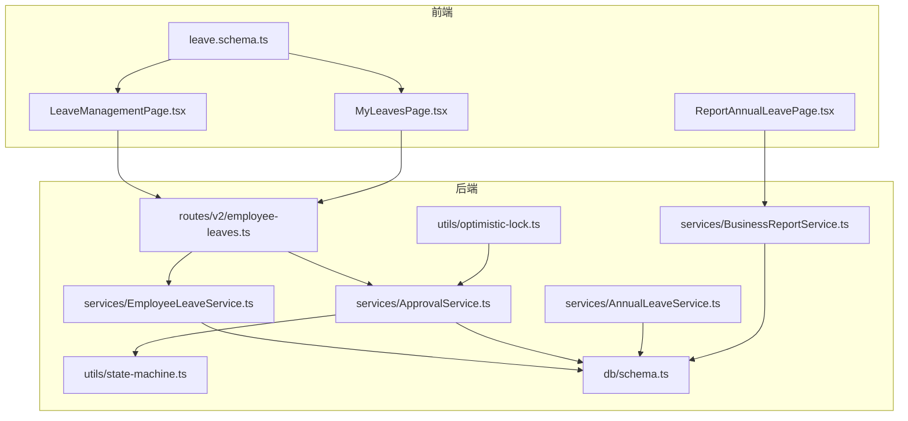
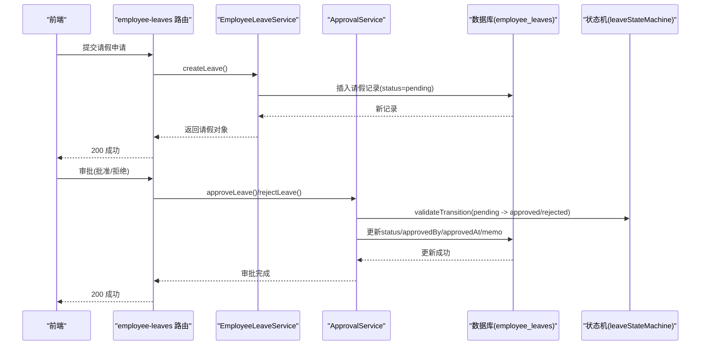
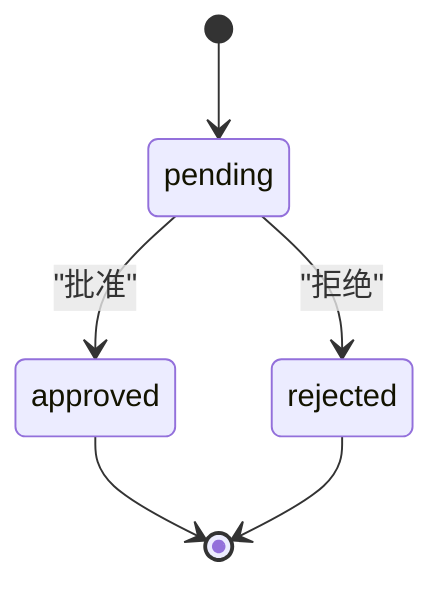
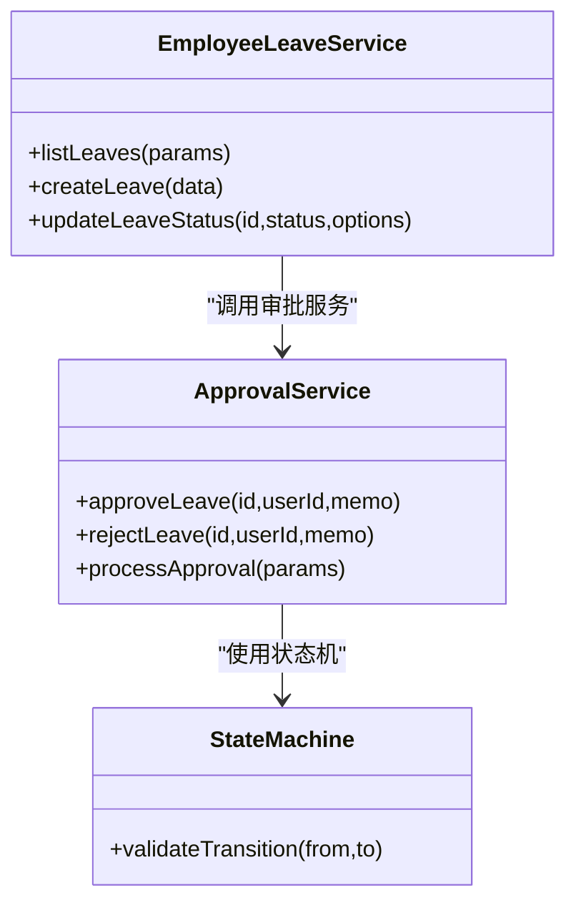
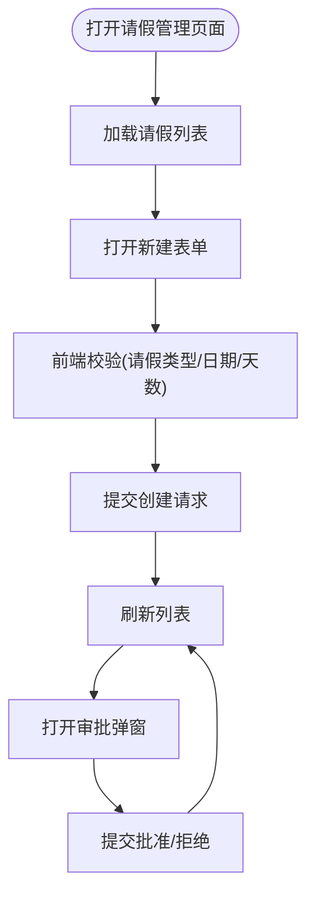
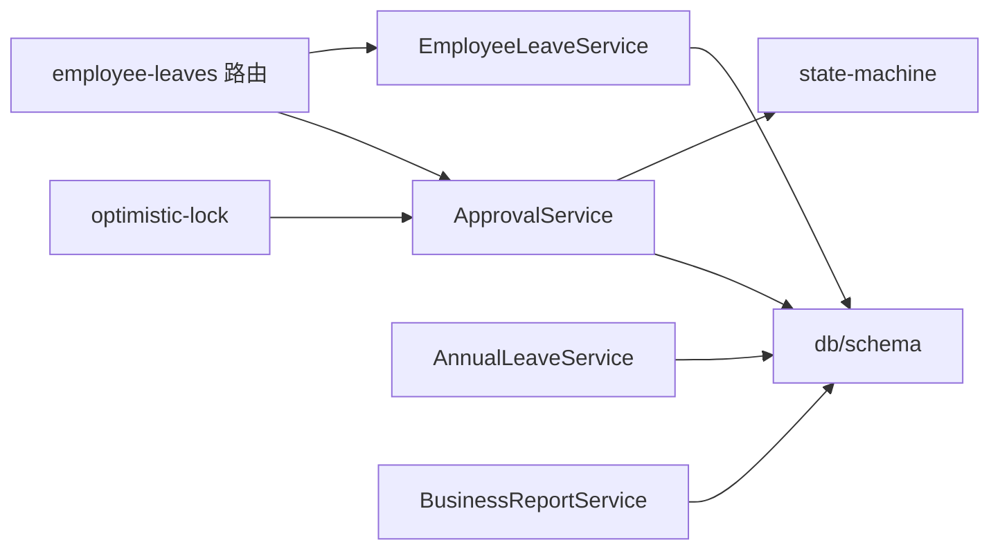

# 请假管理路由

<cite>
**本文引用的文件**
- [backend/src/routes/v2/employee-leaves.ts](file://backend/src/routes/v2/employee-leaves.ts)
- [backend/src/services/EmployeeLeaveService.ts](file://backend/src/services/EmployeeLeaveService.ts)
- [backend/src/services/ApprovalService.ts](file://backend/src/services/ApprovalService.ts)
- [backend/src/utils/state-machine.ts](file://backend/src/utils/state-machine.ts)
- [backend/src/db/schema.ts](file://backend/src/db/schema.ts)
- [backend/src/services/AnnualLeaveService.ts](file://backend/src/services/AnnualLeaveService.ts)
- [backend/src/services/BusinessReportService.ts](file://backend/src/services/BusinessReportService.ts)
- [backend/src/utils/optimistic-lock.ts](file://backend/src/utils/optimistic-lock.ts)
- [backend/test/utils/state-machine.test.ts](file://backend/test/utils/state-machine.test.ts)
- [backend/test/services/ApprovalService.test.ts](file://backend/test/services/ApprovalService.test.ts)
- [frontend/src/validations/leave.schema.ts](file://frontend/src/validations/leave.schema.ts)
- [frontend/src/features/hr/pages/LeaveManagementPage.tsx](file://frontend/src/features/hr/pages/LeaveManagementPage.tsx)
- [frontend/src/features/my/pages/MyLeavesPage.tsx](file://frontend/src/features/my/pages/MyLeavesPage.tsx)
- [frontend/src/features/reports/pages/ReportAnnualLeavePage.tsx](file://frontend/src/features/reports/pages/ReportAnnualLeavePage.tsx)
</cite>

## 目录
1. [简介](#简介)
2. [项目结构](#项目结构)
3. [核心组件](#核心组件)
4. [架构总览](#架构总览)
5. [详细组件分析](#详细组件分析)
6. [依赖关系分析](#依赖关系分析)
7. [性能考量](#性能考量)
8. [故障排查指南](#故障排查指南)
9. [结论](#结论)
10. [附录](#附录)

## 简介
本文件系统化阐述请假管理模块的API设计与实现，覆盖以下关键能力：
- 请假申请提交、审批流程推进、历史记录查询与统计报表生成
- 端点“/api/v2/employee-leaves”的状态机驱动特性，明确 pending、approved、rejected、cancelled 等状态的转换规则与触发条件
- 请假类型（年假、病假、事假）的枚举定义与前端校验
- 工时计算逻辑与考勤系统的数据同步机制
- EmployeeLeaveService 与 ApprovalService 的交互，展示审批链路的实现方式
- 前端集成示例，说明如何构建动态审批表单
- 异常场景处理，包括冲突假期检测与并发修改的乐观锁机制

## 项目结构
请假管理模块位于后端路由层与服务层之间，采用清晰的职责分离：
- 路由层：定义 OpenAPI 路由与请求/响应模型，负责权限校验与参数解析
- 服务层：封装业务逻辑，包括请假 CRUD、状态变更、统计与报表
- 数据层：基于 Drizzle ORM 的 SQLite 表结构，包含乐观锁版本号
- 前端：提供请假申请、审批与报表页面，配合表单校验与状态标签

图表来源
- [backend/src/routes/v2/employee-leaves.ts](file://backend/src/routes/v2/employee-leaves.ts#L1-L176)
- [backend/src/services/EmployeeLeaveService.ts](file://backend/src/services/EmployeeLeaveService.ts#L1-L182)
- [backend/src/services/ApprovalService.ts](file://backend/src/services/ApprovalService.ts#L1-L645)
- [backend/src/utils/state-machine.ts](file://backend/src/utils/state-machine.ts#L44-L87)
- [backend/src/db/schema.ts](file://backend/src/db/schema.ts#L241-L284)
- [backend/src/services/AnnualLeaveService.ts](file://backend/src/services/AnnualLeaveService.ts#L1-L195)
- [backend/src/services/BusinessReportService.ts](file://backend/src/services/BusinessReportService.ts#L265-L300)

章节来源
- [backend/src/routes/v2/employee-leaves.ts](file://backend/src/routes/v2/employee-leaves.ts#L1-L176)
- [backend/src/db/schema.ts](file://backend/src/db/schema.ts#L241-L284)

## 核心组件
- 路由与控制器
  - 列表查询、创建请假、更新状态（审批）
  - 权限校验与 OpenAPI 规范
- 服务层
  - EmployeeLeaveService：请假 CRUD、状态更新、统计
  - ApprovalService：通用审批流程、状态机校验、通知与操作历史
  - AnnualLeaveService：年假配置、周期计算、使用统计与结算
  - BusinessReportService：按月扣减非年假工时、年假报表
- 数据模型
  - employee_leaves 表含乐观锁版本号
- 前端
  - 请假申请与审批表单、状态标签、报表页面

章节来源
- [backend/src/routes/v2/employee-leaves.ts](file://backend/src/routes/v2/employee-leaves.ts#L1-L176)
- [backend/src/services/EmployeeLeaveService.ts](file://backend/src/services/EmployeeLeaveService.ts#L1-L182)
- [backend/src/services/ApprovalService.ts](file://backend/src/services/ApprovalService.ts#L1-L645)
- [backend/src/services/AnnualLeaveService.ts](file://backend/src/services/AnnualLeaveService.ts#L1-L195)
- [backend/src/services/BusinessReportService.ts](file://backend/src/services/BusinessReportService.ts#L265-L300)
- [backend/src/db/schema.ts](file://backend/src/db/schema.ts#L241-L284)
- [frontend/src/validations/leave.schema.ts](file://frontend/src/validations/leave.schema.ts#L1-L32)
- [frontend/src/features/hr/pages/LeaveManagementPage.tsx](file://frontend/src/features/hr/pages/LeaveManagementPage.tsx#L1-L200)
- [frontend/src/features/my/pages/MyLeavesPage.tsx](file://frontend/src/features/my/pages/MyLeavesPage.tsx#L1-L35)
- [frontend/src/features/reports/pages/ReportAnnualLeavePage.tsx](file://frontend/src/features/reports/pages/ReportAnnualLeavePage.tsx#L1-L49)

## 架构总览
请假管理采用“路由-服务-数据”三层架构，配合状态机与乐观锁保障一致性与可审计性。

图表来源
- [backend/src/routes/v2/employee-leaves.ts](file://backend/src/routes/v2/employee-leaves.ts#L83-L176)
- [backend/src/services/EmployeeLeaveService.ts](file://backend/src/services/EmployeeLeaveService.ts#L100-L181)
- [backend/src/services/ApprovalService.ts](file://backend/src/services/ApprovalService.ts#L326-L376)
- [backend/src/utils/state-machine.ts](file://backend/src/utils/state-machine.ts#L80-L87)
- [backend/src/db/schema.ts](file://backend/src/db/schema.ts#L241-L284)

## 详细组件分析

### 路由与端点设计
- GET /api/v2/employee-leaves
  - 功能：分页/筛选列出请假记录
  - 参数：employeeId、status
  - 权限：需登录并具备查看权限
- POST /api/v2/employee-leaves
  - 功能：创建请假申请
  - 请求体：employeeId、leaveType、startDate、endDate、days、reason、memo
  - 权限：需具备创建权限
  - 默认状态：pending
- PUT /api/v2/employee-leaves/{id}/status
  - 功能：更新请假状态（批准/拒绝）
  - 请求体：status(枚举 approved/rejected)、memo
  - 权限：需具备审批权限
  - 审批人信息：approvedBy、approvedAt 自动写入

章节来源
- [backend/src/routes/v2/employee-leaves.ts](file://backend/src/routes/v2/employee-leaves.ts#L43-L176)

### 状态机驱动的请假状态流转
- 状态集合：pending、approved、rejected
- 允许的转换：
  - pending → approved
  - pending → rejected
  - approved 与 rejected 为终态，不可再转换
- 路由层与审批服务均通过状态机进行合法性校验，避免非法状态变更

图表来源
- [backend/src/utils/state-machine.ts](file://backend/src/utils/state-machine.ts#L80-L87)
- [backend/test/utils/state-machine.test.ts](file://backend/test/utils/state-machine.test.ts#L101-L113)

章节来源
- [backend/src/utils/state-machine.ts](file://backend/src/utils/state-machine.ts#L80-L87)
- [backend/test/utils/state-machine.test.ts](file://backend/test/utils/state-machine.test.ts#L101-L113)

### 请假类型与工时计算
- 请假类型枚举（后端/前端一致）
  - sick：病假
  - annual：年假
  - personal：事假
  - other：其他
- 工时计算与报表
  - 非年假类型的请假在月度工资计算中按重叠天数扣减应发工时
  - 年假报表按员工维度统计周期、已用、剩余天数
- 年假服务
  - 支持半年制/年制两种周期
  - 计算周期起止、已用天数、剩余天数
  - 支持离职结算（未休折算）

章节来源
- [frontend/src/validations/leave.schema.ts](file://frontend/src/validations/leave.schema.ts#L4-L7)
- [backend/src/services/BusinessReportService.ts](file://backend/src/services/BusinessReportService.ts#L426-L496)
- [backend/src/services/AnnualLeaveService.ts](file://backend/src/services/AnnualLeaveService.ts#L1-L195)
- [frontend/src/features/reports/pages/ReportAnnualLeavePage.tsx](file://frontend/src/features/reports/pages/ReportAnnualLeavePage.tsx#L1-L49)

### EmployeeLeaveService 与 ApprovalService 的交互
- EmployeeLeaveService
  - 提供 listLeaves、createLeave、updateLeaveStatus 等核心方法
  - 在更新状态时写入 approvedBy、approvedAt 等审计字段
- ApprovalService
  - 通用审批流程：读取记录、校验状态机、权限检查、更新状态、记录操作历史、发送通知
  - 专门针对请假的 approveLeave/rejectLeave 方法
  - 支持批量审批与历史查询

图表来源
- [backend/src/services/EmployeeLeaveService.ts](file://backend/src/services/EmployeeLeaveService.ts#L1-L182)
- [backend/src/services/ApprovalService.ts](file://backend/src/services/ApprovalService.ts#L148-L229)
- [backend/src/utils/state-machine.ts](file://backend/src/utils/state-machine.ts#L44-L87)

章节来源
- [backend/src/services/EmployeeLeaveService.ts](file://backend/src/services/EmployeeLeaveService.ts#L1-L182)
- [backend/src/services/ApprovalService.ts](file://backend/src/services/ApprovalService.ts#L148-L229)

### 前端集成示例
- 请假管理页面
  - 表单字段：员工选择、请假类型、日期范围、天数、原因、备注
  - 校验规则：必填、日期先后顺序、最小天数
  - 审批弹窗：批准/拒绝选择与备注
- 我的请假页面
  - 展示历史与统计，支持按年份筛选
- 报表页面
  - 年假统计汇总与明细

图表来源
- [frontend/src/features/hr/pages/LeaveManagementPage.tsx](file://frontend/src/features/hr/pages/LeaveManagementPage.tsx#L1-L200)
- [frontend/src/features/my/pages/MyLeavesPage.tsx](file://frontend/src/features/my/pages/MyLeavesPage.tsx#L1-L35)
- [frontend/src/validations/leave.schema.ts](file://frontend/src/validations/leave.schema.ts#L1-L32)

章节来源
- [frontend/src/features/hr/pages/LeaveManagementPage.tsx](file://frontend/src/features/hr/pages/LeaveManagementPage.tsx#L1-L200)
- [frontend/src/features/my/pages/MyLeavesPage.tsx](file://frontend/src/features/my/pages/MyLeavesPage.tsx#L1-L35)
- [frontend/src/validations/leave.schema.ts](file://frontend/src/validations/leave.schema.ts#L1-L32)

### 异常场景处理
- 冲突假期检测
  - 通过业务报表服务对当月请假与应发工时进行重叠计算，非年假类型按重叠天数扣减
- 并发修改的乐观锁机制
  - 数据库表 employee_leaves 含 version 字段
  - 审批服务在更新时使用乐观锁校验，避免并发冲突导致的数据覆盖

章节来源
- [backend/src/services/BusinessReportService.ts](file://backend/src/services/BusinessReportService.ts#L426-L496)
- [backend/src/db/schema.ts](file://backend/src/db/schema.ts#L241-L284)
- [backend/src/utils/optimistic-lock.ts](file://backend/src/utils/optimistic-lock.ts#L1-L41)
- [backend/src/services/ApprovalService.ts](file://backend/src/services/ApprovalService.ts#L177-L229)

## 依赖关系分析
- 路由依赖服务层，服务层依赖数据层与工具模块
- 审批服务依赖状态机与通知、操作历史等横切关注点
- 年假服务与业务报表服务共同支撑统计与报表

图表来源
- [backend/src/routes/v2/employee-leaves.ts](file://backend/src/routes/v2/employee-leaves.ts#L1-L176)
- [backend/src/services/EmployeeLeaveService.ts](file://backend/src/services/EmployeeLeaveService.ts#L1-L182)
- [backend/src/services/ApprovalService.ts](file://backend/src/services/ApprovalService.ts#L1-L645)
- [backend/src/utils/state-machine.ts](file://backend/src/utils/state-machine.ts#L44-L87)
- [backend/src/db/schema.ts](file://backend/src/db/schema.ts#L241-L284)
- [backend/src/services/AnnualLeaveService.ts](file://backend/src/services/AnnualLeaveService.ts#L1-L195)
- [backend/src/services/BusinessReportService.ts](file://backend/src/services/BusinessReportService.ts#L265-L300)
- [backend/src/utils/optimistic-lock.ts](file://backend/src/utils/optimistic-lock.ts#L1-L41)

章节来源
- [backend/src/routes/v2/employee-leaves.ts](file://backend/src/routes/v2/employee-leaves.ts#L1-L176)
- [backend/src/services/ApprovalService.ts](file://backend/src/services/ApprovalService.ts#L148-L229)

## 性能考量
- 查询优化
  - 列表查询支持按 employeeId、status、year 过滤，建议在相应列建立索引以提升查询效率
- 批量审批
  - 提供批量批准/拒绝接口，减少多次往返，提高审批效率
- 报表计算
  - 月度扣减与年假统计涉及跨表聚合，建议在报表服务中使用分页与缓存策略

## 故障排查指南
- 审批失败（状态机校验）
  - 若尝试将已批准的记录再次审批，状态机将拒绝非法转换
  - 参考测试用例验证行为
- 并发冲突
  - 若出现“数据已被其他用户修改，请刷新后重试”，请刷新页面并重新提交
- 权限不足
  - 创建与审批均需相应权限，确保用户角色与权限配置正确

章节来源
- [backend/test/utils/state-machine.test.ts](file://backend/test/utils/state-machine.test.ts#L101-L113)
- [backend/test/services/ApprovalService.test.ts](file://backend/test/services/ApprovalService.test.ts#L490-L514)
- [backend/src/utils/optimistic-lock.ts](file://backend/src/utils/optimistic-lock.ts#L16-L31)

## 结论
请假管理模块通过清晰的路由定义、服务层封装与状态机约束，实现了从申请、审批到统计的全链路闭环。前端提供了直观的表单与报表页面，配合后端的工时扣减与年假统计，满足日常 HR 与财务需求。并发与状态安全通过乐观锁与状态机双重保障，确保系统稳定可靠。

## 附录
- 端点清单
  - GET /api/v2/employee-leaves
  - POST /api/v2/employee-leaves
  - PUT /api/v2/employee-leaves/{id}/status
- 关键字段
  - leaveType：sick、annual、personal、other
  - status：pending、approved、rejected
  - version：乐观锁版本号
- 前端要点
  - 表单校验与日期范围控制
  - 审批弹窗与状态标签
  - 报表页面的汇总与明细