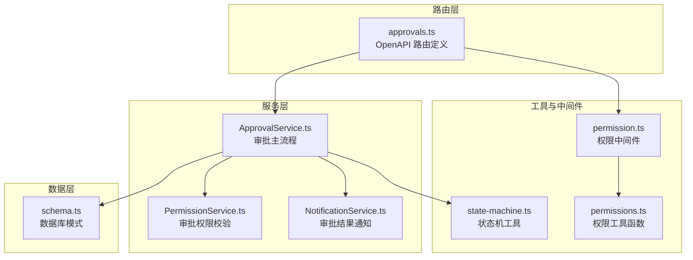
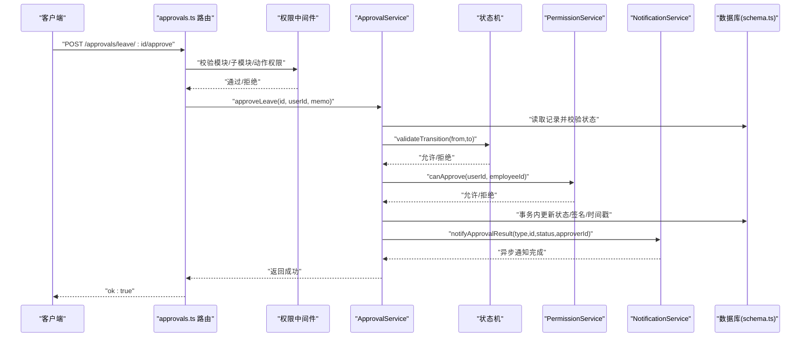
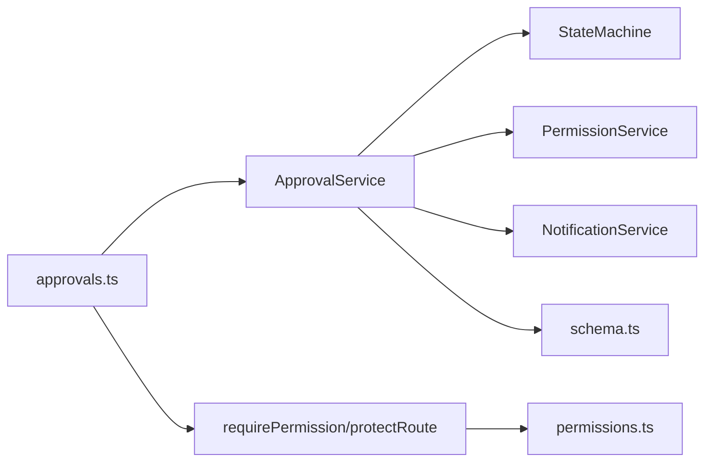
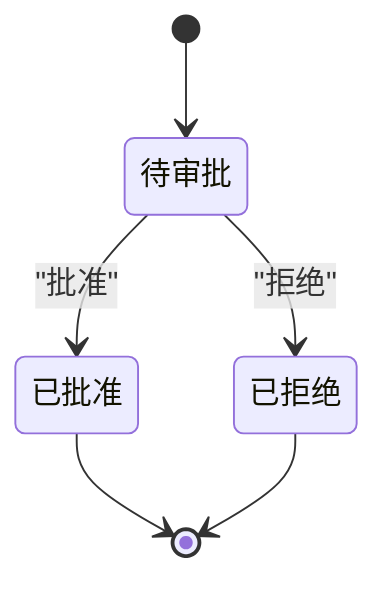
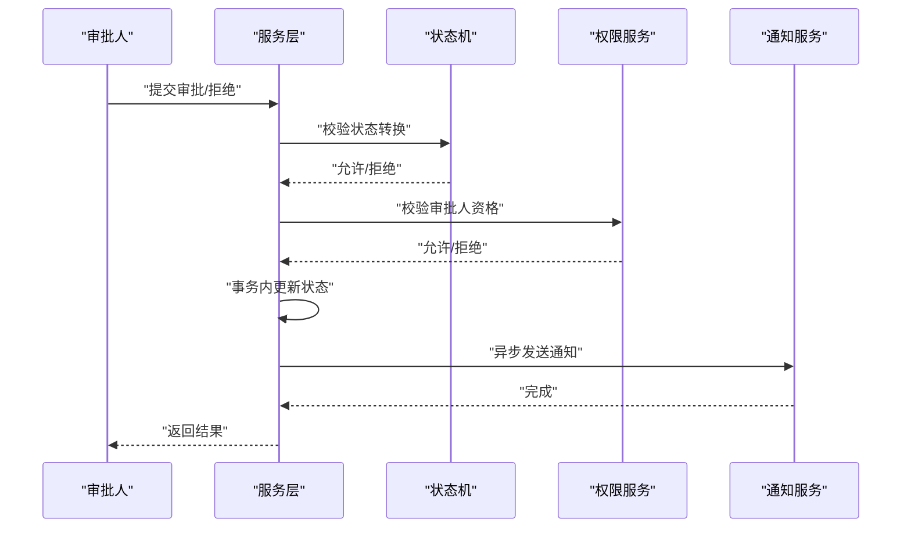

# 审批流程路由

<cite>
**本文引用的文件**
- [backend/src/routes/v2/approvals.ts](file://backend/src/routes/v2/approvals.ts)
- [backend/src/services/ApprovalService.ts](file://backend/src/services/ApprovalService.ts)
- [backend/src/utils/state-machine.ts](file://backend/src/utils/state-machine.ts)
- [backend/src/services/NotificationService.ts](file://backend/src/services/NotificationService.ts)
- [backend/src/services/PermissionService.ts](file://backend/src/services/PermissionService.ts)
- [backend/src/middleware/permission.ts](file://backend/src/middleware/permission.ts)
- [backend/src/utils/permissions.ts](file://backend/src/utils/permissions.ts)
- [backend/src/db/schema.ts](file://backend/src/db/schema.ts)
- [backend/test/routes/v2/approvals.test.ts](file://backend/test/routes/v2/approvals.test.ts)
- [backend/test/services/ApprovalService.test.ts](file://backend/test/services/ApprovalService.test.ts)
</cite>

## 目录
1. [简介](#简介)
2. [项目结构](#项目结构)
3. [核心组件](#核心组件)
4. [架构总览](#架构总览)
5. [详细组件分析](#详细组件分析)
6. [依赖关系分析](#依赖关系分析)
7. [性能考量](#性能考量)
8. [故障排查指南](#故障排查指南)
9. [结论](#结论)
10. [附录](#附录)

## 简介
本文件深入解析财务系统中的“审批流程（approvals）”API 设计与实现机制，覆盖以下关键点：
- 审批申请提交与审批节点流转
- 审批结果反馈与审计日志
- 审批工作流的状态机模型（待审批、已批准、已拒绝、已撤销等）
- 通过通知服务向相关方发送审批结果
- 与员工请假、报销、借款等业务模块的集成
- 审批链配置的灵活性（单级与多级审批模式）
- 权限中间件与审批人资格校验

## 项目结构
审批流程路由位于后端路由层，服务层负责业务逻辑与状态机校验，通知与权限服务提供跨模块能力，数据库模式定义了请假、报销、借款等实体。

图表来源
- [backend/src/routes/v2/approvals.ts](file://backend/src/routes/v2/approvals.ts#L1-L486)
- [backend/src/services/ApprovalService.ts](file://backend/src/services/ApprovalService.ts#L1-L645)
- [backend/src/utils/state-machine.ts](file://backend/src/utils/state-machine.ts#L1-L89)
- [backend/src/services/NotificationService.ts](file://backend/src/services/NotificationService.ts#L1-L130)
- [backend/src/services/PermissionService.ts](file://backend/src/services/PermissionService.ts#L1-L147)
- [backend/src/middleware/permission.ts](file://backend/src/middleware/permission.ts#L1-L43)
- [backend/src/utils/permissions.ts](file://backend/src/utils/permissions.ts#L1-L273)
- [backend/src/db/schema.ts](file://backend/src/db/schema.ts#L1-L200)

章节来源
- [backend/src/routes/v2/approvals.ts](file://backend/src/routes/v2/approvals.ts#L1-L486)
- [backend/src/services/ApprovalService.ts](file://backend/src/services/ApprovalService.ts#L1-L645)
- [backend/src/utils/state-machine.ts](file://backend/src/utils/state-machine.ts#L1-L89)
- [backend/src/services/NotificationService.ts](file://backend/src/services/NotificationService.ts#L1-L130)
- [backend/src/services/PermissionService.ts](file://backend/src/services/PermissionService.ts#L1-L147)
- [backend/src/middleware/permission.ts](file://backend/src/middleware/permission.ts#L1-L43)
- [backend/src/utils/permissions.ts](file://backend/src/utils/permissions.ts#L1-L273)
- [backend/src/db/schema.ts](file://backend/src/db/schema.ts#L1-L200)

## 核心组件
- 路由层（approvals.ts）：定义 OpenAPI 接口，封装请求参数与响应结构；调用服务层执行审批动作；记录审计日志；对特定业务（如报销、借款）进行权限校验。
- 服务层（ApprovalService.ts）：统一处理审批与拒绝流程；基于状态机校验状态转换；执行事务性更新；记录操作历史；触发通知；对借款审批后联动财务生成现金流。
- 状态机（state-machine.ts）：定义请假、报销、借款等实体的状态转换规则，保证业务状态合法。
- 权限服务（PermissionService.ts）：根据职位层级与组织关系判断审批人是否具备审批某员工申请的资格。
- 通知服务（NotificationService.ts）：在审批完成后异步发送邮件通知给申请人。
- 中间件与权限工具（permission.ts、permissions.ts）：提供统一的权限检查与保护路由的能力。

章节来源
- [backend/src/routes/v2/approvals.ts](file://backend/src/routes/v2/approvals.ts#L1-L486)
- [backend/src/services/ApprovalService.ts](file://backend/src/services/ApprovalService.ts#L1-L645)
- [backend/src/utils/state-machine.ts](file://backend/src/utils/state-machine.ts#L1-L89)
- [backend/src/services/PermissionService.ts](file://backend/src/services/PermissionService.ts#L1-L147)
- [backend/src/services/NotificationService.ts](file://backend/src/services/NotificationService.ts#L1-L130)
- [backend/src/middleware/permission.ts](file://backend/src/middleware/permission.ts#L1-L43)
- [backend/src/utils/permissions.ts](file://backend/src/utils/permissions.ts#L1-L273)

## 架构总览
审批流程的端到端调用序列如下：

图表来源
- [backend/src/routes/v2/approvals.ts](file://backend/src/routes/v2/approvals.ts#L165-L211)
- [backend/src/services/ApprovalService.ts](file://backend/src/services/ApprovalService.ts#L148-L229)
- [backend/src/utils/state-machine.ts](file://backend/src/utils/state-machine.ts#L16-L42)
- [backend/src/services/PermissionService.ts](file://backend/src/services/PermissionService.ts#L110-L146)
- [backend/src/services/NotificationService.ts](file://backend/src/services/NotificationService.ts#L18-L75)
- [backend/src/db/schema.ts](file://backend/src/db/schema.ts#L1-L200)

## 详细组件分析

### 路由层：审批 API 定义与权限控制
- 待审批列表与历史接口：分别返回当前审批人可处理的待审批项以及其审批历史。
- 单个审批动作接口：支持请假、报销、借款的批准与拒绝，均携带可选备注。
- 权限控制：
  - 路由层对“报销”和“借款”的审批接口进行模块级权限校验（例如 hr.reimbursement.approve、finance.borrowing.approve），确保只有具备相应权限的角色才能执行审批。
  - 对“请假”审批，权限校验在服务层通过 PermissionService 进行，路由层不重复校验，避免重复逻辑。
- 审计日志：每次审批动作都会记录审计日志，便于追踪。

章节来源
- [backend/src/routes/v2/approvals.ts](file://backend/src/routes/v2/approvals.ts#L75-L116)
- [backend/src/routes/v2/approvals.ts](file://backend/src/routes/v2/approvals.ts#L118-L163)
- [backend/src/routes/v2/approvals.ts](file://backend/src/routes/v2/approvals.ts#L165-L211)
- [backend/src/routes/v2/approvals.ts](file://backend/src/routes/v2/approvals.ts#L213-L265)
- [backend/src/routes/v2/approvals.ts](file://backend/src/routes/v2/approvals.ts#L267-L317)
- [backend/src/routes/v2/approvals.ts](file://backend/src/routes/v2/approvals.ts#L319-L375)
- [backend/src/routes/v2/approvals.ts](file://backend/src/routes/v2/approvals.ts#L377-L427)
- [backend/src/routes/v2/approvals.ts](file://backend/src/routes/v2/approvals.ts#L429-L486)

### 服务层：审批主流程与状态机
- 统一审批处理：
  - processApproval 方法封装了审批与拒绝的通用逻辑：读取记录、状态机校验、权限校验、事务内更新、记录操作历史、异步通知。
  - 支持自定义 getEmployeeId 与 afterUpdate 回调，以适配不同业务实体（如借款需要从用户映射到员工ID，并在批准后生成现金流）。
- 业务方法：
  - approveLeave/rejectLeave：请假审批。
  - approveReimbursement/rejectReimbursement：报销审批。
  - approveBorrowing/rejectBorrowing：借款审批（批准后联动财务生成现金流）。
- 批量操作：
  - 提供批量批准/拒绝请假、报销、借款的方法，内部逐条执行并汇总结果。
- 操作历史：
  - 在审批完成后记录操作历史，便于审计与追溯。

章节来源
- [backend/src/services/ApprovalService.ts](file://backend/src/services/ApprovalService.ts#L148-L229)
- [backend/src/services/ApprovalService.ts](file://backend/src/services/ApprovalService.ts#L326-L376)
- [backend/src/services/ApprovalService.ts](file://backend/src/services/ApprovalService.ts#L378-L431)
- [backend/src/services/ApprovalService.ts](file://backend/src/services/ApprovalService.ts#L433-L581)

### 状态机模型：审批工作流状态转换
- 状态机工具：
  - StateMachine.validateTransition(from,to)：严格校验状态转换是否被允许，若非法则抛出业务错误。
- 实体状态机：
  - 请假：pending → approved/rejected（终态）
  - 报销：pending → approved/rejected（终态）
  - 借款：pending → approved → outstanding → partial → repaid（终态）；rejected 也为终态。
- 作用：
  - 防止非法状态推进，保障审批流程的合规性与一致性。

章节来源
- [backend/src/utils/state-machine.ts](file://backend/src/utils/state-machine.ts#L1-L42)
- [backend/src/utils/state-machine.ts](file://backend/src/utils/state-machine.ts#L44-L89)

### 权限中间件与审批人资格验证
- 路由级权限：
  - 对“报销”和“借款”的审批接口使用 requirePermission/protectRoute 进行模块级权限校验。
- 服务级权限：
  - PermissionService.canApprove(userId, employeeId)：根据职位层级与组织关系判断审批人是否具备审批资格。
  - 可审批范围：
    - 总部主管：可审批所有人。
    - 项目主管：可审批本项目所有人。
    - 组长：仅能审批本组工程师。
    - 工程师：仅能审批自己。
- 权限工具：
  - hasPermission、getDataAccessFilter 等工具函数提供统一的权限与数据访问控制能力。

章节来源
- [backend/src/middleware/permission.ts](file://backend/src/middleware/permission.ts#L1-L43)
- [backend/src/utils/permissions.ts](file://backend/src/utils/permissions.ts#L99-L125)
- [backend/src/utils/permissions.ts](file://backend/src/utils/permissions.ts#L196-L263)
- [backend/src/services/PermissionService.ts](file://backend/src/services/PermissionService.ts#L55-L146)

### 通知与审计：审批结果反馈
- 通知服务：
  - 在审批完成后异步发送邮件通知给申请人，通知开关由系统配置控制。
- 审计日志：
  - 路由层在审批后记录审计动作，便于审计与合规追踪。

章节来源
- [backend/src/services/NotificationService.ts](file://backend/src/services/NotificationService.ts#L18-L75)
- [backend/src/routes/v2/approvals.ts](file://backend/src/routes/v2/approvals.ts#L200-L211)
- [backend/src/routes/v2/approvals.ts](file://backend/src/routes/v2/approvals.ts#L255-L263)
- [backend/src/routes/v2/approvals.ts](file://backend/src/routes/v2/approvals.ts#L313-L316)
- [backend/src/routes/v2/approvals.ts](file://backend/src/routes/v2/approvals.ts#L365-L373)

### 与业务模块的集成
- 请假（employeeLeaves）：路由层与服务层分别处理“请假”审批，权限校验在服务层执行。
- 报销（expenseReimbursements）：路由层进行模块级权限校验，服务层执行审批与状态机校验。
- 借款（borrowings）：路由层进行模块级权限校验，服务层在批准后联动财务生成现金流，并通过状态机推进到 outstanding 状态。
- 数据库模式：employees、positions、departments、orgDepartments 等表支撑审批流程中的组织与权限判定。

章节来源
- [backend/src/db/schema.ts](file://backend/src/db/schema.ts#L1-L200)
- [backend/src/services/ApprovalService.ts](file://backend/src/services/ApprovalService.ts#L378-L431)

### 审批链配置的灵活性与单/多级审批
- 当前实现：
  - 服务层通过 PermissionService 的 canApprove 判断审批人资格，结合职位层级与组织关系，天然支持单级审批（直接上级）。
  - 对于多级审批，可在业务上扩展审批链配置（例如在系统配置中维护审批顺序），并在服务层按顺序推进审批，每级审批后触发下一级审批人通知。
- 状态机与事务：
  - 状态机保证状态转换合法；事务确保审批过程原子性，失败回滚。
- 批量操作：
  - 提供批量审批/拒绝接口，便于快速处理大量待审批事项。

章节来源
- [backend/src/services/PermissionService.ts](file://backend/src/services/PermissionService.ts#L55-L146)
- [backend/src/services/ApprovalService.ts](file://backend/src/services/ApprovalService.ts#L433-L581)

## 依赖关系分析
- 路由层依赖：
  - 服务层（ApprovalService）、权限工具（permissions.ts）、审计工具（audit）、响应工具（response）。
- 服务层依赖：
  - 状态机（state-machine.ts）、权限服务（PermissionService）、通知服务（NotificationService）、财务服务（FinanceService）、操作历史服务（OperationHistoryService）、数据库模式（schema.ts）。
- 通知与权限：
  - NotificationService 依赖 EmailService 与 SystemConfigService 控制通知开关。
  - PermissionService 依赖 employees/positions 表进行审批资格判定。

图表来源
- [backend/src/routes/v2/approvals.ts](file://backend/src/routes/v2/approvals.ts#L1-L486)
- [backend/src/services/ApprovalService.ts](file://backend/src/services/ApprovalService.ts#L1-L645)
- [backend/src/utils/state-machine.ts](file://backend/src/utils/state-machine.ts#L1-L89)
- [backend/src/services/PermissionService.ts](file://backend/src/services/PermissionService.ts#L1-L147)
- [backend/src/services/NotificationService.ts](file://backend/src/services/NotificationService.ts#L1-L130)
- [backend/src/middleware/permission.ts](file://backend/src/middleware/permission.ts#L1-L43)
- [backend/src/utils/permissions.ts](file://backend/src/utils/permissions.ts#L1-L273)
- [backend/src/db/schema.ts](file://backend/src/db/schema.ts#L1-L200)

## 性能考量
- 查询优化：
  - 服务层对“待审批列表”使用 QueryBuilder 与左连接，减少 N+1 查询风险。
- 事务与并发：
  - 审批更新在事务内执行，保证一致性；乐观锁版本号存在于账户流水表，建议在相关实体中复用以降低并发冲突。
- 异步通知：
  - 通知服务异步发送，避免阻塞审批主流程。
- 批量操作：
  - 批量审批/拒绝逐条执行，建议在前端或调用侧控制批次大小，避免单次请求过大导致超时。

章节来源
- [backend/src/services/ApprovalService.ts](file://backend/src/services/ApprovalService.ts#L41-L146)
- [backend/src/services/ApprovalService.ts](file://backend/src/services/ApprovalService.ts#L433-L581)
- [backend/src/services/NotificationService.ts](file://backend/src/services/NotificationService.ts#L18-L75)

## 故障排查指南
- 常见错误与定位：
  - 无权限：路由层对报销/借款审批进行模块级权限校验；服务层对请假审批进行审批人资格校验。若报错“无权审批”，检查审批人职位与组织关系。
  - 状态非法：状态机校验失败会抛出业务错误，检查实体当前状态与允许的下一步状态。
  - 记录不存在：服务层在事务内读取记录，若不存在会抛出“未找到”错误。
- 日志与审计：
  - 路由层记录审计日志；服务层记录操作历史；通知失败会被记录但不影响审批流程。
- 测试参考：
  - 单元测试覆盖了待审批列表、审批/拒绝、状态机验证、批量操作、操作历史记录等场景，可作为问题定位的参考。

章节来源
- [backend/src/routes/v2/approvals.ts](file://backend/src/routes/v2/approvals.ts#L165-L211)
- [backend/src/services/ApprovalService.ts](file://backend/src/services/ApprovalService.ts#L148-L229)
- [backend/test/services/ApprovalService.test.ts](file://backend/test/services/ApprovalService.test.ts#L259-L307)
- [backend/test/services/ApprovalService.test.ts](file://backend/test/services/ApprovalService.test.ts#L337-L394)
- [backend/test/services/ApprovalService.test.ts](file://backend/test/services/ApprovalService.test.ts#L396-L436)
- [backend/test/services/ApprovalService.test.ts](file://backend/test/services/ApprovalService.test.ts#L438-L487)
- [backend/test/services/ApprovalService.test.ts](file://backend/test/services/ApprovalService.test.ts#L489-L510)
- [backend/test/services/ApprovalService.test.ts](file://backend/test/services/ApprovalService.test.ts#L511-L598)

## 结论
审批流程（approvals）API 通过清晰的路由层、严谨的服务层与状态机、完善的权限与通知机制，实现了对请假、报销、借款等业务的标准化审批管理。系统具备良好的扩展性：可通过配置化审批链支持多级审批，通过状态机保障状态转换的合法性，通过权限中间件与服务层校验确保审批人资格，通过异步通知与审计日志提升可观测性与合规性。

## 附录
- 审批状态机图示（概念示意）

- 审批流程时序图（概念示意）

