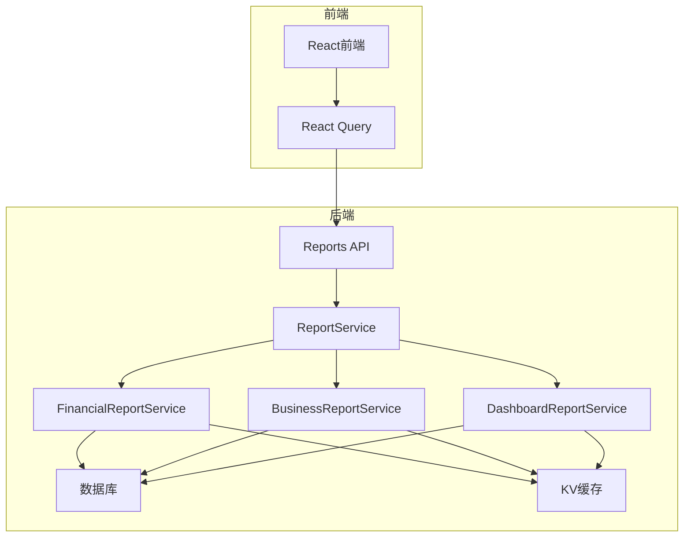
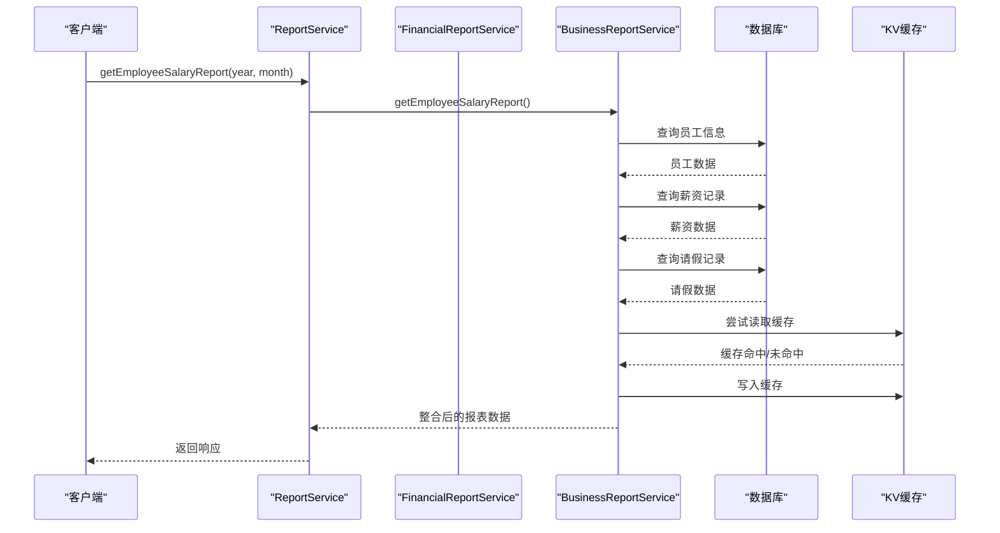
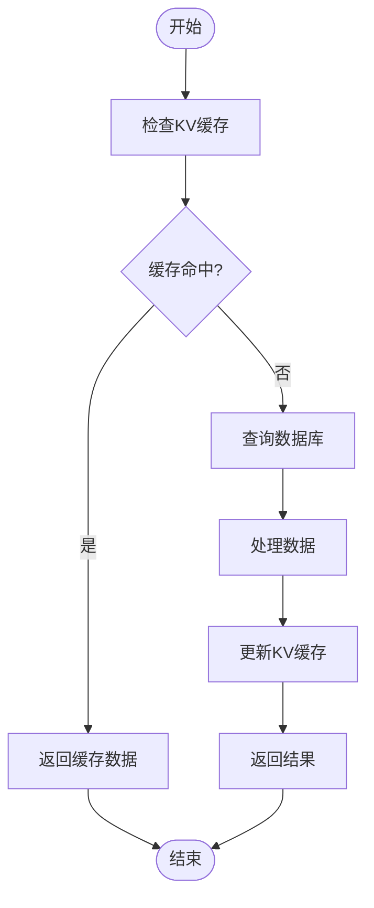
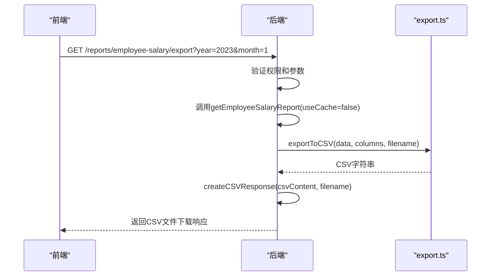
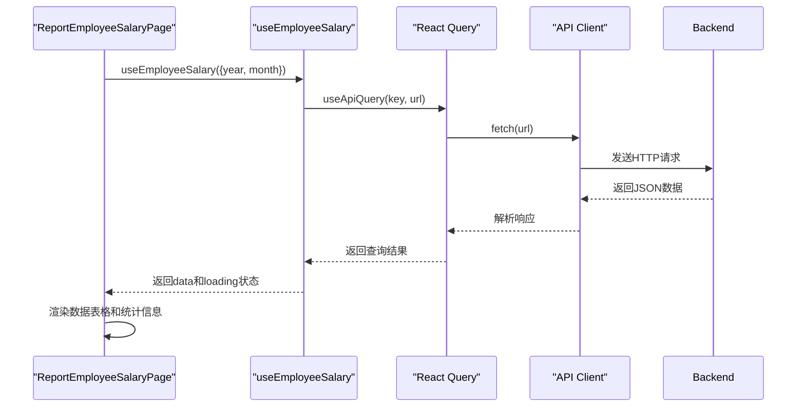
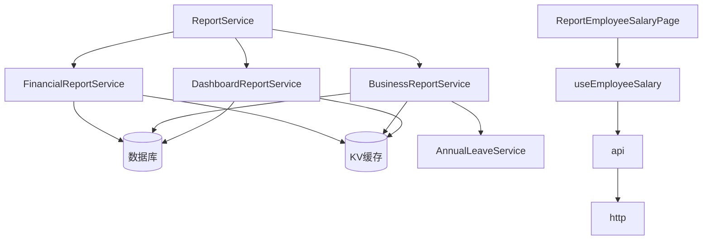

# 报表系统路由

<cite>
**本文档引用的文件**   
- [reports.ts](file://backend/src/routes/v2/reports.ts)
- [ReportService.ts](file://backend/src/services/ReportService.ts)
- [FinancialReportService.ts](file://backend/src/services/FinancialReportService.ts)
- [BusinessReportService.ts](file://backend/src/services/BusinessReportService.ts)
- [DashboardReportService.ts](file://backend/src/services/DashboardReportService.ts)
- [common.schema.ts](file://backend/src/schemas/common.schema.ts)
- [export.ts](file://backend/src/utils/export.ts)
- [useReports.ts](file://frontend/src/hooks/business/useReports.ts)
- [ReportEmployeeSalaryPage.tsx](file://frontend/src/features/reports/pages/ReportEmployeeSalaryPage.tsx)
</cite>

## 目录
1. [简介](#简介)
2. [项目结构](#项目结构)
3. [核心组件](#核心组件)
4. [架构概述](#架构概述)
5. [详细组件分析](#详细组件分析)
6. [依赖分析](#依赖分析)
7. [性能考虑](#性能考虑)
8. [故障排除指南](#故障排除指南)
9. [结论](#结论)
10. [附录](#附录)（如有必要）

## 简介
本文档详细说明了财务系统中报表API的设计与实现，重点分析了/reports端点的功能。文档涵盖了支持的报表类型（包括财务、人事、业务统计等）、查询参数设计、数据源整合机制、性能优化策略、分页与大数据导出实现，以及前端集成示例。

## 项目结构
后端报表系统位于`backend/src/routes/v2/reports.ts`，通过Hono框架定义了多个报表端点。报表服务采用门面模式，由`ReportService`统一调度`FinancialReportService`、`BusinessReportService`和`DashboardReportService`等具体服务类。前端通过React Query Hook与这些API进行交互。

**Section sources**
- [reports.ts](file://backend/src/routes/v2/reports.ts)
- [ReportService.ts](file://backend/src/services/ReportService.ts)

## 核心组件

**Section sources**
- [reports.ts](file://backend/src/routes/v2/reports.ts)
- [ReportService.ts](file://backend/src/services/ReportService.ts)

## 架构概述



**Diagram sources**
- [reports.ts](file://backend/src/routes/v2/reports.ts)
- [ReportService.ts](file://backend/src/services/ReportService.ts)
- [FinancialReportService.ts](file://backend/src/services/FinancialReportService.ts)
- [BusinessReportService.ts](file://backend/src/services/BusinessReportService.ts)
- [DashboardReportService.ts](file://backend/src/services/DashboardReportService.ts)

## 详细组件分析

### 报表类型与查询参数

系统支持多种报表类型，每种报表都有特定的查询参数设计：

- **财务报表**：包括AR/AP汇总/明细、费用汇总/明细、账户余额、借款汇总/明细等，主要使用时间范围（start/end）和部门ID（departmentId）作为筛选条件。
- **人事报表**：包括员工薪资报表和年假报表，支持按年份、月份和部门进行筛选。
- **业务统计报表**：包括项目现金流、站点增长、新站点收入等，同样基于时间范围和部门维度进行分析。

查询参数通过Zod Schema进行验证，确保输入的合法性。例如，`dateRangeQuerySchema`确保开始日期不晚于结束日期，`salaryReportQuerySchema`限制年份和月份的有效范围。

```mermaid
classDiagram
class dateRangeQuerySchema {
+start : string (YYYY-MM-DD)
+end : string (YYYY-MM-DD)
}
class salaryReportQuerySchema {
+year : number (2000-2100)
+month : number (1-12)
}
class idParamSchema {
+id : UUID
}
class singleDateQuerySchema {
+asOf : string (YYYY-MM-DD)
}
note right of dateRangeQuerySchema
用于时间范围查询的参数验证
end note
note right of salaryReportQuerySchema
用于薪资报表的年月参数验证
end note
```

**Diagram sources**
- [common.schema.ts](file://backend/src/schemas/common.schema.ts)

**Section sources**
- [reports.ts](file://backend/src/routes/v2/reports.ts)
- [common.schema.ts](file://backend/src/schemas/common.schema.ts)

### ReportService数据源整合

`ReportService`作为门面服务，负责整合多个数据源生成复合报表。它通过依赖注入获取数据库连接和KV命名空间，并创建具体的报表服务实例。



**Diagram sources**
- [ReportService.ts](file://backend/src/services/ReportService.ts)
- [BusinessReportService.ts](file://backend/src/services/BusinessReportService.ts)

**Section sources**
- [ReportService.ts](file://backend/src/services/ReportService.ts)
- [BusinessReportService.ts](file://backend/src/services/BusinessReportService.ts)

### 性能优化策略

系统通过缓存机制显著优化了查询性能。多个报表服务在查询前会先检查KV缓存，如果缓存命中则直接返回缓存数据，避免了重复的数据库查询。



例如，`getAccountBalance`方法在查询账户余额时，会先尝试从KV缓存中获取数据，如果未命中则执行复杂的SQL查询并计算余额，最后将结果写入缓存。`getDashboardStats`和`getDepartmentCashFlow`等方法也采用了类似的缓存策略。

**Diagram sources**
- [FinancialReportService.ts](file://backend/src/services/FinancialReportService.ts)
- [BusinessReportService.ts](file://backend/src/services/BusinessReportService.ts)
- [DashboardReportService.ts](file://backend/src/services/DashboardReportService.ts)

**Section sources**
- [FinancialReportService.ts](file://backend/src/services/FinancialReportService.ts)
- [BusinessReportService.ts](file://backend/src/services/BusinessReportService.ts)
- [DashboardReportService.ts](file://backend/src/services/DashboardReportService.ts)

### 分页与大数据导出

系统实现了分页策略和大数据量导出机制。对于大数据量的导出需求，系统提供了专门的导出端点，如`/employee-salary/export`，该端点返回CSV格式的文件。



`exportToCSV`工具函数负责将数据数组转换为CSV格式的字符串，并添加BOM以支持中文Excel正确显示。`createCSVResponse`函数则创建带有正确Content-Type和Content-Disposition头的响应，触发浏览器的文件下载。

**Diagram sources**
- [reports.ts](file://backend/src/routes/v2/reports.ts)
- [export.ts](file://backend/src/utils/export.ts)

**Section sources**
- [reports.ts](file://backend/src/routes/v2/reports.ts)
- [export.ts](file://backend/src/utils/export.ts)

### 前端集成示例

前端使用React Query高效地获取和展示报表数据。通过自定义Hook如`useEmployeeSalary`，实现了数据获取、缓存和状态管理的封装。



`useApiQuery`封装了API调用的通用逻辑，包括错误处理、响应解包和缓存策略。`ReportEmployeeSalaryPage`组件使用这个Hook获取数据，并在UI中展示结果，同时提供了年份和月份的筛选功能。

**Diagram sources**
- [useReports.ts](file://frontend/src/hooks/business/useReports.ts)
- [ReportEmployeeSalaryPage.tsx](file://frontend/src/features/reports/pages/ReportEmployeeSalaryPage.tsx)

**Section sources**
- [useReports.ts](file://frontend/src/hooks/business/useReports.ts)
- [ReportEmployeeSalaryPage.tsx](file://frontend/src/features/reports/pages/ReportEmployeeSalaryPage.tsx)

## 依赖分析



**Diagram sources**
- [ReportService.ts](file://backend/src/services/ReportService.ts)
- [FinancialReportService.ts](file://backend/src/services/FinancialReportService.ts)
- [BusinessReportService.ts](file://backend/src/services/BusinessReportService.ts)
- [DashboardReportService.ts](file://backend/src/services/DashboardReportService.ts)
- [useReports.ts](file://frontend/src/hooks/business/useReports.ts)
- [ReportEmployeeSalaryPage.tsx](file://frontend/src/features/reports/pages/ReportEmployeeSalaryPage.tsx)

**Section sources**
- [ReportService.ts](file://backend/src/services/ReportService.ts)
- [FinancialReportService.ts](file://backend/src/services/FinancialReportService.ts)
- [BusinessReportService.ts](file://backend/src/services/BusinessReportService.ts)
- [DashboardReportService.ts](file://backend/src/services/DashboardReportService.ts)
- [useReports.ts](file://frontend/src/hooks/business/useReports.ts)
- [ReportEmployeeSalaryPage.tsx](file://frontend/src/features/reports/pages/ReportEmployeeSalaryPage.tsx)

## 性能考虑
系统通过KV缓存机制显著提升了报表查询的性能。对于计算密集型的报表如仪表盘统计、部门现金流和账户余额，缓存策略避免了重复的数据库查询和计算。缓存的TTL根据不同报表的更新频率进行设置，如仪表盘统计缓存5分钟，薪资报表缓存1小时。对于大数据量导出，系统提供了专门的端点，避免在常规API中处理大文件生成。

## 故障排除指南
当报表数据不正确时，首先检查查询参数是否符合Schema定义。如果缓存数据过期，可以尝试清除相关缓存键。对于权限问题，确保用户具有相应的`report.*.view`权限。在开发环境中，可以通过禁用缓存来验证数据库查询逻辑是否正确。

**Section sources**
- [reports.ts](file://backend/src/routes/v2/reports.ts)
- [ReportService.ts](file://backend/src/services/ReportService.ts)

## 结论
本报表系统通过清晰的分层架构和模块化设计，实现了多种报表类型的支持。系统通过门面模式整合多个数据源，利用缓存机制优化性能，并提供了完善的前端集成方案。未来可以考虑引入物化视图或更复杂的缓存策略来进一步提升大数据量查询的性能。