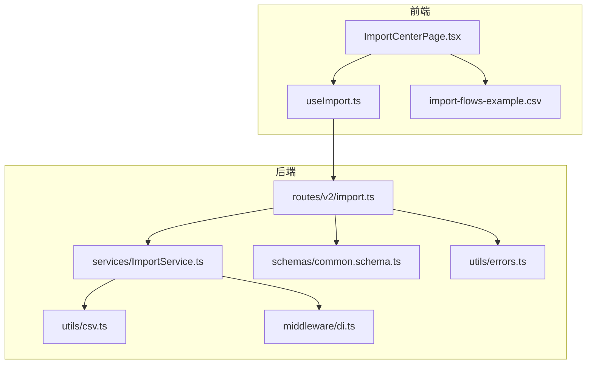
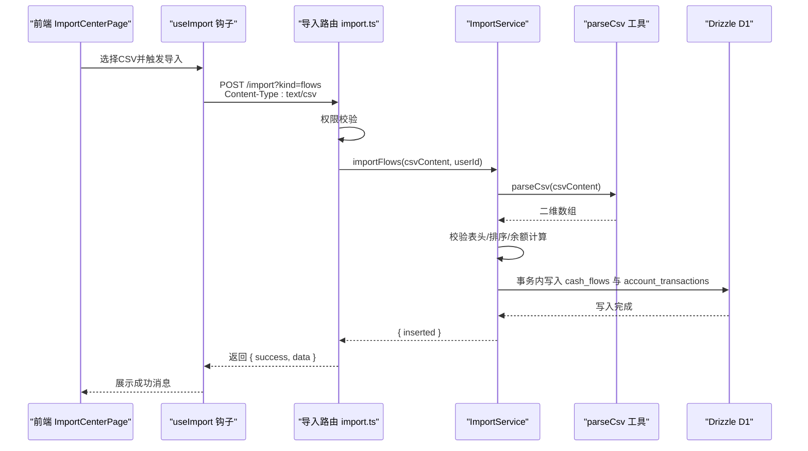
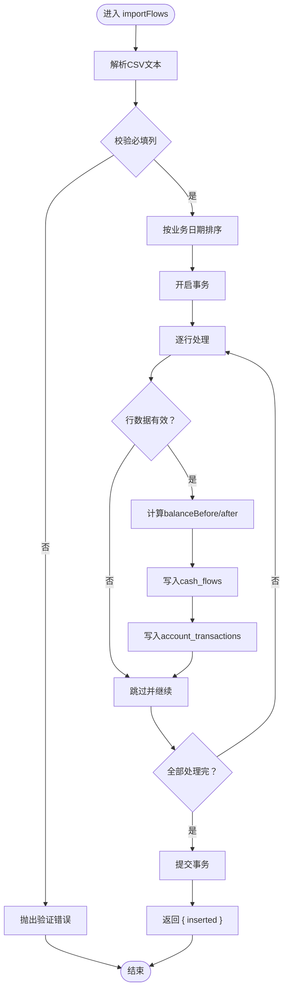
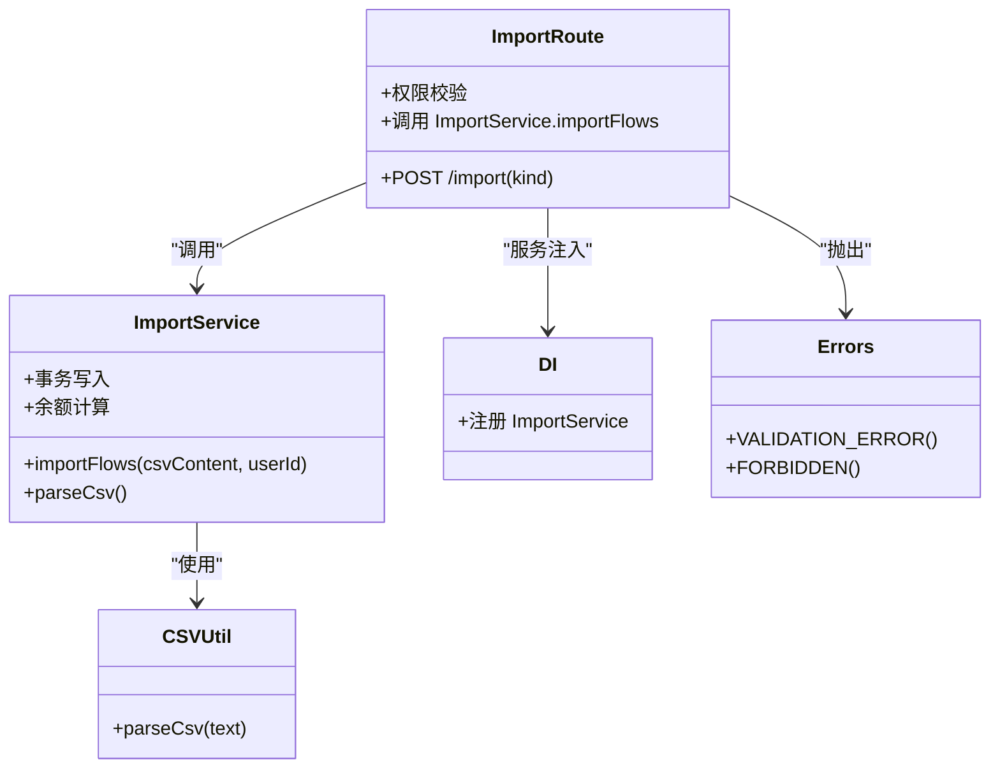

# 数据导入路由

<cite>
**本文引用的文件**
- [backend/src/routes/v2/import.ts](file://backend/src/routes/v2/import.ts)
- [backend/src/services/ImportService.ts](file://backend/src/services/ImportService.ts)
- [backend/src/utils/csv.ts](file://backend/src/utils/csv.ts)
- [backend/src/schemas/common.schema.ts](file://backend/src/schemas/common.schema.ts)
- [backend/src/utils/errors.ts](file://backend/src/utils/errors.ts)
- [backend/src/middleware/di.ts](file://backend/src/middleware/di.ts)
- [frontend/src/features/finance/pages/ImportCenterPage.tsx](file://frontend/src/features/finance/pages/ImportCenterPage.tsx)
- [frontend/src/hooks/business/useImport.ts](file://frontend/src/hooks/business/useImport.ts)
- [frontend/public/examples/import-flows-example.csv](file://frontend/public/examples/import-flows-example.csv)
</cite>

## 目录
1. [简介](#简介)
2. [项目结构](#项目结构)
3. [核心组件](#核心组件)
4. [架构总览](#架构总览)
5. [详细组件分析](#详细组件分析)
6. [依赖关系分析](#依赖关系分析)
7. [性能考量](#性能考量)
8. [故障排查指南](#故障排查指南)
9. [结论](#结论)
10. [附录](#附录)

## 简介
本文件系统性文档化“数据导入”功能的API设计与实现，覆盖以下要点：
- 支持批量导入的业务类型：财务流水（flows）、应收（AR）、应付（AP）、期初（opening）。当前代码实现仅支持 flows 类型的导入。
- CSV 文件上传接口的实现方式：请求体为纯文本（text/plain），通过查询参数 kind 指定导入类型；后端解析 CSV 并执行业务校验与入库。
- 文件大小限制、MIME 类型校验与病毒扫描集成：当前仓库未见针对 CSV 的文件大小/MIME 校验与病毒扫描集成逻辑；建议在网关或边缘层补充。
- 后台异步处理机制：当前实现为同步处理，未见队列系统；建议引入队列以支持大文件导入而不阻塞主线程。
- 导入结果反馈机制与错误恢复策略：后端返回成功插入数量；前端展示成功消息；错误通过统一错误处理器返回。
- 用户体验设计：前端 ImportCenterPage 提供示例下载、字段说明、上传按钮与加载状态。

## 项目结构
围绕导入功能的关键文件分布如下：
- 后端路由与服务
  - 路由：backend/src/routes/v2/import.ts
  - 服务：backend/src/services/ImportService.ts
  - 工具：backend/src/utils/csv.ts
  - 校验：backend/src/schemas/common.schema.ts
  - 错误：backend/src/utils/errors.ts
  - 依赖注入：backend/src/middleware/di.ts
- 前端页面与钩子
  - 页面：frontend/src/features/finance/pages/ImportCenterPage.tsx
  - 钩子：frontend/src/hooks/business/useImport.ts
  - 示例CSV：frontend/public/examples/import-flows-example.csv

图表来源
- [backend/src/routes/v2/import.ts](file://backend/src/routes/v2/import.ts#L1-L84)
- [backend/src/services/ImportService.ts](file://backend/src/services/ImportService.ts#L1-L126)
- [backend/src/utils/csv.ts](file://backend/src/utils/csv.ts#L1-L15)
- [backend/src/schemas/common.schema.ts](file://backend/src/schemas/common.schema.ts#L93-L100)
- [backend/src/middleware/di.ts](file://backend/src/middleware/di.ts#L51-L76)
- [backend/src/utils/errors.ts](file://backend/src/utils/errors.ts#L1-L228)
- [frontend/src/features/finance/pages/ImportCenterPage.tsx](file://frontend/src/features/finance/pages/ImportCenterPage.tsx#L1-L87)
- [frontend/src/hooks/business/useImport.ts](file://frontend/src/hooks/business/useImport.ts#L1-L15)
- [frontend/public/examples/import-flows-example.csv](file://frontend/public/examples/import-flows-example.csv#L1-L5)

章节来源
- [backend/src/routes/v2/import.ts](file://backend/src/routes/v2/import.ts#L1-L84)
- [backend/src/services/ImportService.ts](file://backend/src/services/ImportService.ts#L1-L126)
- [frontend/src/features/finance/pages/ImportCenterPage.tsx](file://frontend/src/features/finance/pages/ImportCenterPage.tsx#L1-L87)

## 核心组件
- 导入路由（import.ts）
  - 定义导入接口，请求体为 text/plain，查询参数包含 kind（flows/AR/AP/opening）。
  - 权限校验：要求具备 finance.flow.create 权限。
  - 当 kind 为 flows 时，调用 ImportService.importFlows 处理。
  - 返回结构：success 字段与 data（如 inserted）。
- 导入服务（ImportService.ts）
  - 解析 CSV：使用 parseCsv 将文本拆分为二维数组。
  - 表头校验：必需列 biz_date、type、account_id、amount。
  - 数据排序：按业务日期升序，保证余额计算正确。
  - 事务处理：整批数据在一个事务内写入 cash_flows 与 account_transactions。
  - 余额计算：基于插入前余额计算 balanceBefore/balanceAfter。
  - 返回 inserted 数量。
- CSV 工具（csv.ts）
  - 简易 CSV 解析器，按逗号分割并去除回车，不支持复杂引号处理。
- 校验模式（common.schema.ts）
  - csvImportQuerySchema 定义了 kind 的枚举值。
- 错误处理（errors.ts）
  - 统一错误类与错误响应结构，便于前后端一致处理。
- 依赖注入（di.ts）
  - 在 DI 中注册 ImportService，供路由通过 c.var.services.import 使用。

章节来源
- [backend/src/routes/v2/import.ts](file://backend/src/routes/v2/import.ts#L1-L84)
- [backend/src/services/ImportService.ts](file://backend/src/services/ImportService.ts#L1-L126)
- [backend/src/utils/csv.ts](file://backend/src/utils/csv.ts#L1-L15)
- [backend/src/schemas/common.schema.ts](file://backend/src/schemas/common.schema.ts#L93-L100)
- [backend/src/utils/errors.ts](file://backend/src/utils/errors.ts#L1-L228)
- [backend/src/middleware/di.ts](file://backend/src/middleware/di.ts#L51-L76)

## 架构总览
导入流程从浏览器发起，经由前端 Hook 与路由，最终落到 ImportService 的业务处理与数据库写入。

图表来源
- [frontend/src/features/finance/pages/ImportCenterPage.tsx](file://frontend/src/features/finance/pages/ImportCenterPage.tsx#L1-L87)
- [frontend/src/hooks/business/useImport.ts](file://frontend/src/hooks/business/useImport.ts#L1-L15)
- [backend/src/routes/v2/import.ts](file://backend/src/routes/v2/import.ts#L1-L84)
- [backend/src/services/ImportService.ts](file://backend/src/services/ImportService.ts#L1-L126)
- [backend/src/utils/csv.ts](file://backend/src/utils/csv.ts#L1-L15)

## 详细组件分析

### 后端路由：导入接口
- 请求方法与路径：POST /import
- 查询参数：kind（flows/AR/AP/opening）
- 请求体：text/plain（CSV 文本）
- 权限：finance.flow.create
- 响应：
  - 成功：{ success: true, data: { inserted } }
  - 失败：{ success: false, error: { code, message, details } }

章节来源
- [backend/src/routes/v2/import.ts](file://backend/src/routes/v2/import.ts#L1-L84)
- [backend/src/schemas/common.schema.ts](file://backend/src/schemas/common.schema.ts#L93-L100)
- [backend/src/utils/errors.ts](file://backend/src/utils/errors.ts#L1-L228)

### 导入服务：flows 类型
- CSV 解析：parseCsv
- 表头索引：biz_date、type、account_id、amount 为必填；其他字段为可选
- 数据排序：按业务日期升序，保证余额连续性
- 事务处理：整批数据在一个事务中写入两条表
  - cash_flows：流水主表
  - account_transactions：交易明细与余额快照
- 余额计算：基于插入前余额计算 balanceBefore 与 balanceAfter
- 返回：inserted（成功插入条数）

图表来源
- [backend/src/services/ImportService.ts](file://backend/src/services/ImportService.ts#L1-L126)
- [backend/src/utils/csv.ts](file://backend/src/utils/csv.ts#L1-L15)

章节来源
- [backend/src/services/ImportService.ts](file://backend/src/services/ImportService.ts#L1-L126)

### 前端页面：ImportCenterPage
- 功能概览
  - 下拉选择导入类型（flows/AR/AP/opening），当前仅 flows 可用
  - 下载示例 CSV
  - 选择 CSV 文件并读取为文本
  - 调用 useImportData 发起导入，成功后提示 inserted 数量
- 字段说明
  - flows：必填 bizDate、type、accountId、amount；可选 siteId、departmentId、counterparty、memo、categoryId、voucher_no、method
  - AR/AP/opening：字段说明见页面文案
- 交互细节
  - loading 状态：按钮 loading 显示导入中
  - 错误提示：withErrorHandler 包裹上传逻辑，失败时弹出错误消息

章节来源
- [frontend/src/features/finance/pages/ImportCenterPage.tsx](file://frontend/src/features/finance/pages/ImportCenterPage.tsx#L1-L87)
- [frontend/src/hooks/business/useImport.ts](file://frontend/src/hooks/business/useImport.ts#L1-L15)
- [frontend/public/examples/import-flows-example.csv](file://frontend/public/examples/import-flows-example.csv#L1-L5)

### 错误处理与返回结构
- 后端统一错误处理：Errors 对象提供 VALIDATION_ERROR、FORBIDDEN 等；errorHandlerV2 返回 { success: false, error } 结构
- 导入路由返回：{ success: true/false, data/error }，其中 data 为 { inserted }

章节来源
- [backend/src/utils/errors.ts](file://backend/src/utils/errors.ts#L1-L228)
- [backend/src/routes/v2/import.ts](file://backend/src/routes/v2/import.ts#L1-L84)

## 依赖关系分析
- 路由依赖
  - 权限校验：hasPermission
  - 错误处理：Errors
  - 请求体解析：c.req.text()
  - 服务注入：c.var.services.import
- 服务依赖
  - CSV 解析：parseCsv
  - 余额计算：FinanceService（通过 txFinanceService 在事务内复用）
  - 数据库：Drizzle D1
- 前端依赖
  - useMutation：@tanstack/react-query
  - API 客户端：apiClient
  - 示例 CSV：/examples/import-*.csv

图表来源
- [backend/src/routes/v2/import.ts](file://backend/src/routes/v2/import.ts#L1-L84)
- [backend/src/services/ImportService.ts](file://backend/src/services/ImportService.ts#L1-L126)
- [backend/src/utils/csv.ts](file://backend/src/utils/csv.ts#L1-L15)
- [backend/src/middleware/di.ts](file://backend/src/middleware/di.ts#L51-L76)
- [backend/src/utils/errors.ts](file://backend/src/utils/errors.ts#L1-L228)

章节来源
- [backend/src/routes/v2/import.ts](file://backend/src/routes/v2/import.ts#L1-L84)
- [backend/src/services/ImportService.ts](file://backend/src/services/ImportService.ts#L1-L126)
- [backend/src/middleware/di.ts](file://backend/src/middleware/di.ts#L51-L76)

## 性能考量
- 当前实现为同步处理，逐行插入并计算余额，适合中小规模 CSV；对于大规模 CSV，建议：
  - 引入队列系统（如 Cloudflare Queue 或外部消息队列），将导入任务异步化
  - 分片/分页批量写入，减少单次事务压力
  - 增加并发控制与重试机制
- CSV 解析器为简易实现，不支持复杂引号场景；若业务 CSV 包含逗号或换行，建议升级为健壮的 CSV 解析库
- 余额计算依赖逐行顺序，排序成本 O(n log n)，可考虑在上游 CSV 生成阶段就保证有序

[本节为通用性能建议，不直接分析具体文件]

## 故障排查指南
- 常见错误与定位
  - 403 权限不足：检查用户是否具备 finance.flow.create 权限
  - 400 验证错误：缺失必填列（biz_date/type/account_id/amount）或 CSV 行数不足
  - 500 服务器错误：数据库异常、事务失败
- 前端提示
  - ImportCenterPage 使用 withErrorHandler 包裹上传逻辑，失败时弹出错误消息
  - 成功时展示 inserted 数量
- 后端日志
  - errorHandlerV2 会记录错误级别与上下文，便于定位问题

章节来源
- [backend/src/utils/errors.ts](file://backend/src/utils/errors.ts#L1-L228)
- [backend/src/routes/v2/import.ts](file://backend/src/routes/v2/import.ts#L1-L84)
- [frontend/src/features/finance/pages/ImportCenterPage.tsx](file://frontend/src/features/finance/pages/ImportCenterPage.tsx#L1-L87)

## 结论
- 当前实现满足基本导入需求，支持 flows 类型的 CSV 批量导入，并提供基础的表头校验与余额计算。
- 未发现针对 CSV 的文件大小限制、MIME 类型校验与病毒扫描集成；建议在网络入口或边缘层补充。
- 未发现队列系统；建议引入队列以支持大文件异步导入，避免阻塞主线程。
- 导入结果反馈清晰，前端展示成功数量，错误通过统一错误处理器返回。

[本节为总结性内容，不直接分析具体文件]

## 附录

### API 定义（导入）
- 方法与路径
  - POST /import
- 查询参数
  - kind: flows | AR | AP | opening
- 请求头
  - Content-Type: text/csv
- 请求体
  - CSV 文本（纯文本）
- 成功响应
  - { success: true, data: { inserted: number } }
- 失败响应
  - { success: false, error: { code, message, details? } }

章节来源
- [backend/src/routes/v2/import.ts](file://backend/src/routes/v2/import.ts#L1-L84)
- [backend/src/schemas/common.schema.ts](file://backend/src/schemas/common.schema.ts#L93-L100)

### 字段说明（flows）
- 必填字段
  - biz_date：业务日期
  - type：income/expense/transfer_out/transfer_in
  - account_id：账户ID
  - amount：金额（元）
- 可选字段
  - site_id、department_id、counterparty、memo、category_id、voucher_no、method

章节来源
- [frontend/src/features/finance/pages/ImportCenterPage.tsx](file://frontend/src/features/finance/pages/ImportCenterPage.tsx#L1-L87)
- [frontend/public/examples/import-flows-example.csv](file://frontend/public/examples/import-flows-example.csv#L1-L5)

### 建议改进清单
- 文件安全与体积
  - 在网关/边缘层增加 CSV 文件大小限制与 MIME 类型校验
  - 集成病毒扫描（如与第三方扫描服务对接）
- 异步处理
  - 引入队列系统，支持大文件异步导入
  - 提供导入任务状态查询与进度反馈
- 错误恢复
  - 失败行记录与重试机制
  - 导入报告（成功/失败明细）
- 用户体验
  - 前端进度条与错误提示增强
  - 支持 AR/AP/opening 的导入类型扩展

[本节为通用改进建议，不直接分析具体文件]