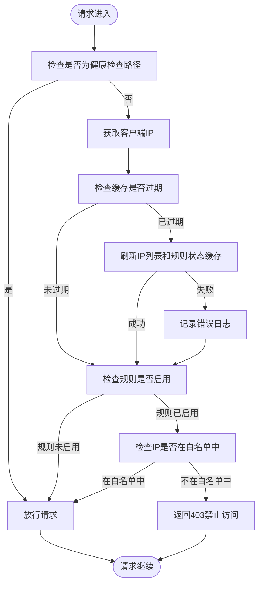

# 安全策略

<cite>
**本文档引用文件**   
- [IPWhitelistService.ts](file://backend/src/services/IPWhitelistService.ts)
- [ipWhitelist.ts](file://backend/src/middleware/ipWhitelist.ts)
- [ip-whitelist.ts](file://backend/src/routes/v2/ip-whitelist.ts)
- [cloudflare.ts](file://backend/src/utils/cloudflare.ts)
- [permissions.ts](file://backend/src/utils/permissions.ts)
- [types.ts](file://backend/src/types.ts)
- [IPWhitelistManagementPage.tsx](file://frontend/src/features/system/pages/IPWhitelistManagementPage.tsx)
- [ipWhitelist.schema.ts](file://frontend/src/validations/ipWhitelist.schema.ts)
</cite>

## 目录
1. [引言](#引言)
2. [IP白名单服务实现](#ip白名单服务实现)
3. [中间件拦截机制](#中间件拦截机制)
4. [存储结构与API安全](#存储结构与api安全)
5. [企业级安全部署建议](#企业级安全部署建议)

## 引言
本文档全面介绍IP白名单安全策略的实现机制，涵盖IPWhitelistService对Cloudflare环境变量的依赖、IP地址的增删查操作、ipWhitelist中间件在请求入口处的拦截逻辑、IP列表的存储结构以及管理API的安全考虑。同时提供企业级安全部署建议，包括结合2FA和IP白名单构建纵深防御体系。

## IP白名单服务实现

IP白名单功能通过`IPWhitelistService`类实现，该服务依赖Cloudflare的API进行IP列表和防火墙规则的管理。服务通过环境变量配置Cloudflare的认证信息和账户ID，确保与Cloudflare服务的安全通信。

### 依赖的Cloudflare环境变量
`IPWhitelistService`依赖以下环境变量与Cloudflare服务进行交互：
- `CF_IP_LISTS_TOKEN`: 用于管理IP列表的API令牌
- `CF_FIREWALL_TOKEN`: 用于管理防火墙规则的API令牌
- `CF_ACCOUNT_ID`: Cloudflare账户ID，用于IP列表操作
- `CF_ZONE_ID`: Cloudflare区域ID，用于创建和管理自定义规则
- `CF_IP_LIST_ID`: 可选，指定已存在的IP列表ID

这些环境变量在`types.ts`中定义，并通过`Env`类型进行类型安全的访问。

### IP地址的增删查操作
`IPWhitelistService`提供了完整的IP地址管理接口，包括添加、删除和查询操作。

#### 添加IP地址
`addIP`方法用于向白名单中添加单个IP地址。在添加前，服务会检查IP是否已存在，避免重复添加。添加成功后，返回包含IP信息和Cloudflare项目ID的响应。

#### 批量添加IP地址
`batchAddIPs`方法支持批量添加多个IP地址。服务会先检查所有IP是否已存在，如果有重复则抛出业务错误。批量添加通过Cloudflare的批量API接口实现，提高操作效率。

#### 删除IP地址
`deleteIP`和`batchDeleteIPs`方法分别用于删除单个和多个IP地址。删除操作通过Cloudflare的删除API接口实现，并返回操作结果统计。

#### 查询IP列表
`getIPList`方法从Cloudflare获取当前的IP白名单列表。服务会将Cloudflare返回的原始数据转换为应用内部的数据结构，包括IP地址、描述、创建时间等信息。

**Section sources**
- [IPWhitelistService.ts](file://backend/src/services/IPWhitelistService.ts#L18-L118)

## 中间件拦截机制

ipWhitelist中间件在请求入口处拦截非授权IP的访问，确保只有白名单中的IP才能访问受保护的API端点。

### 中间件工作流程
中间件的工作流程如下：
1. **健康检查放行**：对于`/api/health`和`/api/version`等健康检查路径，中间件直接放行，确保监控系统正常工作。
2. **获取客户端IP**：从`CF-Connecting-IP`请求头中获取客户端的真实IP地址。该头由Cloudflare提供，确保在CDN环境下获取正确的客户端IP。
3. **缓存机制**：中间件使用内存缓存存储IP列表和规则状态，缓存有效期为1分钟，减少对Cloudflare API的频繁调用。
4. **规则状态检查**：首先检查白名单规则是否启用。如果规则未启用，中间件直接放行请求。
5. **IP地址验证**：如果规则已启用，检查客户端IP是否在白名单中。如果不在白名单中，返回403禁止访问的响应。

### 错误处理与降级策略
中间件实现了完善的错误处理机制。如果在刷新缓存时发生错误（如Cloudflare API调用失败），中间件会选择"开放失败"策略，即允许请求通过，同时记录错误日志。这种策略确保在安全服务暂时不可用时，系统仍能正常运行，避免因安全检查导致的服务中断。



**Diagram sources**
- [ipWhitelist.ts](file://backend/src/middleware/ipWhitelist.ts#L12-L75)

**Section sources**
- [ipWhitelist.ts](file://backend/src/middleware/ipWhitelist.ts#L12-L75)

## 存储结构与API安全

### IP列表的存储结构
IP白名单的存储结构设计遵循以下原则：
- **外部存储**：IP列表存储在Cloudflare的IP Lists服务中，而非应用本地数据库。这种设计利用了Cloudflare的全球网络优势，确保IP过滤在靠近用户的位置执行，提高安全性和性能。
- **数据结构**：每个IP列表项包含IP地址、描述、Cloudflare项目ID、创建时间和更新时间。其中，IP地址和项目ID是核心字段，其他字段用于管理和审计。
- **缓存优化**：应用在内存中缓存IP列表，减少对Cloudflare API的调用频率，提高响应速度。

### 管理API的安全考虑
IP白名单的管理API实施了严格的安全控制，确保只有授权用户才能修改白名单。

#### 权限控制
所有管理API端点都通过`hasPermission`函数进行权限检查。只有具有`system.config.update`权限的用户才能执行IP白名单的增删改操作。权限检查基于用户的职位和权限配置，确保最小权限原则。

#### 审计日志
每次对IP白名单的修改操作都会记录审计日志，包括操作类型、操作对象、操作人和操作详情。审计日志用于安全审计和问题追踪。

#### API端点安全
管理API提供了完整的RESTful接口，包括：
- `GET /ip-whitelist`: 获取IP白名单列表
- `POST /ip-whitelist`: 添加单个IP地址
- `POST /ip-whitelist/batch`: 批量添加IP地址
- `DELETE /ip-whitelist/batch`: 批量删除IP地址
- `DELETE /ip-whitelist/{id}`: 删除单个IP地址
- `POST /ip-whitelist/rule/toggle`: 启用或停用白名单规则

所有写操作都需要通过权限验证，并记录审计日志。

```mermaid
classDiagram
class IPWhitelistService {
+getIPList() Promise~IPWhitelistItem[]~
+addIP(ip : string, description? : string) Promise~IPWhitelistItem~
+batchAddIPs(ips : {ip : string, description? : string}[]) Promise~BatchAddResult~
+deleteIP(id : string) Promise~{ok : boolean}~
+batchDeleteIPs(ids : string[]) Promise~BatchDeleteResult~
+getRuleStatus() Promise~RuleStatus~
+createRule() Promise~{ok : boolean, ruleId : string, rulesetId : string}~
+toggleRule(enabled : boolean) Promise~{ok : boolean, enabled : boolean}~
}
class IPWhitelistItem {
+id : string
+ipAddress : string
+description : string | null
+cloudflareRuleId : string
+createdAt : number
+updatedAt : number
}
class BatchAddResult {
+success : boolean
+successCount : number
+failedCount : number
+errors : {ip : string, error : string}[] | undefined
}
class BatchDeleteResult {
+success : boolean
+successCount : number
+failedCount : number
}
class RuleStatus {
+enabled : boolean
+ruleId? : string
+rulesetId? : string
}
IPWhitelistService --> IPWhitelistItem : "返回"
IPWhitelistService --> BatchAddResult : "返回"
IPWhitelistService --> BatchDeleteResult : "返回"
IPWhitelistService --> RuleStatus : "返回"
```

**Diagram sources**
- [IPWhitelistService.ts](file://backend/src/services/IPWhitelistService.ts#L15-L140)
- [ip-whitelist.ts](file://backend/src/routes/v2/ip-whitelist.ts#L14-L415)

**Section sources**
- [ip-whitelist.ts](file://backend/src/routes/v2/ip-whitelist.ts#L75-L415)
- [permissions.ts](file://backend/src/utils/permissions.ts#L99-L125)

## 企业级安全部署建议

### 结合2FA和IP白名单构建纵深防御体系
为了构建更强大的安全防护体系，建议将IP白名单与双因素认证（2FA）结合使用，形成纵深防御。

#### 纵深防御策略
1. **网络层防护**：通过IP白名单限制访问来源，只允许特定IP地址访问系统。这可以有效防止来自未知IP的扫描和攻击。
2. **身份层防护**：在IP白名单的基础上，实施双因素认证。即使攻击者获取了用户名和密码，也无法通过2FA验证。
3. **应用层防护**：结合角色权限控制，确保用户只能访问其权限范围内的功能。

#### 部署建议
- **分阶段部署**：先在测试环境中部署IP白名单，验证其对业务的影响，然后逐步推广到生产环境。
- **监控与告警**：设置监控和告警，及时发现和响应安全事件。例如，当有大量IP被阻止时，应触发告警。
- **定期审查**：定期审查IP白名单，移除不再需要的IP地址，确保白名单的准确性和安全性。
- **应急响应**：制定应急响应计划，当安全事件发生时，能够快速响应和恢复。

通过以上措施，可以构建一个多层次、全方位的安全防护体系，有效保护企业系统的安全。

**Section sources**
- [IPWhitelistManagementPage.tsx](file://frontend/src/features/system/pages/IPWhitelistManagementPage.tsx#L16-L343)
- [cloudflare.ts](file://backend/src/utils/cloudflare.ts#L33-L800)