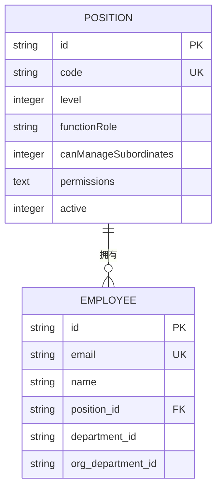
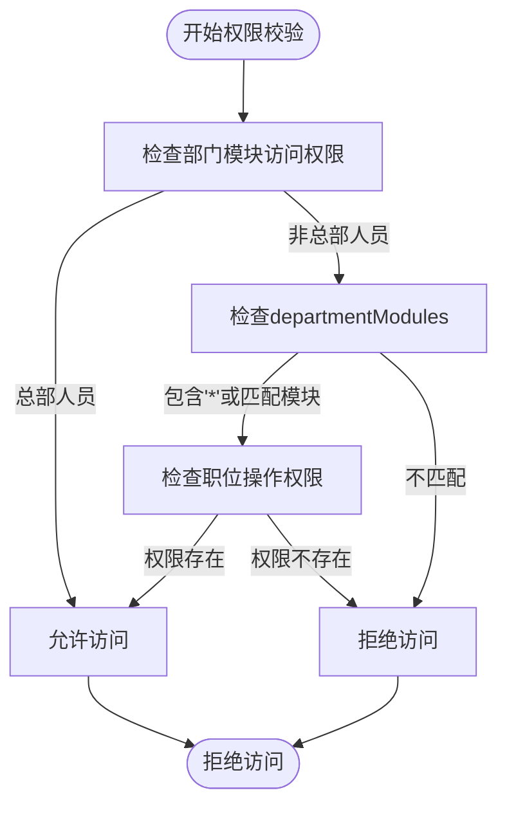
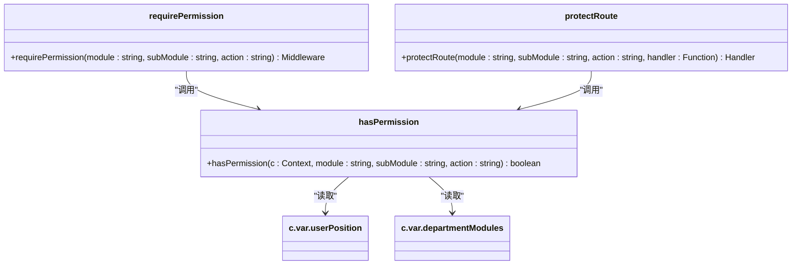
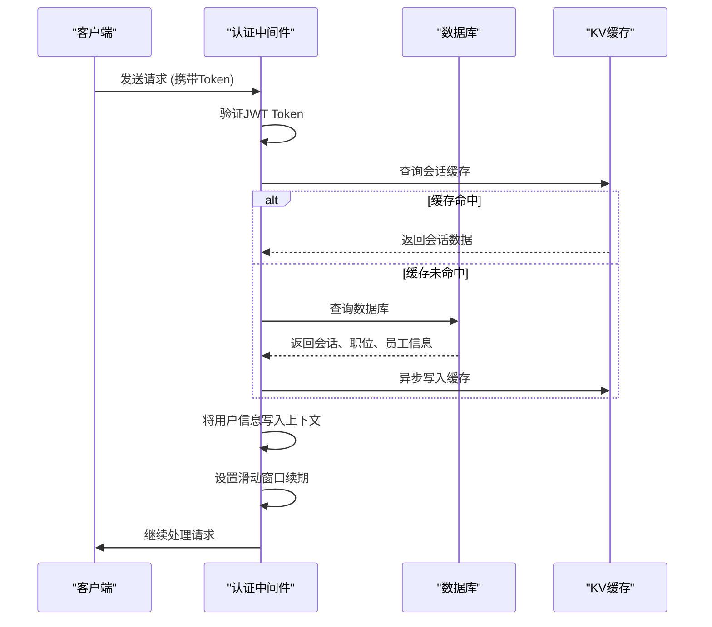

# 权限管理

<cite>
**本文档引用的文件**   
- [PermissionService.ts](file://backend/src/services/PermissionService.ts)
- [permission.ts](file://backend/src/middleware/permission.ts)
- [position-permissions.ts](file://backend/src/routes/v2/position-permissions.ts)
- [permissions.ts](file://backend/src/utils/permissions.ts)
- [schema.ts](file://backend/src/db/schema.ts)
- [middleware.ts](file://backend/src/middleware.ts)
- [types.ts](file://backend/src/types.ts)
- [business.schema.ts](file://backend/src/schemas/business.schema.ts)
- [RBAC.test.ts](file://backend/test/services/RBAC.test.ts)
</cite>

## 目录
1. [引言](#引言)
2. [权限数据模型](#权限数据模型)
3. [职位权限配置接口](#职位权限配置接口)
4. [权限校验中间件](#权限校验中间件)
5. [权限分配最佳实践](#权限分配最佳实践)
6. [常见权限错误排查](#常见权限错误排查)
7. [结论](#结论)

## 引言
本系统采用基于角色的访问控制（RBAC）模型，通过职位（Position）来管理用户的模块化权限。权限系统的核心是`PermissionService`，它负责管理职位的权限配置，并通过`requirePermission`和`protectRoute`中间件在路由层面进行权限校验。用户的权限信息在认证时被预加载到请求上下文（c.var.userContext）中，以提高后续权限检查的效率。

## 权限数据模型
系统的权限数据模型采用模块（module）、子模块（subModule）和操作（action）的三级结构，以实现细粒度的权限控制。

### 数据库表结构
权限信息主要存储在`positions`表中，其核心字段如下：



**Diagram sources**
- [schema.ts](file://backend/src/db/schema.ts#L50-L63)
- [schema.ts](file://backend/src/db/schema.ts#L14-L48)

### 权限配置结构
职位的权限配置以JSON格式存储在`positions.permissions`字段中，其结构为：
```json
{
  "module": {
    "subModule": ["action1", "action2"]
  }
}
```
例如，一个财务专员的权限配置可能如下：
```json
{
  "finance": {
    "flow": ["view", "create"],
    "report": ["view"]
  },
  "hr": {
    "employee": ["view"]
  }
}
```

### 权限校验流程
权限校验分为两个层面：部门模块访问控制和职位操作权限。



**Diagram sources**
- [permissions.ts](file://backend/src/utils/permissions.ts#L99-L124)
- [permissions.ts](file://backend/src/utils/permissions.ts#L63-L88)

**Section sources**
- [permissions.ts](file://backend/src/utils/permissions.ts#L99-L124)
- [permissions.ts](file://backend/src/utils/permissions.ts#L63-L88)

## 职位权限配置接口
`position-permissions`路由提供了对职位及其权限的完整CRUD操作。

### 接口功能
| HTTP方法 | 路径 | 功能 | 所需权限 |
|--------|------|------|---------|
| GET | /position-permissions | 获取所有职位 | system.position.view |
| GET | /position-permissions/{id} | 获取指定职位 | system.position.view |
| POST | /position-permissions | 创建新职位 | system.position.create |
| PUT | /position-permissions/{id} | 更新职位 | system.position.update |
| DELETE | /position-permissions/{id} | 删除职位 | system.position.delete |

**Section sources**
- [position-permissions.ts](file://backend/src/routes/v2/position-permissions.ts#L30-L251)

### 权限配置示例
创建职位时，可以通过`permissions`字段直接配置其权限：
```json
{
  "code": "finance_specialist",
  "name": "财务专员",
  "level": 2,
  "functionRole": "finance",
  "permissions": {
    "finance": {
      "flow": ["view", "create"],
      "report": ["view"]
    }
  }
}
```
系统会自动将`permissions`对象序列化为JSON字符串存储。

## 权限校验中间件
系统提供了两种权限校验中间件：`requirePermission`和`protectRoute`，它们都依赖于`hasPermission`工具函数。

### 中间件实现


**Diagram sources**
- [permission.ts](file://backend/src/middleware/permission.ts#L12-L42)
- [permissions.ts](file://backend/src/utils/permissions.ts#L99-L124)

### 使用示例
在路由中使用`requirePermission`中间件：
```typescript
import { requirePermission } from '../../middleware/permission.js'

// 需要 finance.flow.create 权限才能访问
myRoutes.use('/finance/flows', requirePermission('finance', 'flow', 'create'))
```

在非OpenAPI路由中使用`protectRoute`：
```typescript
import { protectRoute } from '../../middleware/permission.js'

// 需要 hr.employee.view 权限才能访问
myRoutes.get('/hr/employees', protectRoute('hr', 'employee', 'view', async (c) => {
  // 处理逻辑
}))
```

### 用户上下文加载
用户的职位和权限信息在认证中间件中被预加载到上下文中：



**Diagram sources**
- [middleware.ts](file://backend/src/middleware.ts#L17-L110)

**Section sources**
- [middleware.ts](file://backend/src/middleware.ts#L17-L110)

## 权限分配最佳实践
为了确保系统的安全性和可维护性，建议遵循以下权限分配最佳实践。

### 职位层级设计
系统采用六级职位模型，通过`level`和`code`字段区分不同层级的权限：
- **level=1**: 总部主管/专员，拥有全局访问权限
- **level=2**: 项目主管/专员，可访问本项目数据
- **level=3**: 组长/工程师，权限受限于组或个人

### 权限最小化原则
为职位分配权限时，应遵循最小权限原则，只授予完成工作所必需的权限。例如，财务专员应能查看和创建现金流，但不应有删除权限。

### 模块化权限管理
利用`departmentModules`字段实现部门级别的模块访问控制。例如，一个项目部门可以被配置为只允许访问`finance.*`和`hr.*`模块，即使职位配置了其他模块的权限也无法访问。

### 审计日志
所有对职位权限的修改都会被记录到审计日志中，便于追踪和审计：
```typescript
logAuditAction(c, 'update', 'position', id, JSON.stringify({ code: body.code, name: body.name }))
```

## 常见权限错误排查
当用户遇到权限错误时，可以按照以下步骤进行排查。

### 403 Forbidden 错误
当用户收到403错误时，通常意味着权限校验失败。排查步骤如下：

1. **检查路由权限配置**：确认路由是否正确使用了`requirePermission`或`protectRoute`中间件。
2. **验证用户职位**：检查用户当前职位的`permissions`字段是否包含所需权限。
3. **检查部门模块**：确认`departmentModules`是否允许访问该模块。
4. **查看审计日志**：通过审计日志确认权限校验的具体失败原因。

### 权限不生效
如果新分配的权限没有立即生效，可能是因为：
- **缓存问题**：用户的会话信息可能被缓存在KV中，需要等待缓存过期或手动清除。
- **未重新登录**：用户的权限信息在登录时被加载，修改权限后需要重新登录才能生效。

### 测试验证
系统提供了RBAC测试用例，可以用来验证权限逻辑的正确性：
```typescript
// 测试总部人员是否可以查看任何人
it('Level 1 (HQ): can view anyone', async () => {
  const result = await service.canViewEmployee(actor, position, targetEmployeeId)
  expect(result).toBe(true)
})
```

## 结论
本系统的权限管理模块通过清晰的RBAC模型、灵活的模块化权限配置和高效的中间件校验机制，实现了细粒度的访问控制。通过`PermissionService`统一管理职位权限，并结合`requirePermission`和`protectRoute`中间件，确保了系统安全性和可维护性。在实际使用中，应遵循权限最小化原则，并利用审计日志进行监控和排查。