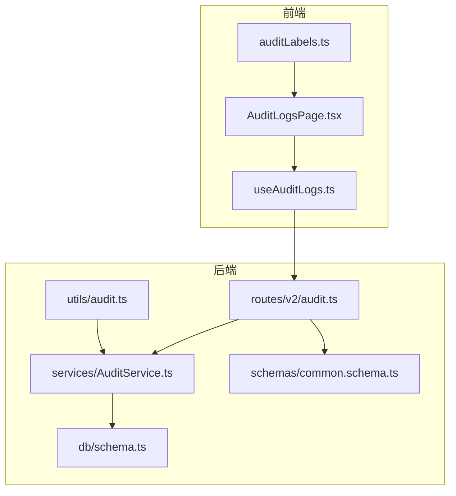
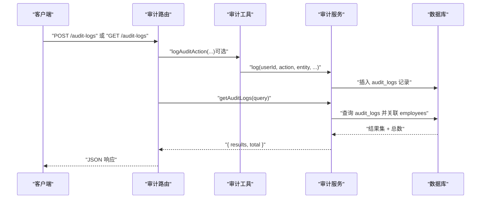
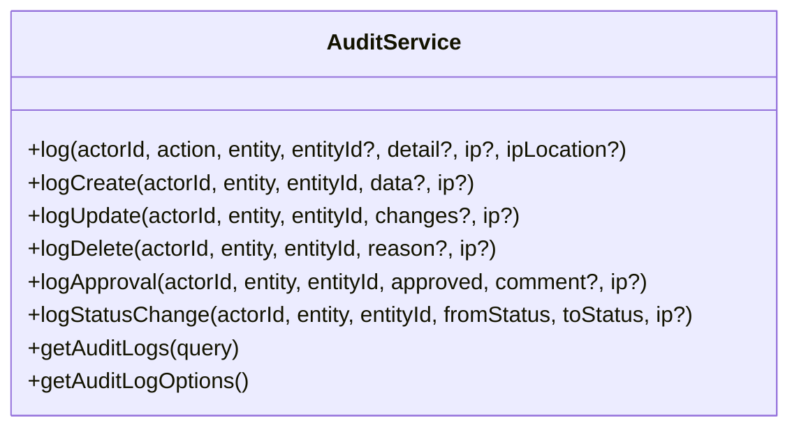
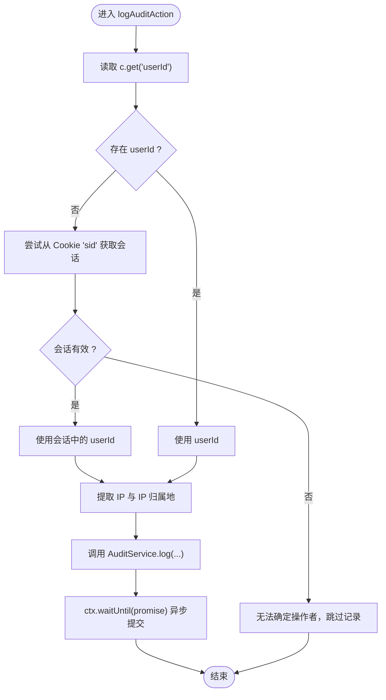
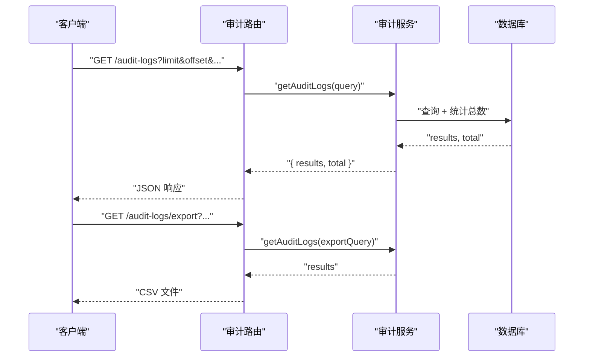
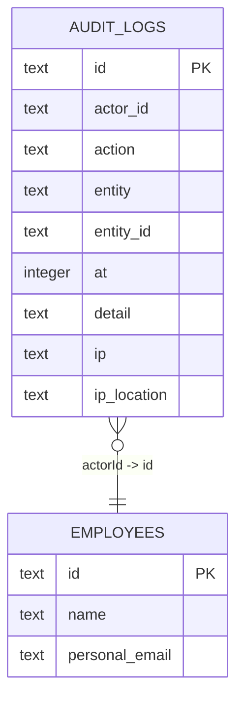
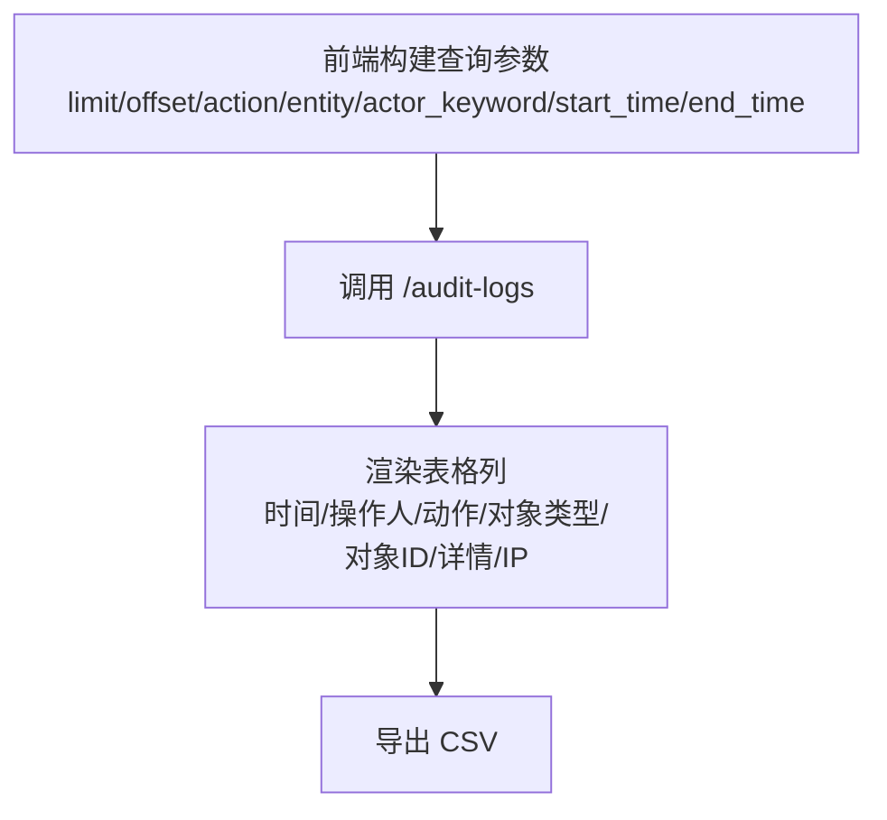
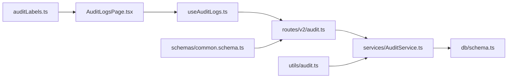

# 系统审计

<cite>
**本文引用的文件列表**
- [AuditService.ts](file://backend/src/services/AuditService.ts)
- [audit.ts](file://backend/src/utils/audit.ts)
- [audit.ts（后端路由）](file://backend/src/routes/v2/audit.ts)
- [common.schema.ts](file://backend/src/schemas/common.schema.ts)
- [schema.ts](file://backend/src/db/schema.ts)
- [auditLabels.ts](file://frontend/src/config/auditLabels.ts)
- [useAuditLogs.ts](file://frontend/src/hooks/business/useAuditLogs.ts)
- [AuditLogsPage.tsx](file://frontend/src/features/system/pages/AuditLogsPage.tsx)
- [account-transfers.ts](file://backend/src/routes/v2/account-transfers.ts)
- [allowance-payments.ts](file://backend/src/routes/v2/allowance-payments.ts)
- [approvals.ts](file://backend/src/routes/v2/approvals.ts)
- [ar-ap.ts](file://backend/src/routes/v2/ar-ap.ts)
- [borrowings.ts](file://backend/src/routes/v2/borrowings.ts)
- [audit.test.ts](file://backend/test/routes/audit.test.ts)
</cite>

## 目录
1. [简介](#简介)
2. [项目结构与角色定位](#项目结构与角色定位)
3. [核心组件](#核心组件)
4. [架构总览](#架构总览)
5. [详细组件分析](#详细组件分析)
6. [依赖关系分析](#依赖关系分析)
7. [性能与扩展性](#性能与扩展性)
8. [故障排查指南](#故障排查指南)
9. [结论](#结论)
10. [附录：合规与最佳实践](#附录合规与最佳实践)

## 简介
本文件系统化阐述系统的审计日志能力，重点说明 AuditService 如何通过 log 方法记录关键操作（如登录、登出、数据修改等），解释审计日志的数据结构（操作者、操作类型、实体类型、IP 信息等），描述审计中间件的自动记录机制以及 getAuditLogs 查询接口的分页实现，并给出合规性建议与日志分析最佳实践。

## 项目结构与角色定位
- 后端服务层：提供审计日志写入与查询能力，统一规范操作类型与实体类型。
- 路由层：暴露审计日志查询、导出、手动创建等接口，并进行权限控制。
- 工具层：封装自动审计记录工具函数，负责从请求上下文提取 IP 与 IP 归属地。
- 前端展示层：提供审计日志查询界面、导出 CSV、中文标签与详情解析。

图表来源
- [audit.ts（后端路由）](file://backend/src/routes/v2/audit.ts#L1-L224)
- [audit.ts（工具）](file://backend/src/utils/audit.ts#L1-L90)
- [AuditService.ts](file://backend/src/services/AuditService.ts#L1-L277)
- [schema.ts](file://backend/src/db/schema.ts#L675-L692)
- [common.schema.ts](file://backend/src/schemas/common.schema.ts#L193-L205)
- [AuditLogsPage.tsx](file://frontend/src/features/system/pages/AuditLogsPage.tsx#L1-L192)
- [useAuditLogs.ts](file://frontend/src/hooks/business/useAuditLogs.ts#L1-L116)
- [auditLabels.ts](file://frontend/src/config/auditLabels.ts#L1-L263)

章节来源
- [audit.ts（后端路由）](file://backend/src/routes/v2/audit.ts#L1-L224)
- [audit.ts（工具）](file://backend/src/utils/audit.ts#L1-L90)
- [AuditService.ts](file://backend/src/services/AuditService.ts#L1-L277)
- [schema.ts](file://backend/src/db/schema.ts#L675-L692)
- [common.schema.ts](file://backend/src/schemas/common.schema.ts#L193-L205)
- [AuditLogsPage.tsx](file://frontend/src/features/system/pages/AuditLogsPage.tsx#L1-L192)
- [useAuditLogs.ts](file://frontend/src/hooks/business/useAuditLogs.ts#L1-L116)
- [auditLabels.ts](file://frontend/src/config/auditLabels.ts#L1-L263)

## 核心组件
- 审计服务（AuditService）
  - 提供统一的日志写入入口与便捷方法（创建/更新/删除/审批/状态变更）。
  - 支持按条件查询审计日志并返回总数，便于前端分页。
  - 提供审计日志过滤选项（操作类型、实体类型、操作人）。
- 审计工具（logAuditAction）
  - 从请求上下文提取用户标识、IP 与 IP 归属地，异步记录审计日志，不影响主流程。
- 审计路由（routes/v2/audit）
  - 提供查询、导出、手动创建审计日志的接口，包含权限校验与 OpenAPI 规范。
- 数据模型（auditLogs 表）
  - 审计日志表包含操作者、操作类型、实体类型、实体 ID、时间戳、详情、IP 与 IP 归属地等字段。
- 前端展示与解析
  - 提供中文标签映射、详情字段解析、实体 ID 截断显示、表格列渲染与导出 CSV。

章节来源
- [AuditService.ts](file://backend/src/services/AuditService.ts#L1-L277)
- [audit.ts（工具）](file://backend/src/utils/audit.ts#L1-L90)
- [audit.ts（后端路由）](file://backend/src/routes/v2/audit.ts#L1-L224)
- [schema.ts](file://backend/src/db/schema.ts#L675-L692)
- [auditLabels.ts](file://frontend/src/config/auditLabels.ts#L1-L263)
- [useAuditLogs.ts](file://frontend/src/hooks/business/useAuditLogs.ts#L1-L116)

## 架构总览
审计流程从“业务路由”出发，调用“审计工具”记录日志；查询时由“审计路由”调用“审计服务”，结合“数据库表”与“员工表”进行关联查询与分页统计。

图表来源
- [audit.ts（后端路由）](file://backend/src/routes/v2/audit.ts#L1-L224)
- [audit.ts（工具）](file://backend/src/utils/audit.ts#L1-L90)
- [AuditService.ts](file://backend/src/services/AuditService.ts#L1-L277)
- [schema.ts](file://backend/src/db/schema.ts#L675-L692)

## 详细组件分析

### 审计服务（AuditService）
- 日志写入
  - 统一入口 log 接收 actorId、action、entity、entityId、detail、ip、ipLocation。
  - 提供便捷方法：logCreate、logUpdate、logDelete、logApproval、logStatusChange。
- 查询与分页
  - 支持按 action、entity、actorId、actor_keyword（姓名/邮箱模糊）、起止时间过滤。
  - 返回 results 与 total，便于前端分页控件使用。
- 过滤选项
  - 提供操作类型、实体类型、操作人的去重选项，供前端下拉选择。

图表来源
- [AuditService.ts](file://backend/src/services/AuditService.ts#L62-L277)

章节来源
- [AuditService.ts](file://backend/src/services/AuditService.ts#L62-L277)

### 审计工具（logAuditAction）
- 自动记录机制
  - 从请求上下文提取 userId；若缺失，尝试从会话 cookie 中获取。
  - 从 Cloudflare 请求头提取 IP 与 IP 归属地（城市+国家）。
  - 在有 ExecutionContext 的环境下，使用 waitUntil 异步提交日志，避免阻塞主请求。
- 错误处理
  - 若 AuditService 不在上下文中或记录失败，仅记录日志而不中断主流程。

图表来源
- [audit.ts（工具）](file://backend/src/utils/audit.ts#L1-L90)

章节来源
- [audit.ts（工具）](file://backend/src/utils/audit.ts#L1-L90)

### 审计路由（routes/v2/audit）
- 查询接口
  - GET /audit-logs：支持 action、entity、actorId、actor_keyword、startTime、endTime、limit、offset。
  - 返回 success、data.results、data.total。
- 导出接口
  - GET /audit-logs/export：导出 CSV，包含时间、操作人、邮箱、操作、实体类型、实体ID、IP、IP归属地、详情。
- 手动创建接口
  - POST /audit-logs：记录一次审计日志，要求已认证用户。
- 权限控制
  - 查询与导出需要 system:audit:view / system:audit:export 权限。

图表来源
- [audit.ts（后端路由）](file://backend/src/routes/v2/audit.ts#L1-L224)
- [AuditService.ts](file://backend/src/services/AuditService.ts#L170-L242)

章节来源
- [audit.ts（后端路由）](file://backend/src/routes/v2/audit.ts#L1-L224)
- [AuditService.ts](file://backend/src/services/AuditService.ts#L170-L242)

### 数据模型（auditLogs 表）
- 字段
  - id、actorId、action、entity、entityId、at、detail、ip、ipLocation。
- 索引
  - 时间索引、实体ID索引，有利于按时间倒序与实体维度检索。
- 关联
  - 查询时与 employees 表左连接，补充操作人姓名与邮箱。

图表来源
- [schema.ts](file://backend/src/db/schema.ts#L675-L692)

章节来源
- [schema.ts](file://backend/src/db/schema.ts#L675-L692)

### 前端展示与解析
- 列表页面
  - 支持按操作类型、实体类型、操作人关键词、时间范围筛选。
  - 分页基于 limit/offset，总数来自后端。
- 中文标签与详情解析
  - 提供操作类型、实体类型的中文映射与颜色。
  - 详情字段按键名映射中文并格式化金额、布尔值、状态值等。
  - 实体 ID 过长时截断显示。
- 导出 CSV
  - 下载 CSV 文件，包含时间、操作人、邮箱、操作、实体类型、实体ID、IP、IP归属地、详情。

图表来源
- [useAuditLogs.ts](file://frontend/src/hooks/business/useAuditLogs.ts#L1-L116)
- [AuditLogsPage.tsx](file://frontend/src/features/system/pages/AuditLogsPage.tsx#L1-L192)
- [auditLabels.ts](file://frontend/src/config/auditLabels.ts#L1-L263)

章节来源
- [useAuditLogs.ts](file://frontend/src/hooks/business/useAuditLogs.ts#L1-L116)
- [AuditLogsPage.tsx](file://frontend/src/features/system/pages/AuditLogsPage.tsx#L1-L192)
- [auditLabels.ts](file://frontend/src/config/auditLabels.ts#L1-L263)

### 自动审计记录在业务路由中的使用
- 账户转账、补贴发放、审批、应收应付、借款等路由均在关键操作处调用 logAuditAction，确保关键业务行为被记录。
- 示例：在创建/更新/删除等场景，将变更内容序列化为 detail，便于审计分析。

章节来源
- [account-transfers.ts](file://backend/src/routes/v2/account-transfers.ts#L1-L200)
- [allowance-payments.ts](file://backend/src/routes/v2/allowance-payments.ts#L200-L450)
- [approvals.ts](file://backend/src/routes/v2/approvals.ts#L200-L480)
- [ar-ap.ts](file://backend/src/routes/v2/ar-ap.ts#L200-L430)
- [borrowings.ts](file://backend/src/routes/v2/borrowings.ts#L180-L330)

## 依赖关系分析
- 审计服务依赖数据库模式（auditLogs 表）与员工表（employees）进行关联查询。
- 审计路由依赖审计服务与通用查询 Schema（auditLogQuerySchema）。
- 审计工具依赖请求上下文（userId、cookies、headers）与日志工具（Logger）。
- 前端依赖审计路由提供的接口与标签映射。

图表来源
- [audit.ts（后端路由）](file://backend/src/routes/v2/audit.ts#L1-L224)
- [AuditService.ts](file://backend/src/services/AuditService.ts#L1-L277)
- [schema.ts](file://backend/src/db/schema.ts#L675-L692)
- [audit.ts（工具）](file://backend/src/utils/audit.ts#L1-L90)
- [common.schema.ts](file://backend/src/schemas/common.schema.ts#L193-L205)
- [useAuditLogs.ts](file://frontend/src/hooks/business/useAuditLogs.ts#L1-L116)
- [AuditLogsPage.tsx](file://frontend/src/features/system/pages/AuditLogsPage.tsx#L1-L192)
- [auditLabels.ts](file://frontend/src/config/auditLabels.ts#L1-L263)

章节来源
- [audit.ts（后端路由）](file://backend/src/routes/v2/audit.ts#L1-L224)
- [AuditService.ts](file://backend/src/services/AuditService.ts#L1-L277)
- [schema.ts](file://backend/src/db/schema.ts#L675-L692)
- [audit.ts（工具）](file://backend/src/utils/audit.ts#L1-L90)
- [common.schema.ts](file://backend/src/schemas/common.schema.ts#L193-L205)
- [useAuditLogs.ts](file://frontend/src/hooks/business/useAuditLogs.ts#L1-L116)
- [AuditLogsPage.tsx](file://frontend/src/features/system/pages/AuditLogsPage.tsx#L1-L192)
- [auditLabels.ts](file://frontend/src/config/auditLabels.ts#L1-L263)

## 性能与扩展性
- 查询性能
  - 审计日志表具备时间与实体ID索引，适合按时间倒序与实体维度检索。
  - 查询接口默认 limit=100，可通过前端分页控件调整，避免一次性返回过多数据。
- 导出性能
  - 导出接口限制最大查询量（例如 10000），避免超大数据量导出导致内存压力。
- 异步记录
  - 审计工具在有 ExecutionContext 时使用 waitUntil 异步提交，避免阻塞主请求，提升吞吐。
- 可扩展性
  - 新增操作类型与实体类型只需在服务常量与前端标签映射中补充即可。
  - 详情字段解析支持通用键名映射与金额格式化，便于扩展新的业务对象。

[本节为通用性能讨论，无需列出具体文件来源]

## 故障排查指南
- 无法记录审计日志
  - 检查是否存在 userId 或会话（sid）；若两者都不存在，将无法确定 actorId。
  - 确认 ExecutionContext 存在且支持 waitUntil，否则异步提交会被跳过。
- 查询结果为空
  - 检查查询参数是否正确（action、entity、actorId、actor_keyword、时间范围）。
  - 确认审计日志表中是否存在对应记录。
- 导出异常
  - 确认导出接口权限与查询参数。
  - 检查 CSV 生成逻辑与响应头设置。
- 单元测试参考
  - 后端审计路由测试覆盖了查询、导出与手动创建接口的基本行为，可作为集成测试参考。

章节来源
- [audit.ts（工具）](file://backend/src/utils/audit.ts#L1-L90)
- [audit.ts（后端路由）](file://backend/src/routes/v2/audit.ts#L1-L224)
- [audit.test.ts](file://backend/test/routes/audit.test.ts#L1-L146)

## 结论
该系统通过统一的审计服务与工具，实现了对关键业务操作的自动记录与集中查询。前端提供了完善的筛选、分页与导出能力，并通过中文标签与详情解析提升了可读性。整体设计具备良好的扩展性与性能表现，能够满足合规审计与运营分析需求。

[本节为总结性内容，无需列出具体文件来源]

## 附录：合规与最佳实践

- 审计日志数据结构
  - 操作者：actorId（员工ID），可关联员工姓名与邮箱。
  - 操作类型：action（如 login、logout、create、update、delete、approve、reject、status_change、transfer、payment、settlement、reverse 等）。
  - 实体类型：entity（如 user、employee、department、org_department、position、account、cash_flow、ar_ap、salary、salary_payment、allowance、borrowing、repayment、expense、fixed_asset、rental、leave、approval 等）。
  - 实体ID：entityId（业务对象唯一标识）。
  - 时间戳：at（毫秒级 Unix 时间）。
  - 详情：detail（JSON 字符串，记录变更前后对比或附加说明）。
  - IP 信息：ip、ipLocation（从 Cloudflare 请求头提取的城市+国家）。

- 自动记录机制
  - 在关键业务路由中调用 logAuditAction，确保登录、登出、创建、更新、删除、审批、状态变更、财务操作等行为被记录。
  - 详情建议包含必要的上下文信息（如变更字段、金额、数量等），以便复核与追踪。

- 查询与分页
  - 前端使用 limit/offset 实现分页，后端返回 total 与 results。
  - 支持按操作类型、实体类型、操作人关键词、时间范围过滤，便于快速定位问题。

- 导出与分析
  - 导出 CSV 包含时间、操作人、邮箱、操作、实体类型、实体ID、IP、IP归属地、详情，便于离线分析。
  - 建议定期导出并归档，满足审计与合规要求。

- 合规建议
  - 严格控制审计日志访问权限，仅授权人员可查看与导出。
  - 对敏感字段（如密码、令牌、金额）在 detail 中进行脱敏处理。
  - 明确保留期限与销毁策略，遵守数据保护法规。
  - 对异常登录、高风险操作增加告警与二次确认流程。

[本节为通用合规与最佳实践建议，无需列出具体文件来源]