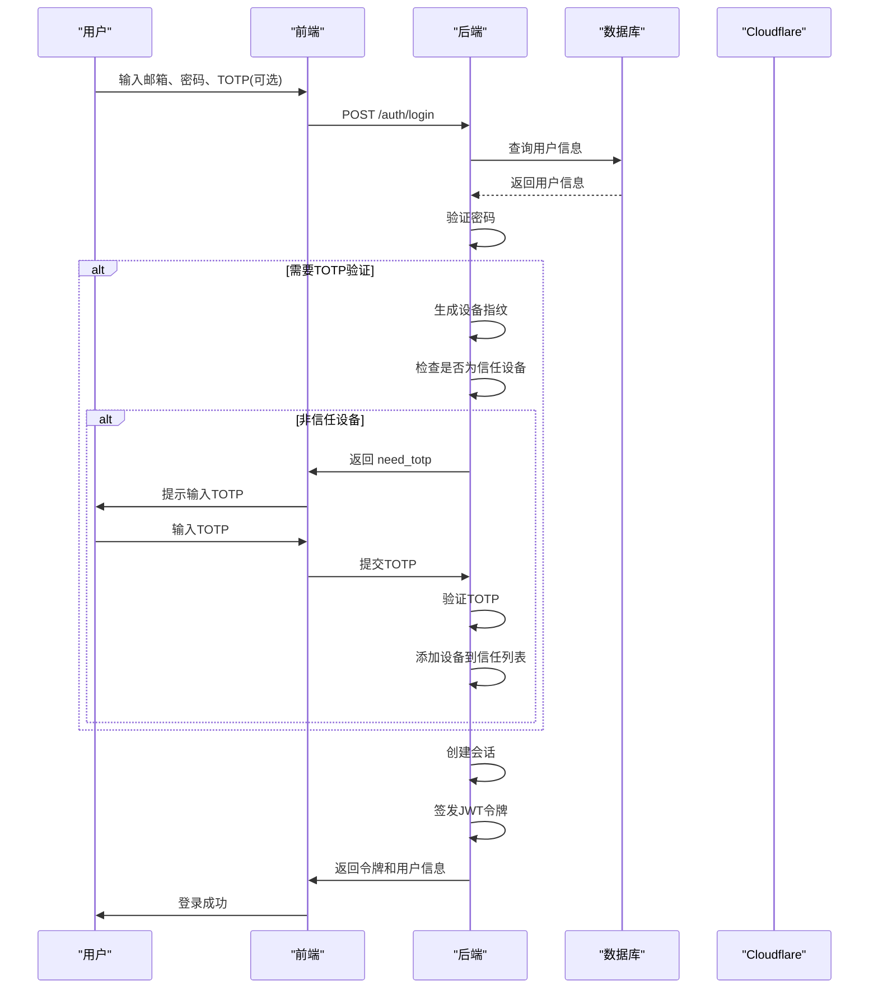

# 系统设置与安全路由

<cite>
**本文档引用的文件**   
- [system-config.ts](file://backend/src/routes/v2/system-config.ts)
- [auth.ts](file://backend/src/routes/v2/auth.ts)
- [ip-whitelist.ts](file://backend/src/routes/v2/ip-whitelist.ts)
- [position-permissions.ts](file://backend/src/routes/v2/position-permissions.ts)
- [audit.ts](file://backend/src/routes/v2/audit.ts)
- [my.ts](file://backend/src/routes/v2/my.ts)
- [jwt.ts](file://backend/src/utils/jwt.ts)
- [permissions.ts](file://backend/src/utils/permissions.ts)
- [AuthService.ts](file://backend/src/services/AuthService.ts)
- [SystemConfigService.ts](file://backend/src/services/SystemConfigService.ts)
- [IPWhitelistService.ts](file://backend/src/services/IPWhitelistService.ts)
- [PositionService.ts](file://backend/src/services/PositionService.ts)
</cite>

## 目录
1. [系统参数配置](#系统参数配置)
2. [用户认证与JWT+TOTP双因素认证](#用户认证与jwttotp双因素认证)
3. [IP白名单管理](#ip白名单管理)
4. [职位权限管理与RBAC模型](#职位权限管理与rbac模型)
5. [操作审计日志](#操作审计日志)
6. [个人中心](#个人中心)
7. [安全最佳实践建议](#安全最佳实践建议)

## 系统参数配置

系统参数配置模块（`system-config`）提供了对系统全局配置项的管理，包括查询和更新配置。该模块通过 `system-config.ts` 文件中的路由实现，支持对系统配置进行细粒度的权限控制。

- **获取所有系统配置**：通过 `GET /system-config` 接口，具有 `system.config.view` 权限的用户可以获取所有系统配置。该接口返回一个包含所有配置项的键值对对象。
- **获取特定配置项**：通过 `GET /system-config/{key}` 接口，可以获取指定键的配置项。该接口同样需要 `system.config.view` 权限。
- **更新系统配置**：通过 `PUT /system-config/{key}` 接口，具有 `system.config.update` 权限的用户可以更新指定键的配置值。更新操作会触发审计日志记录。

系统配置的存储和管理由 `SystemConfigService` 类负责，该类通过 D1 数据库的 `systemConfig` 表进行持久化。配置值支持 JSON 格式，允许存储复杂的数据结构。

**Section sources**
- [system-config.ts](file://backend/src/routes/v2/system-config.ts#L60-L183)
- [SystemConfigService.ts](file://backend/src/services/SystemConfigService.ts#L1-L61)

## 用户认证与JWT+TOTP双因素认证

用户认证模块（`auth`）实现了完整的用户登录、登出、密码重置和双因素认证（2FA）流程。该模块的核心是 JWT+TOTP 双因素认证机制，确保了系统的安全性。

### JWT+TOTP双因素认证流程

1. **登录请求**：用户通过 `POST /auth/login` 接口提交邮箱和密码。如果系统启用了 2FA 且用户已绑定 TOTP，则需要提供 TOTP 验证码。
2. **身份验证**：`AuthService` 类验证用户凭据。如果用户是首次在新设备上登录，且已绑定 TOTP，则需要验证 TOTP 验证码。
3. **信任设备管理**：成功验证 TOTP 后，设备指纹（基于 IP 和 User-Agent 生成）会被添加到信任设备列表中，后续登录可免验证 TOTP。
4. **令牌签发**：认证成功后，系统生成一个 JWT 令牌，包含用户会话 ID、用户 ID、邮箱、姓名和职位信息。令牌通过 `signAuthToken` 函数签发，有效期为 7 天。
5. **令牌验证**：后续请求通过 `verifyAuthToken` 函数验证 JWT 令牌的有效性，确保用户身份的合法性。



**Diagram sources**
- [auth.ts](file://backend/src/routes/v2/auth.ts#L147-L213)
- [AuthService.ts](file://backend/src/services/AuthService.ts#L34-L148)
- [jwt.ts](file://backend/src/utils/jwt.ts#L72-L93)

**Section sources**
- [auth.ts](file://backend/src/routes/v2/auth.ts#L1-L688)
- [AuthService.ts](file://backend/src/services/AuthService.ts#L1-L495)
- [jwt.ts](file://backend/src/utils/jwt.ts#L1-L132)

## IP白名单管理

IP 白名单模块（`ip-whitelist`）通过 Cloudflare 的 IP 列表功能，实现了对访问源 IP 的严格控制。该模块允许管理员添加、删除和批量管理 IP 地址，并通过中间件对请求进行实时过滤。

- **获取IP白名单**：`GET /ip-whitelist` 接口返回当前白名单中的所有 IP 地址。
- **添加IP地址**：`POST /ip-whitelist` 接口允许管理员添加单个 IP 地址到白名单。
- **批量操作**：支持批量添加和删除 IP 地址，提高管理效率。
- **规则管理**：可以创建、启用/禁用 Cloudflare 规则，控制白名单的生效状态。

IP 白名单的管理由 `IPWhitelistService` 类负责，该类通过调用 Cloudflare API 进行操作。中间件 `createIPWhitelistMiddleware` 在请求到达业务逻辑前进行 IP 检查，确保只有白名单内的 IP 可以访问系统。

**Section sources**
- [ip-whitelist.ts](file://backend/src/routes/v2/ip-whitelist.ts#L53-L415)
- [IPWhitelistService.ts](file://backend/src/services/IPWhitelistService.ts#L1-L141)
- [ipWhitelist.ts](file://backend/src/middleware/ipWhitelist.ts#L1-L76)

## 职位权限管理与RBAC模型

职位权限管理模块（`position-permissions`）实现了基于角色的访问控制（RBAC）模型。系统通过职位（Position）来定义权限，每个职位关联一组权限配置，用户通过其职位获得相应的操作权限。

### RBAC模型实现

- **职位定义**：职位包含代码、名称、级别、功能角色和权限配置。权限配置以 JSON 格式存储，定义了该职位在不同模块和子模块下的操作权限（如 view、create、update、delete）。
- **权限检查**：`hasPermission` 函数用于检查用户是否具有执行特定操作的权限。该函数结合用户职位的权限配置和部门模块访问控制，进行综合判断。
- **数据访问控制**：`getDataAccessFilter` 函数根据用户职位层级生成 SQL 过滤条件，确保用户只能访问其权限范围内的数据。例如，总部人员可访问所有数据，项目人员只能访问本项目数据，工程师只能访问自己的数据。

```mermaid
classDiagram
class Position {
+string id
+string code
+string name
+number level
+string functionRole
+any permissions
+number canManageSubordinates
}
class User {
+string id
+string email
+string name
+string positionId
+string departmentId
+string orgDepartmentId
}
class PermissionService {
+hasPermission(c, module, subModule, action) bool
+getDataAccessFilter(c, tableAlias, options) {where, binds}
+canManageSubordinates(c) bool
}
User --> Position : "拥有"
PermissionService --> Position : "使用"
PermissionService --> User : "使用"
```

**Diagram sources**
- [position-permissions.ts](file://backend/src/routes/v2/position-permissions.ts#L31-L252)
- [PositionService.ts](file://backend/src/services/PositionService.ts#L1-L224)
- [permissions.ts](file://backend/src/utils/permissions.ts#L99-L273)

**Section sources**
- [position-permissions.ts](file://backend/src/routes/v2/position-permissions.ts#L1-L252)
- [PositionService.ts](file://backend/src/services/PositionService.ts#L1-L224)
- [permissions.ts](file://backend/src/utils/permissions.ts#L1-L273)

## 操作审计日志

操作审计日志模块（`audit`）自动记录系统中的关键操作，提供完整的操作追溯能力。所有敏感操作（如登录、登出、配置更新、数据修改）都会被记录到审计日志中。

- **日志记录**：通过 `logAuditAction` 函数，可以在业务逻辑中手动记录审计日志。该函数会自动收集操作人、操作类型、实体、实体ID、详情、IP地址等信息。
- **日志查询**：`GET /audit-logs` 接口允许管理员查询审计日志，支持按操作、实体、时间范围等条件过滤。
- **日志导出**：`GET /audit-logs/export` 接口支持将审计日志导出为 CSV 文件，便于离线分析。

审计日志的存储和管理由 `AuditService` 类负责，确保日志数据的完整性和安全性。

**Section sources**
- [audit.ts](file://backend/src/routes/v2/audit.ts#L27-L224)
- [audit.ts](file://backend/src/utils/audit.ts)
- [AuthService.ts](file://backend/src/services/AuthService.ts#L131-L140)

## 个人中心

个人中心模块（`my`）为用户提供了个人信息管理、请假、报销、借款等功能。该模块的路由定义在 `my.ts` 文件中，涵盖了用户日常操作的各个方面。

- **个人信息管理**：用户可以查看和更新个人资料，如电话、紧急联系人等。
- **请假管理**：用户可以提交请假申请，查看请假记录和统计。
- **报销管理**：用户可以提交报销申请，查看报销记录和统计。
- **借款管理**：用户可以提交借款申请，查看借款记录和统计。
- **考勤管理**：用户可以进行打卡上班和下班，查看考勤记录。

所有创建和更新操作都会触发审计日志记录，确保操作的可追溯性。

**Section sources**
- [my.ts](file://backend/src/routes/v2/my.ts#L239-L800)

## 安全最佳实践建议

为了确保系统的安全性，建议遵循以下最佳实践：

- **令牌刷新机制**：JWT 令牌的有效期设置为 7 天，结合会话机制，确保令牌在过期后需要重新登录。会话在数据库和 KV 中双重存储，支持单点登录和会话管理。
- **敏感操作的二次确认**：对于删除职位、重置 TOTP 等敏感操作，系统通过异步任务和邮件通知进行二次确认，防止误操作。
- **IP白名单与信任设备**：结合 IP 白名单和信任设备机制，实现多层访问控制。新设备首次登录需要 TOTP 验证，后续登录可免验证。
- **审计日志**：所有关键操作均记录审计日志，包括操作人、操作类型、实体、IP地址等信息，确保操作的可追溯性。
- **安全响应头**：通过 `securityHeaders` 中间件设置安全响应头，如 `X-Content-Type-Options`、`X-Frame-Options`、`Content-Security-Policy` 等，提升应用的安全性。

**Section sources**
- [jwt.ts](file://backend/src/utils/jwt.ts#L56-L59)
- [AuthService.ts](file://backend/src/services/AuthService.ts#L99-L113)
- [security.ts](file://backend/src/middleware/security.ts#L1-L81)
- [audit.ts](file://backend/src/utils/audit.ts)