# 认证授权

<cite>
**本文引用的文件列表**
- [AuthService.ts](file://backend/src/services/AuthService.ts)
- [TrustedDeviceService.ts](file://backend/src/services/TrustedDeviceService.ts)
- [jwt.ts](file://backend/src/utils/jwt.ts)
- [auth.ts](file://backend/src/routes/v2/auth.ts)
- [auth.ts](file://backend/src/utils/auth.ts)
- [schema.ts](file://backend/src/db/schema.ts)
- [rateLimit.ts](file://backend/src/middleware/rateLimit.ts)
- [RateLimitService.ts](file://backend/src/services/RateLimitService.ts)
- [EmailService.ts](file://backend/src/services/EmailService.ts)
- [audit.ts](file://backend/src/utils/audit.ts)
- [audit.ts](file://backend/src/routes/v2/audit.ts)
- [password_reset.test.ts](file://backend/test/services/password_reset.test.ts)
- [activation.test.ts](file://backend/test/services/activation.test.ts)
</cite>

## 目录
1. [简介](#简介)
2. [项目结构](#项目结构)
3. [核心组件](#核心组件)
4. [架构总览](#架构总览)
5. [详细组件分析](#详细组件分析)
6. [依赖关系分析](#依赖关系分析)
7. [性能考量](#性能考量)
8. [故障排查指南](#故障排查指南)
9. [结论](#结论)
10. [附录](#附录)

## 简介
本文件系统性阐述基于 JWT+TOTP 的双因素认证体系，覆盖用户登录、密码重置、账号激活与 2FA 管理的完整流程。重点解析 AuthService 中 login 方法的执行逻辑，包括会话创建（createSession）、单点登录控制、信任设备机制（TrustedDeviceService）与自动登录流程；同时说明密码重置（resetPassword）与账号激活（activateAccount）的令牌安全策略，以及 TOTP 重置请求（requestTotpReset）的 KV 命名空间存储机制。文档还提供安全实践建议，如防止邮箱枚举攻击的静默返回策略与会话令牌的双重存储（D1+KV）。

## 项目结构
后端采用分层架构：
- 路由层：定义认证相关 API，负责参数校验、限流与响应封装
- 服务层：核心业务逻辑，如认证、会话、信任设备、限流、审计
- 工具层：JWT 编解码、TOTP 生成与校验、审计日志工具
- 数据层：Drizzle ORM 映射 D1 表结构（employees、sessions、trusted_devices 等）

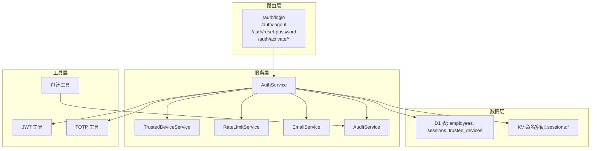

图表来源
- [auth.ts](file://backend/src/routes/v2/auth.ts#L1-L177)
- [AuthService.ts](file://backend/src/services/AuthService.ts#L1-L198)
- [TrustedDeviceService.ts](file://backend/src/services/TrustedDeviceService.ts#L1-L167)
- [jwt.ts](file://backend/src/utils/jwt.ts#L1-L132)
- [auth.ts](file://backend/src/utils/auth.ts#L1-L17)
- [schema.ts](file://backend/src/db/schema.ts#L118-L137)

章节来源
- [auth.ts](file://backend/src/routes/v2/auth.ts#L1-L177)
- [AuthService.ts](file://backend/src/services/AuthService.ts#L1-L198)
- [schema.ts](file://backend/src/db/schema.ts#L118-L137)

## 核心组件
- AuthService：统一处理登录、会话创建、密码重置、账号激活、TOTP 重置请求与校验
- TrustedDeviceService：设备指纹生成、信任设备判定、添加与清理
- JWT 工具：签发与校验 JWT，承载会话标识与用户角色信息
- 限流中间件与 RateLimitService：基于 KV 的滑动窗口限流
- EmailService：发送登录通知、密码重置、TOTP 重置等邮件
- 审计日志：围绕认证事件进行审计记录

章节来源
- [AuthService.ts](file://backend/src/services/AuthService.ts#L1-L198)
- [TrustedDeviceService.ts](file://backend/src/services/TrustedDeviceService.ts#L1-L167)
- [jwt.ts](file://backend/src/utils/jwt.ts#L1-L132)
- [rateLimit.ts](file://backend/src/middleware/rateLimit.ts#L1-L133)
- [RateLimitService.ts](file://backend/src/services/RateLimitService.ts#L1-L48)
- [EmailService.ts](file://backend/src/services/EmailService.ts#L332-L379)
- [audit.ts](file://backend/src/utils/audit.ts#L43-L89)

## 架构总览
下图展示认证流程的关键交互：路由接收请求，调用 AuthService 执行业务逻辑，必要时访问 D1/KV 存储与 EmailService 发送通知，并通过 JWT 工具签发令牌。

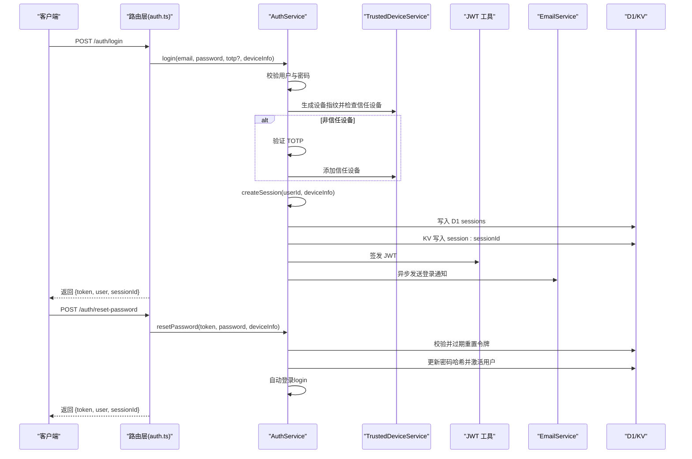

图表来源
- [auth.ts](file://backend/src/routes/v2/auth.ts#L81-L144)
- [AuthService.ts](file://backend/src/services/AuthService.ts#L34-L148)
- [AuthService.ts](file://backend/src/services/AuthService.ts#L150-L198)
- [jwt.ts](file://backend/src/utils/jwt.ts#L72-L132)
- [EmailService.ts](file://backend/src/services/EmailService.ts#L332-L379)

## 详细组件分析

### 组件一：AuthService.login 执行逻辑
- 用户校验与员工记录关联：通过个人邮箱查询员工记录，校验账户状态与密码哈希
- 2FA 策略：根据系统配置决定是否强制启用 2FA；若启用且用户未绑定 TOTP，则拒绝登录
- 信任设备判定：生成设备指纹（SHA-256），检查是否信任设备；非信任设备需验证 TOTP 并加入信任设备
- 登录成功后更新最近登录时间，创建会话并写入 D1 与 KV
- 审计日志：记录登录事件（含 IP、UA 等上下文）

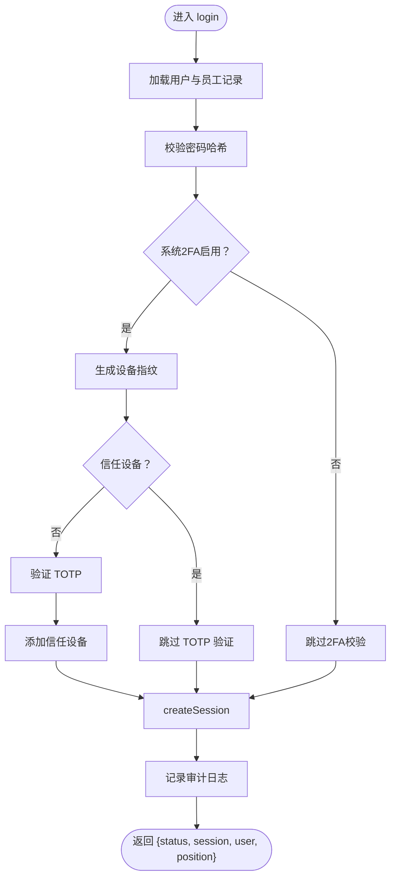

图表来源
- [AuthService.ts](file://backend/src/services/AuthService.ts#L34-L148)
- [AuthService.ts](file://backend/src/services/AuthService.ts#L150-L198)
- [TrustedDeviceService.ts](file://backend/src/services/TrustedDeviceService.ts#L14-L63)

章节来源
- [AuthService.ts](file://backend/src/services/AuthService.ts#L34-L148)
- [AuthService.ts](file://backend/src/services/AuthService.ts#L150-L198)
- [TrustedDeviceService.ts](file://backend/src/services/TrustedDeviceService.ts#L14-L63)

### 组件二：会话创建与单点登录控制
- 单点登录（SLO）：登录前删除该用户所有旧会话（D1 与 KV 同步清理）
- 双重存储：D1 作为持久化备份与审计载体；KV 作为高性能缓存，写入 TTL
- 会话读取：优先从 KV 读取，降级到 D1 查询并校验过期

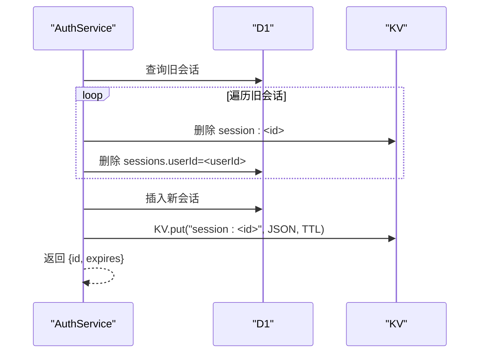

图表来源
- [AuthService.ts](file://backend/src/services/AuthService.ts#L150-L198)

章节来源
- [AuthService.ts](file://backend/src/services/AuthService.ts#L150-L198)

### 组件三：信任设备机制（TrustedDeviceService）
- 设备指纹：基于 userId、IP、User-Agent 的 SHA-256 派生固定长度指纹
- 信任判定：检查是否存在且未过期（默认 90 天），过期则清理并返回未信任
- 添加信任：插入记录并记录设备名称（解析 UA），忽略唯一约束冲突
- 清理过期：定期清理过期设备记录

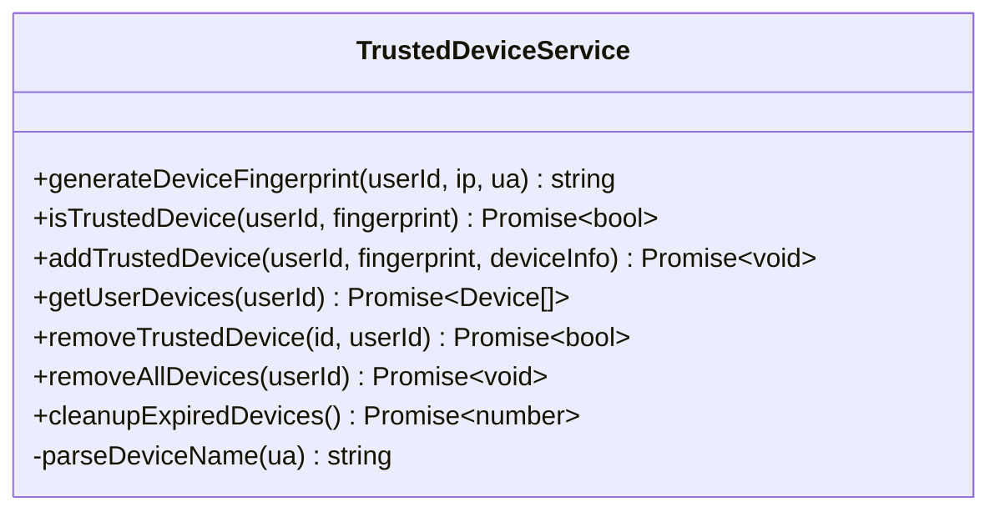

图表来源
- [TrustedDeviceService.ts](file://backend/src/services/TrustedDeviceService.ts#L1-L167)

章节来源
- [TrustedDeviceService.ts](file://backend/src/services/TrustedDeviceService.ts#L1-L167)

### 组件四：密码重置（resetPassword）与令牌安全策略
- 令牌生成与存储：requestPasswordReset 生成 UUID 拼接令牌并写入 D1，1 小时过期
- 令牌校验：verifyResetToken 校验存在性与过期时间
- 重置流程：resetPassword 校验令牌后更新密码哈希、激活用户、清空重置令牌并触发自动登录
- 防枚举策略：requestPasswordReset 对不存在用户也返回成功，避免泄露邮箱存在性

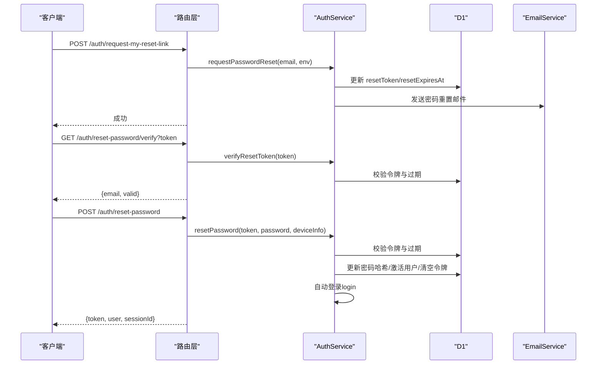

图表来源
- [auth.ts](file://backend/src/routes/v2/auth.ts#L530-L571)
- [auth.ts](file://backend/src/routes/v2/auth.ts#L445-L477)
- [auth.ts](file://backend/src/routes/v2/auth.ts#L478-L528)
- [AuthService.ts](file://backend/src/services/AuthService.ts#L229-L327)
- [schema.ts](file://backend/src/db/schema.ts#L14-L48)

章节来源
- [auth.ts](file://backend/src/routes/v2/auth.ts#L530-L571)
- [auth.ts](file://backend/src/routes/v2/auth.ts#L445-L528)
- [AuthService.ts](file://backend/src/services/AuthService.ts#L229-L327)
- [schema.ts](file://backend/src/db/schema.ts#L14-L48)

### 组件五：账号激活（activateAccount）与 2FA 绑定
- 激活令牌校验：verifyActivationToken 校验存在性与过期
- 激活流程：激活用户、设置密码哈希、可选绑定 TOTP（取决于系统配置），并自动登录
- 防枚举策略：对不存在用户返回无效链接错误

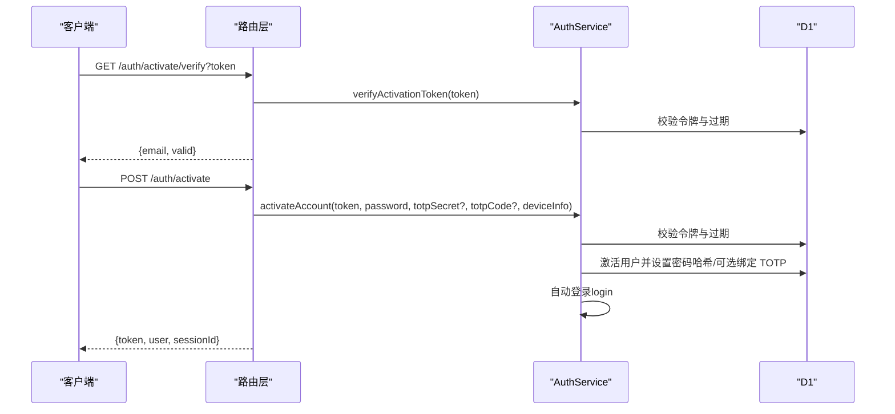

图表来源
- [auth.ts](file://backend/src/routes/v2/auth.ts#L315-L418)
- [AuthService.ts](file://backend/src/services/AuthService.ts#L349-L443)
- [schema.ts](file://backend/src/db/schema.ts#L14-L48)

章节来源
- [auth.ts](file://backend/src/routes/v2/auth.ts#L315-L418)
- [AuthService.ts](file://backend/src/services/AuthService.ts#L349-L443)
- [schema.ts](file://backend/src/db/schema.ts#L14-L48)

### 组件六：TOTP 重置请求（requestTotpReset）与 KV 存储机制
- 请求入口：移动端接口 /auth/mobile/request-totp-reset
- KV 存储：以 totp_reset:{token} 为键，值为 userId，TTL 30 分钟
- 邮件发送：优先使用个人邮箱，否则使用公司邮箱
- 校验与重置：verifyTotpResetToken 校验令牌有效性；resetTotpByToken 清空用户 TOTP 并删除令牌

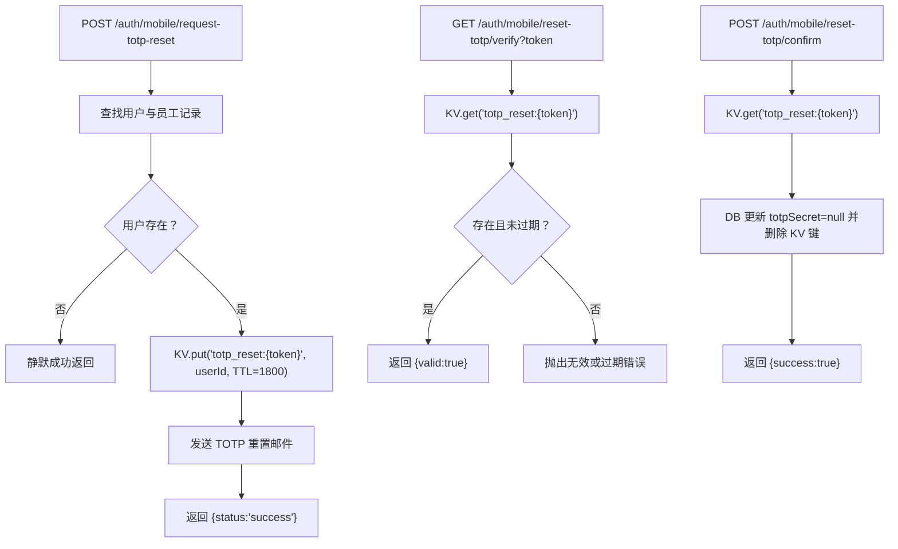

图表来源
- [auth.ts](file://backend/src/routes/v2/auth.ts#L573-L686)
- [AuthService.ts](file://backend/src/services/AuthService.ts#L444-L493)
- [EmailService.ts](file://backend/src/services/EmailService.ts#L332-L379)

章节来源
- [auth.ts](file://backend/src/routes/v2/auth.ts#L573-L686)
- [AuthService.ts](file://backend/src/services/AuthService.ts#L444-L493)
- [EmailService.ts](file://backend/src/services/EmailService.ts#L332-L379)

### 组件七：JWT 与令牌签发
- JWT 载荷：包含 sid（会话 ID）、sub（用户 ID）、email、name、position 等
- 签发与校验：使用 HMAC-SHA256，支持 Base64URL 编码与过期校验
- 路由集成：登录成功后签发 JWT，后续 /auth/me 通过 JWT 校验获取用户信息

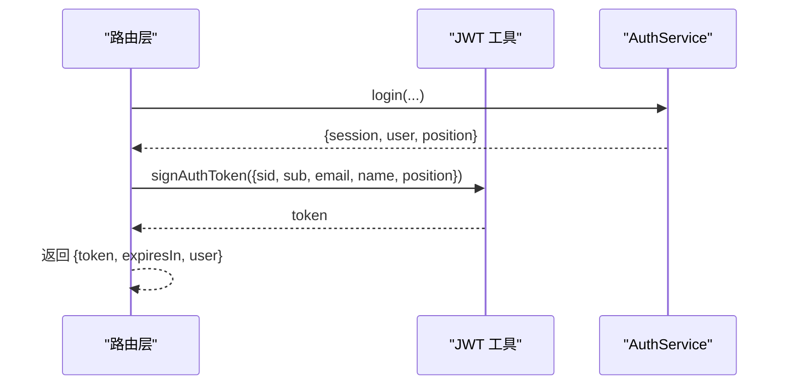

图表来源
- [auth.ts](file://backend/src/routes/v2/auth.ts#L36-L79)
- [jwt.ts](file://backend/src/utils/jwt.ts#L72-L132)

章节来源
- [auth.ts](file://backend/src/routes/v2/auth.ts#L36-L79)
- [jwt.ts](file://backend/src/utils/jwt.ts#L1-L132)

### 组件八：限流与安全防护
- 登录限流：按 IP 滑动窗口限制每分钟最多 N 次尝试
- 密码重置限流：按 IP 每小时最多 M 次
- TOTP 重置限流：按邮箱每小时最多 K 次
- 限流实现：基于 KV 的滑动窗口计数，返回剩余次数与重试时间

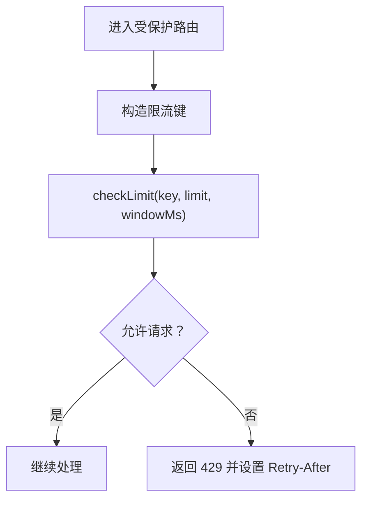

图表来源
- [rateLimit.ts](file://backend/src/middleware/rateLimit.ts#L1-L133)
- [RateLimitService.ts](file://backend/src/services/RateLimitService.ts#L1-L48)

章节来源
- [rateLimit.ts](file://backend/src/middleware/rateLimit.ts#L1-L133)
- [RateLimitService.ts](file://backend/src/services/RateLimitService.ts#L1-L48)

### 组件九：审计日志与登录通知
- 审计日志：登录、登出、重置密码、激活账号、TOTP 重置等事件记录
- 登录通知：登录成功后异步发送邮件通知（可配置开关）

章节来源
- [audit.ts](file://backend/src/utils/audit.ts#L43-L89)
- [auth.ts](file://backend/src/routes/v2/auth.ts#L81-L128)
- [audit.ts](file://backend/src/routes/v2/audit.ts#L1-L90)

## 依赖关系分析
- 路由层依赖服务层与工具层；服务层依赖数据库与 KV、邮件与审计服务
- 限流中间件独立于业务逻辑，通过注入的 RateLimitService 实现
- 审计工具与路由层解耦，通过服务层统一调用

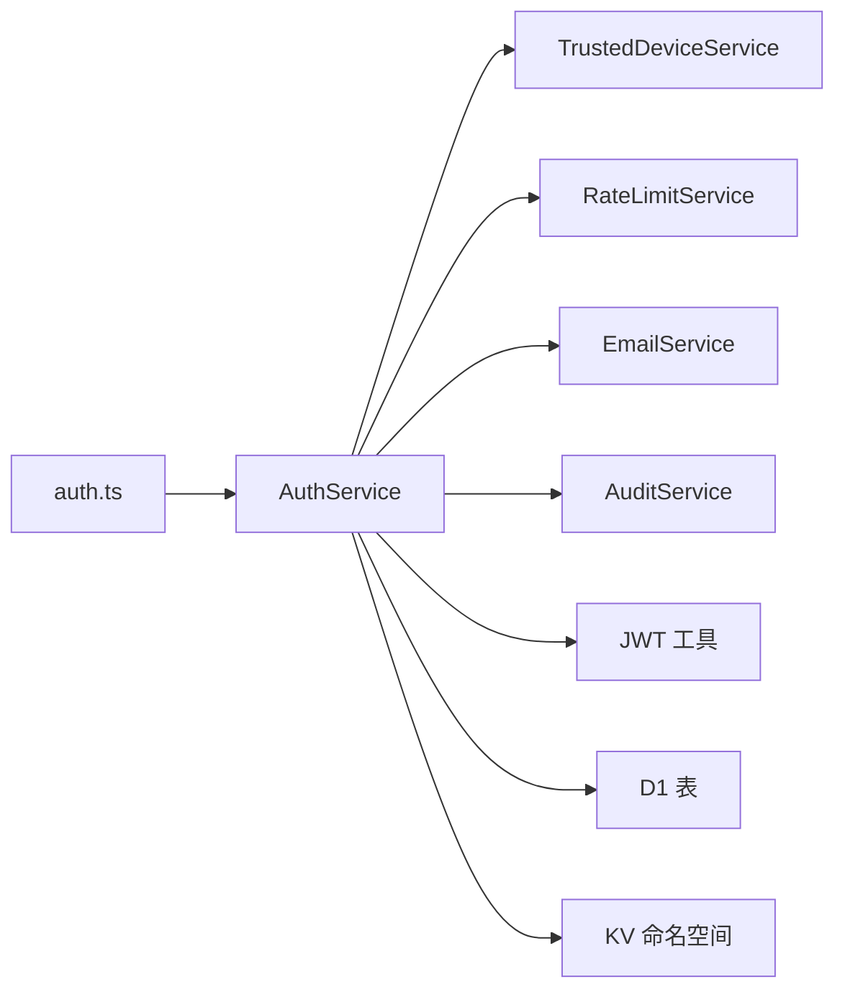

图表来源
- [auth.ts](file://backend/src/routes/v2/auth.ts#L1-L177)
- [AuthService.ts](file://backend/src/services/AuthService.ts#L1-L198)
- [TrustedDeviceService.ts](file://backend/src/services/TrustedDeviceService.ts#L1-L167)
- [RateLimitService.ts](file://backend/src/services/RateLimitService.ts#L1-L48)
- [EmailService.ts](file://backend/src/services/EmailService.ts#L332-L379)
- [audit.ts](file://backend/src/utils/audit.ts#L43-L89)

章节来源
- [auth.ts](file://backend/src/routes/v2/auth.ts#L1-L177)
- [AuthService.ts](file://backend/src/services/AuthService.ts#L1-L198)

## 性能考量
- 会话读取路径：优先 KV，降级 D1，减少数据库压力
- 令牌签发：HMAC-SHA256 在 Edge Runtime 上性能稳定
- 限流：KV 计数避免数据库热点，滑动窗口精确控制速率
- 异步通知：使用 waitUntil 提升用户体验，不影响主流程响应

[本节为通用指导，无需列出具体文件来源]

## 故障排查指南
- 登录失败
  - 检查用户是否存在、密码哈希是否正确、账户是否停用
  - 若启用 2FA 且未绑定，系统会拒绝登录
  - 非信任设备需提供正确的 TOTP
- 会话异常
  - 确认 KV 与 D1 的 session 条目是否同步删除
  - 检查 KV TTL 与 D1 过期时间是否一致
- 令牌失效
  - 密码重置与激活令牌均有过期时间，超时需重新发起
  - TOTP 重置令牌 TTL 为 30 分钟
- 邮件问题
  - 确认 EMAIL_SERVICE 配置与 TOKEN
  - 检查邮件模板与前端 URL 参数
- 审计与日志
  - 通过审计接口查看登录、重置、激活等事件详情

章节来源
- [AuthService.ts](file://backend/src/services/AuthService.ts#L34-L148)
- [AuthService.ts](file://backend/src/services/AuthService.ts#L150-L198)
- [auth.ts](file://backend/src/routes/v2/auth.ts#L81-L128)
- [audit.ts](file://backend/src/routes/v2/audit.ts#L1-L90)

## 结论
该认证体系通过 JWT 与 TOTP 双因子增强安全性，结合信任设备机制与单点登录控制，既保障了用户体验又提升了安全强度。会话采用 D1+KV 双重存储，兼顾可靠性与性能；限流与审计进一步强化了抗攻击能力。建议在生产环境中持续监控令牌生命周期、设备信任策略与邮件通知配置，确保整体安全策略的有效性。

[本节为总结性内容，无需列出具体文件来源]

## 附录
- 关键流程测试参考
  - 密码重置流程测试：[password_reset.test.ts](file://backend/test/services/password_reset.test.ts#L113-L182)
  - 账号激活流程测试：[activation.test.ts](file://backend/test/services/activation.test.ts#L68-L172)

章节来源
- [password_reset.test.ts](file://backend/test/services/password_reset.test.ts#L113-L182)
- [activation.test.ts](file://backend/test/services/activation.test.ts#L68-L172)