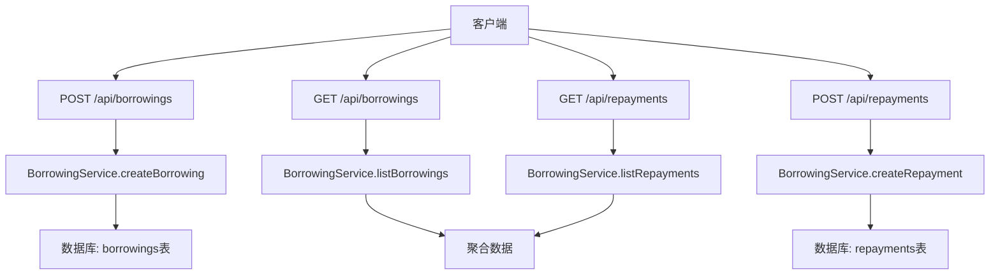
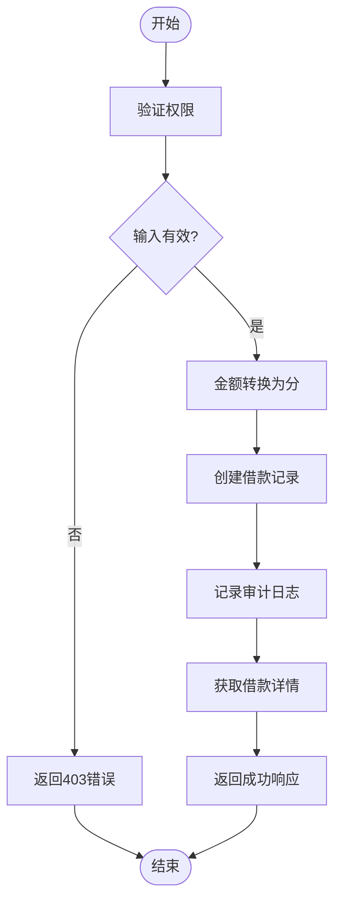
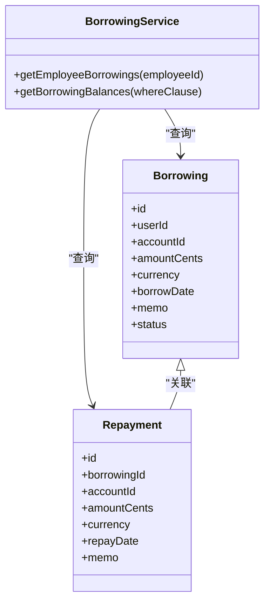
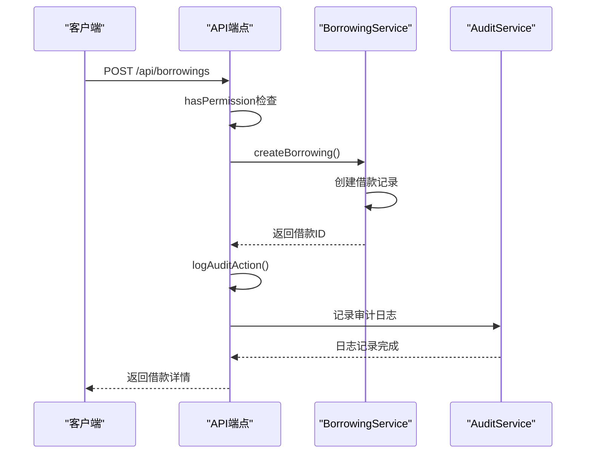

# 借款管理

<cite>
**本文档引用的文件**   
- [borrowings.ts](file://backend/src/routes/v2/borrowings.ts)
- [BorrowingService.ts](file://backend/src/services/BorrowingService.ts)
- [common.schema.ts](file://backend/src/schemas/common.schema.ts)
- [business.schema.ts](file://backend/src/schemas/business.schema.ts)
- [reports.ts](file://backend/src/routes/v2/reports.ts)
- [audit.ts](file://backend/src/utils/audit.ts)
- [permissions.ts](file://backend/src/utils/permissions.ts)
- [schema.ts](file://backend/src/db/schema.ts)
</cite>

## 目录
1. [简介](#简介)
2. [核心API端点](#核心api端点)
3. [借款创建流程](#借款创建流程)
4. [还款管理](#还款管理)
5. [数据查询与聚合](#数据查询与聚合)
6. [报表集成](#报表集成)
7. [权限与审计](#权限与审计)
8. [完整API交互示例](#完整api交互示例)
9. [结论](#结论)

## 简介
本API文档详细描述了财务系统中的借款管理功能，重点涵盖员工个人借款及其还款流程。系统通过RESTful API提供完整的借款生命周期管理，包括借款创建、还款记录、余额计算和财务报表集成。核心功能由`/api/borrowings`和`/api/repayments`端点支持，所有操作均受严格的权限控制和审计日志记录。

**Section sources**
- [borrowings.ts](file://backend/src/routes/v2/borrowings.ts#L1-L379)

## 核心API端点
借款管理功能通过一组RESTful API端点实现，主要分为借款和还款两大类。

### 借款端点
- `POST /api/borrowings`: 创建新的借款记录
- `GET /api/borrowings`: 查询借款列表

### 还款端点
- `POST /api/repayments`: 创建还款记录
- `GET /api/repayments`: 查询还款列表



**Diagram sources **
- [borrowings.ts](file://backend/src/routes/v2/borrowings.ts#L147-L337)
- [BorrowingService.ts](file://backend/src/services/BorrowingService.ts#L19-L137)

**Section sources**
- [borrowings.ts](file://backend/src/routes/v2/borrowings.ts#L1-L379)

## 借款创建流程
`POST /api/borrowings`端点用于创建员工个人借款，其核心逻辑在`BorrowingService.createBorrowing`方法中实现。

### 核心字段
创建借款时需要提供以下核心字段：
- **userId**: 借款人ID
- **accountId**: 借款账户ID
- **amount**: 借款金额（以元为单位）
- **currency**: 币种代码（如CNY）
- **borrowDate**: 借款日期（YYYY-MM-DD格式）
- **memo**: 备注信息（可选）

### 创建逻辑
1. 验证用户权限
2. 将金额从元转换为分（乘以100并四舍五入）
3. 在数据库中创建借款记录
4. 记录审计日志
5. 返回包含完整信息的借款对象



**Diagram sources **
- [borrowings.ts](file://backend/src/routes/v2/borrowings.ts#L176-L208)
- [BorrowingService.ts](file://backend/src/services/BorrowingService.ts#L109-L137)

**Section sources**
- [borrowings.ts](file://backend/src/routes/v2/borrowings.ts#L147-L208)
- [BorrowingService.ts](file://backend/src/services/BorrowingService.ts#L109-L137)
- [business.schema.ts](file://backend/src/schemas/business.schema.ts#L246-L253)

## 还款管理
还款功能通过`/api/repayments`端点管理，支持对借款进行分次还款。

### 还款创建
`POST /api/repayments`端点用于创建还款记录，其核心字段包括：
- **borrowingId**: 关联的借款ID
- **accountId**: 还款账户ID
- **amount**: 还款金额（以元为单位）
- **currency**: 币种代码
- **repayDate**: 还款日期
- **memo**: 备注信息

### 还款逻辑
1. 验证用户是否具有`finance.borrowing.create`权限
2. 将还款金额转换为分
3. 在`repayments`表中创建还款记录
4. 记录审计日志
5. 返回创建的还款详情

**Section sources**
- [borrowings.ts](file://backend/src/routes/v2/borrowings.ts#L275-L337)
- [BorrowingService.ts](file://backend/src/services/BorrowingService.ts#L230-L257)
- [business.schema.ts](file://backend/src/schemas/business.schema.ts#L416-L423)

## 数据查询与聚合
系统提供了多种查询和聚合功能，以支持借款数据的分析和展示。

### 还款查询
`repaymentQuerySchema`定义了按借款ID查询还款计划的能力。通过在`GET /api/repayments`端点传递`borrowingId`查询参数，可以获取特定借款的所有还款记录。

### 余额计算
`getBorrowingById`服务调用返回包含余额计算的聚合数据。`BorrowingService.getEmployeeBorrowings`方法执行以下聚合计算：
- **总借款金额**: 该员工所有借款的总和
- **总还款金额**: 该员工所有还款的总和
- **余额**: 总借款金额减去总还款金额



**Diagram sources **
- [BorrowingService.ts](file://backend/src/services/BorrowingService.ts#L296-L347)
- [schema.ts](file://backend/src/db/schema.ts#L368-L383)
- [schema.ts](file://backend/src/db/schema.ts#L426-L437)

**Section sources**
- [BorrowingService.ts](file://backend/src/services/BorrowingService.ts#L296-L347)
- [common.schema.ts](file://backend/src/schemas/common.schema.ts#L159-L161)

## 报表集成
借款数据被纳入财务统计报表，通过`/api/report-borrowing`路由提供。

### 借款汇总报表
`/api/report-borrowing/summary`端点提供借款汇总信息，包括：
- 借款人数量
- 总借款金额
- 总还款金额
- 剩余余额

### 仪表盘统计
借款数据也集成到系统仪表盘中，`/api/dashboard/stats`端点返回包含借款统计的综合数据，如`borrowings`对象中的`totalBorrowedCents`、`totalRepaidCents`和`balanceCents`字段。

**Section sources**
- [reports.ts](file://backend/src/routes/v2/reports.ts#L517-L556)
- [reports.ts](file://backend/src/routes/v2/reports.ts#L48-L113)

## 权限与审计
系统实施了严格的权限控制和审计日志记录机制。

### 权限控制
只有具有`finance.borrowing.create`权限的用户才能创建借款和还款。权限检查通过`hasPermission`函数实现，该函数基于用户的职位和权限配置进行验证。

### 审计日志
每次借款操作都会调用`logAuditAction`函数记录审计日志。该函数在以下位置被调用：
- `POST /api/borrowings`成功后
- `POST /api/repayments`成功后

审计日志包含操作类型、实体类型、实体ID和操作详情。



**Diagram sources **
- [borrowings.ts](file://backend/src/routes/v2/borrowings.ts#L179-L180)
- [borrowings.ts](file://backend/src/routes/v2/borrowings.ts#L194-L204)
- [audit.ts](file://backend/src/utils/audit.ts#L33-L89)
- [permissions.ts](file://backend/src/utils/permissions.ts#L99-L125)

**Section sources**
- [borrowings.ts](file://backend/src/routes/v2/borrowings.ts#L179-L204)
- [audit.ts](file://backend/src/utils/audit.ts#L33-L89)
- [permissions.ts](file://backend/src/utils/permissions.ts#L99-L125)

## 完整API交互示例
以下是一个员工申请5000元备用金并分次还款的完整API交互示例。

### 1. 创建借款
```http
POST /api/borrowings
Content-Type: application/json

{
  "userId": "user-123",
  "accountId": "acc-456",
  "amount": 5000,
  "currency": "CNY",
  "borrowDate": "2023-01-01",
  "memo": "备用金"
}
```

响应：
```json
{
  "success": true,
  "data": {
    "id": "borrow-789",
    "userId": "user-123",
    "accountId": "acc-456",
    "amountCents": 500000,
    "currency": "CNY",
    "borrowDate": "2023-01-01",
    "memo": "备用金",
    "status": "outstanding"
  }
}
```

### 2. 第一次还款（2000元）
```http
POST /api/repayments
Content-Type: application/json

{
  "borrowingId": "borrow-789",
  "accountId": "acc-456",
  "amount": 2000,
  "currency": "CNY",
  "repayDate": "2023-01-15",
  "memo": "第一次还款"
}
```

### 3. 第二次还款（3000元）
```http
POST /api/repayments
Content-Type: application/json

{
  "borrowingId": "borrow-789",
  "accountId": "acc-456",
  "amount": 3000,
  "currency": "CNY",
  "repayDate": "2023-01-30",
  "memo": "第二次还款"
}
```

### 4. 查询借款余额
```http
GET /api/borrowings/balance
```

响应：
```json
{
  "success": true,
  "data": {
    "results": [
      {
        "userId": "user-123",
        "borrower_name": "张三",
        "borrower_email": "zhangsan@example.com",
        "currency": "CNY",
        "total_borrowed_cents": 500000,
        "total_repaid_cents": 500000,
        "balance_cents": 0
      }
    ]
  }
}
```

**Section sources**
- [borrowings.ts](file://backend/src/routes/v2/borrowings.ts#L176-L208)
- [borrowings.ts](file://backend/src/routes/v2/borrowings.ts#L304-L337)
- [borrowings.ts](file://backend/src/routes/v2/borrowings.ts#L338-L378)

## 结论
借款管理功能提供了一套完整的API，支持员工个人借款及其还款的全生命周期管理。系统通过严格的权限控制确保只有授权人员可以操作，同时通过审计日志记录所有关键操作。借款数据被有效集成到财务报表中，为财务统计和分析提供了支持。该功能设计合理，易于使用，并具有良好的扩展性。