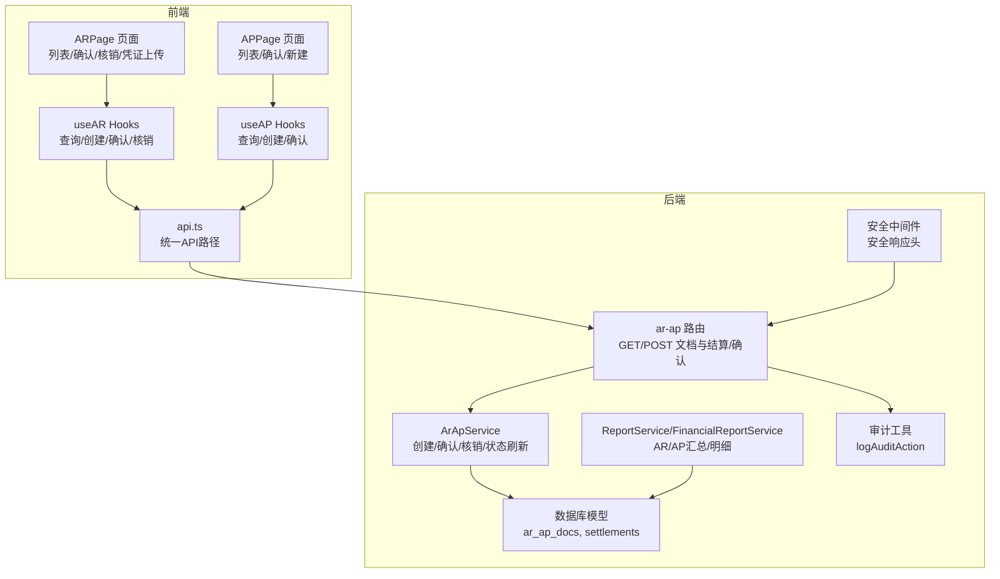
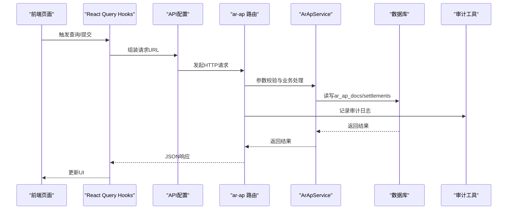
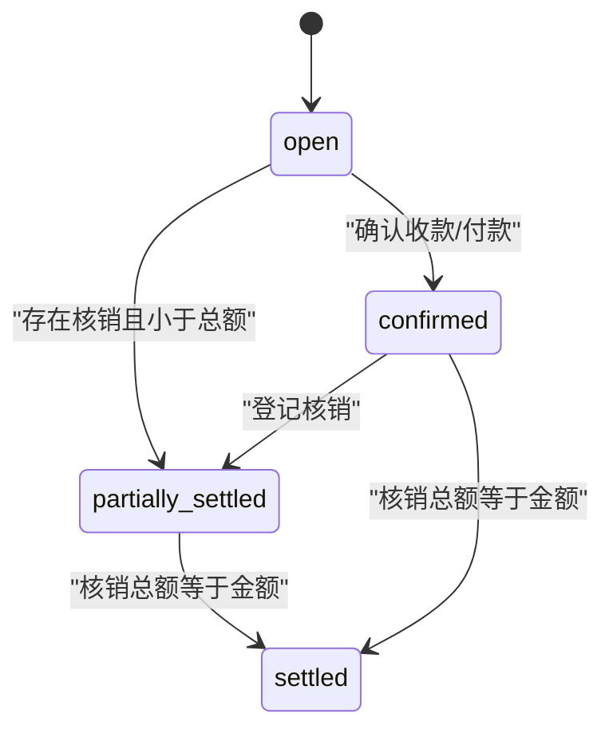
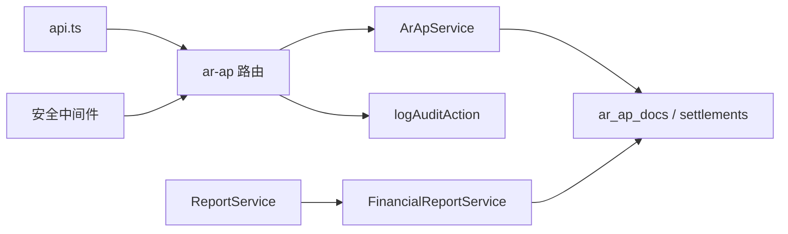

# 应收应付管理

<cite>
**本文引用的文件**
- [backend/src/routes/v2/ar-ap.ts](file://backend/src/routes/v2/ar-ap.ts)
- [backend/src/services/ArApService.ts](file://backend/src/services/ArApService.ts)
- [backend/src/services/ReportService.ts](file://backend/src/services/ReportService.ts)
- [backend/src/services/FinancialReportService.ts](file://backend/src/services/FinancialReportService.ts)
- [backend/src/schemas/business.schema.ts](file://backend/src/schemas/business.schema.ts)
- [backend/src/db/schema.ts](file://backend/src/db/schema.ts)
- [backend/src/utils/audit.ts](file://backend/src/utils/audit.ts)
- [backend/src/middleware/security.ts](file://backend/src/middleware/security.ts)
- [frontend/src/features/finance/pages/ARPage.tsx](file://frontend/src/features/finance/pages/ARPage.tsx)
- [frontend/src/features/finance/pages/APPage.tsx](file://frontend/src/features/finance/pages/APPage.tsx)
- [frontend/src/hooks/business/useAR.ts](file://frontend/src/hooks/business/useAR.ts)
- [frontend/src/hooks/business/useAP.ts](file://frontend/src/hooks/business/useAP.ts)
- [frontend/src/config/api.ts](file://frontend/src/config/api.ts)
- [frontend/src/types/business.ts](file://frontend/src/types/business.ts)
</cite>

## 目录
1. [简介](#简介)
2. [项目结构](#项目结构)
3. [核心组件](#核心组件)
4. [架构总览](#架构总览)
5. [详细组件分析](#详细组件分析)
6. [依赖关系分析](#依赖关系分析)
7. [性能考量](#性能考量)
8. [故障排查指南](#故障排查指南)
9. [结论](#结论)
10. [附录](#附录)

## 简介
本文件面向应收应付（AR/AP）模块的API与前端页面，提供全生命周期管理说明，覆盖客户应收款（AR）与供应商应付款（AP）的创建、查询、核销、确认、报表生成与审计追踪。重点包括：
- GET /api/v2/ar/docs 与 /api/v2/ap/docs 如何按状态、日期范围等条件筛选并分页返回待收/待付列表
- POST /api/v2/ar/docs 创建AR/AP单据的必填字段与校验规则
- AR/AP状态机通过“确认收款/付款”与“核销”路由实现状态流转
- 前端页面（ARPage、APPage）如何调用API驱动UI展示账龄分析与催收提醒
- 与ReportService的集成，支持生成AR/AP汇总与明细报表
- 审计中间件如何记录每笔账款变动，确保财务可追溯性

## 项目结构
AR/AP模块横跨后端路由、服务层、数据库模型、前端页面与Hooks，以及报表与审计工具。

图表来源
- [backend/src/routes/v2/ar-ap.ts](file://backend/src/routes/v2/ar-ap.ts#L1-L626)
- [backend/src/services/ArApService.ts](file://backend/src/services/ArApService.ts#L1-L264)
- [backend/src/services/ReportService.ts](file://backend/src/services/ReportService.ts#L1-L85)
- [backend/src/services/FinancialReportService.ts](file://backend/src/services/FinancialReportService.ts#L1-L200)
- [backend/src/db/schema.ts](file://backend/src/db/schema.ts#L352-L447)
- [backend/src/utils/audit.ts](file://backend/src/utils/audit.ts#L1-L90)
- [backend/src/middleware/security.ts](file://backend/src/middleware/security.ts#L1-L81)
- [frontend/src/features/finance/pages/ARPage.tsx](file://frontend/src/features/finance/pages/ARPage.tsx#L1-L407)
- [frontend/src/features/finance/pages/APPage.tsx](file://frontend/src/features/finance/pages/APPage.tsx#L1-L320)
- [frontend/src/hooks/business/useAR.ts](file://frontend/src/hooks/business/useAR.ts#L1-L86)
- [frontend/src/hooks/business/useAP.ts](file://frontend/src/hooks/business/useAP.ts#L1-L48)
- [frontend/src/config/api.ts](file://frontend/src/config/api.ts#L58-L63)

章节来源
- [backend/src/routes/v2/ar-ap.ts](file://backend/src/routes/v2/ar-ap.ts#L1-L626)
- [frontend/src/features/finance/pages/ARPage.tsx](file://frontend/src/features/finance/pages/ARPage.tsx#L1-L407)
- [frontend/src/features/finance/pages/APPage.tsx](file://frontend/src/features/finance/pages/APPage.tsx#L1-L320)

## 核心组件
- 后端路由与API
  - GET /api/v2/ar/docs：按kind=AR/AP、status、分页查询AR/AP单据
  - GET /api/v2/ap/docs：仅AP单据，按status、分页查询
  - POST /api/v2/ar/docs：创建AR/AP单据（kind、partyId/siteId/departmentId、issueDate、dueDate、amountCents、memo等）
  - POST /api/v2/ar/settlements：登记核销（docId、flowId、settleAmountCents、settleDate）
  - GET /api/v2/ar/settlements：查询某单据的结算记录
  - GET /api/v2/ar/statement：查询单据及结算明细
  - POST /api/v2/ar/confirm：确认AR/AP单据并生成现金流，同时自动核销全部金额
- 服务层
  - ArApService：创建、确认、核销、状态刷新、查询单据与结算
  - ReportService/FinancialReportService：AR/AP汇总与明细报表
- 数据库模型
  - ar_ap_docs：AR/AP单据表
  - settlements：核销记录表
- 前端页面与Hooks
  - ARPage/APPage：列表、搜索、确认、核销、凭证上传
  - useAR/useAP：封装API调用与React Query缓存
- 审计与安全
  - logAuditAction：记录用户操作
  - 安全中间件：设置安全响应头

章节来源
- [backend/src/routes/v2/ar-ap.ts](file://backend/src/routes/v2/ar-ap.ts#L56-L626)
- [backend/src/services/ArApService.ts](file://backend/src/services/ArApService.ts#L1-L264)
- [backend/src/services/ReportService.ts](file://backend/src/services/ReportService.ts#L1-L85)
- [backend/src/services/FinancialReportService.ts](file://backend/src/services/FinancialReportService.ts#L1-L200)
- [backend/src/db/schema.ts](file://backend/src/db/schema.ts#L352-L447)
- [frontend/src/features/finance/pages/ARPage.tsx](file://frontend/src/features/finance/pages/ARPage.tsx#L1-L407)
- [frontend/src/features/finance/pages/APPage.tsx](file://frontend/src/features/finance/pages/APPage.tsx#L1-L320)
- [frontend/src/hooks/business/useAR.ts](file://frontend/src/hooks/business/useAR.ts#L1-L86)
- [frontend/src/hooks/business/useAP.ts](file://frontend/src/hooks/business/useAP.ts#L1-L48)
- [backend/src/utils/audit.ts](file://backend/src/utils/audit.ts#L1-L90)
- [backend/src/middleware/security.ts](file://backend/src/middleware/security.ts#L1-L81)

## 架构总览
AR/AP模块采用“路由-服务-数据模型”的清晰分层，前端通过Hooks与API配置对接后端，报表服务与审计工具贯穿业务流程。

图表来源
- [frontend/src/hooks/business/useAR.ts](file://frontend/src/hooks/business/useAR.ts#L1-L86)
- [frontend/src/hooks/business/useAP.ts](file://frontend/src/hooks/business/useAP.ts#L1-L48)
- [frontend/src/config/api.ts](file://frontend/src/config/api.ts#L58-L63)
- [backend/src/routes/v2/ar-ap.ts](file://backend/src/routes/v2/ar-ap.ts#L1-L626)
- [backend/src/services/ArApService.ts](file://backend/src/services/ArApService.ts#L1-L264)
- [backend/src/utils/audit.ts](file://backend/src/utils/audit.ts#L1-L90)

## 详细组件分析

### API端点与参数说明
- GET /api/v2/ar/docs
  - 查询参数
    - kind: AR 或 AP（可选）
    - status: 单据状态（可选）
    - page/pageSize: 分页
  - 返回
    - items: 包含单据基础信息与已结、站点名等扩展字段
    - pagination: 分页统计
- GET /api/v2/ap/docs
  - 查询参数
    - status: 单据状态（可选）
    - page/pageSize: 分页
  - 返回
    - items: AP单据列表（kind固定为AP）
    - pagination: 分页统计
- POST /api/v2/ar/docs
  - 请求体
    - kind: AR 或 AP（必填）
    - partyId/siteId/departmentId: 关联方（可选）
    - issueDate/dueDate: 开立/到期日期（可选，默认当天）
    - amountCents: 金额（必填，>0）
    - memo/docNo: 备注/单号（可选）
  - 返回
    - id: 新建单据ID
    - docNo: 单据编号
- POST /api/v2/ar/settlements
  - 请求体
    - docId: 单据ID（必填）
    - flowId: 对应现金流ID（必填）
    - settleAmountCents: 核销金额（必填，>0）
    - settleDate: 核销日期（可选，默认当天）
  - 返回
    - id: 核销记录ID
- GET /api/v2/ar/settlements
  - 查询参数
    - docId: 单据ID（必填）
  - 返回
    - results: 结算记录数组
- GET /api/v2/ar/statement
  - 查询参数
    - docId: 单据ID（必填）
  - 返回
    - doc: 单据详情
    - settlements: 结算记录
    - settledCents/remainingCents: 已结/未结金额
- POST /api/v2/ar/confirm
  - 请求体
    - docId: 单据ID（必填）
    - accountId: 账户ID（必填）
    - categoryId: 类别ID（必填）
    - bizDate: 业务日期（必填）
    - voucherUrl: 凭证URL（必填）
    - method/memo/createdBy: 可选
  - 返回
    - ok: 成功标志
    - flowId: 生成的现金流ID
    - voucherNo: 凭证号

章节来源
- [backend/src/routes/v2/ar-ap.ts](file://backend/src/routes/v2/ar-ap.ts#L56-L626)
- [backend/src/schemas/business.schema.ts](file://backend/src/schemas/business.schema.ts#L186-L224)

### 创建AR/AP单据的校验规则
- 必填字段
  - kind: AR 或 AP
  - amountCents: 整数且大于0
- 可选字段
  - partyId/siteId/departmentId、issueDate/dueDate、memo、docNo
- 服务端行为
  - 自动生成docNo（若未提供）
  - 初始化status为open
  - 插入ar_ap_docs记录

章节来源
- [backend/src/schemas/business.schema.ts](file://backend/src/schemas/business.schema.ts#L186-L224)
- [backend/src/services/ArApService.ts](file://backend/src/services/ArApService.ts#L84-L118)

### 状态机与状态流转
- 单据状态
  - open：未结
  - partially_settled：部分结算
  - settled：已结清
- 状态刷新逻辑
  - 通过核销累计金额与单据总金额比较，动态计算并更新状态
- 确认流程
  - 生成现金流（收入/支出），并将单据状态置为confirmed
  - 自动按单据金额创建一条核销记录

图表来源
- [backend/src/services/ArApService.ts](file://backend/src/services/ArApService.ts#L120-L167)
- [backend/src/services/ArApService.ts](file://backend/src/services/ArApService.ts#L178-L243)

章节来源
- [backend/src/services/ArApService.ts](file://backend/src/services/ArApService.ts#L120-L167)
- [backend/src/services/ArApService.ts](file://backend/src/services/ArApService.ts#L178-L243)

### 前端页面与UI驱动
- ARPage
  - 列表：GET /api/v2/ar/docs?kind=AR&page=&pageSize=
  - 搜索：按站点名/状态过滤
  - 确认：POST /api/v2/ar/confirm（需上传凭证）
  - 核销：POST /api/v2/ar/settlements
  - 明细：GET /api/v2/ar/statement
  - 凭证上传：通过api.upload.voucher上传后回显URL
- APPage
  - 列表：GET /api/v2/ar/docs?kind=AP&page=&pageSize=
  - 搜索：按供应商/状态过滤
  - 确认：POST /api/v2/ar/confirm（需上传凭证）
  - 新建：POST /api/v2/ar.docs（kind=AP）

章节来源
- [frontend/src/features/finance/pages/ARPage.tsx](file://frontend/src/features/finance/pages/ARPage.tsx#L1-L407)
- [frontend/src/features/finance/pages/APPage.tsx](file://frontend/src/features/finance/pages/APPage.tsx#L1-L320)
- [frontend/src/hooks/business/useAR.ts](file://frontend/src/hooks/business/useAR.ts#L1-L86)
- [frontend/src/hooks/business/useAP.ts](file://frontend/src/hooks/business/useAP.ts#L1-L48)
- [frontend/src/config/api.ts](file://frontend/src/config/api.ts#L58-L63)

### 报表集成（AR/AP汇总与明细）
- ReportService门面
  - getArApSummary(kind, start, end, departmentId?)
  - getArApDetail(kind, start, end, departmentId?)
- FinancialReportService实现
  - 按时间区间与部门维度聚合AR/AP单据
  - 计算总金额、已结金额、按状态分布
- 前端报表页面
  - ReportARSummaryPage/ReportARDetailPage
  - ReportAPSummaryPage/ReportAPDetailPage

章节来源
- [backend/src/services/ReportService.ts](file://backend/src/services/ReportService.ts#L1-L85)
- [backend/src/services/FinancialReportService.ts](file://backend/src/services/FinancialReportService.ts#L1-L200)
- [frontend/src/config/api.ts](file://frontend/src/config/api.ts#L64-L79)

### 审计与可追溯性
- 审计记录
  - 在关键操作（创建、核销、确认）后调用logAuditAction记录
  - 记录字段：actorId、action、entity、entityId、detail、ip、ipLocation
- 安全中间件
  - 设置X-Content-Type-Options、X-Frame-Options、X-XSS-Protection、Strict-Transport-Security、Content-Security-Policy、Referrer-Policy、Permissions-Policy、X-Permitted-Cross-Domain-Policies等安全头

章节来源
- [backend/src/utils/audit.ts](file://backend/src/utils/audit.ts#L1-L90)
- [backend/src/middleware/security.ts](file://backend/src/middleware/security.ts#L1-L81)
- [backend/src/routes/v2/ar-ap.ts](file://backend/src/routes/v2/ar-ap.ts#L194-L220)
- [backend/src/routes/v2/ar-ap.ts](file://backend/src/routes/v2/ar-ap.ts#L292-L316)
- [backend/src/routes/v2/ar-ap.ts](file://backend/src/routes/v2/ar-ap.ts#L405-L437)

## 依赖关系分析
- 路由依赖服务层，服务层依赖数据库模型
- 前端Hooks依赖API配置，API配置指向后端路由
- 报表服务依赖数据库与KV缓存
- 审计工具与安全中间件贯穿业务流程

图表来源
- [frontend/src/config/api.ts](file://frontend/src/config/api.ts#L58-L63)
- [backend/src/routes/v2/ar-ap.ts](file://backend/src/routes/v2/ar-ap.ts#L1-L626)
- [backend/src/services/ArApService.ts](file://backend/src/services/ArApService.ts#L1-L264)
- [backend/src/services/ReportService.ts](file://backend/src/services/ReportService.ts#L1-L85)
- [backend/src/services/FinancialReportService.ts](file://backend/src/services/FinancialReportService.ts#L1-L200)
- [backend/src/db/schema.ts](file://backend/src/db/schema.ts#L352-L447)
- [backend/src/utils/audit.ts](file://backend/src/utils/audit.ts#L1-L90)
- [backend/src/middleware/security.ts](file://backend/src/middleware/security.ts#L1-L81)

章节来源
- [backend/src/routes/v2/ar-ap.ts](file://backend/src/routes/v2/ar-ap.ts#L1-L626)
- [backend/src/services/ArApService.ts](file://backend/src/services/ArApService.ts#L1-L264)
- [backend/src/services/ReportService.ts](file://backend/src/services/ReportService.ts#L1-L85)
- [backend/src/services/FinancialReportService.ts](file://backend/src/services/FinancialReportService.ts#L1-L200)
- [backend/src/db/schema.ts](file://backend/src/db/schema.ts#L352-L447)
- [frontend/src/config/api.ts](file://frontend/src/config/api.ts#L58-L63)

## 性能考量
- 分页查询
  - 路由层使用分页参数，服务层先查总数再查分页数据，避免一次性加载大量数据
- 并行查询
  - 获取单据与结算明细时使用Promise.all并行查询，减少往返延迟
- 状态刷新
  - 通过核销累计金额与单据金额比较，避免复杂计算导致的性能问题
- 缓存与KV
  - 报表服务对账户余额等结果使用KV缓存，降低重复查询成本

章节来源
- [backend/src/routes/v2/ar-ap.ts](file://backend/src/routes/v2/ar-ap.ts#L341-L370)
- [backend/src/services/ArApService.ts](file://backend/src/services/ArApService.ts#L27-L82)
- [backend/src/services/FinancialReportService.ts](file://backend/src/services/FinancialReportService.ts#L165-L200)

## 故障排查指南
- 权限不足
  - 创建/确认接口需具备finance.ar.create权限，否则返回禁止访问
- 业务状态异常
  - 确认接口要求单据未确认且账户有效，否则抛出业务错误
- 数据缺失
  - 查询单据不存在时返回未找到
- 校验失败
  - 金额、凭证URL、必填字段缺失将触发参数校验错误
- 审计日志未记录
  - 若缺少userId或AuditService不可用，审计记录会被忽略但不影响主流程

章节来源
- [backend/src/routes/v2/ar-ap.ts](file://backend/src/routes/v2/ar-ap.ts#L92-L160)
- [backend/src/routes/v2/ar-ap.ts](file://backend/src/routes/v2/ar-ap.ts#L194-L220)
- [backend/src/routes/v2/ar-ap.ts](file://backend/src/routes/v2/ar-ap.ts#L292-L316)
- [backend/src/routes/v2/ar-ap.ts](file://backend/src/routes/v2/ar-ap.ts#L405-L437)
- [backend/src/services/ArApService.ts](file://backend/src/services/ArApService.ts#L178-L243)
- [backend/src/utils/audit.ts](file://backend/src/utils/audit.ts#L33-L90)

## 结论
AR/AP模块通过清晰的路由与服务层设计、严格的参数校验、完善的审计与安全中间件，实现了从创建、确认、核销到报表与可追溯性的完整闭环。前端页面通过Hooks与API配置无缝对接后端能力，支持账龄分析与催收提醒等业务场景。

## 附录
- 数据模型概览（AR/AP相关）
  - ar_ap_docs：单据主表，包含kind、partyId、siteId、departmentId、issueDate、dueDate、amountCents、docNo、memo、status、createdAt/updatedAt
  - settlements：核销记录，包含docId、flowId、settleAmountCents、settleDate、createdAt

章节来源
- [backend/src/db/schema.ts](file://backend/src/db/schema.ts#L352-L447)