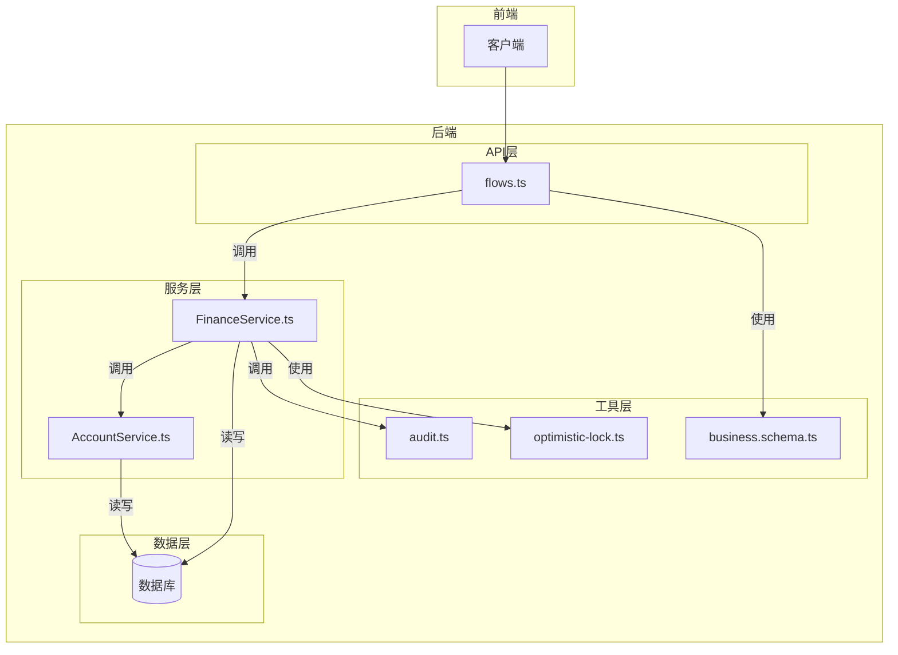
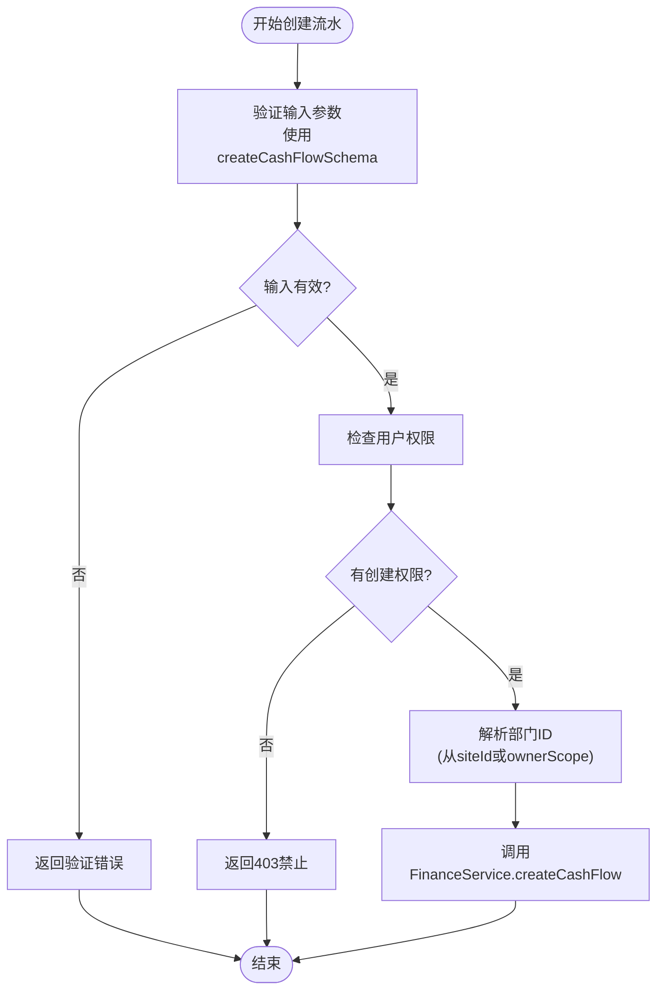
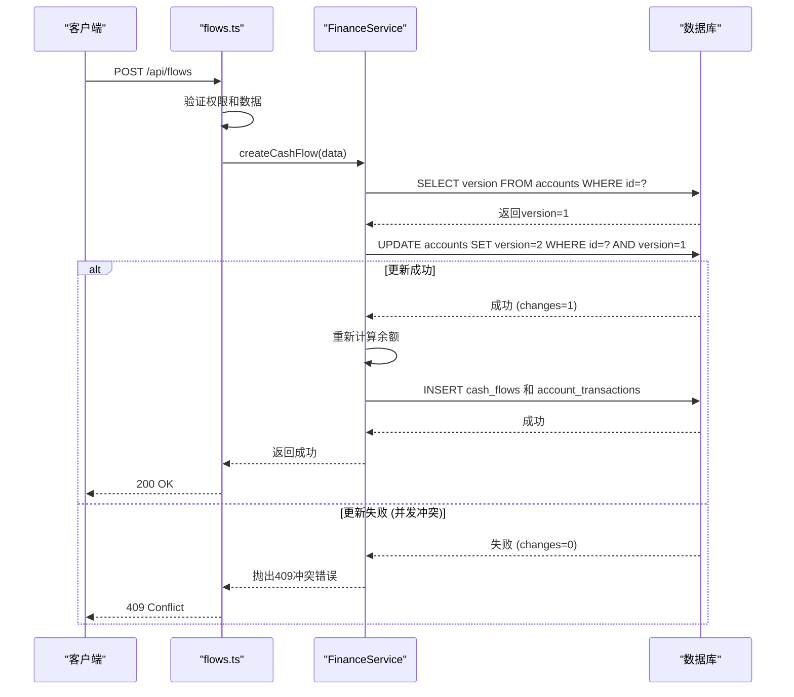
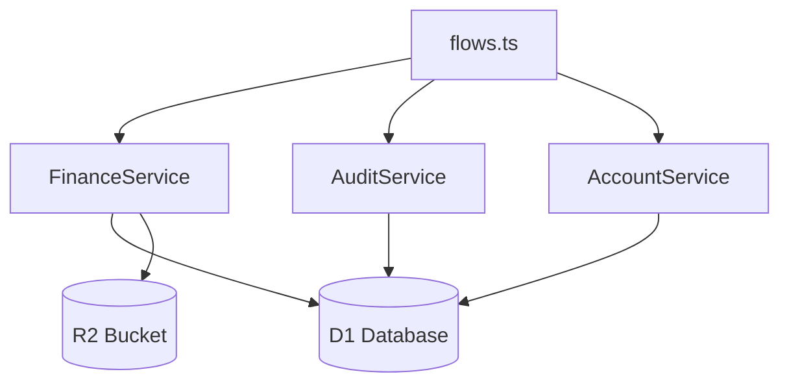

# 财务流水

<cite>
**本文档引用的文件**   
- [flows.ts](file://backend/src/routes/v2/flows.ts)
- [FinanceService.ts](file://backend/src/services/FinanceService.ts)
- [AccountService.ts](file://backend/src/services/AccountService.ts)
- [business.schema.ts](file://backend/src/schemas/business.schema.ts)
- [schema.ts](file://backend/src/db/schema.ts)
- [audit.ts](file://backend/src/utils/audit.ts)
- [optimistic-lock.ts](file://backend/src/utils/optimistic-lock.ts)
</cite>

## 目录
1. [介绍](#介绍)
2. [核心组件](#核心组件)
3. [架构概述](#架构概述)
4. [详细组件分析](#详细组件分析)
5. [依赖分析](#依赖分析)
6. [性能考虑](#性能考虑)
7. [故障排除指南](#故障排除指南)
8. [结论](#结论)

## 介绍
本文档详细阐述了财务流水（flows）API端点的设计与实现，涵盖创建、查询和管理财务流水记录的核心功能。文档深入解析了`POST /api/flows`创建流水的请求体结构，包括业务日期（bizDate）、金额（amountCents）、账户ID（accountId）和类别ID（categoryId）等关键字段，并说明了Zod验证模式如何确保数据完整性。同时，文档描述了`GET /api/flows`端点的分页查询机制，支持按日期范围、账户和类型（收入/支出）进行过滤。此外，还阐述了该路由与`FinanceService`和`AccountService`的交互逻辑，以及乐观锁在并发更新场景下的应用。通过提供创建新财务流水的完整示例和审计日志的记录机制，本文档旨在为开发者和维护者提供全面的技术参考。

## 核心组件

本文档的核心组件包括处理财务流水的API路由`flows.ts`、核心业务逻辑服务`FinanceService.ts`、账户管理服务`AccountService.ts`、用于数据验证的`business.schema.ts`、定义数据库结构的`schema.ts`、负责操作审计的`audit.ts`以及实现并发控制的`optimistic-lock.ts`。这些组件协同工作，构成了一个健壮、安全且可扩展的财务流水管理系统。

**Section sources**
- [flows.ts](file://backend/src/routes/v2/flows.ts#L1-L566)
- [FinanceService.ts](file://backend/src/services/FinanceService.ts#L1-L443)
- [AccountService.ts](file://backend/src/services/AccountService.ts#L1-L168)
- [business.schema.ts](file://backend/src/schemas/business.schema.ts#L1-L1069)
- [schema.ts](file://backend/src/db/schema.ts#L1-L706)

## 架构概述

财务流水API的架构遵循清晰的分层模式，从HTTP路由到业务服务再到数据访问层。当客户端发起请求时，首先由`flows.ts`中的路由处理器接收。该处理器利用Zod进行请求数据的验证，并通过中间件进行权限检查。验证通过后，请求被委托给`FinanceService`，该服务封装了所有与财务流水相关的业务逻辑，如创建流水、计算余额和处理红冲。`FinanceService`在执行操作时，会调用`AccountService`来获取账户信息，并直接与数据库进行交互。整个流程中，`audit.ts`中的`logAuditAction`函数会自动记录每一次关键操作，而`optimistic-lock.ts`中的工具则确保了在高并发场景下对账户余额更新的安全性。



**Diagram sources **
- [flows.ts](file://backend/src/routes/v2/flows.ts#L1-L566)
- [FinanceService.ts](file://backend/src/services/FinanceService.ts#L1-L443)
- [AccountService.ts](file://backend/src/services/AccountService.ts#L1-L168)
- [schema.ts](file://backend/src/db/schema.ts#L1-L706)
- [audit.ts](file://backend/src/utils/audit.ts#L1-L90)
- [optimistic-lock.ts](file://backend/src/utils/optimistic-lock.ts#L1-L41)

## 详细组件分析

### 创建财务流水分析
创建财务流水是系统的核心功能，涉及数据验证、权限控制、业务逻辑处理和审计日志记录等多个环节。

#### 请求体结构与Zod验证
`POST /api/flows`端点的请求体结构由`createCashFlowSchema`严格定义。该Zod模式确保了所有必需字段的存在和格式正确。关键字段包括：
- **accountId**: 账户ID，必须为有效的UUID。
- **categoryId**: 类别ID，必须为有效的UUID。
- **bizDate**: 业务日期，格式为`YYYY-MM-DD`。
- **type**: 流水类型，必须为`income`（收入）或`expense`（支出）。
- **amountCents**: 金额（单位：分），必须为正整数。
- **voucherUrls**: 凭证URL数组，或使用向后兼容的`voucherUrl`字段。通过`.refine()`方法，确保至少提供一个凭证。

此验证模式在`flows.ts`的`createCashFlowRoute`中被应用，确保了进入业务逻辑层的数据是干净和可靠的。



**Diagram sources **
- [flows.ts](file://backend/src/routes/v2/flows.ts#L327-L356)
- [business.schema.ts](file://backend/src/schemas/business.schema.ts#L11-L41)

#### 分页查询机制
`GET /api/flows`端点支持分页查询，其机制由`createPaginatedHandler`和`parsePagination`辅助函数实现。客户端可以通过`page`和`limit`查询参数来控制返回的数据页码和每页数量。服务端的`FinanceService.listCashFlows`方法接收这些分页参数，并结合`getDataAccessFilter`生成的权限过滤条件，构建SQL查询。查询结果包含流水记录列表和分页元数据（总记录数、总页数等），最终通过`apiSuccess`包装后返回。

**Section sources**
- [flows.ts](file://backend/src/routes/v2/flows.ts#L98-L126)
- [route-helpers.ts](file://backend/src/utils/route-helpers.ts#L34-L58)
- [FinanceService.ts](file://backend/src/services/FinanceService.ts#L241-L268)

#### 服务交互逻辑
`flows.ts`路由与`FinanceService`和`AccountService`的交互逻辑清晰。路由层负责HTTP协议的处理，如解析请求、验证数据和返回响应。所有核心业务逻辑，如创建流水、计算余额、检查账户余额是否充足等，都封装在`FinanceService`中。当需要获取账户名称等关联信息时，`FinanceService`会直接在数据库查询中通过`LEFT JOIN`关联`accounts`表，而不是调用`AccountService`。这表明`AccountService`主要用于账户的增删改查，而`FinanceService`则专注于财务流水的复杂业务。

**Section sources**
- [flows.ts](file://backend/src/routes/v2/flows.ts#L401-L415)
- [FinanceService.ts](file://backend/src/services/FinanceService.ts#L70-L229)
- [AccountService.ts](file://backend/src/services/AccountService.ts#L15-L44)

#### 乐观锁应用
在并发更新场景下，系统使用乐观锁来防止账户余额计算错误。`FinanceService.createCashFlow`方法在创建流水前，会先尝试更新`accounts`表中对应账户的`version`字段。更新条件是`id`匹配且`version`等于当前读取的值。如果更新成功（`meta.changes > 0`），说明没有其他并发操作修改过该账户，可以安全地继续后续操作。如果更新失败，则抛出`BUS_CONCURRENT_MODIFICATION`错误，提示用户重试。这种模式通过`accounts`表的`version`字段实现，确保了对账户状态修改的串行化。



**Diagram sources **
- [FinanceService.ts](file://backend/src/services/FinanceService.ts#L146-L155)
- [schema.ts](file://backend/src/db/schema.ts#L148)

#### 创建财务流水示例
以下是一个创建新财务流水的完整示例：

**请求头:**
```
Authorization: Bearer <your_jwt_token>
Content-Type: application/json
```

**JSON Payload:**
```json
{
  "accountId": "acc-123",
  "categoryId": "cat-456",
  "bizDate": "2023-10-27",
  "type": "expense",
  "amountCents": 50000,
  "memo": "办公用品采购",
  "voucherUrls": ["https://example.com/voucher1.jpg"]
}
```

**预期响应:**
```json
{
  "success": true,
  "data": {
    "id": "flow-789",
    "voucherNo": "JZ20231027-001"
  }
}
```

**Section sources**
- [flows.ts](file://backend/src/routes/v2/flows.ts#L327-L356)
- [finance-core.test.ts](file://backend/test/routes/finance-core.test.ts#L226-L262)

#### 审计日志记录
审计日志通过`audit.ts`中的`logAuditAction`函数自动记录。该函数在`flows.ts`的`createRouteHandler`中被调用，作为中间件的一部分。每次创建、更新或红冲流水时，都会调用此函数。它会记录操作类型（如`create`, `update`）、实体类型（`cash_flow`）、实体ID、操作详情（如金额、类型）以及操作者的用户ID。此外，它还会从Cloudflare请求头中提取IP地址和地理位置信息，以增强审计的完整性。日志记录使用`ctx.waitUntil()`异步执行，避免阻塞主业务流程。

**Section sources**
- [flows.ts](file://backend/src/routes/v2/flows.ts#L417-L424)
- [audit.ts](file://backend/src/utils/audit.ts#L33-L89)

## 依赖分析

财务流水系统依赖于多个内部和外部组件。内部依赖包括`AccountService`用于账户信息、`MasterDataService`用于基础数据、`AuditService`用于日志记录。外部依赖包括Cloudflare Workers环境、D1数据库、R2对象存储（用于凭证文件）和Hono框架。这些依赖关系通过依赖注入（DI）的方式在应用启动时注入到路由上下文中，确保了组件间的松耦合。



**Diagram sources **
- [flows.ts](file://backend/src/routes/v2/flows.ts#L19)
- [FinanceService.ts](file://backend/src/services/FinanceService.ts#L21)
- [AccountService.ts](file://backend/src/services/AccountService.ts#L13)

## 性能考虑

系统的性能关键在于数据库查询的效率。`listCashFlows`方法在`cash_flows`表上使用了复合索引`idxAccountBiz`（accountId, bizDate）和`idxType`（type），这能显著加速按账户、日期和类型过滤的查询。对于`createCashFlow`操作，虽然使用了乐观锁，但在高并发场景下仍可能因冲突而失败，客户端需要实现重试逻辑。凭证文件的上传和下载通过R2对象存储处理，减轻了数据库的负担。

## 故障排除指南

- **403 Forbidden**: 检查用户权限是否包含`finance.flow.create`。
- **409 Conflict**: 表示乐观锁冲突，通常是由于并发修改同一账户导致。客户端应提示用户重试操作。
- **400 Validation Error**: 检查请求体是否符合`createCashFlowSchema`的定义，特别是`voucherUrls`或`voucherUrl`是否已提供。
- **凭证无法下载**: 检查R2存储桶的权限和文件路径是否正确。
- **余额计算错误**: 确认`accountTransactions`表中的记录是否完整，因为余额是基于此表的历史记录计算的。

**Section sources**
- [errors.ts](file://backend/src/utils/errors.ts)
- [flows.ts](file://backend/src/routes/v2/flows.ts)
- [FinanceService.ts](file://backend/src/services/FinanceService.ts)

## 结论

财务流水API的设计体现了高内聚、低耦合的原则。通过将路由、服务和数据访问分层，系统变得易于维护和测试。Zod验证确保了数据入口的安全，乐观锁机制保障了在并发环境下的数据一致性，而自动化的审计日志则提供了完整的操作追溯能力。该系统为财务数据的管理提供了一个可靠、安全且可扩展的基础。