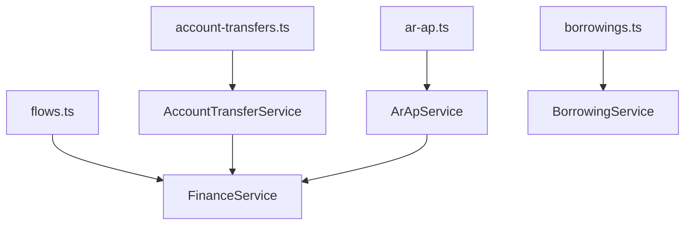
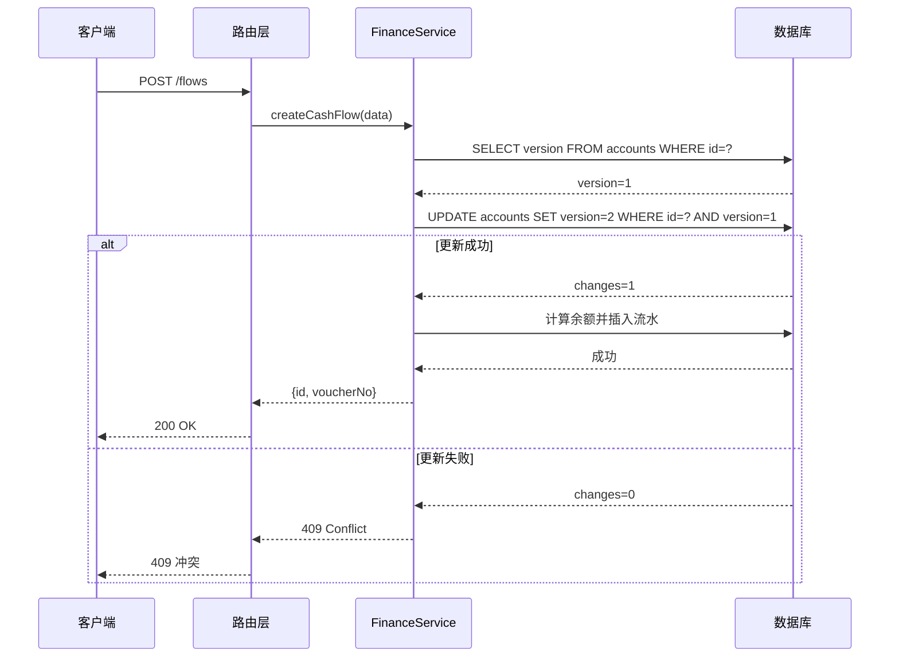

# 财务管理路由

<cite>
**本文档引用的文件**   
- [flows.ts](file://backend/src/routes/v2/flows.ts)
- [account-transfers.ts](file://backend/src/routes/v2/account-transfers.ts)
- [ar-ap.ts](file://backend/src/routes/v2/ar-ap.ts)
- [borrowings.ts](file://backend/src/routes/v2/borrowings.ts)
- [FinanceService.ts](file://backend/src/services/FinanceService.ts)
- [AccountService.ts](file://backend/src/services/AccountService.ts)
- [ArApService.ts](file://backend/src/services/ArApService.ts)
- [BorrowingService.ts](file://backend/src/services/BorrowingService.ts)
- [AccountTransferService.ts](file://backend/src/services/AccountTransferService.ts)
- [business.schema.ts](file://backend/src/schemas/business.schema.ts)
- [common.schema.ts](file://backend/src/schemas/common.schema.ts)
- [schema.ts](file://backend/src/db/schema.ts)
- [permission.ts](file://backend/src/middleware/permission.ts)
- [audit.ts](file://backend/src/utils/audit.ts)
- [optimistic-lock.ts](file://backend/src/utils/optimistic-lock.ts)
</cite>

## 目录
1. [引言](#引言)
2. [核心功能端点设计](#核心功能端点设计)
   1. [财务流水 (flows)](#财务流水-flows)
   2. [账户转账 (account-transfers)](#账户转账-account-transfers)
   3. [应收应付 (ar-ap)](#应收应付-ar-ap)
   4. [借款管理 (borrowings)](#借款管理-borrowings)
3. [数据校验与中间件](#数据校验与中间件)
4. [后端服务调用关系](#后端服务调用关系)
5. [典型使用场景示例](#典型使用场景示例)
6. [乐观锁机制](#乐观锁机制)

## 引言
本文档详细说明了财务管理模块的API路由设计，涵盖了财务流水、账户转账、应收应付和借款管理等核心功能。文档解释了每个端点的HTTP方法、URL路径、请求参数、请求体结构及响应格式，并结合Zod验证模式说明了数据校验机制。同时，文档阐述了如何通过中间件实现权限控制与审计日志记录，以及这些路由与`FinanceService`、`AccountService`等后端服务的调用关系。

## 核心功能端点设计

### 财务流水 (flows)
财务流水模块提供了对现金流入和流出的管理功能，包括创建、查询、更新凭证和红冲操作。

#### 获取下一个凭证号
- **HTTP方法**: `GET`
- **URL路径**: `/flows/next-voucher`
- **请求参数**: 
  - `date` (string): 用于生成凭证号的日期，格式为YYYY-MM-DD。
- **响应格式**:
  ```json
  {
    "success": true,
    "data": {
      "voucherNo": "JZ20231001-001"
    }
  }
  ```
- **功能说明**: 根据指定日期生成下一个凭证号，格式为`JZYYYYMMDD-XXX`。

#### 获取现金流水列表
- **HTTP方法**: `GET`
- **URL路径**: `/flows`
- **请求参数**: 
  - `page` (number, optional): 页码，默认为1。
  - `pageSize` (number, optional): 每页数量，默认为20。
- **响应格式**:
  ```json
  {
    "success": true,
    "data": {
      "items": [
        {
          "id": "string",
          "voucherNo": "string",
          "bizDate": "string",
          "type": "income" | "expense",
          "accountId": "string",
          "amountCents": "number",
          "memo": "string",
          "voucherUrls": ["string"],
          "createdBy": "string",
          "createdAt": "number"
        }
      ],
      "pagination": {
        "page": "number",
        "pageSize": "number",
        "total": "number",
        "totalPages": "number"
      }
    }
  }
  ```
- **功能说明**: 分页查询现金流水记录，支持按创建者和部门进行数据访问过滤。

#### 创建现金流水
- **HTTP方法**: `POST`
- **URL路径**: `/flows`
- **请求体结构**:
  ```json
  {
    "accountId": "string",
    "categoryId": "string",
    "bizDate": "string",
    "type": "income" | "expense",
    "amountCents": "number",
    "voucherUrls": ["string"],
    "memo": "string"
  }
  ```
- **响应格式**:
  ```json
  {
    "success": true,
    "data": {
      "id": "string",
      "voucherNo": "string"
    }
  }
  ```
- **功能说明**: 创建一笔新的现金流水，系统会自动计算凭证号，并在创建时进行余额校验（仅支出）。

#### 更新凭证
- **HTTP方法**: `PUT`
- **URL路径**: `/flows/{id}/voucher`
- **请求参数**:
  - `id` (string): 流水记录的ID。
- **请求体结构**:
  ```json
  {
    "voucherUrls": ["string"]
  }
  ```
- **响应格式**:
  ```json
  {
    "success": true,
    "data": {
      "ok": true
    }
  }
  ```
- **功能说明**: 更新指定流水记录的凭证附件。

#### 红冲流水
- **HTTP方法**: `POST`
- **URL路径**: `/flows/{id}/reverse`
- **请求参数**:
  - `id` (string): 需要红冲的原始流水ID。
- **请求体结构**:
  ```json
  {
    "reversalReason": "string"
  }
  ```
- **响应格式**:
  ```json
  {
    "success": true,
    "data": {
      "ok": true,
      "reversalId": "string",
      "reversalVoucherNo": "string",
      "originalVoucherNo": "string"
    }
  }
  ```
- **功能说明**: 对指定的流水记录进行红冲操作，生成一条反向的记账记录，并标记原记录为已冲正。

**Section sources**
- [flows.ts](file://backend/src/routes/v2/flows.ts#L68-L565)

### 账户转账 (account-transfers)
账户转账模块用于管理不同账户之间的资金转移。

#### 获取转账列表
- **HTTP方法**: `GET`
- **URL路径**: `/account-transfers`
- **请求参数**:
  - `fromAccountId` (string, optional): 转出账户ID。
  - `toAccountId` (string, optional): 转入账户ID。
  - `startDate` (string, optional): 开始日期。
  - `endDate` (string, optional): 结束日期。
  - `limit` (number, optional): 限制返回数量，默认为200。
- **响应格式**:
  ```json
  {
    "success": true,
    "data": {
      "results": [
        {
          "id": "string",
          "transferDate": "string",
          "fromAccountId": "string",
          "toAccountId": "string",
          "fromAmountCents": "number",
          "toAmountCents": "number",
          "memo": "string",
          "fromAccountName": "string",
          "toAccountName": "string"
        }
      ]
    }
  }
  ```
- **功能说明**: 查询账户转账记录，支持按账户、日期范围进行过滤。

#### 创建转账
- **HTTP方法**: `POST`
- **URL路径**: `/account-transfers`
- **请求体结构**:
  ```json
  {
    "transferDate": "string",
    "fromAccountId": "string",
    "toAccountId": "string",
    "fromAmountCents": "number",
    "toAmountCents": "number",
    "exchangeRate": "number",
    "memo": "string",
    "voucherUrl": "string"
  }
  ```
- **响应格式**:
  ```json
  {
    "success": true,
    "data": {
      "id": "string"
    }
  }
  ```
- **功能说明**: 创建一笔账户转账，系统会自动在转出和转入账户上分别创建交易记录。

#### 获取转账详情
- **HTTP方法**: `GET`
- **URL路径**: `/account-transfers/{id}`
- **请求参数**:
  - `id` (string): 转账记录的ID。
- **响应格式**:
  ```json
  {
    "success": true,
    "data": {
      "id": "string",
      "transferDate": "string",
      "fromAccountId": "string",
      "toAccountId": "string",
      "fromAmountCents": "number",
      "toAmountCents": "number",
      "memo": "string",
      "fromAccountName": "string",
      "toAccountName": "string"
    }
  }
  ```
- **功能说明**: 获取指定转账记录的详细信息。

**Section sources**
- [account-transfers.ts](file://backend/src/routes/v2/account-transfers.ts#L36-L234)

### 应收应付 (ar-ap)
应收应付模块用于管理客户应收款（AR）和供应商应付款（AP）。

#### 列出AR/AP单据
- **HTTP方法**: `GET`
- **URL路径**: `/ar/docs` 或 `/ap/docs`
- **请求参数**:
  - `kind` ("AR" | "AP", optional): 单据类型。
  - `status` (string, optional): 状态。
  - `page` (number, optional): 页码。
  - `pageSize` (number, optional): 每页数量。
- **响应格式**:
  ```json
  {
    "success": true,
    "data": {
      "items": [
        {
          "id": "string",
          "kind": "AR" | "AP",
          "docNo": "string",
          "partyId": "string",
          "amountCents": "number",
          "status": "string",
          "settledCents": "number"
        }
      ],
      "pagination": {
        "page": "number",
        "pageSize": "number",
        "total": "number",
        "totalPages": "number"
      }
    }
  }
  ```
- **功能说明**: 分页查询应收或应付款单据。

#### 创建AR/AP单据
- **HTTP方法**: `POST`
- **URL路径**: `/ar/docs`
- **请求体结构**:
  ```json
  {
    "kind": "AR" | "AP",
    "amountCents": "number",
    "issueDate": "string",
    "partyId": "string",
    "memo": "string"
  }
  ```
- **响应格式**:
  ```json
  {
    "success": true,
    "data": {
      "id": "string",
      "docNo": "string"
    }
  }
  ```
- **功能说明**: 创建一笔应收或应付款单据。

#### 创建结算
- **HTTP方法**: `POST`
- **URL路径**: `/ar/settlements`
- **请求体结构**:
  ```json
  {
    "docId": "string",
    "flowId": "string",
    "settleAmountCents": "number"
  }
  ```
- **响应格式**:
  ```json
  {
    "success": true,
    "data": {
      "id": "string"
    }
  }
  ```
- **功能说明**: 为指定的AR/AP单据创建结算记录。

#### 确认AR/AP单据
- **HTTP方法**: `POST`
- **URL路径**: `/ar/confirm`
- **请求体结构**:
  ```json
  {
    "docId": "string",
    "accountId": "string",
    "bizDate": "string",
    "categoryId": "string",
    "voucherUrl": "string"
  }
  ```
- **响应格式**:
  ```json
  {
    "success": true,
    "data": {
      "ok": true,
      "flowId": "string",
      "voucherNo": "string"
    }
  }
  ```
- **功能说明**: 确认一笔AR/AP单据，系统会自动创建对应的现金流水并更新单据状态。

**Section sources**
- [ar-ap.ts](file://backend/src/routes/v2/ar-ap.ts#L57-L625)

### 借款管理 (borrowings)
借款管理模块用于管理员工的借款和还款。

#### 获取借款列表
- **HTTP方法**: `GET`
- **URL路径**: `/borrowings`
- **请求参数**:
  - `userId` (string, optional): 借款人ID。
  - `page` (number, optional): 页码。
  - `pageSize` (number, optional): 每页数量。
- **响应格式**:
  ```json
  {
    "success": true,
    "data": {
      "items": [
        {
          "id": "string",
          "userId": "string",
          "amountCents": "number",
          "currency": "string",
          "borrowDate": "string",
          "memo": "string",
          "borrower_name": "string"
        }
      ],
      "pagination": {
        "page": "number",
        "pageSize": "number",
        "total": "number",
        "totalPages": "number"
      }
    }
  }
  ```
- **功能说明**: 分页查询员工借款记录。

#### 创建借款
- **HTTP方法**: `POST`
- **URL路径**: `/borrowings`
- **请求体结构**:
  ```json
  {
    "userId": "string",
    "accountId": "string",
    "amount": "number",
    "currency": "string",
    "borrowDate": "string",
    "memo": "string"
  }
  ```
- **响应格式**:
  ```json
  {
    "success": true,
    "data": {
      "id": "string",
      "userId": "string",
      "amountCents": "number",
      "currency": "string",
      "borrowDate": "string"
    }
  }
  ```
- **功能说明**: 创建一笔新的员工借款。

#### 获取还款列表
- **HTTP方法**: `GET`
- **URL路径**: `/repayments`
- **请求参数**:
  - `borrowingId` (string, optional): 借款记录ID。
- **响应格式**:
  ```json
  {
    "success": true,
    "data": {
      "results": [
        {
          "id": "string",
          "borrowingId": "string",
          "amountCents": "number",
          "currency": "string",
          "repayDate": "string",
          "borrower_name": "string"
        }
      ]
    }
  }
  ```
- **功能说明**: 查询指定借款的还款记录。

#### 创建还款
- **HTTP方法**: `POST`
- **URL路径**: `/repayments`
- **请求体结构**:
  ```json
  {
    "borrowingId": "string",
    "accountId": "string",
    "amount": "number",
    "currency": "string",
    "repayDate": "string",
    "memo": "string"
  }
  ```
- **响应格式**:
  ```json
  {
    "success": true,
    "data": {
      "id": "string",
      "borrowingId": "string",
      "amountCents": "number",
      "currency": "string",
      "repayDate": "string"
    }
  }
  ```
- **功能说明**: 为指定的借款记录创建一笔还款。

**Section sources**
- [borrowings.ts](file://backend/src/routes/v2/borrowings.ts#L71-L378)

## 数据校验与中间件
API路由使用Zod库进行数据校验，确保请求数据的完整性和正确性。例如，在创建现金流水时，`createCashFlowSchema`会验证`accountId`、`amountCents`等字段的格式和必填性。

权限控制通过`permission.ts`中的中间件实现。每个需要权限的端点都会使用`requirePermission`或`protectRoute`函数，检查用户是否具有执行特定操作的权限。例如，创建现金流水需要`finance.flow.create`权限。

审计日志通过`audit.ts`中的`logAuditAction`函数记录。每次关键操作（如创建、更新、删除）都会被记录到`auditLogs`表中，包含操作者、操作类型、实体、详情以及IP信息。

**Section sources**
- [business.schema.ts](file://backend/src/schemas/business.schema.ts#L11-L273)
- [permission.ts](file://backend/src/middleware/permission.ts#L12-L42)
- [audit.ts](file://backend/src/utils/audit.ts#L33-L89)

## 后端服务调用关系
API路由与后端服务之间存在清晰的调用关系。路由层负责处理HTTP请求和响应，而服务层负责核心业务逻辑。

- `flows.ts` 路由调用 `FinanceService` 来创建和管理现金流水。
- `account-transfers.ts` 路由调用 `AccountTransferService`，而`AccountTransferService`又依赖`FinanceService`来获取账户余额和创建交易记录。
- `ar-ap.ts` 路由调用 `ArApService`，`ArApService`在确认单据时会调用`FinanceService`来创建现金流水。
- `borrowings.ts` 路由调用 `BorrowingService` 来管理借款和还款。

这种分层架构确保了业务逻辑的复用性和代码的可维护性。



**Diagram sources**
- [flows.ts](file://backend/src/routes/v2/flows.ts)
- [account-transfers.ts](file://backend/src/routes/v2/account-transfers.ts)
- [ar-ap.ts](file://backend/src/routes/v2/ar-ap.ts)
- [borrowings.ts](file://backend/src/routes/v2/borrowings.ts)
- [FinanceService.ts](file://backend/src/services/FinanceService.ts)
- [AccountTransferService.ts](file://backend/src/services/AccountTransferService.ts)
- [ArApService.ts](file://backend/src/services/ArApService.ts)
- [BorrowingService.ts](file://backend/src/services/BorrowingService.ts)

## 典型使用场景示例

### 创建一笔跨账户转账
1. 客户端调用`POST /account-transfers`，提供转出账户、转入账户、金额等信息。
2. 路由层验证权限和数据格式。
3. `AccountTransferService`创建转账记录，并调用`FinanceService.getAccountBalanceBefore`检查账户余额。
4. 系统在转出账户上创建一笔`transfer_out`交易，在转入账户上创建一笔`transfer_in`交易。
5. 返回新创建的转账记录ID。

### 登记客户应收款
1. 客户端调用`POST /ar/docs`，创建一笔AR单据。
2. 调用`POST /ar/confirm`确认该单据，提供收款账户和凭证。
3. `ArApService`调用`FinanceService.createCashFlow`创建一笔收入流水。
4. 系统更新AR单据状态为“已确认”，并创建结算记录。

## 乐观锁机制
系统在`accounts`、`employeeLeaves`等表中使用了乐观锁机制来防止并发冲突。每个表都有一个`version`字段，表示记录的版本号。

在`FinanceService.createCashFlow`方法中，当创建一笔新的现金流水时：
1. 系统首先读取账户的当前`version`。
2. 尝试更新账户的`version`为`version + 1`，并使用`WHERE version = old_version`作为条件。
3. 如果更新成功（`changes > 0`），则继续执行；如果失败，则说明有其他请求同时修改了该账户，抛出并发冲突错误。

这种机制确保了同一账户的交易是串行写入的，避免了余额计算错误。



**Diagram sources**
- [FinanceService.ts](file://backend/src/services/FinanceService.ts#L146-L165)
- [schema.ts](file://backend/src/db/schema.ts#L148)
- [optimistic-lock.ts](file://backend/src/utils/optimistic-lock.ts)