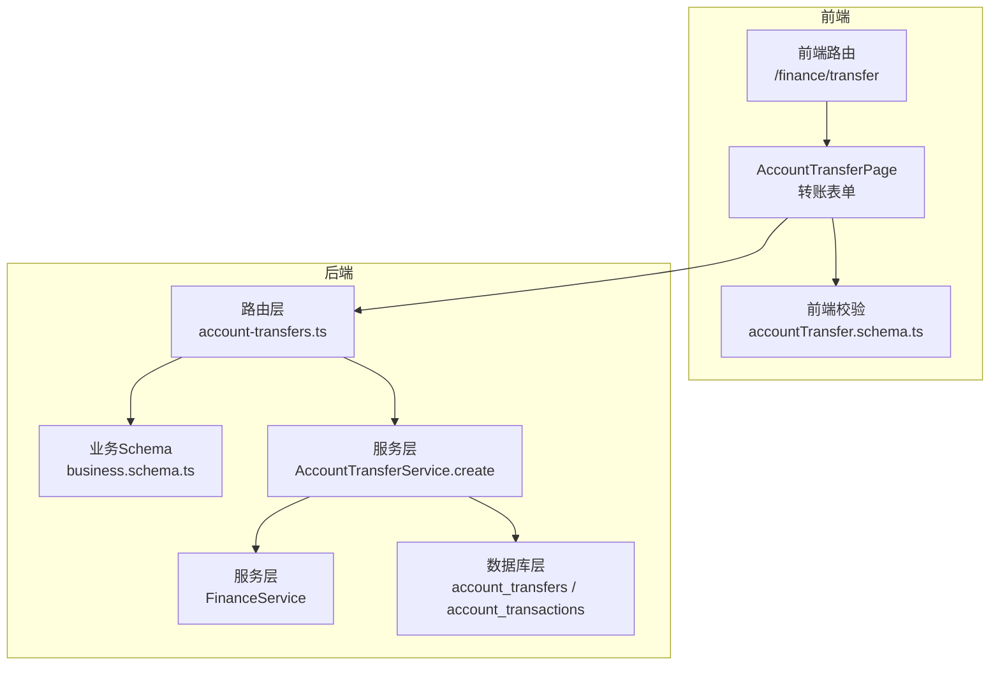
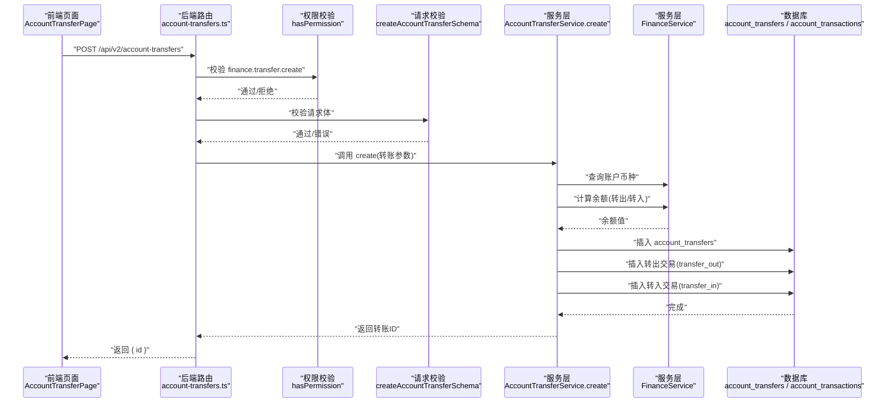
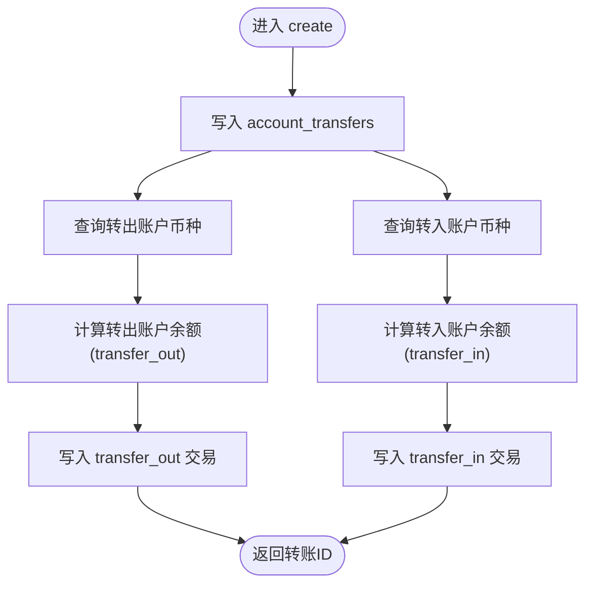
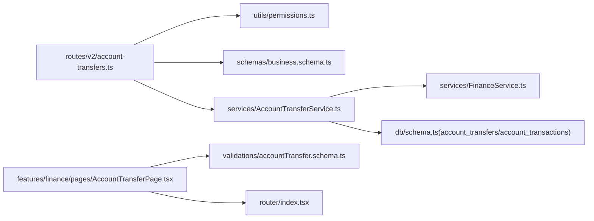

# 账户转账

<cite>
**本文引用的文件**
- [backend/src/routes/v2/account-transfers.ts](file://backend/src/routes/v2/account-transfers.ts)
- [backend/src/services/AccountTransferService.ts](file://backend/src/services/AccountTransferService.ts)
- [backend/src/services/FinanceService.ts](file://backend/src/services/FinanceService.ts)
- [backend/src/schemas/business.schema.ts](file://backend/src/schemas/business.schema.ts)
- [backend/src/utils/permissions.ts](file://backend/src/utils/permissions.ts)
- [backend/src/db/schema.ts](file://backend/src/db/schema.ts)
- [frontend/src/features/finance/pages/AccountTransferPage.tsx](file://frontend/src/features/finance/pages/AccountTransferPage.tsx)
- [frontend/src/validations/accountTransfer.schema.ts](file://frontend/src/validations/accountTransfer.schema.ts)
- [frontend/src/router/index.tsx](file://frontend/src/router/index.tsx)
- [backend/src/constants/errorCodes.ts](file://backend/src/constants/errorCodes.ts)
- [backend/src/utils/response.ts](file://backend/src/utils/response.ts)
</cite>

## 目录
1. [简介](#简介)
2. [项目结构](#项目结构)
3. [核心组件](#核心组件)
4. [架构总览](#架构总览)
5. [详细组件分析](#详细组件分析)
6. [依赖关系分析](#依赖关系分析)
7. [性能与并发特性](#性能与并发特性)
8. [故障排查指南](#故障排查指南)
9. [结论](#结论)
10. [附录](#附录)

## 简介
本文件面向“账户转账”功能，围绕跨账户资金转移的实现机制进行系统化说明。重点覆盖：
- POST /api/v2/account-transfers 的请求参数与校验
- createAccountTransferSchema 如何保障跨境/同币种转账的合规性
- 服务层 AccountTransferService.create 的原子性转账流程
- 前端路由 /finance/transfer 与转账表单提交的衔接
- 不同币种转换示例与失败场景下的错误码策略
- 权限控制 hasPermission 中间件对 finance.transfer.create 的访问约束

## 项目结构
账户转账功能涉及前后端协作：
- 后端：路由层定义 OpenAPI 路由与权限校验，服务层执行转账事务，数据库层定义账户转账与账户交易表结构
- 前端：路由挂载 AccountTransferPage 页面，表单收集转账数据并通过 API 提交

图表来源
- [frontend/src/router/index.tsx](file://frontend/src/router/index.tsx#L1-L256)
- [frontend/src/features/finance/pages/AccountTransferPage.tsx](file://frontend/src/features/finance/pages/AccountTransferPage.tsx#L1-L362)
- [frontend/src/validations/accountTransfer.schema.ts](file://frontend/src/validations/accountTransfer.schema.ts#L1-L19)
- [backend/src/routes/v2/account-transfers.ts](file://backend/src/routes/v2/account-transfers.ts#L1-L235)
- [backend/src/schemas/business.schema.ts](file://backend/src/schemas/business.schema.ts#L255-L274)
- [backend/src/services/AccountTransferService.ts](file://backend/src/services/AccountTransferService.ts#L44-L124)
- [backend/src/services/FinanceService.ts](file://backend/src/services/FinanceService.ts#L41-L68)
- [backend/src/db/schema.ts](file://backend/src/db/schema.ts#L448-L476)

章节来源
- [backend/src/routes/v2/account-transfers.ts](file://backend/src/routes/v2/account-transfers.ts#L1-L235)
- [frontend/src/features/finance/pages/AccountTransferPage.tsx](file://frontend/src/features/finance/pages/AccountTransferPage.tsx#L1-L362)
- [frontend/src/router/index.tsx](file://frontend/src/router/index.tsx#L1-L256)

## 核心组件
- 路由与权限
  - POST /api/v2/account-transfers：创建转账，使用 hasPermission 校验 finance.transfer.create 权限
  - GET /api/v2/account-transfers：查询转账列表，使用 hasPermission 校验 finance.transfer.view 权限
  - GET /api/v2/account-transfers/{id}：查询转账详情，使用 hasPermission 校验 finance.transfer.view 权限
- 业务Schema
  - createAccountTransferSchema：定义转账请求体字段及校验规则（金额正数、账户不同、汇率正数可选等）
- 服务层
  - AccountTransferService.create：原子性执行转账，写入 account_transfers 与 account_transactions
  - FinanceService.getAccountBalanceBefore：基于历史交易计算某账户在指定时间点前的余额
- 数据库
  - account_transfers：存储转账主记录（含 from/to 账户、币种、金额、汇率、凭证等）
  - account_transactions：存储每笔账户交易明细（余额前后值、类型等）

章节来源
- [backend/src/routes/v2/account-transfers.ts](file://backend/src/routes/v2/account-transfers.ts#L118-L184)
- [backend/src/schemas/business.schema.ts](file://backend/src/schemas/business.schema.ts#L255-L274)
- [backend/src/services/AccountTransferService.ts](file://backend/src/services/AccountTransferService.ts#L44-L124)
- [backend/src/services/FinanceService.ts](file://backend/src/services/FinanceService.ts#L41-L68)
- [backend/src/db/schema.ts](file://backend/src/db/schema.ts#L448-L476)

## 架构总览
下图展示从前端表单到后端服务的调用链路与关键数据流。

图表来源
- [backend/src/routes/v2/account-transfers.ts](file://backend/src/routes/v2/account-transfers.ts#L118-L184)
- [backend/src/services/AccountTransferService.ts](file://backend/src/services/AccountTransferService.ts#L44-L124)
- [backend/src/services/FinanceService.ts](file://backend/src/services/FinanceService.ts#L41-L68)
- [backend/src/schemas/business.schema.ts](file://backend/src/schemas/business.schema.ts#L255-L274)

## 详细组件分析

### 请求参数与校验（POST /api/v2/account-transfers）
- 请求体字段
  - transferDate：转账日期（字符串，需符合日期格式）
  - fromAccountId：转出账户ID（UUID）
  - toAccountId：转入账户ID（UUID）
  - fromAmountCents：转出金额（分，整数，>0）
  - toAmountCents：转入金额（分，整数，>0）
  - exchangeRate：汇率（可选，正数）
  - memo：备注（可选）
  - voucherUrl：凭证URL（可选，校验URL格式）
- 校验规则
  - 账户ID必须有效且不同
  - 金额必须为正数
  - 汇率可选，若提供需为正数
  - 凭证URL可选，但前端表单提交时会将 voucherUrls 数组中的首张图片上传为单个 URL 字段
- 前端表单行为
  - 同币种转账：转入金额与转出金额相等
  - 不同币种转账：需提供 exchangeRate，前端会据此自动计算 toAmount
  - 凭证上传：前端上传多张图片，后端接收时取第一张作为 voucherUrl

章节来源
- [backend/src/schemas/business.schema.ts](file://backend/src/schemas/business.schema.ts#L255-L274)
- [frontend/src/validations/accountTransfer.schema.ts](file://frontend/src/validations/accountTransfer.schema.ts#L1-L19)
- [frontend/src/features/finance/pages/AccountTransferPage.tsx](file://frontend/src/features/finance/pages/AccountTransferPage.tsx#L1-L362)

### 转账服务层：AccountTransferService.create
- 主要步骤
  1) 写入转账主记录 account_transfers（含币种、金额、汇率、凭证、创建人）
  2) 计算转出账户余额：调用 FinanceService.getAccountBalanceBefore 获取转出账户在 transferDate 时间点前的余额，生成 transfer_out 交易记录
  3) 计算转入账户余额：调用 FinanceService.getAccountBalanceBefore 获取转入账户在 transferDate 时间点前的余额，生成 transfer_in 交易记录
- 原子性保证
  - 服务层通过数据库事务（由上层路由/容器管理）确保转账记录与两条交易记录同时成功或失败
  - 余额计算严格依据历史交易，避免并发导致的余额不一致

图表来源
- [backend/src/services/AccountTransferService.ts](file://backend/src/services/AccountTransferService.ts#L44-L124)
- [backend/src/services/FinanceService.ts](file://backend/src/services/FinanceService.ts#L41-L68)
- [backend/src/db/schema.ts](file://backend/src/db/schema.ts#L448-L476)

章节来源
- [backend/src/services/AccountTransferService.ts](file://backend/src/services/AccountTransferService.ts#L44-L124)
- [backend/src/services/FinanceService.ts](file://backend/src/services/FinanceService.ts#L41-L68)
- [backend/src/db/schema.ts](file://backend/src/db/schema.ts#L448-L476)

### 权限控制：hasPermission 中间件
- 路由层在创建与查询转账时分别校验 finance.transfer.create 与 finance.transfer.view
- 仅具备相应权限的用户可发起转账或查看转账记录
- 权限来源于用户职位的权限配置，支持模块级与操作级控制

章节来源
- [backend/src/routes/v2/account-transfers.ts](file://backend/src/routes/v2/account-transfers.ts#L70-L72)
- [backend/src/routes/v2/account-transfers.ts](file://backend/src/routes/v2/account-transfers.ts#L152-L154)
- [backend/src/routes/v2/account-transfers.ts](file://backend/src/routes/v2/account-transfers.ts#L212-L214)
- [backend/src/utils/permissions.ts](file://backend/src/utils/permissions.ts#L99-L125)

### 前端路由与表单提交
- 前端路由 /finance/transfer 对应 AccountTransferPage
- 表单提交时：
  - 将 voucherUrls 数组中的首张图片上传为单个 voucherUrl 字段
  - 将金额从元转换为分（乘以 100 并四舍五入为整数）
  - 根据币种是否相同决定是否强制 toAmount 与 fromAmount 相等
  - 支持不同币种转账时输入 exchangeRate 并自动计算 toAmount

章节来源
- [frontend/src/router/index.tsx](file://frontend/src/router/index.tsx#L1-L256)
- [frontend/src/features/finance/pages/AccountTransferPage.tsx](file://frontend/src/features/finance/pages/AccountTransferPage.tsx#L1-L362)
- [frontend/src/validations/accountTransfer.schema.ts](file://frontend/src/validations/accountTransfer.schema.ts#L1-L19)

### 错误码与失败场景
- 常见错误码
  - VALIDATION_BAD_REQUEST：请求体不符合 createAccountTransferSchema 规则
  - AUTH_FORBIDDEN：无 finance.transfer.create/view 权限
  - BUSINESS_NOT_FOUND：查询转账详情时记录不存在
  - BUSINESS_INSUFFICIENT_BALANCE：同币种转账时余额不足（参考现金流服务的余额检查逻辑）
  - BUSINESS_CONCURRENT_MODIFICATION：并发冲突（参考现金流服务的乐观锁）
- 返回结构
  - 成功：{ success: true, data: { id } }
  - 失败：{ success: false, error: { code, message, details } }

章节来源
- [backend/src/constants/errorCodes.ts](file://backend/src/constants/errorCodes.ts#L1-L32)
- [backend/src/utils/response.ts](file://backend/src/utils/response.ts#L1-L132)
- [backend/src/routes/v2/account-transfers.ts](file://backend/src/routes/v2/account-transfers.ts#L118-L184)

## 依赖关系分析
- 路由层依赖
  - hasPermission：权限校验
  - createAccountTransferSchema：请求体校验
  - AccountTransferService：业务执行
- 服务层依赖
  - FinanceService：余额计算
  - 数据库：account_transfers、account_transactions
- 前端依赖
  - 路由：/finance/transfer
  - 表单校验：accountTransfer.schema.ts
  - 页面：AccountTransferPage

图表来源
- [backend/src/routes/v2/account-transfers.ts](file://backend/src/routes/v2/account-transfers.ts#L1-L235)
- [backend/src/utils/permissions.ts](file://backend/src/utils/permissions.ts#L99-L125)
- [backend/src/schemas/business.schema.ts](file://backend/src/schemas/business.schema.ts#L255-L274)
- [backend/src/services/AccountTransferService.ts](file://backend/src/services/AccountTransferService.ts#L44-L124)
- [backend/src/services/FinanceService.ts](file://backend/src/services/FinanceService.ts#L41-L68)
- [backend/src/db/schema.ts](file://backend/src/db/schema.ts#L448-L476)
- [frontend/src/features/finance/pages/AccountTransferPage.tsx](file://frontend/src/features/finance/pages/AccountTransferPage.tsx#L1-L362)
- [frontend/src/validations/accountTransfer.schema.ts](file://frontend/src/validations/accountTransfer.schema.ts#L1-L19)
- [frontend/src/router/index.tsx](file://frontend/src/router/index.tsx#L1-L256)

## 性能与并发特性
- 余额计算采用“历史余额法”
  - 通过 accountTransactions 历史记录定位指定时间点前的最后一条交易，取其 balanceAfterCents 作为余额基线
  - 若无历史记录，则回退到账户 openingCents
- 并发控制
  - 账户余额计算依赖历史记录顺序，避免直接维护账户余额字段，减少写放大
  - 在其他业务中采用乐观锁（更新 accounts.version）防止并发写入导致的余额竞争
- 数据一致性
  - 转账主记录与两条交易记录在同一事务内写入，保证原子性

章节来源
- [backend/src/services/FinanceService.ts](file://backend/src/services/FinanceService.ts#L41-L68)
- [backend/src/services/AccountTransferService.ts](file://backend/src/services/AccountTransferService.ts#L44-L124)

## 故障排查指南
- 无法创建转账
  - 检查权限：确认用户具备 finance.transfer.create 权限
  - 检查请求体：确保 from/to 账户ID不同，金额为正数，汇率为正数（若提供）
  - 检查凭证：前端上传凭证后，后端接收的是单个 voucherUrl
- 查询不到转账详情
  - 确认传入的 id 是否存在
- 余额不足或并发冲突
  - 同币种转账可能触发余额不足错误
  - 并发写入可能触发 BUSINESS_CONCURRENT_MODIFICATION

章节来源
- [backend/src/routes/v2/account-transfers.ts](file://backend/src/routes/v2/account-transfers.ts#L152-L154)
- [backend/src/routes/v2/account-transfers.ts](file://backend/src/routes/v2/account-transfers.ts#L212-L214)
- [backend/src/constants/errorCodes.ts](file://backend/src/constants/errorCodes.ts#L1-L32)

## 结论
账户转账功能通过严格的请求体校验、权限控制与服务层原子性事务，实现了跨账户资金转移的可靠落地。前端表单与后端 API 协作明确，支持同币种与不同币种转账场景。建议在生产环境中持续关注并发写入与余额计算的性能表现，并完善异常监控与审计日志。

## 附录

### API 定义（POST /api/v2/account-transfers）
- 请求体字段
  - transferDate: 字符串（日期）
  - fromAccountId: 字符串（UUID）
  - toAccountId: 字符串（UUID）
  - fromAmountCents: 整数（>0）
  - toAmountCents: 整数（>0）
  - exchangeRate: 数字（可选，>0）
  - memo: 字符串（可选）
  - voucherUrl: 字符串（可选，URL）
- 成功响应
  - { success: true, data: { id: 字符串 } }
- 失败响应
  - { success: false, error: { code, message, details } }

章节来源
- [backend/src/routes/v2/account-transfers.ts](file://backend/src/routes/v2/account-transfers.ts#L118-L184)
- [backend/src/schemas/business.schema.ts](file://backend/src/schemas/business.schema.ts#L255-L274)
- [backend/src/utils/response.ts](file://backend/src/utils/response.ts#L1-L132)

### 示例：不同币种转换
- 场景：USD 账户转至 EUR 账户
- 步骤：
  1) 前端输入 USD 账户、EUR 账户、转出金额与汇率
  2) 前端自动计算转入金额（转出金额 × 汇率）
  3) 提交请求体包含 fromAmountCents、toAmountCents、exchangeRate、voucherUrl
  4) 后端写入 account_transfers 与两条 account_transactions 记录

章节来源
- [frontend/src/features/finance/pages/AccountTransferPage.tsx](file://frontend/src/features/finance/pages/AccountTransferPage.tsx#L1-L362)
- [backend/src/services/AccountTransferService.ts](file://backend/src/services/AccountTransferService.ts#L44-L124)